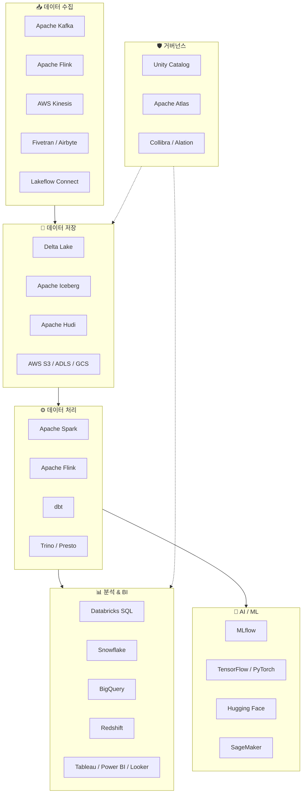
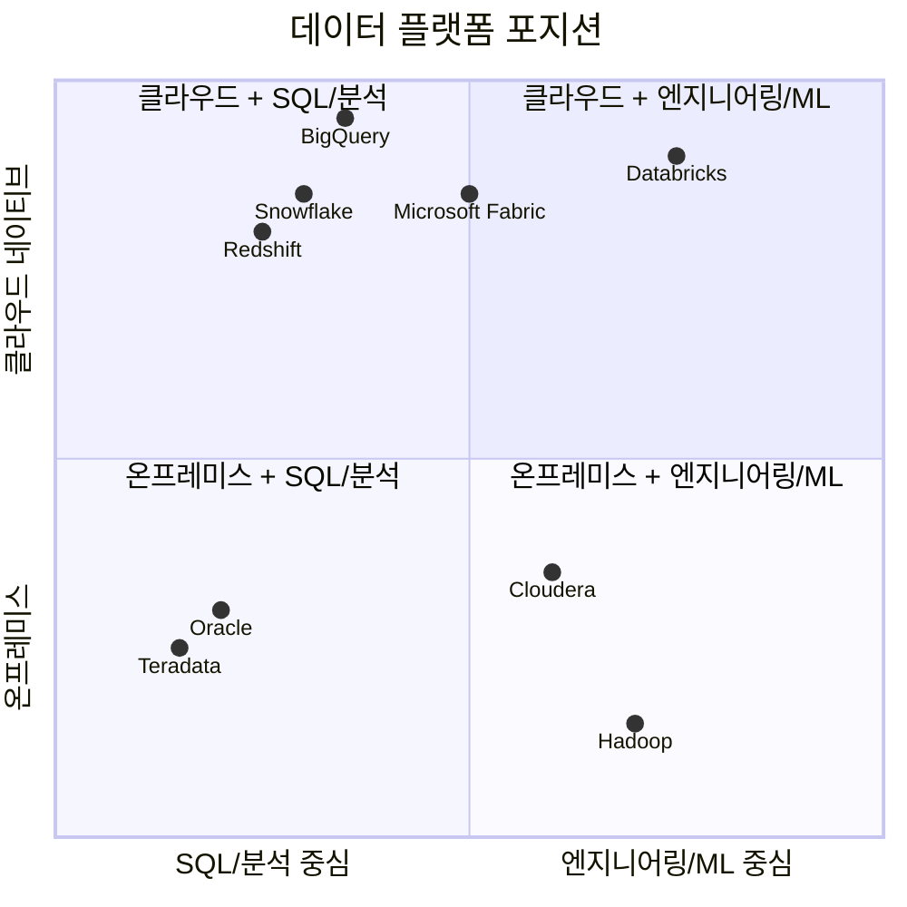

# 빅데이터 생태계 — 주요 솔루션과 빅 플레이어

## 현재 빅데이터 생태계의 전체 그림

빅데이터 생태계는 매우 넓고 다양한 도구들이 존재합니다. 이 문서에서는 각 영역별로 어떤 솔루션이 있고, 주요 벤더들이 어떤 포지션을 차지하고 있는지 정리해 드리겠습니다.

---

## 영역별 기술 지도

---

## 데이터 수집 (Ingestion) 솔루션

### 스트리밍 수집

| 솔루션 | 개발사 | 설명 |
|--------|--------|------|
| **Apache Kafka** | LinkedIn → Apache | 가장 널리 사용되는 분산 메시지 스트리밍 플랫폼입니다. 초당 수백만 건의 이벤트를 처리할 수 있습니다 |
| **Confluent** | Confluent | Kafka의 상용 관리형 서비스입니다. Kafka 창시자가 설립했습니다 |
| **Amazon Kinesis** | AWS | AWS의 실시간 스트리밍 서비스입니다 |
| **Azure Event Hubs** | Microsoft | Azure의 이벤트 스트리밍 서비스입니다. Kafka API와 호환됩니다 |
| **Google Pub/Sub** | Google | Google Cloud의 메시지 서비스입니다 |

### 배치/CDC 수집

| 솔루션 | 유형 | 설명 |
|--------|------|------|
| **Fivetran** | SaaS | 400+ 소스에서 자동으로 데이터를 수집하는 관리형 ELT 서비스입니다 |
| **Airbyte** | 오픈소스 | Fivetran의 오픈소스 대안입니다. 300+ 커넥터를 제공합니다 |
| **Lakeflow Connect** | Databricks | Databricks의 관리형 수집 서비스입니다. DB, SaaS에서 CDC 기반 수집을 지원합니다 |
| **AWS DMS** | AWS | 데이터베이스 마이그레이션 및 CDC 복제 서비스입니다 |
| **Debezium** | 오픈소스 | CDC(Change Data Capture)에 특화된 오픈소스 커넥터입니다 |

> 💡 **CDC(Change Data Capture)란?** 데이터베이스에서 발생하는 변경 사항(INSERT, UPDATE, DELETE)을 실시간으로 감지하여 다른 시스템에 전달하는 기술입니다. 전체 데이터를 매번 복사하는 대신, 변경된 부분만 전달하므로 효율적입니다.

---

## 데이터 저장 (Storage) — 테이블 포맷

현대 데이터 레이크에서는 **오픈 테이블 포맷**이 핵심 기술입니다.

| 포맷 | 개발사 | 특징 |
|------|--------|------|
| **Delta Lake** | Databricks | Spark 생태계와 깊이 통합. 가장 성숙한 포맷입니다 |
| **Apache Iceberg** | Netflix → Apache | 엔진 독립적. Snowflake, Trino 등 다양한 엔진에서 지원합니다 |
| **Apache Hudi** | Uber → Apache | 증분 처리(Incremental Processing)에 강점이 있습니다 |

> 💡 세 포맷 모두 **ACID 트랜잭션**, **스키마 진화**, **타임 트래블**을 지원하며, 실제 데이터는 **Parquet** 파일로 저장합니다. 업계는 점차 **Delta Lake + Iceberg** 조합(UniForm)으로 수렴하는 추세입니다.

---

## 데이터 처리 (Processing) 엔진

| 엔진 | 유형 | 설명 |
|------|------|------|
| **Apache Spark** | 배치 + 스트리밍 | 가장 널리 사용되는 분산 처리 엔진입니다. Databricks의 핵심입니다 |
| **Apache Flink** | 스트리밍 우선 | 진정한 이벤트 단위 스트리밍 처리에 강점이 있습니다 |
| **Trino (구 PrestoSQL)** | 대화형 쿼리 | 빠른 SQL 쿼리 엔진입니다. 여러 데이터 소스를 연합 쿼리할 수 있습니다 |
| **dbt** | SQL 변환 | SQL 기반 데이터 변환 도구입니다. ELT의 T(Transform)에 특화되어 있습니다 |
| **Apache Beam** | 통합 모델 | Google이 개발. 배치/스트리밍 통합 프로그래밍 모델을 제공합니다 |

---

## 분석 플랫폼 & 데이터 웨어하우스

### 클라우드 데이터 플랫폼 비교

| 플랫폼 | 제공사 | 핵심 강점 | 테이블 포맷 |
|--------|--------|-----------|------------|
| **Databricks** | Databricks | 통합 레이크하우스, Spark/ML/AI | Delta Lake |
| **Snowflake** | Snowflake | 사용 편의성, SQL 성능, 멀티 클라우드 | 독자 + Iceberg |
| **BigQuery** | Google | 서버리스, 자동 확장, ML 통합 | 독자 + BigLake |
| **Redshift** | AWS | AWS 생태계 통합, 비용 효율 | 독자 |
| **Synapse** | Microsoft | Azure 통합, Spark + SQL 결합 | 독자 |
| **Microsoft Fabric** | Microsoft | OneLake 기반 통합 플랫폼 | Delta Lake |

### BI 도구

| 도구 | 특징 |
|------|------|
| **Tableau** | 데이터 시각화의 선도 기업. 직관적인 드래그&드롭 인터페이스입니다 |
| **Power BI** | Microsoft 생태계와 긴밀하게 통합됩니다. 가격이 경쟁력 있습니다 |
| **Looker** | Google Cloud 소속. LookML 기반의 시맨틱 레이어를 제공합니다 |
| **Databricks AI/BI** | Databricks 내장 대시보드. Genie(자연어 분석)를 지원합니다 |
| **Apache Superset** | 오픈소스 BI 도구. 웹 기반의 대시보드를 제공합니다 |

---

## AI & ML 플랫폼

| 플랫폼 | 제공사 | 설명 |
|--------|--------|------|
| **MLflow** | Databricks (오픈소스) | ML 실험 추적, 모델 관리, GenAI 트레이싱을 지원합니다 |
| **SageMaker** | AWS | AWS의 관리형 ML 플랫폼입니다 |
| **Vertex AI** | Google | Google Cloud의 ML 플랫폼입니다 |
| **Azure ML** | Microsoft | Azure의 ML 플랫폼입니다 |
| **Hugging Face** | Hugging Face | 오픈소스 ML 모델 허브. LLM 생태계의 중심입니다 |
| **Weights & Biases** | W&B | 실험 추적에 특화된 ML 도구입니다 |

---

## 데이터 거버넌스

| 솔루션 | 유형 | 설명 |
|--------|------|------|
| **Unity Catalog** | Databricks (오픈소스) | Databricks의 통합 거버넌스 솔루션입니다 |
| **Collibra** | 상용 | 엔터프라이즈 데이터 거버넌스 플랫폼입니다 |
| **Alation** | 상용 | 데이터 카탈로그 + 거버넌스 플랫폼입니다 |
| **Apache Atlas** | 오픈소스 | Hadoop 생태계의 메타데이터 관리 도구입니다 |
| **AWS Glue Data Catalog** | AWS | AWS의 관리형 메타데이터 카탈로그입니다 |

---

## 빅 플레이어 포지션 맵

---

## 기술 선택 가이드

| 요구 사항 | 권장 솔루션 |
|-----------|-----------|
| 통합 데이터 플랫폼 (ETL + SQL + ML + AI) | **Databricks** |
| SQL 분석 중심, 사용 편의성 우선 | **Snowflake** |
| AWS 생태계에 올인 | **Redshift + Glue + SageMaker** |
| Google Cloud 생태계 | **BigQuery + Vertex AI** |
| Microsoft 생태계 | **Microsoft Fabric** 또는 **Azure Databricks** |
| 오픈소스 중심, 벤더 독립 | **Spark + Iceberg + Trino + MLflow** |

---

## 정리

| 영역 | 주요 솔루션 | Databricks의 대응 |
|------|-----------|------------------|
| 데이터 수집 | Kafka, Fivetran, Airbyte | Lakeflow Connect, Auto Loader |
| 데이터 저장 | Delta Lake, Iceberg, Hudi | Delta Lake + UniForm |
| 데이터 처리 | Spark, Flink, dbt | Apache Spark (내장) |
| SQL 분석 | Snowflake, BigQuery, Redshift | Databricks SQL |
| BI | Tableau, Power BI, Looker | AI/BI Dashboard + Genie |
| ML/AI | SageMaker, Vertex AI, MLflow | MLflow + Model Serving + Agent Framework |
| 거버넌스 | Collibra, Alation, Glue Catalog | Unity Catalog |

---

## 참고 링크

- [Databricks Blog: Data + AI Platform](https://www.databricks.com/blog)
- [Gartner: Cloud Database Management Systems](https://www.gartner.com/reviews/market/cloud-database-management-systems)
- [DB-Engines Ranking](https://db-engines.com/en/ranking)
