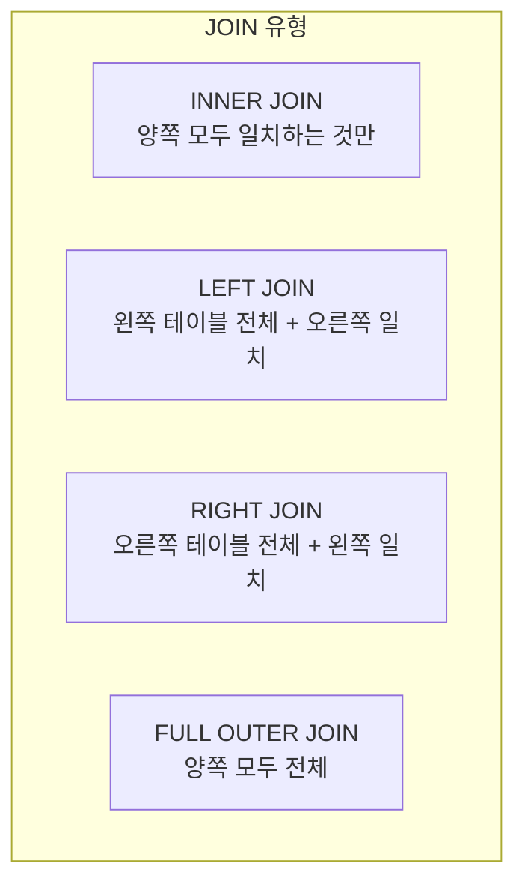

# 관계형 데이터베이스 기초

## 왜 관계형 데이터베이스를 알아야 하나요?

빅데이터와 데이터 레이크하우스를 이해하려면, 먼저 그 이전 세대의 기술인 **관계형 데이터베이스(RDBMS)** 를 알아야 합니다. 현재 사용되는 데이터 기술의 대부분은 RDBMS의 개념을 기반으로 하거나, RDBMS의 한계를 극복하기 위해 만들어졌기 때문입니다.

---

## 관계형 데이터베이스(RDBMS)란?

> 💡 **RDBMS(Relational Database Management System, 관계형 데이터베이스 관리 시스템)** 란 데이터를 **테이블(표)** 형태로 저장하고, 테이블 간의 **관계(Relationship)** 를 통해 데이터를 연결하는 데이터베이스 시스템입니다.

1970년 IBM의 연구원 **에드거 코드(Edgar F. Codd)** 가 발표한 논문에서 처음 제안된 이후, 50년 넘게 전 세계에서 가장 널리 사용되는 데이터 저장 방식입니다.

### 비유로 이해하기

엑셀 스프레드시트를 떠올려 보겠습니다.

- 하나의 **시트** = 하나의 **테이블**
- 시트의 **열(Column)** = 데이터의 **속성** (이름, 나이, 주소 등)
- 시트의 **행(Row)** = 하나의 **레코드** (한 명의 고객 정보)
- 여러 시트를 **공통 키로 연결** = **관계(Relationship)**

---

## 핵심 개념

### 테이블 (Table)

데이터를 저장하는 기본 단위입니다. 행(Row)과 열(Column)으로 구성됩니다.

**고객 테이블 (customers)**

| customer_id (PK) | name | email | city |
|-------------------|------|-------|------|
| 1 | 김철수 | cs@mail.com | 서울 |
| 2 | 이영희 | yh@mail.com | 부산 |
| 3 | 박민수 | ms@mail.com | 대구 |

**주문 테이블 (orders)**

| order_id (PK) | customer_id (FK) | product | amount | order_date |
|----------------|------------------|---------|--------|------------|
| 101 | 1 | 노트북 | 1,200,000 | 2025-03-01 |
| 102 | 2 | 키보드 | 89,000 | 2025-03-02 |
| 103 | 1 | 마우스 | 65,000 | 2025-03-03 |

### 키 (Key)

> 💡 **기본 키(Primary Key, PK)** 는 테이블에서 각 행을 **고유하게 식별**하는 컬럼입니다. 중복될 수 없고, NULL이 될 수 없습니다. 위 예시에서 `customer_id`와 `order_id`가 각 테이블의 기본 키입니다.

> 💡 **외래 키(Foreign Key, FK)** 는 다른 테이블의 기본 키를 **참조**하여 두 테이블을 연결하는 컬럼입니다. 위 예시에서 주문 테이블의 `customer_id`는 고객 테이블의 `customer_id`를 참조하는 외래 키입니다. 이를 통해 "주문 101은 김철수(customer_id=1)의 주문이다"라는 관계가 형성됩니다.

### 조인 (JOIN)

> 💡 **조인(JOIN)** 은 두 개 이상의 테이블을 **공통 컬럼을 기준으로 합치는** 연산입니다. 관계형 데이터베이스의 핵심 기능입니다.

```sql
-- 고객 이름과 주문 정보를 함께 조회
SELECT
    c.name AS 고객명,
    o.product AS 상품,
    o.amount AS 금액,
    o.order_date AS 주문일
FROM customers c
INNER JOIN orders o ON c.customer_id = o.customer_id;
```

결과:

| 고객명 | 상품 | 금액 | 주문일 |
|--------|------|------|--------|
| 김철수 | 노트북 | 1,200,000 | 2025-03-01 |
| 이영희 | 키보드 | 89,000 | 2025-03-02 |
| 김철수 | 마우스 | 65,000 | 2025-03-03 |

### 주요 JOIN 유형



| JOIN 유형 | 설명 | 사용 예시 |
|-----------|------|----------|
| **INNER JOIN** | 양쪽 테이블에 모두 존재하는 데이터만 반환합니다 | 주문한 고객 목록 |
| **LEFT JOIN** | 왼쪽 테이블 전체 + 일치하는 오른쪽 데이터. 일치하지 않으면 NULL입니다 | 모든 고객 + 주문 여부 |
| **RIGHT JOIN** | 오른쪽 테이블 전체 + 일치하는 왼쪽 데이터 | 모든 주문 + 고객 정보 |
| **FULL OUTER JOIN** | 양쪽 모두 전체 데이터를 반환합니다 | 전체 데이터 병합 |
| **CROSS JOIN** | 양쪽의 모든 조합을 생성합니다 (카테시안 곱) | 모든 상품 × 모든 지역 |

---

## SQL 기본 구문

> 💡 **SQL(Structured Query Language)** 은 관계형 데이터베이스에서 데이터를 조회, 삽입, 수정, 삭제하기 위한 표준 언어입니다. 1970년대 IBM에서 개발되었으며, 현재 거의 모든 데이터 플랫폼(Databricks 포함)에서 사용됩니다.

### 데이터 조회 (SELECT)

```sql
-- 기본 조회
SELECT name, city FROM customers;

-- 조건 필터링
SELECT * FROM orders WHERE amount > 100000;

-- 집계 함수
SELECT
    city,
    COUNT(*) AS 고객수,
    AVG(amount) AS 평균주문금액
FROM customers c
JOIN orders o ON c.customer_id = o.customer_id
GROUP BY city
HAVING COUNT(*) >= 2
ORDER BY 평균주문금액 DESC;
```

### SELECT 구문 실행 순서

SQL은 작성 순서와 실행 순서가 다릅니다. 이를 이해하면 쿼리를 더 정확하게 작성할 수 있습니다.

| 실행 순서 | 구문 | 역할 |
|-----------|------|------|
| 1 | `FROM` / `JOIN` | 어떤 테이블에서 데이터를 가져올지 결정합니다 |
| 2 | `WHERE` | 행 단위로 조건을 필터링합니다 |
| 3 | `GROUP BY` | 그룹별로 묶습니다 |
| 4 | `HAVING` | 그룹에 대한 조건을 필터링합니다 |
| 5 | `SELECT` | 어떤 컬럼을 표시할지 결정합니다 |
| 6 | `ORDER BY` | 정렬합니다 |
| 7 | `LIMIT` | 결과 건수를 제한합니다 |

### 데이터 조작 (DML)

```sql
-- 삽입 (INSERT)
INSERT INTO customers (customer_id, name, email, city)
VALUES (4, '최지은', 'je@mail.com', '인천');

-- 수정 (UPDATE)
UPDATE customers SET city = '서울' WHERE customer_id = 3;

-- 삭제 (DELETE)
DELETE FROM orders WHERE order_date < '2024-01-01';
```

### 데이터 정의 (DDL)

```sql
-- 테이블 생성 (CREATE)
CREATE TABLE products (
    product_id INT PRIMARY KEY,
    name VARCHAR(100) NOT NULL,
    category VARCHAR(50),
    price DECIMAL(10, 2)
);

-- 테이블 구조 변경 (ALTER)
ALTER TABLE products ADD COLUMN stock INT DEFAULT 0;

-- 테이블 삭제 (DROP)
DROP TABLE products;
```

> 💡 **DML과 DDL의 차이**: **DML(Data Manipulation Language)** 은 데이터 자체를 다루는 명령어(SELECT, INSERT, UPDATE, DELETE)이고, **DDL(Data Definition Language)** 은 테이블의 구조(스키마)를 정의하는 명령어(CREATE, ALTER, DROP)입니다.

---

## ACID 트랜잭션

관계형 데이터베이스의 가장 중요한 특성 중 하나가 **ACID 트랜잭션**입니다. (이전 섹션에서도 간략히 다루었지만, 여기서 좀 더 자세히 설명하겠습니다.)

### 실생활 예시: 은행 이체

A 계좌에서 B 계좌로 100만 원을 이체하는 상황을 생각해 보겠습니다.

```sql
-- 트랜잭션 시작
BEGIN TRANSACTION;

-- 1. A 계좌에서 100만 원 차감
UPDATE accounts SET balance = balance - 1000000 WHERE account_id = 'A';

-- 2. B 계좌에 100만 원 입금
UPDATE accounts SET balance = balance + 1000000 WHERE account_id = 'B';

-- 모든 작업이 성공하면 확정
COMMIT;

-- 중간에 오류가 발생하면 모두 취소
-- ROLLBACK;
```

| ACID 속성 | 이 예시에서의 의미 |
|-----------|------------------|
| **Atomicity (원자성)** | 차감과 입금이 반드시 함께 성공하거나 함께 실패합니다. 차감만 되고 입금이 안 되는 상황은 발생하지 않습니다 |
| **Consistency (일관성)** | 이체 전후로 A+B의 총액은 변하지 않습니다 |
| **Isolation (격리성)** | 이체 중에 다른 사람이 A 잔액을 조회하면, 이체 전 또는 이체 후의 일관된 값을 봅니다 |
| **Durability (지속성)** | COMMIT 후에는 서버가 꺼져도 이체 결과가 보존됩니다 |

---

## 인덱스 (Index)

> 💡 **인덱스(Index)** 란 테이블에서 특정 데이터를 빠르게 찾기 위한 **색인**입니다. 책의 "찾아보기" 페이지처럼, 전체 데이터를 하나씩 확인하지 않고도 원하는 데이터의 위치를 빠르게 파악할 수 있습니다.

```sql
-- email 컬럼에 인덱스 생성
CREATE INDEX idx_customers_email ON customers(email);

-- 인덱스가 있으면 이 쿼리가 훨씬 빨라집니다
SELECT * FROM customers WHERE email = 'cs@mail.com';
```

| 항목 | 인덱스 없음 | 인덱스 있음 |
|------|-----------|-----------|
| 검색 방식 | 전체 스캔 (모든 행 확인) | 인덱스 조회 (바로 위치 파악) |
| 100만 건에서 1건 찾기 | 최대 100만 번 비교 | 약 20번 비교 (B-Tree 기준) |
| 쓰기 속도 | 빠름 | 약간 느림 (인덱스도 갱신해야 함) |

> 💡 **B-Tree란?** 대부분의 RDBMS에서 인덱스에 사용하는 자료 구조입니다. 데이터를 정렬된 트리(나무) 형태로 관리하여, 검색 시 데이터 양의 로그(log) 횟수만에 원하는 값을 찾을 수 있습니다. 100만 건의 데이터에서도 약 20번의 비교만으로 원하는 데이터를 찾을 수 있습니다.

---

## 대표적인 RDBMS 제품

| 제품 | 특징 | 주 사용 환경 |
|------|------|-------------|
| **MySQL** | 가장 널리 사용되는 오픈소스 RDBMS | 웹 애플리케이션, SaaS |
| **PostgreSQL** | 가장 기능이 풍부한 오픈소스 RDBMS | 복잡한 쿼리, GIS, JSON |
| **Oracle Database** | 엔터프라이즈 급 상용 RDBMS | 대기업, 금융, 통신 |
| **SQL Server** | Microsoft의 상용 RDBMS | Windows 기반 엔터프라이즈 |
| **SQLite** | 파일 기반 경량 RDBMS | 모바일 앱, 임베디드 |

---

## RDBMS의 한계와 빅데이터의 등장

RDBMS는 훌륭한 기술이지만, 데이터의 양과 다양성이 폭발적으로 증가하면서 한계에 부딪히게 되었습니다.

| 한계 | 설명 |
|------|------|
| **수직 확장 한계** | RDBMS는 주로 하나의 서버에서 동작합니다. 성능을 올리려면 더 강력한 서버(Scale-Up)가 필요한데, 물리적 한계가 있습니다 |
| **정형 데이터 한정** | 이미지, 로그, JSON 같은 비정형/반정형 데이터를 효율적으로 다루기 어렵습니다 |
| **비용** | 페타바이트(PB) 규모의 데이터를 RDBMS에 저장하면 라이선스와 하드웨어 비용이 천문학적입니다 |
| **분석 성능** | 수십억 건의 데이터를 집계하는 분석 쿼리는 매우 느릴 수 있습니다 |

이 한계를 극복하기 위해 **빅데이터 기술**(Hadoop, Spark 등)이 등장했습니다. 다음 문서에서 이 역사를 자세히 살펴보겠습니다.

---

## 정리

| 핵심 개념 | 설명 |
|-----------|------|
| **RDBMS** | 데이터를 테이블(행/열) 형태로 저장하고, 관계로 연결하는 데이터베이스 시스템입니다 |
| **기본 키 (PK)** | 각 행을 고유하게 식별하는 컬럼입니다 |
| **외래 키 (FK)** | 다른 테이블의 기본 키를 참조하여 관계를 형성하는 컬럼입니다 |
| **JOIN** | 두 테이블을 공통 컬럼으로 합치는 연산입니다 |
| **SQL** | 데이터를 조회·조작·정의하기 위한 표준 언어입니다 |
| **ACID** | 트랜잭션의 안전성을 보장하는 네 가지 속성입니다 |
| **인덱스** | 데이터 검색 속도를 높이는 색인 구조입니다 |

---

## 참고 링크

- [Databricks: SQL language reference](https://docs.databricks.com/aws/en/sql/language-manual/)
- [PostgreSQL Tutorial](https://www.postgresql.org/docs/current/tutorial.html)
