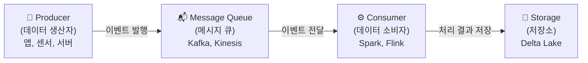
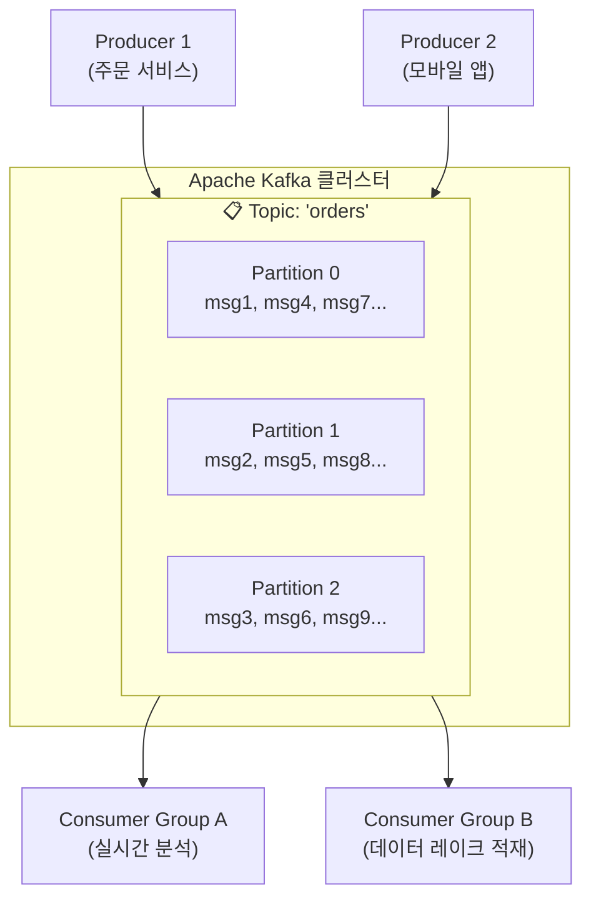
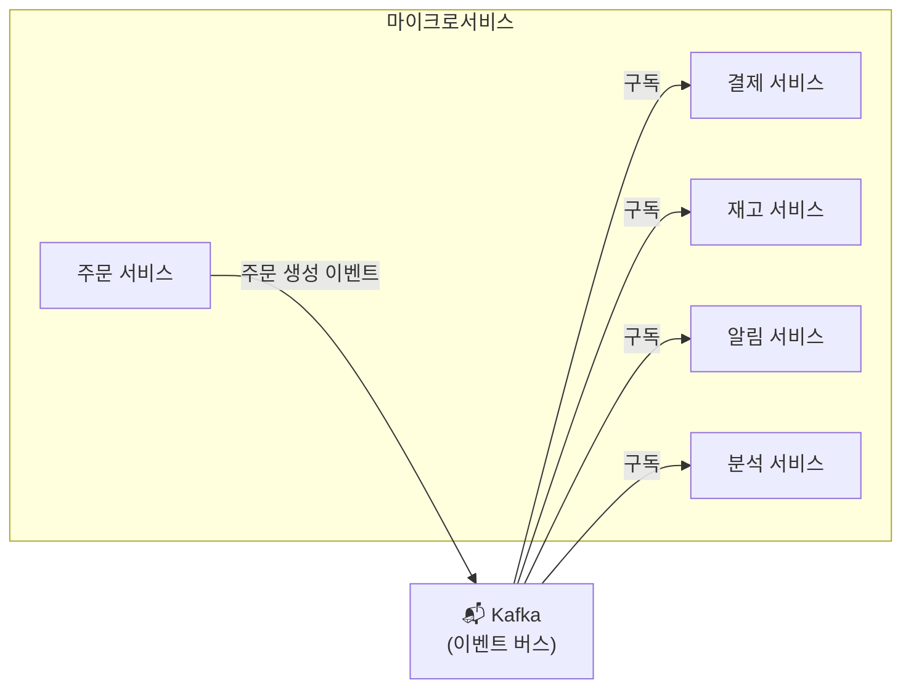
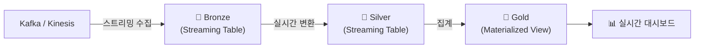

# 실시간 처리 기술 — Kafka, Flink, Spark Streaming

## 왜 실시간 처리가 필요한가요?

비즈니스 환경이 점점 빨라지면서, "어제의 데이터"가 아닌 "지금의 데이터"로 의사결정해야 하는 상황이 많아졌습니다.

| 사례 | 필요한 응답 시간 | 설명 |
|------|----------------|------|
| 신용카드 사기 감지 | 밀리초 | 결제 승인 전에 사기 여부를 판단해야 합니다 |
| 실시간 추천 | 초 | 사용자의 최근 행동에 기반한 상품 추천입니다 |
| IoT 설비 모니터링 | 초 | 온도, 진동 이상 시 즉시 알림을 보내야 합니다 |
| 실시간 대시보드 | 분 | 현재 매출, 트래픽을 실시간으로 표시합니다 |
| 로그 모니터링 | 초~분 | 서버 에러 급증 시 즉시 대응해야 합니다 |

---

## 실시간 처리의 핵심 구성 요소

실시간 데이터 처리 시스템은 일반적으로 세 가지 구성 요소로 이루어집니다.



| 구성 요소 | 역할 | 비유 |
|-----------|------|------|
| **Producer (생산자)** | 이벤트/데이터를 생성하여 발행합니다 | 편지를 보내는 사람 |
| **Message Queue (메시지 큐)** | 이벤트를 임시 저장하고 순서대로 전달합니다 | 우체국 (편지를 모아서 배달) |
| **Consumer (소비자)** | 이벤트를 받아서 처리합니다 | 편지를 받아서 읽는 사람 |
| **Storage (저장소)** | 처리된 결과를 영구 저장합니다 | 파일 캐비닛 |

---

## Apache Kafka

### 개념

> 💡 **Apache Kafka**는 LinkedIn에서 개발한 **분산 이벤트 스트리밍 플랫폼**입니다. 초당 수백만 건의 이벤트를 안정적으로 수집하고, 여러 소비자에게 전달할 수 있습니다. 현재 전 세계 Fortune 500 기업의 80% 이상이 사용하고 있습니다.

### 핵심 개념



| 개념 | 설명 |
|------|------|
| **Topic (토픽)** | 이벤트가 발행되는 카테고리입니다. "orders", "clicks", "logs" 같은 이름을 가집니다 |
| **Partition (파티션)** | 토픽을 물리적으로 나눈 단위입니다. 파티션이 여러 개이면 병렬로 처리할 수 있습니다 |
| **Producer (프로듀서)** | 토픽에 이벤트를 발행하는 애플리케이션입니다 |
| **Consumer (컨슈머)** | 토픽에서 이벤트를 읽어가는 애플리케이션입니다 |
| **Consumer Group** | 같은 토픽을 읽는 컨슈머들의 그룹입니다. 파티션이 그룹 내 컨슈머에게 분배됩니다 |
| **Offset** | 각 파티션에서 컨슈머가 어디까지 읽었는지를 나타내는 위치 정보입니다 |
| **Broker** | Kafka 서버 인스턴스입니다. 여러 Broker가 클러스터를 구성합니다 |

### Kafka의 특징

| 특징 | 설명 |
|------|------|
| **높은 처리량** | 초당 수백만 건의 이벤트를 처리할 수 있습니다 |
| **내구성** | 이벤트를 디스크에 저장하므로, 컨슈머가 느려도 데이터가 유실되지 않습니다 |
| **재처리 가능** | Offset을 되돌려서 과거 이벤트를 다시 읽을 수 있습니다 |
| **다중 소비** | 하나의 이벤트를 여러 Consumer Group이 독립적으로 읽을 수 있습니다 |

### 관련 솔루션

| 솔루션 | 설명 |
|--------|------|
| **Confluent Cloud** | Kafka의 관리형 클라우드 서비스입니다 |
| **Amazon MSK** | AWS에서 관리형 Kafka를 제공합니다 |
| **Azure Event Hubs** | Kafka API와 호환되는 Azure의 스트리밍 서비스입니다 |
| **Amazon Kinesis** | AWS의 자체 실시간 스트리밍 서비스입니다 |

---

## 스트림 처리 엔진

메시지 큐에서 이벤트를 받아 실시간으로 처리하는 엔진들을 살펴보겠습니다.

### Apache Spark Structured Streaming

> 💡 **Spark Structured Streaming**은 Apache Spark의 스트리밍 모듈로, **마이크로 배치(Micro-Batch)** 방식으로 스트리밍 데이터를 처리합니다. 배치 코드와 동일한 DataFrame API를 사용할 수 있어서, 배치→스트리밍 전환이 매우 쉽습니다.

```python
# Kafka에서 주문 이벤트를 실시간으로 읽어서 Delta 테이블에 저장
df = (spark.readStream
    .format("kafka")
    .option("kafka.bootstrap.servers", "broker:9092")
    .option("subscribe", "orders")
    .load()
)

# JSON 파싱 및 변환
from pyspark.sql.functions import from_json, col
schema = "order_id LONG, customer_id LONG, amount DOUBLE, ts TIMESTAMP"

orders = (df
    .select(from_json(col("value").cast("string"), schema).alias("data"))
    .select("data.*")
)

# Delta Lake에 스트리밍으로 저장
(orders.writeStream
    .format("delta")
    .outputMode("append")
    .option("checkpointLocation", "/checkpoints/orders")
    .toTable("catalog.schema.streaming_orders")
)
```

### Apache Flink

> 💡 **Apache Flink**는 진정한 **이벤트 단위(Event-at-a-time)** 스트리밍 처리 엔진입니다. 이벤트가 도착하는 즉시 하나씩 처리하므로, Spark의 마이크로 배치보다 더 낮은 지연 시간(밀리초 수준)을 달성할 수 있습니다.

### Spark Streaming vs Flink 비교

| 비교 항목 | Spark Structured Streaming | Apache Flink |
|-----------|--------------------------|-------------|
| **처리 모델** | 마이크로 배치 (기본) | 이벤트 단위 (True Streaming) |
| **지연 시간** | 수백 밀리초 ~ 초 | 밀리초 ~ 수십 밀리초 |
| **배치/스트리밍 통합** | 동일 API (DataFrame) | 별도 API (DataStream vs Table) |
| **상태 관리** | 체크포인트 기반 | Savepoint + 체크포인트 |
| **생태계** | Spark 생태계 (MLlib, SQL 등) | 독자 생태계 |
| **Databricks 지원** | ✅ 네이티브 지원 | ❌ 별도 운영 필요 |

> 💡 **체크포인트(Checkpoint)란?** 스트리밍 처리의 현재 진행 상태(어디까지 읽었고, 어떤 집계 값을 가지고 있는지)를 주기적으로 저장하는 것입니다. 장애가 발생하면 마지막 체크포인트부터 재시작하여 데이터 유실 없이 처리를 이어갈 수 있습니다.

---

## 이벤트 드리븐 아키텍처 (EDA)

### 개념

> 💡 **이벤트 드리븐 아키텍처(Event-Driven Architecture, EDA)**란 시스템의 구성 요소들이 **이벤트**를 중심으로 통신하는 아키텍처 패턴입니다. A 서비스에서 발생한 이벤트를 Kafka 같은 메시지 큐에 발행하면, 관심 있는 다른 서비스들이 이를 구독하여 처리합니다.



### EDA의 장점

| 장점 | 설명 |
|------|------|
| **느슨한 결합** | 서비스 간 직접 호출 없이 이벤트로 통신하므로, 서비스를 독립적으로 변경할 수 있습니다 |
| **확장성** | 이벤트를 처리하는 서비스(Consumer)를 쉽게 추가할 수 있습니다 |
| **실시간 반응** | 이벤트 발생 즉시 관련 서비스가 반응합니다 |
| **이력 보존** | Kafka에 이벤트가 보존되므로, 나중에 새로운 서비스가 과거 이벤트를 재처리할 수 있습니다 |

---

## Databricks에서의 실시간 처리

Databricks는 **Spark Structured Streaming**을 기반으로 실시간 처리를 지원하며, 이를 Medallion 아키텍처와 결합하여 사용합니다.



| Databricks 기능 | 역할 |
|----------------|------|
| **Auto Loader** | 클라우드 스토리지의 새 파일을 실시간으로 감지하여 수집합니다 |
| **Structured Streaming** | Kafka, Kinesis 등에서 이벤트를 실시간으로 읽고 처리합니다 |
| **Streaming Tables (SDP)** | 선언적으로 스트리밍 파이프라인을 정의합니다 |
| **Materialized Views (SDP)** | 스트리밍 데이터를 실시간으로 집계합니다 |
| **Delta Lake** | 스트리밍으로 적재된 데이터에 ACID 트랜잭션을 보장합니다 |

---

## 실시간 처리 아키텍처 패턴

### Lambda 아키텍처

> 💡 **Lambda 아키텍처**는 **배치 레이어**와 **스피드 레이어**(실시간)를 분리하여, 각각의 장점을 활용하는 아키텍처입니다. 배치는 정확성을, 스피드는 속도를 담당합니다.

**단점**: 같은 로직을 배치용과 스트리밍용으로 두 번 구현해야 하는 유지보수 부담이 있습니다.

### Kappa 아키텍처

> 💡 **Kappa 아키텍처**는 모든 데이터를 **스트리밍으로만 처리**하는 아키텍처입니다. 배치 처리가 필요하면, 과거 이벤트를 Kafka에서 다시 읽어서(재처리) 스트리밍 파이프라인으로 처리합니다.

### Delta 아키텍처 (Databricks 권장)

Databricks는 **Delta Lake의 배치/스트리밍 통합 능력**을 활용하여, 하나의 코드로 배치와 스트리밍을 모두 처리하는 방식을 권장합니다. Lambda나 Kappa의 장점을 모두 취하면서 복잡성을 줄입니다.

---

## 정리

| 핵심 개념 | 설명 |
|-----------|------|
| **Apache Kafka** | 분산 이벤트 스트리밍 플랫폼. 이벤트를 안정적으로 수집하고 전달합니다 |
| **Structured Streaming** | Spark의 스트리밍 엔진. 마이크로 배치 방식으로 동작합니다 |
| **Apache Flink** | 이벤트 단위 스트리밍 엔진. 밀리초 수준의 낮은 지연 시간을 제공합니다 |
| **EDA** | 이벤트를 중심으로 서비스가 통신하는 아키텍처 패턴입니다 |
| **CDC** | 데이터베이스 변경 사항을 실시간으로 감지하여 전달하는 기술입니다 |
| **체크포인트** | 스트리밍 처리 상태를 저장하여 장애 시 복구를 보장합니다 |

이것으로 **선행 지식** 섹션을 마치겠습니다. 이제 [01. 데이터 기초](../01-data-fundamentals/README.md)로 진행하시면, Databricks 중심의 본격적인 학습을 시작하실 수 있습니다.

---

## 참고 링크

- [Apache Kafka Official](https://kafka.apache.org/)
- [Apache Flink Official](https://flink.apache.org/)
- [Databricks: Structured Streaming](https://docs.databricks.com/aws/en/structured-streaming/)
- [Confluent: Kafka 101](https://developer.confluent.io/courses/apache-kafka/events/)
- [Databricks Blog: Streaming](https://www.databricks.com/blog/category/engineering-blog)
