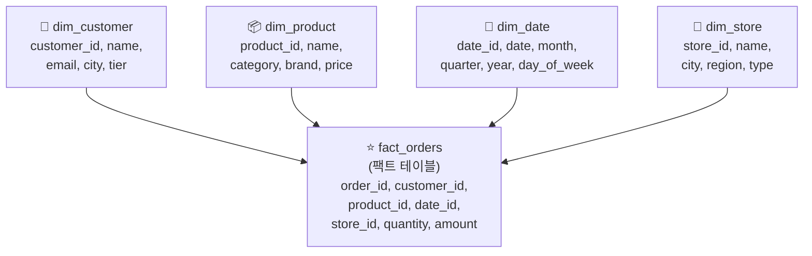
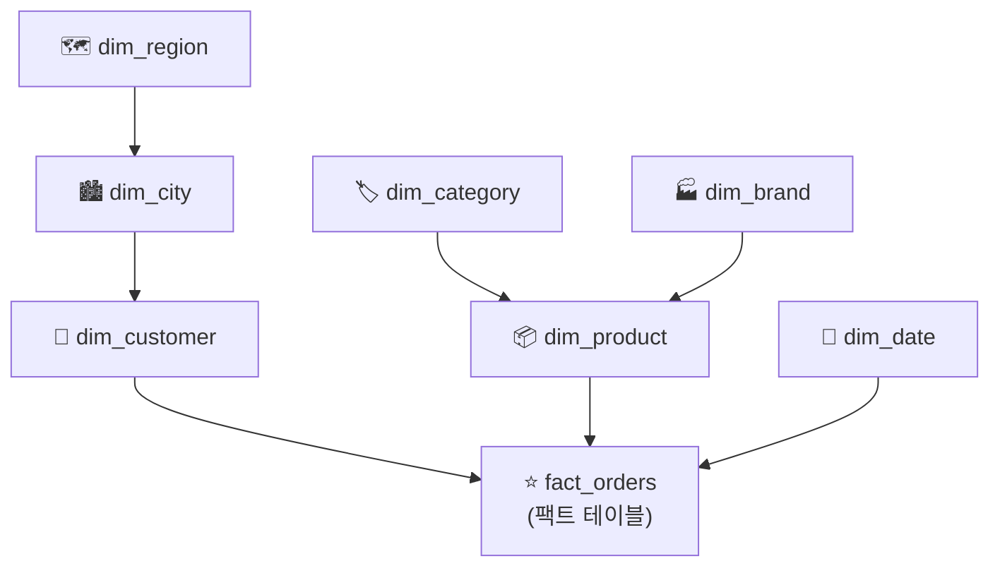

# 데이터 모델링 — 정규화, Star 스키마, Snowflake 스키마

## 왜 데이터 모델링을 알아야 하나요?

데이터베이스에 데이터를 저장할 때, "테이블을 어떻게 설계하느냐"에 따라 저장 효율, 쿼리 성능, 유지보수 편의성이 크게 달라집니다. 이 설계 과정을 **데이터 모델링(Data Modeling)** 이라고 합니다.

데이터 모델링은 크게 두 가지 방향이 있습니다.

| 방향 | 목적 | 적합한 시스템 |
|------|------|-------------|
| **정규화 (Normalization)** | 중복을 제거하고 무결성을 보장합니다 | OLTP (운영 시스템) |
| **비정규화 (Denormalization)** | 분석 성능을 극대화합니다 | OLAP (분석 시스템, 웨어하우스) |

---

## 정규화 (Normalization)

### 개념

> 💡 **정규화(Normalization)** 란 데이터의 **중복을 최소화**하기 위해 테이블을 분리하고, 관계를 통해 연결하는 설계 방법입니다. 데이터의 일관성과 무결성을 보장하는 것이 목표입니다.

### 비유: 전화번호부

**정규화하지 않은 경우 (중복 가득):**

| 주문번호 | 고객명 | 고객전화 | 고객주소 | 상품명 | 가격 |
|----------|--------|----------|----------|--------|------|
| 001 | 김철수 | 010-1234 | 서울시 강남구 | 노트북 | 120만 |
| 002 | 김철수 | 010-1234 | 서울시 강남구 | 키보드 | 8.9만 |
| 003 | 이영희 | 010-5678 | 부산시 해운대구 | 마우스 | 6.5만 |

❌ **문제점**: 김철수의 전화번호가 변경되면, 해당 고객의 모든 주문 행을 수정해야 합니다. 하나라도 놓치면 데이터 불일치가 발생합니다.

**정규화한 경우 (중복 제거):**

**고객 테이블:**

| customer_id | name | phone | address |
|------------|------|-------|---------|
| C1 | 김철수 | 010-1234 | 서울시 강남구 |
| C2 | 이영희 | 010-5678 | 부산시 해운대구 |

**주문 테이블:**

| order_id | customer_id | product | price |
|----------|------------|---------|-------|
| 001 | C1 | 노트북 | 120만 |
| 002 | C1 | 키보드 | 8.9만 |
| 003 | C2 | 마우스 | 6.5만 |

✅ 김철수의 전화번호를 고객 테이블에서 **한 번만** 수정하면 됩니다.

### 정규화 단계

| 단계 | 이름 | 규칙 | 설명 |
|------|------|------|------|
| **1NF** | 제1정규형 | 원자값만 저장 | 하나의 셀에 하나의 값만 저장합니다 (쉼표로 구분된 리스트 금지) |
| **2NF** | 제2정규형 | 부분 종속 제거 | 기본 키의 일부에만 종속되는 컬럼을 별도 테이블로 분리합니다 |
| **3NF** | 제3정규형 | 이행 종속 제거 | 키가 아닌 컬럼이 다른 키가 아닌 컬럼에 종속되는 경우를 제거합니다 |

> 💡 실무에서는 보통 **3NF(제3정규형)** 까지 적용하면 충분합니다. 그 이상의 정규화(BCNF, 4NF, 5NF)는 매우 특수한 경우에만 사용됩니다.

### 정규화의 장단점

| 장점 | 단점 |
|------|------|
| 데이터 중복이 없어 저장 공간 절약 | JOIN이 많아져 분석 쿼리가 느려질 수 있습니다 |
| 데이터 수정 시 한 곳만 변경하면 됩니다 | 테이블이 많아져 구조가 복잡해집니다 |
| 데이터 일관성이 보장됩니다 | 개발자가 테이블 간 관계를 모두 이해해야 합니다 |

---

## 비정규화 — 분석을 위한 설계

### OLTP vs OLAP 설계의 차이

> 💡 **OLTP(Online Transaction Processing)** 와 **OLAP(Online Analytical Processing)** 은 서로 다른 목적을 가진 시스템이며, 데이터 모델링 방식도 달라야 합니다.

| 비교 | OLTP (운영) | OLAP (분석) |
|------|------------|------------|
| **목적** | 주문 처리, 결제, 회원가입 등 개별 트랜잭션 | 매출 집계, 추이 분석, 리포트 등 대량 조회 |
| **쿼리 패턴** | 소량의 행을 빠르게 읽기/쓰기 | 대량의 행을 집계 (SUM, AVG, COUNT) |
| **설계 원칙** | 정규화 (중복 제거) | 비정규화 (조인 최소화) |
| **대표 도구** | MySQL, PostgreSQL, Oracle | Databricks SQL, Snowflake, BigQuery |

### 차원 모델링 (Dimensional Modeling)

분석 시스템(OLAP)을 위한 대표적인 설계 방법론이 **차원 모델링**입니다. 데이터를 **팩트(Fact)** 와 **디멘전(Dimension)** 으로 나누어 설계합니다.

> 💡 **팩트 테이블(Fact Table)** 이란 비즈니스에서 발생하는 **이벤트(사건)** 와 그 **측정값(숫자)** 을 저장하는 테이블입니다. 주문, 클릭, 결제 등의 이벤트가 해당합니다. 보통 테이블 중 가장 행 수가 많습니다.

> 💡 **디멘전 테이블(Dimension Table)** 이란 팩트 이벤트의 **맥락(누가, 언제, 어디서, 무엇을)** 을 설명하는 참조 테이블입니다. 고객, 상품, 날짜, 지역 등이 해당합니다.

---

## Star 스키마 (Star Schema)

### 개념

> 💡 **Star 스키마(별 모양 스키마)** 는 중앙에 팩트 테이블을 두고, 주위에 디멘전 테이블을 **직접 연결**하는 가장 기본적인 차원 모델링 패턴입니다. 다이어그램이 별 모양처럼 보여서 이런 이름이 붙었습니다.



### 예시 테이블

**fact_orders (팩트)**

| order_id | customer_id | product_id | date_id | store_id | quantity | amount |
|----------|------------|------------|---------|----------|----------|--------|
| 1 | C1 | P101 | 20250301 | S01 | 1 | 1,200,000 |
| 2 | C2 | P205 | 20250302 | S03 | 2 | 178,000 |

**dim_customer (디멘전)**

| customer_id | name | city | tier |
|------------|------|------|------|
| C1 | 김철수 | 서울 | Gold |
| C2 | 이영희 | 부산 | Silver |

**dim_date (디멘전)**

| date_id | date | month | quarter | year | day_of_week |
|---------|------|-------|---------|------|-------------|
| 20250301 | 2025-03-01 | 3 | Q1 | 2025 | 토요일 |
| 20250302 | 2025-03-02 | 3 | Q1 | 2025 | 일요일 |

### Star 스키마의 장단점

| 장점 | 단점 |
|------|------|
| 구조가 직관적이고 이해하기 쉽습니다 | 디멘전 테이블에 중복이 있을 수 있습니다 |
| JOIN이 단순하여 쿼리 성능이 좋습니다 | 디멘전이 매우 크면 비효율적일 수 있습니다 |
| BI 도구와 호환성이 좋습니다 | |

### 분석 쿼리 예시

```sql
-- "2025년 Q1 서울 지역의 카테고리별 매출"
SELECT
    p.category,
    d.quarter,
    s.city,
    SUM(f.amount) AS total_revenue,
    COUNT(f.order_id) AS order_count
FROM fact_orders f
JOIN dim_product p ON f.product_id = p.product_id
JOIN dim_date d ON f.date_id = d.date_id
JOIN dim_store s ON f.store_id = s.store_id
WHERE d.year = 2025
  AND d.quarter = 'Q1'
  AND s.city = '서울'
GROUP BY p.category, d.quarter, s.city
ORDER BY total_revenue DESC;
```

---

## Snowflake 스키마 (Snowflake Schema)

### 개념

> 💡 **Snowflake 스키마(눈꽃 모양 스키마)** 는 Star 스키마의 디멘전 테이블을 더 세분화(정규화)하여, 디멘전이 **하위 디멘전을 참조**하는 구조입니다. 다이어그램이 눈꽃처럼 가지를 쳐서 이런 이름이 붙었습니다.



### Star vs Snowflake 비교

| 비교 항목 | Star 스키마 | Snowflake 스키마 |
|-----------|-----------|-----------------|
| 디멘전 구조 | 하나의 넓은 테이블 | 여러 정규화된 테이블 |
| JOIN 수 | 적음 (팩트 ↔ 디멘전만) | 많음 (디멘전 ↔ 하위 디멘전도) |
| 쿼리 성능 | 빠름 | 상대적으로 느림 (JOIN 증가) |
| 저장 공간 | 디멘전 중복 있음 | 중복 최소화 |
| 이해 용이성 | 직관적 | 복잡 |
| **실무 권장** | ✅ 대부분의 경우 권장 | 디멘전이 매우 크고 중복이 심할 때 |

---

## 현대 데이터 플랫폼에서의 모델링

### Databricks 레이크하우스에서의 모델링

Databricks 레이크하우스에서는 Medallion 아키텍처와 차원 모델링을 결합하여 사용합니다.

| 계층 | 모델링 방식 | 설명 |
|------|-----------|------|
| **Bronze** | 원본 그대로 | 모델링 없이 원본을 보존합니다 |
| **Silver** | 3NF에 가까운 정규화 | 정제된 엔티티별 테이블 (고객, 주문, 상품 등) |
| **Gold** | Star 스키마 / 비정규화 | 비즈니스 분석용 팩트+디멘전 또는 넓은 비정규화 테이블 |


### One Big Table (OBT) 패턴

최근에는 컴퓨팅 파워가 충분해지면서, 모든 디멘전을 팩트에 미리 합쳐 놓은 **하나의 큰 테이블(One Big Table, OBT)** 패턴도 많이 사용됩니다.

```sql
-- Gold: 비정규화된 넓은 테이블 (OBT)
CREATE TABLE gold.wide_orders AS
SELECT
    f.order_id,
    f.quantity,
    f.amount,
    c.name AS customer_name,
    c.city AS customer_city,
    c.tier AS customer_tier,
    p.name AS product_name,
    p.category AS product_category,
    p.brand AS product_brand,
    d.date,
    d.month,
    d.quarter,
    d.year
FROM fact_orders f
JOIN dim_customer c ON f.customer_id = c.customer_id
JOIN dim_product p ON f.product_id = p.product_id
JOIN dim_date d ON f.date_id = d.date_id;
```

> 💡 OBT 패턴은 JOIN 없이 바로 분석할 수 있어 쿼리가 매우 간단하고 빠르지만, 데이터 중복이 크게 증가합니다. Databricks처럼 저렴한 클라우드 스토리지를 사용하는 환경에서는 저장 비용보다 쿼리 편의성을 우선하는 경우가 많습니다.

---

## 정리

| 핵심 개념 | 설명 |
|-----------|------|
| **정규화** | 중복을 제거하여 데이터 일관성을 보장하는 설계입니다. OLTP에 적합합니다 |
| **비정규화** | 의도적으로 중복을 허용하여 분석 성능을 높이는 설계입니다. OLAP에 적합합니다 |
| **팩트 테이블** | 비즈니스 이벤트(주문, 클릭)와 측정값(금액, 수량)을 저장합니다 |
| **디멘전 테이블** | 이벤트의 맥락(누가, 언제, 어디서, 무엇을)을 설명하는 참조 데이터입니다 |
| **Star 스키마** | 팩트 + 디멘전을 직접 연결하는 단순한 구조입니다. 대부분의 경우 권장됩니다 |
| **Snowflake 스키마** | 디멘전을 추가 정규화하여 중복을 줄인 구조입니다 |

---

## 참고 링크

- [Databricks: Data modeling](https://docs.databricks.com/aws/en/sql/language-manual/)
- [Kimball Group: Dimensional Modeling](https://www.kimballgroup.com/data-warehouse-business-intelligence-resources/kimball-techniques/dimensional-modeling-techniques/)
