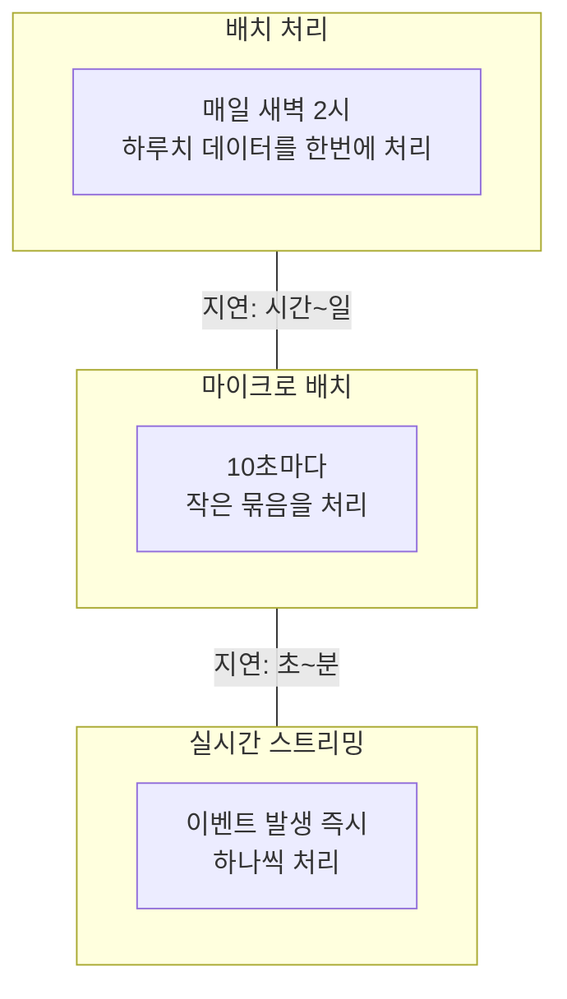
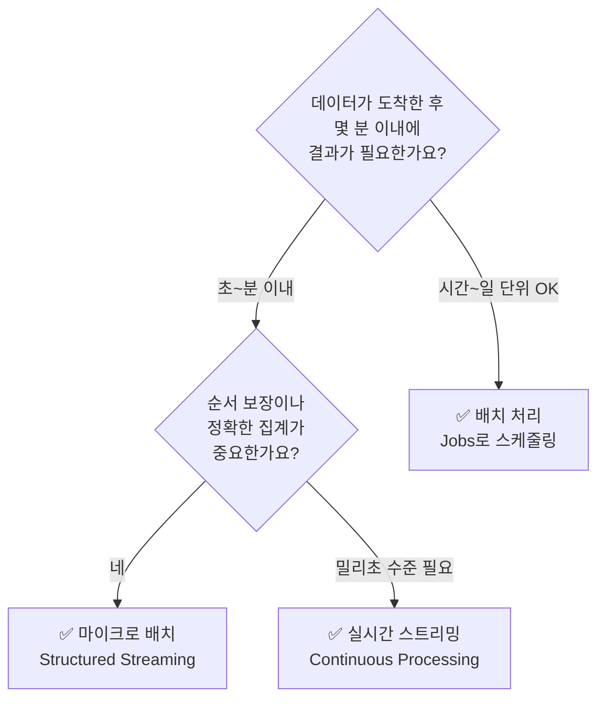

# 배치 처리 vs 스트리밍 처리

## 왜 이 개념을 알아야 하나요?

데이터 파이프라인을 설계할 때 가장 먼저 결정해야 하는 것 중 하나가 바로 **"데이터를 얼마나 자주, 얼마나 빠르게 처리할 것인가?"**입니다. 이 질문에 대한 답이 바로 **배치(Batch) 처리**와 **스트리밍(Streaming) 처리**의 선택입니다.

---

## 배치 처리 (Batch Processing)

### 개념

> 💡 **배치 처리(Batch Processing)**란 일정 기간 동안 쌓인 데이터를 한꺼번에 모아서 처리하는 방식입니다. "모아서 한 번에 처리"가 핵심입니다.

비유하자면, **우편배달부**와 같습니다. 편지가 도착할 때마다 바로 배달하는 것이 아니라, 아침에 한꺼번에 모아서 배달합니다.

### 동작 방식


### 대표적인 사례

| 사례 | 설명 |
|------|------|
| 일별 매출 리포트 | 전날의 매출 데이터를 새벽에 집계하여 리포트를 생성합니다 |
| 월말 급여 계산 | 한 달간의 근태 데이터를 모아서 급여를 계산합니다 |
| 추천 모델 학습 | 일주일간의 사용자 행동 데이터로 추천 모델을 재학습합니다 |
| 데이터 백업 | 매일 특정 시간에 전체 데이터베이스를 백업합니다 |

### 장단점

| 장점 | 단점 |
|------|------|
| 구현이 비교적 간단함 | 데이터 반영까지 시간 지연(Latency)이 발생합니다 |
| 리소스를 효율적으로 사용할 수 있음 | 실시간 의사결정이 불가능합니다 |
| 대용량 데이터 처리에 비용 효율적 | 오류 발생 시 전체를 재처리해야 할 수 있습니다 |
| 디버깅과 모니터링이 쉬움 | 피크 시간에 리소스가 집중됩니다 |

---

## 스트리밍 처리 (Stream Processing)

### 개념

> 💡 **스트리밍 처리(Stream Processing)**란 데이터가 발생하는 **즉시** 연속적으로 처리하는 방식입니다. "도착하는 대로 바로 처리"가 핵심입니다.

비유하자면, **컨베이어 벨트**와 같습니다. 물건(데이터)이 도착하면 바로 컨베이어 벨트 위에서 처리되어 다음 단계로 넘어갑니다. 멈추지 않고 계속 흘러갑니다.

### 동작 방식


> 💡 **이벤트(Event)란?** 시스템에서 발생하는 하나하나의 데이터 포인트를 말합니다. 사용자가 버튼을 클릭하는 것, 센서가 온도를 측정하는 것, 결제가 완료되는 것 — 모두 이벤트입니다. 스트리밍 처리는 이 이벤트들을 하나씩 또는 작은 묶음(마이크로 배치)으로 처리합니다.

> 💡 **메시지 큐(Message Queue)란?** 이벤트를 일시적으로 저장했다가 순서대로 전달해 주는 중간 시스템입니다. Apache Kafka, Amazon Kinesis, Azure Event Hubs 등이 대표적입니다. 데이터를 보내는 쪽(Producer)과 받아서 처리하는 쪽(Consumer)을 느슨하게 연결하여, 한쪽이 느려지더라도 데이터가 유실되지 않도록 해 줍니다.

### 대표적인 사례

| 사례 | 설명 |
|------|------|
| 실시간 이상 거래 감지 | 신용카드 결제가 발생할 때마다 즉시 사기 여부를 판단합니다 |
| 실시간 대시보드 | 웹사이트 동시 접속자 수를 초 단위로 갱신합니다 |
| IoT 센서 모니터링 | 공장 설비의 온도가 임계치를 넘으면 즉시 알림을 발송합니다 |
| 실시간 추천 | 사용자의 최근 행동을 기반으로 실시간으로 상품을 추천합니다 |
| 로그 모니터링 | 서버 에러 로그가 급증하면 즉시 운영팀에 알림을 보냅니다 |

### 장단점

| 장점 | 단점 |
|------|------|
| 데이터를 즉시 활용할 수 있음 | 구현이 상대적으로 복잡합니다 |
| 실시간 의사결정 가능 | 컴퓨팅 리소스가 항상 실행되어야 하므로 비용이 높을 수 있습니다 |
| 점진적 처리로 안정적 | 순서 보장, 중복 처리 등 고려 사항이 많습니다 |
| 최신 데이터를 항상 반영 | 디버깅이 어려울 수 있습니다 |

---

## 마이크로 배치 (Micro-Batch): 두 세계의 중간

실무에서는 순수한 실시간 처리보다 **마이크로 배치(Micro-Batch)** 방식을 많이 사용합니다.

> 💡 **마이크로 배치(Micro-Batch)란?** 데이터를 아주 짧은 간격(수 초~수 분)으로 작은 묶음 단위로 처리하는 방식입니다. 순수한 스트리밍(이벤트 단위 처리)과 배치(대량 일괄 처리)의 중간 지점에 해당합니다.



Databricks의 **Spark Structured Streaming**은 기본적으로 마이크로 배치 방식으로 동작하며, 필요에 따라 Continuous Processing 모드로 더 낮은 지연시간을 달성할 수도 있습니다.

---

## 한눈에 비교

| 비교 항목 | 배치 처리 | 마이크로 배치 | 스트리밍 처리 |
|-----------|-----------|---------------|---------------|
| **처리 단위** | 대량 (시간/일 단위) | 소량 (초/분 단위) | 개별 이벤트 |
| **지연 시간** | 분~시간~일 | 초~분 | 밀리초~초 |
| **구현 복잡도** | 낮음 | 중간 | 높음 |
| **비용** | 낮음 (필요 시만 실행) | 중간 | 높음 (항상 실행) |
| **적합한 사례** | 리포트, ML 학습 | 니어 리얼타임 대시보드 | 이상 감지, 실시간 알림 |
| **Databricks 도구** | Jobs (Scheduled) | Structured Streaming | Structured Streaming (Continuous) |

---

## Databricks에서의 배치와 스트리밍 통합

Databricks의 큰 장점 중 하나는 **배치와 스트리밍을 동일한 코드로 처리**할 수 있다는 것입니다.

### 동일한 코드, 다른 실행 모드

```python
# 배치 처리: 한 번 실행하고 종료
df = spark.read.format("delta").load("/data/orders")
result = df.groupBy("category").agg(sum("amount"))
result.write.format("delta").mode("overwrite").save("/data/summary")

# 스트리밍 처리: 새 데이터가 올 때마다 자동으로 처리
df = spark.readStream.format("delta").load("/data/orders")
result = df.groupBy("category").agg(sum("amount"))
result.writeStream.format("delta").outputMode("complete") \
    .option("checkpointLocation", "/checkpoints/summary") \
    .start("/data/summary")
```

위 예시에서 보시는 것처럼, `read` → `readStream`, `write` → `writeStream`으로 바꾸는 것만으로 배치 파이프라인을 스트리밍 파이프라인으로 전환할 수 있습니다.

### SDP에서의 통합

Spark Declarative Pipelines(SDP)를 사용하면, 배치와 스트리밍의 구분 자체가 더욱 단순해집니다.

| SDP 개념 | 처리 방식 | 설명 |
|----------|-----------|------|
| **Streaming Table** | 스트리밍 (추가 전용) | 새로 도착한 데이터만 증분 처리합니다 |
| **Materialized View** | 배치 (전체 재계산) | 전체 데이터를 기준으로 결과를 재계산합니다 |

> 🆕 **최신 기능**: Databricks는 **Serverless Streaming**을 통해 스트리밍 워크로드도 서버리스로 실행할 수 있게 되었습니다. 클러스터를 직접 관리할 필요 없이, 데이터가 들어올 때만 자동으로 리소스를 할당받아 처리합니다. 이를 통해 스트리밍의 "항상 실행" 비용 문제를 크게 완화할 수 있습니다.

---

## 어떤 방식을 선택해야 하나요?

다음 질문들에 답해 보시면 적합한 방식을 선택하는 데 도움이 됩니다.



실무에서는 **하나의 시스템 안에서 배치와 스트리밍을 혼합**하여 사용하는 것이 일반적입니다. 예를 들어, 실시간 이상 거래 감지는 스트리밍으로, 일별 매출 리포트는 배치로 처리하는 식입니다. Databricks는 이 두 가지를 하나의 플랫폼에서 모두 지원하므로, 상황에 맞는 최적의 방식을 유연하게 선택하실 수 있습니다.

---

## 정리

| 핵심 개념 | 설명 |
|-----------|------|
| **배치 처리** | 데이터를 모아서 한꺼번에 처리하는 방식. 비용 효율적이지만 지연이 있습니다 |
| **스트리밍 처리** | 데이터가 도착하는 즉시 처리하는 방식. 실시간이지만 복잡하고 비용이 높습니다 |
| **마이크로 배치** | 짧은 간격(초~분)으로 작은 묶음을 처리하는 실용적인 중간 방식입니다 |
| **메시지 큐** | 이벤트를 임시 저장하여 Producer와 Consumer를 연결하는 중간 시스템입니다 |
| **Structured Streaming** | Spark의 스트리밍 엔진으로, 배치와 동일한 API로 스트리밍 처리를 지원합니다 |

다음 문서에서는 데이터의 **유형**(정형, 반정형, 비정형)에 따른 특징과 처리 방법을 살펴보겠습니다.

---

## 참고 링크

- [Databricks: Structured Streaming](https://docs.databricks.com/aws/en/structured-streaming/)
- [Azure Databricks: Stream processing](https://learn.microsoft.com/en-us/azure/databricks/structured-streaming/)
- [Databricks Blog: Streaming](https://www.databricks.com/blog/category/engineering-blog)
