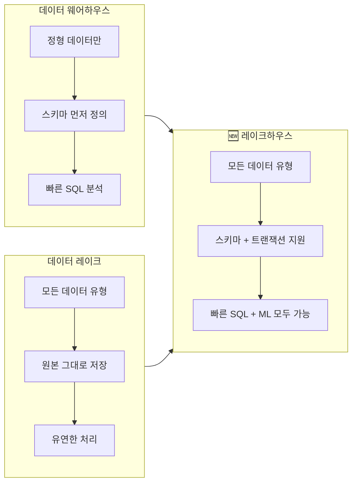

# 데이터 웨어하우스 vs 데이터 레이크

## 왜 이 개념을 알아야 하나요?

데이터를 수집했다면, 어딘가에 저장해야 합니다. 그런데 데이터를 저장하는 방식에는 여러 가지가 있으며, 어떤 방식을 선택하느냐에 따라 이후의 분석 방법, 비용, 성능이 크게 달라집니다.

데이터 저장소의 대표적인 두 가지 접근법인 **데이터 웨어하우스(Data Warehouse)**와 **데이터 레이크(Data Lake)**를 비교해 보겠습니다. 이 두 개념을 이해하면, Databricks가 제시하는 **레이크하우스(Lakehouse)** 패러다임이 왜 등장했는지 자연스럽게 이해하실 수 있습니다.

---

## 데이터 웨어하우스 (Data Warehouse)

### 개념

> 💡 **데이터 웨어하우스(Data Warehouse)**란 비즈니스 의사결정을 위해 다양한 소스의 데이터를 **구조화된 형태**로 통합·저장하는 중앙 저장소입니다.

쉽게 비유하면 **잘 정리된 도서관**과 같습니다. 모든 책(데이터)이 분류 체계(스키마)에 따라 정리되어 있어서, 원하는 정보를 빠르게 찾을 수 있습니다. 대신, 새로운 책을 넣으려면 반드시 정해진 분류 체계에 맞춰야 합니다.

### 핵심 특징

| 특징 | 설명 |
|------|------|
| **Schema-on-Write** | 데이터를 저장하기 **전에** 스키마(구조)를 먼저 정의해야 합니다 |
| **정형 데이터 중심** | 행(Row)과 열(Column)이 명확한 테이블 형태의 데이터를 저장합니다 |
| **SQL 기반 분석** | SQL 쿼리를 통해 빠르게 데이터를 조회하고 분석할 수 있습니다 |
| **높은 쿼리 성능** | 분석에 최적화된 구조(컬럼 기반 저장 등)로 빠른 응답 속도를 제공합니다 |

> 💡 **Schema-on-Write란?** 데이터를 저장소에 쓰는(Write) 시점에 스키마(데이터의 구조, 즉 어떤 컬럼이 있고 각 컬럼의 타입은 무엇인지)를 강제하는 방식입니다. 마치 엑셀 시트의 열 제목을 먼저 정하고, 그 규칙에 맞는 데이터만 입력하는 것과 같습니다.

> 💡 **컬럼 기반 저장(Columnar Storage)이란?** 일반적인 데이터베이스는 행(Row) 단위로 데이터를 저장하지만, 분석용 웨어하우스는 열(Column) 단위로 저장합니다. "전체 고객의 나이 평균"처럼 특정 컬럼만 읽는 분석 쿼리에서 필요한 컬럼만 읽으면 되므로 훨씬 빠릅니다.

### 대표적인 제품

- Amazon Redshift, Google BigQuery, Snowflake, Databricks SQL

### 장단점

| 장점 | 단점 |
|------|------|
| SQL로 빠른 분석 가능 | 스키마를 미리 정의해야 하므로 유연성이 낮음 |
| 데이터 품질이 보장됨 | 비정형 데이터(이미지, 동영상 등) 저장이 어려움 |
| 비즈니스 사용자도 쉽게 사용 | 스토리지 비용이 상대적으로 높음 |
| 거버넌스(권한 관리)가 잘 됨 | 대용량 데이터 저장 시 비용 급증 |

---

## 데이터 레이크 (Data Lake)

### 개념

> 💡 **데이터 레이크(Data Lake)**란 정형·반정형·비정형 데이터를 **원본 형태 그대로** 저장할 수 있는 대규모 저장소입니다.

비유하자면 **거대한 창고**와 같습니다. 어떤 물건(데이터)이든 일단 넣을 수 있고, 나중에 필요할 때 꺼내서 정리하면 됩니다. 도서관처럼 미리 분류할 필요가 없어서 빠르게 데이터를 저장할 수 있지만, 잘 관리하지 않으면 원하는 데이터를 찾기 어려워질 수 있습니다.

### 핵심 특징

| 특징 | 설명 |
|------|------|
| **Schema-on-Read** | 데이터를 읽는(Read) 시점에 스키마를 적용합니다. 저장 시에는 원본 그대로 저장합니다 |
| **모든 데이터 유형** | 정형(테이블), 반정형(JSON, XML), 비정형(이미지, 동영상, 로그) 모두 저장 가능합니다 |
| **저비용 대용량** | 클라우드 오브젝트 스토리지(S3, ADLS, GCS) 기반으로 저렴하게 대용량 저장이 가능합니다 |
| **유연한 처리** | 저장 후에 다양한 도구(Spark, Python, R)로 자유롭게 처리할 수 있습니다 |

> 💡 **Schema-on-Read란?** Schema-on-Write와 반대로, 데이터를 읽을 때 비로소 구조를 정하는 방식입니다. 원본 데이터를 그대로 저장해 두고, 분석할 때 "이 파일의 3번째 필드가 이름이고, 5번째 필드가 금액이야"라고 해석하는 것입니다.

> 💡 **오브젝트 스토리지(Object Storage)란?** AWS S3, Azure Blob Storage, Google Cloud Storage 같은 클라우드 저장소입니다. 파일을 폴더/키(Key) 구조로 저장하며, 거의 무제한에 가까운 용량을 저렴한 비용으로 사용할 수 있습니다. 전통적인 파일 시스템과 달리 HTTP 기반으로 접근합니다.

### 대표적인 기술

- AWS S3 + Apache Spark, Azure Data Lake Storage(ADLS), Hadoop HDFS

### 장단점

| 장점 | 단점 |
|------|------|
| 어떤 데이터든 저장 가능 | 데이터 품질 보장이 어려움 |
| 매우 저렴한 저장 비용 | SQL 분석 성능이 웨어하우스보다 느림 |
| ML/AI 워크로드에 적합 | 관리 부실 시 "데이터 늪(Data Swamp)"이 될 위험 |
| 스키마 변경에 유연함 | 거버넌스(접근 제어, 감사)가 약함 |

> 💡 **데이터 늪(Data Swamp)이란?** 데이터 레이크를 적절히 관리하지 않으면, 어떤 데이터가 어디에 있는지, 데이터의 품질이 어떤지 알 수 없는 상태가 됩니다. 이렇게 활용 불가능해진 데이터 레이크를 "데이터 늪"이라고 부릅니다.

---

## 한눈에 비교

| 비교 항목 | 데이터 웨어하우스 | 데이터 레이크 |
|-----------|-------------------|---------------|
| **데이터 유형** | 정형 데이터 | 정형 + 반정형 + 비정형 |
| **스키마** | Schema-on-Write (쓸 때 정의) | Schema-on-Read (읽을 때 정의) |
| **주요 사용자** | 데이터 분석가, BI 사용자 | 데이터 과학자, 데이터 엔지니어 |
| **쿼리 성능** | 매우 빠름 (최적화됨) | 상대적으로 느림 |
| **저장 비용** | 높음 | 낮음 |
| **데이터 품질** | 높음 (스키마 강제) | 관리에 따라 다름 |
| **유연성** | 낮음 | 높음 |
| **대표 제품** | Redshift, BigQuery, Snowflake | S3, ADLS, HDFS |

---

## 그래서, 둘 중 뭘 써야 하나요?

전통적으로 많은 기업들은 **두 가지를 모두 운영**해야 했습니다. BI 분석을 위한 데이터 웨어하우스와, ML 학습이나 로그 분석을 위한 데이터 레이크를 따로 유지하면서, 데이터를 양쪽에 복사하고 동기화하는 비용이 발생했습니다.

이 문제를 해결하기 위해 등장한 것이 바로 **레이크하우스(Lakehouse)** 아키텍처입니다. 데이터 레이크의 저렴한 저장 비용과 유연성에, 데이터 웨어하우스의 트랜잭션 지원과 빠른 쿼리 성능을 결합한 것입니다.

Databricks의 레이크하우스 아키텍처는 **Delta Lake**라는 오픈소스 기술을 기반으로 이 통합을 실현합니다. 다음 섹션인 [03. 레이크하우스 아키텍처](../03-lakehouse-architecture/README.md)에서 이 내용을 자세히 다루겠습니다.

---

## 정리

| 핵심 포인트 | 설명 |
|------------|------|
| 데이터 웨어하우스 | 구조화된 데이터를 빠르게 분석하기 위한 저장소. SQL에 최적화되어 있습니다 |
| 데이터 레이크 | 모든 종류의 데이터를 원본 그대로 저장하는 대용량 저장소입니다 |
| Schema-on-Write | 저장 시 스키마를 정의하는 방식 (웨어하우스) |
| Schema-on-Read | 읽을 때 스키마를 적용하는 방식 (레이크) |
| 레이크하우스 | 양쪽의 장점을 결합한 차세대 아키텍처입니다 |

---

## 참고 링크

- [Databricks: What is a Data Lakehouse?](https://docs.databricks.com/aws/en/lakehouse/)
- [Azure Databricks: What is a data lakehouse?](https://learn.microsoft.com/en-us/azure/databricks/lakehouse/)
- [Databricks Blog: What is a Lakehouse?](https://www.databricks.com/blog/2020/01/30/what-is-a-data-lakehouse.html)
