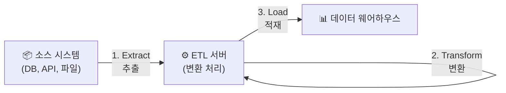
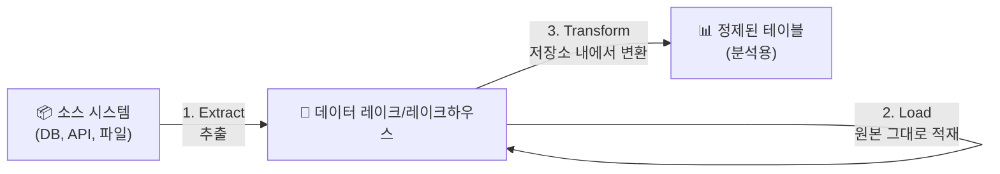
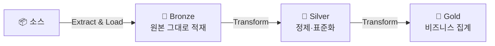

# ETL과 ELT — 데이터 수집·변환·적재의 기본 패턴

## 왜 ETL/ELT를 알아야 하나요?

앞서 데이터 엔지니어링의 핵심이 "데이터를 수집하고, 변환하고, 적재하는 것"이라고 말씀드렸습니다. 이 세 단계를 어떤 순서로, 어디서 수행하느냐에 따라 **ETL**과 **ELT**라는 두 가지 대표적인 패턴으로 나뉩니다.

이 두 패턴을 이해하면 데이터 파이프라인을 설계할 때 "우리 상황에는 어떤 방식이 적합할까?"라는 질문에 답할 수 있습니다.

---

## ETL (Extract → Transform → Load)

### 개념

> 💡 **ETL(Extract-Transform-Load)**은 데이터를 소스에서 **추출(Extract)**한 후, 별도의 처리 서버에서 **변환(Transform)**하고, 변환이 완료된 데이터를 최종 저장소에 **적재(Load)**하는 패턴입니다.



### 동작 방식

쉽게 설명하면, **"정리해서 넣기"** 방식입니다.

1. **Extract(추출)**: 원본 시스템(DB, 파일, API)에서 필요한 데이터를 뽑아옵니다.
2. **Transform(변환)**: 별도의 ETL 서버에서 데이터를 정제하고 가공합니다. 예를 들어, 날짜 형식을 통일하고, 필요 없는 컬럼을 제거하고, 여러 테이블을 조인합니다.
3. **Load(적재)**: 변환이 완료된 깨끗한 데이터만 데이터 웨어하우스에 넣습니다.

### 언제 사용하나요?

- 데이터 웨어하우스의 저장 비용이 비쌀 때 (정제된 데이터만 넣으므로 비용 절약)
- 데이터 품질을 적재 전에 반드시 보장해야 할 때
- 개인정보 마스킹 등 보안 처리가 적재 전에 필요할 때
- 전통적인 온프레미스 환경에서 많이 사용됩니다

### 대표적인 도구

- Informatica, Talend, SSIS (SQL Server Integration Services), Apache NiFi

---

## ELT (Extract → Load → Transform)

### 개념

> 💡 **ELT(Extract-Load-Transform)**은 데이터를 소스에서 **추출(Extract)**한 후, 원본 그대로 먼저 저장소에 **적재(Load)**하고, 저장소 내부의 강력한 컴퓨팅 파워를 활용하여 **변환(Transform)**하는 패턴입니다.



### 동작 방식

쉽게 설명하면, **"일단 넣고, 나중에 정리"** 방식입니다.

1. **Extract(추출)**: 원본 시스템에서 데이터를 뽑아옵니다.
2. **Load(적재)**: 원본 데이터를 변환 없이 그대로 데이터 레이크나 레이크하우스에 넣습니다.
3. **Transform(변환)**: 적재된 저장소 안에서 Spark, SQL 등을 사용하여 데이터를 변환합니다.

### 언제 사용하나요?

- 클라우드 기반의 강력한 컴퓨팅 리소스를 사용할 수 있을 때
- 원본 데이터를 보존해야 할 때 (감사, 규정 준수 목적)
- 데이터의 활용 방법이 아직 확정되지 않았을 때 (원본을 남겨두고 나중에 다양하게 변환)
- 대용량 데이터를 빠르게 수집해야 할 때

### 대표적인 도구

- Databricks (Spark + Delta Lake), Snowflake, BigQuery, dbt

---

## ETL vs ELT 비교

| 비교 항목 | ETL | ELT |
|-----------|-----|-----|
| **변환 시점** | 적재 **전** (별도 서버에서) | 적재 **후** (저장소 내에서) |
| **원본 데이터 보존** | 보통 보존하지 않음 | 원본을 그대로 보존 |
| **변환 처리 위치** | 별도 ETL 서버 | 저장소의 컴퓨팅 엔진 (Spark, SQL) |
| **확장성** | ETL 서버 성능에 제한됨 | 클라우드 컴퓨팅으로 무한 확장 |
| **유연성** | 변환 로직 변경 시 재수집 필요 | 원본이 있으므로 변환 로직만 변경하면 됨 |
| **적합한 환경** | 온프레미스, 소규모 데이터 | 클라우드, 대규모 데이터 |
| **시대적 흐름** | 전통적 방식 (2000~2010년대) | 현대적 방식 (2015년~현재) |

> 💡 **OLTP와 OLAP이란?**
> - **OLTP(Online Transaction Processing)**: 쇼핑몰 주문 처리처럼, 건 단위의 데이터를 빠르게 읽고 쓰는 것에 최적화된 시스템입니다. MySQL, PostgreSQL 등이 대표적입니다.
> - **OLAP(Online Analytical Processing)**: "지난 분기 지역별 매출 합계"처럼, 대량의 데이터를 집계·분석하는 것에 최적화된 시스템입니다. 데이터 웨어하우스가 대표적입니다.
>
> ETL/ELT는 OLTP 시스템의 데이터를 OLAP 시스템으로 옮기는 대표적인 방법입니다.

---

## Databricks에서의 ELT

Databricks는 현대적인 **ELT 패턴**에 최적화된 플랫폼입니다. 그 이유를 살펴보겠습니다.

### Medallion 아키텍처와 ELT

Databricks에서 권장하는 **Medallion 아키텍처(Bronze → Silver → Gold)**는 ELT 패턴의 대표적인 구현입니다.



| 계층 | 역할 | ELT 단계 |
|------|------|----------|
| **Bronze** | 소스 데이터를 원본 그대로 저장 | Extract + Load |
| **Silver** | 정제, 중복 제거, 스키마 표준화 | Transform (1차) |
| **Gold** | 비즈니스 로직에 따른 집계, 요약 | Transform (2차) |

### 왜 Databricks가 ELT에 적합한가요?

1. **Apache Spark**: 대규모 데이터를 병렬로 처리할 수 있는 분산 컴퓨팅 엔진을 제공합니다
2. **Delta Lake**: 데이터 레이크 위에 트랜잭션, 스키마 관리를 추가하여 안정적인 변환이 가능합니다
3. **Serverless 컴퓨팅**: 변환 작업이 필요할 때만 리소스를 할당하여 비용을 최적화합니다
4. **SDP (Spark Declarative Pipelines)**: 변환 로직을 선언적으로 정의하면, 실행 순서와 의존성을 자동으로 관리해 줍니다

> 🆕 **최신 트렌드**: Databricks는 **Lakeflow Connect**를 통해 Extract(수집) 단계를 관리형 서비스로 제공하고 있습니다. 외부 DB나 SaaS에서 데이터를 자동으로 수집하는 커넥터를 제공하여, 데이터 엔지니어가 변환 로직에만 집중할 수 있게 해 줍니다.

---

## 실무 예시: 온라인 쇼핑몰 데이터 파이프라인

온라인 쇼핑몰의 주문 데이터를 처리하는 간단한 ELT 파이프라인을 예시로 살펴보겠습니다.

### 1단계: Extract & Load (Bronze)

```sql
-- Auto Loader를 사용하여 S3에서 주문 JSON 파일을 원본 그대로 수집
CREATE OR REFRESH STREAMING TABLE bronze_orders
AS SELECT
  *,
  _metadata.file_path AS source_file,
  _metadata.file_modification_time AS ingested_at
FROM STREAM read_files(
  's3://my-bucket/orders/',
  format => 'json'
);
```

### 2단계: Transform (Silver)

```sql
-- 정제: 중복 제거, 타입 변환, 유효성 검증
CREATE OR REFRESH STREAMING TABLE silver_orders (
  CONSTRAINT valid_order_id EXPECT (order_id IS NOT NULL) ON VIOLATION DROP ROW,
  CONSTRAINT valid_amount EXPECT (amount > 0) ON VIOLATION DROP ROW
)
AS SELECT
  CAST(order_id AS BIGINT) AS order_id,
  CAST(customer_id AS BIGINT) AS customer_id,
  CAST(order_date AS TIMESTAMP) AS order_date,
  CAST(amount AS DECIMAL(10,2)) AS amount,
  UPPER(TRIM(status)) AS status
FROM STREAM(bronze_orders);
```

### 3단계: Transform (Gold)

```sql
-- 비즈니스 집계: 일별/상품별 매출 요약
CREATE OR REFRESH MATERIALIZED VIEW gold_daily_sales
AS SELECT
  DATE(order_date) AS sale_date,
  product_category,
  COUNT(*) AS order_count,
  SUM(amount) AS total_revenue,
  AVG(amount) AS avg_order_value
FROM silver_orders
GROUP BY DATE(order_date), product_category;
```

---

## 정리

| 핵심 개념 | 설명 |
|-----------|------|
| **ETL** | 추출 → 변환 → 적재. 변환을 먼저 한 후 적재하는 전통적 방식입니다 |
| **ELT** | 추출 → 적재 → 변환. 원본을 먼저 저장하고, 저장소 안에서 변환하는 현대적 방식입니다 |
| **Medallion** | ELT의 대표적 구현. Bronze(원본) → Silver(정제) → Gold(집계) 3계층 구조입니다 |
| **OLTP** | 트랜잭션 처리에 최적화된 시스템 (운영 DB) |
| **OLAP** | 분석 처리에 최적화된 시스템 (데이터 웨어하우스) |

다음 문서에서는 데이터 처리의 두 가지 방식인 **배치 처리**와 **스트리밍 처리**의 차이점을 살펴보겠습니다.

---

## 참고 링크

- [Databricks: Medallion Architecture](https://docs.databricks.com/aws/en/lakehouse/medallion.html)
- [Databricks: Data Engineering](https://docs.databricks.com/aws/en/data-engineering)
- [Databricks Blog: ETL vs ELT](https://www.databricks.com/glossary/etl-vs-elt)
