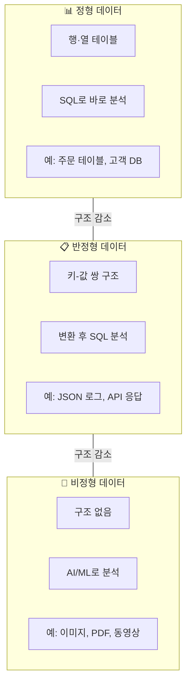

# 정형·반정형·비정형 데이터

## 왜 데이터 유형을 구분해야 하나요?

데이터 파이프라인을 설계할 때, 가장 먼저 "우리가 다루는 데이터는 어떤 형태인가?"를 파악해야 합니다. 데이터의 유형에 따라 저장 방식, 처리 도구, 분석 방법이 모두 달라지기 때문입니다.

데이터는 크게 **정형(Structured)**, **반정형(Semi-Structured)**, **비정형(Unstructured)** 세 가지로 나뉩니다. 각각의 특징을 이해하면, 적합한 저장소와 처리 방법을 선택하는 데 큰 도움이 됩니다.

---

## 정형 데이터 (Structured Data)

### 개념

> 💡 **정형 데이터(Structured Data)**란 행(Row)과 열(Column)로 구성된 테이블 형태의 데이터를 말합니다. 각 열은 이름과 데이터 타입(숫자, 문자열, 날짜 등)이 명확하게 정의되어 있습니다.

가장 익숙한 형태의 데이터입니다. **엑셀 스프레드시트**를 떠올리시면 됩니다.

### 예시

| order_id | customer_name | order_date | amount | status |
|----------|--------------|------------|--------|--------|
| 1001 | 김철수 | 2025-03-15 | 45,000 | 완료 |
| 1002 | 이영희 | 2025-03-16 | 128,000 | 배송중 |
| 1003 | 박민수 | 2025-03-16 | 32,500 | 결제대기 |

### 특징

| 항목 | 설명 |
|------|------|
| **구조** | 행과 열이 명확하게 정의되어 있습니다 |
| **스키마** | 각 컬럼의 이름, 데이터 타입, 제약조건이 사전에 정의됩니다 |
| **조회** | SQL로 쉽게 조회하고 집계할 수 있습니다 |
| **출처** | RDBMS(MySQL, PostgreSQL), ERP, CRM 등의 운영 시스템 |
| **저장 포맷** | CSV, Parquet, Delta, 데이터베이스 테이블 |

> 💡 **RDBMS(Relational Database Management System, 관계형 데이터베이스)란?** 데이터를 테이블(표) 형태로 저장하고, 테이블 간의 관계(Relationship)를 통해 데이터를 연결하는 데이터베이스 시스템입니다. MySQL, PostgreSQL, Oracle, SQL Server 등이 대표적입니다. "관계형"이라는 이름은 테이블 간의 관계를 정의할 수 있다는 것에서 유래합니다.

---

## 반정형 데이터 (Semi-Structured Data)

### 개념

> 💡 **반정형 데이터(Semi-Structured Data)**란 고정된 테이블 구조는 아니지만, **태그(Tag)나 키-값(Key-Value) 쌍**으로 일정한 구조를 가지고 있는 데이터를 말합니다.

비유하자면, **명함**과 같습니다. 명함마다 포함된 정보의 종류가 조금씩 다를 수 있지만(어떤 명함에는 팩스 번호가 있고, 어떤 명함에는 없음), "이름", "전화번호", "이메일" 등 대체로 비슷한 구조를 가지고 있습니다.

### 예시: JSON 형태의 사용자 활동 로그

```json
{
  "event_id": "evt_20250316_001",
  "timestamp": "2025-03-16T14:32:05Z",
  "user": {
    "id": 12345,
    "name": "김철수",
    "tier": "premium"
  },
  "action": "purchase",
  "details": {
    "product_id": "PRD-789",
    "quantity": 2,
    "amount": 45000,
    "payment_method": "credit_card",
    "coupon_applied": true,
    "coupon_code": "SPRING2025"
  },
  "device": {
    "type": "mobile",
    "os": "iOS 18.3",
    "app_version": "4.2.1"
  }
}
```

위 예시에서 보시는 것처럼, JSON 데이터는 중첩(Nested) 구조를 가질 수 있으며, 레코드마다 포함된 필드가 다를 수 있습니다 (예: `coupon_code`가 없는 레코드도 존재 가능).

### 특징

| 항목 | 설명 |
|------|------|
| **구조** | 키-값 쌍이나 태그로 일정한 구조가 있지만, 레코드마다 다를 수 있습니다 |
| **스키마** | 유연합니다. 필드가 추가되거나 빠져도 오류가 발생하지 않습니다 |
| **조회** | SQL로 조회 가능하지만, 중첩 구조를 펼치는(Flatten) 작업이 필요할 수 있습니다 |
| **출처** | REST API 응답, 로그 파일, IoT 센서 데이터, NoSQL DB |
| **대표 포맷** | JSON, XML, Avro, Protobuf, YAML |

> 💡 **중첩(Nested) 구조란?** 위 JSON 예시에서 `user` 안에 `id`, `name`, `tier`가 들어있는 것처럼, 데이터 안에 또 다른 데이터 구조가 포함된 형태입니다. 정형 데이터의 평평한(Flat) 테이블과 달리, 트리(Tree) 형태로 데이터가 계층적으로 구성됩니다.

---

## 비정형 데이터 (Unstructured Data)

### 개념

> 💡 **비정형 데이터(Unstructured Data)**란 미리 정의된 구조가 없는 데이터를 말합니다. 사람이 보면 이해할 수 있지만, 컴퓨터가 직접 분석하기 위해서는 별도의 처리(자연어 처리, 이미지 인식 등)가 필요합니다.

비유하자면 **메모장에 자유롭게 적은 노트**와 같습니다. 내용은 의미가 있지만, 정해진 양식이 없어서 자동으로 분류하거나 집계하기가 어렵습니다.

### 예시

| 유형 | 예시 |
|------|------|
| 텍스트 | 이메일 본문, 고객 리뷰, 채팅 기록, 계약서, 뉴스 기사 |
| 이미지 | 상품 사진, 의료 영상(X-ray, MRI), 위성 사진 |
| 오디오 | 콜센터 녹음, 음성 메모, 팟캐스트 |
| 동영상 | CCTV 영상, 교육 동영상, 라이브 스트리밍 |
| 문서 | PDF, Word, PowerPoint 파일 |

### 특징

| 항목 | 설명 |
|------|------|
| **구조** | 정해진 구조가 없습니다 |
| **스키마** | 해당 사항 없음 |
| **조회** | SQL로 직접 조회할 수 없으며, AI/ML 기반 처리가 필요합니다 |
| **출처** | 소셜 미디어, 이메일, 카메라, 마이크, 문서 시스템 |
| **저장** | 오브젝트 스토리지(S3, ADLS), 파일 시스템 |
| **전체 비중** | 기업 데이터의 약 80~90%가 비정형 데이터로 추정됩니다 |

---

## 세 가지 유형 비교

| 비교 항목 | 정형 데이터 | 반정형 데이터 | 비정형 데이터 |
|-----------|------------|-------------|-------------|
| **구조** | 행·열 테이블 | 키-값/태그 기반 | 구조 없음 |
| **스키마** | 고정 | 유연 | 없음 |
| **예시** | DB 테이블, CSV | JSON, XML, 로그 | 이미지, 동영상, 텍스트 |
| **SQL 조회** | 바로 가능 | 변환 후 가능 | 불가 (AI 처리 필요) |
| **저장 비용** | 중간 | 중간 | 높음 (용량이 큼) |
| **분석 난이도** | 낮음 | 중간 | 높음 |
| **전체 비중** | ~10% | ~10% | ~80% |



---

## Databricks에서 각 데이터 유형 다루기

Databricks는 세 가지 유형의 데이터를 모두 하나의 플랫폼에서 처리할 수 있습니다. 이것이 레이크하우스 아키텍처의 핵심 장점 중 하나입니다.

### 정형 데이터

```sql
-- Delta 테이블로 저장하고, SQL로 바로 분석
SELECT customer_name, SUM(amount) AS total_spent
FROM catalog.schema.orders
GROUP BY customer_name
ORDER BY total_spent DESC;
```

### 반정형 데이터

```sql
-- JSON 데이터를 읽어서 중첩 구조를 펼치기
SELECT
  raw_data:user.id::INT AS user_id,
  raw_data:user.name::STRING AS user_name,
  raw_data:action::STRING AS action,
  raw_data:details.amount::DECIMAL(10,2) AS amount
FROM bronze_events;
```

> 💡 Databricks SQL에서는 `:` (콜론) 표기법을 사용하여 JSON의 중첩 필드에 접근할 수 있습니다. `raw_data:user.name`은 JSON 객체 `raw_data` 안의 `user` 안의 `name` 값을 가져옵니다.

### 비정형 데이터

```python
# Unity Catalog의 Volume에 저장된 PDF 파일을 AI로 파싱
from databricks.sdk import WorkspaceClient

# Volume에 저장된 파일 경로
pdf_path = "/Volumes/catalog/schema/documents/contract.pdf"

# ai_parse_document 함수로 PDF에서 텍스트 추출
result = spark.sql(f"""
  SELECT ai_parse_document('{pdf_path}', 'text') AS parsed_text
""")
```

> 🆕 **최신 기능**: Databricks는 `ai_parse_document` 함수를 통해 PDF, DOCX, PPTX, 이미지 등의 비정형 문서에서 텍스트를 자동으로 추출하는 기능을 제공하고 있습니다. 별도의 외부 도구 없이도 비정형 데이터를 처리할 수 있습니다.

### Unity Catalog의 Volume

비정형 데이터(파일)를 관리하기 위해 Databricks는 **Volume**이라는 개념을 제공합니다.

> 💡 **Volume이란?** Unity Catalog에서 테이블이 아닌 파일(이미지, PDF, 모델 파일 등)을 관리하는 저장 공간입니다. 테이블과 마찬가지로 카탈로그 → 스키마 아래에 생성되며, 동일한 권한 체계로 접근을 제어할 수 있습니다. 경로는 `/Volumes/<catalog>/<schema>/<volume>/` 형태입니다.

---

## 실무에서의 데이터 유형 조합

실제 비즈니스 환경에서는 세 가지 유형의 데이터가 함께 사용되는 경우가 대부분입니다. 예를 들어 보겠습니다.

### 예시: 고객 서비스 분석

| 데이터 | 유형 | 활용 |
|--------|------|------|
| 고객 정보 테이블 | 정형 | 고객 세그먼트 분류 |
| 고객 문의 API 로그 (JSON) | 반정형 | 문의 패턴 분석 |
| 상담 녹음 파일 | 비정형 | 감정 분석, 키워드 추출 |
| 상담사 평가 점수 | 정형 | 성과 대시보드 |
| 고객 리뷰 텍스트 | 비정형 | 토픽 분석, 불만 사항 감지 |

Databricks 레이크하우스에서는 이 모든 데이터를 **Unity Catalog** 아래에서 통합 관리하며, 정형 데이터는 **Delta 테이블**로, 비정형 데이터는 **Volume**으로 저장하여 하나의 거버넌스 체계에서 관리할 수 있습니다.

---

## 정리

| 핵심 개념 | 설명 |
|-----------|------|
| **정형 데이터** | 행·열 구조의 테이블 데이터. SQL로 바로 분석 가능합니다 |
| **반정형 데이터** | JSON, XML 등 유연한 구조의 데이터. 변환 후 분석합니다 |
| **비정형 데이터** | 이미지, 동영상, 텍스트 등 구조가 없는 데이터. AI/ML로 처리합니다 |
| **Volume** | Unity Catalog에서 파일(비정형 데이터)을 관리하는 저장소입니다 |
| **레이크하우스** | 세 가지 유형 모두를 하나의 플랫폼에서 관리하고 분석할 수 있는 아키텍처입니다 |

이것으로 **데이터 기초** 섹션을 마치겠습니다. 다음 섹션에서는 이러한 데이터들을 처리하는 플랫폼인 [Databricks](../02-databricks-overview/README.md)에 대해 자세히 알아보겠습니다.

---

## 참고 링크

- [Databricks: Unity Catalog Volumes](https://docs.databricks.com/aws/en/connect/unity-catalog/volumes.html)
- [Databricks: Semi-structured data](https://docs.databricks.com/aws/en/queries/semi-structured.html)
- [Databricks: ai_parse_document](https://docs.databricks.com/aws/en/sql/language-manual/functions/ai_parse_document.html)
