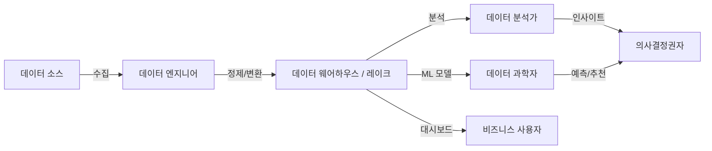
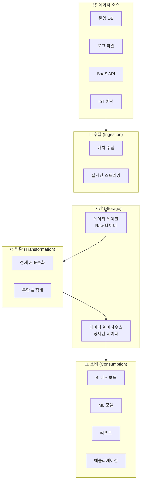

# 데이터 엔지니어링이란?

## 왜 데이터 엔지니어링이 필요한가요?

여러분이 대형 쇼핑몰을 운영한다고 상상해 보겠습니다. 매일 수만 건의 주문이 들어오고, 고객의 클릭 로그가 쌓이며, 재고 시스템에서는 실시간으로 수량이 변하고 있습니다. 이 모든 데이터를 그냥 방치하면 어떻게 될까요? 아마 "이번 달 가장 잘 팔린 상품이 뭐지?", "어떤 고객이 이탈 위험이 높지?" 같은 간단한 질문조차 답하기 어려울 것입니다.

**데이터 엔지니어링(Data Engineering)**은 바로 이 문제를 해결합니다. 여기저기 흩어져 있는 원시 데이터(Raw Data)를 수집하고, 깨끗하게 정리하고, 분석가나 데이터 과학자가 바로 사용할 수 있는 형태로 만들어 주는 일련의 과정입니다.

> 💡 **쉽게 비유하면**: 데이터 엔지니어링은 "데이터의 상수도 시스템"과 같습니다. 산에서 내려오는 원수(Raw Data)를 정수 처리(변환)하고, 깨끗한 물(정제된 데이터)을 각 가정(분석가, 대시보드, ML 모델)에 안정적으로 공급하는 파이프라인을 만드는 것입니다.

---

## 데이터 엔지니어링의 핵심 역할

데이터 엔지니어링은 크게 세 가지 핵심 역할을 수행합니다.

### 1. 데이터 수집 (Ingestion)

다양한 소스에서 데이터를 가져오는 단계입니다.

| 소스 유형 | 예시 |
|-----------|------|
| 데이터베이스 | MySQL, PostgreSQL, Oracle 등의 운영 DB |
| 파일 | CSV, JSON, Parquet, Excel 파일 |
| 스트리밍 | Kafka, Kinesis 같은 실시간 메시지 큐 |
| SaaS 애플리케이션 | Salesforce, SAP, Workday 등 |
| API | REST API, GraphQL 등을 통한 외부 데이터 |

### 2. 데이터 변환 (Transformation)

수집한 원시 데이터를 분석에 적합한 형태로 가공하는 단계입니다.

- **정제(Cleansing)**: 중복 제거, 결측값 처리, 오류 데이터 수정
- **표준화(Standardization)**: 날짜 형식 통일, 통화 변환, 코드값 매핑
- **통합(Integration)**: 여러 소스의 데이터를 하나로 합치기 (예: 주문 데이터 + 고객 데이터)
- **집계(Aggregation)**: 일별 매출 합산, 월별 사용자 수 계산 등

### 3. 데이터 적재 및 서빙 (Loading & Serving)

변환된 데이터를 최종 목적지에 저장하고, 소비자에게 제공하는 단계입니다.

- **데이터 웨어하우스**에 적재하여 BI 대시보드에서 조회
- **데이터 레이크**에 저장하여 데이터 과학자가 ML 모델 학습에 활용
- **실시간 서빙 레이어**를 통해 애플리케이션에서 즉시 사용

---

## 데이터 팀의 구성과 역할

데이터 조직에는 다양한 역할이 존재합니다. 데이터 엔지니어가 어디에 위치하는지 이해하면, 전체 데이터 흐름이 더 명확해집니다.

| 역할 | 하는 일 | 주로 사용하는 도구 |
|------|---------|-------------------|
| **데이터 엔지니어(DE)** | 데이터 파이프라인 설계·구축·운영 | Spark, SQL, Python, Databricks |
| **데이터 분석가(DA)** | 데이터를 조회·시각화하여 인사이트 도출 | SQL, BI 도구 (Tableau, Power BI) |
| **데이터 과학자(DS)** | ML 모델을 만들어 예측·분류 수행 | Python, R, MLflow, TensorFlow |
| **데이터 아키텍트** | 전체 데이터 시스템의 구조 설계 | 아키텍처 도구, 거버넌스 프레임워크 |
| **애널리틱스 엔지니어** | 분석용 데이터 모델(테이블) 설계·관리 | SQL, dbt |

---

## 데이터 파이프라인의 큰 그림

데이터 엔지니어링의 핵심 산출물은 **데이터 파이프라인(Data Pipeline)**입니다. 파이프라인은 데이터가 소스에서 최종 목적지까지 흘러가는 전체 경로를 의미합니다.

> 💡 **핵심 포인트**: 데이터 파이프라인은 "한 번 만들면 끝"이 아닙니다. 매일, 매시간, 때로는 실시간으로 반복 실행되어야 하며, 중간에 오류가 나면 자동으로 감지하고 복구할 수 있어야 합니다. 이것이 데이터 엔지니어링을 단순한 스크립트 작성과 구별짓는 핵심입니다.

---

## 현대 데이터 엔지니어링의 트렌드

데이터 엔지니어링은 빠르게 진화하고 있습니다. 최근의 주요 트렌드를 살펴보겠습니다.

### 클라우드 네이티브 (Cloud-Native)

과거에는 온프레미스(On-Premise) 서버에 직접 Hadoop 클러스터를 구축했지만, 현재는 클라우드 기반 플랫폼(Databricks, Snowflake 등)을 사용하는 것이 표준이 되었습니다. 필요할 때 리소스를 늘리고, 사용하지 않을 때 줄이는 탄력적인 운영이 가능합니다.

### 레이크하우스 패러다임 (Lakehouse)

데이터 레이크와 데이터 웨어하우스의 장점을 결합한 새로운 아키텍처입니다. 하나의 플랫폼에서 모든 데이터를 저장하고, SQL 분석부터 ML 학습까지 수행할 수 있습니다. (이 내용은 [03. 레이크하우스 아키텍처](../03-lakehouse-architecture/README.md)에서 자세히 다룹니다.)

### 선언적 파이프라인 (Declarative Pipelines)

"어떻게(How)" 처리할지 일일이 코딩하는 대신, "무엇을(What)" 만들고 싶은지만 선언하면 시스템이 알아서 처리해 주는 방식입니다. Databricks의 Spark Declarative Pipelines(SDP)가 대표적인 예시입니다.

### 실시간 처리의 보편화

과거에는 하루에 한 번 배치로 처리하는 것이 일반적이었지만, 이제는 몇 초~몇 분 이내에 데이터를 처리하는 니어 리얼타임(Near Real-Time) 처리가 많은 기업에서 표준이 되어가고 있습니다.

---

## 정리

| 핵심 개념 | 설명 |
|-----------|------|
| 데이터 엔지니어링 | 원시 데이터를 수집·변환·적재하여 분석 가능한 형태로 만드는 과정 |
| 데이터 파이프라인 | 데이터가 소스에서 목적지까지 흘러가는 자동화된 경로 |
| 수집(Ingestion) | 다양한 소스에서 데이터를 가져오는 첫 번째 단계 |
| 변환(Transformation) | 원시 데이터를 정제·표준화·통합하는 단계 |
| 적재(Loading) | 최종 목적지(웨어하우스, 레이크)에 저장하는 단계 |

다음 문서에서는 데이터를 저장하는 두 가지 대표적인 방식인 **데이터 웨어하우스**와 **데이터 레이크**의 차이점을 자세히 살펴보겠습니다.

---

## 참고 링크

- [Databricks: Data Engineering 공식 문서](https://docs.databricks.com/aws/en/data-engineering)
- [Azure Databricks: What is data engineering?](https://learn.microsoft.com/en-us/azure/databricks/data-engineering/)
- [Databricks Blog: Data Engineering](https://www.databricks.com/blog/category/engineering-blog)
