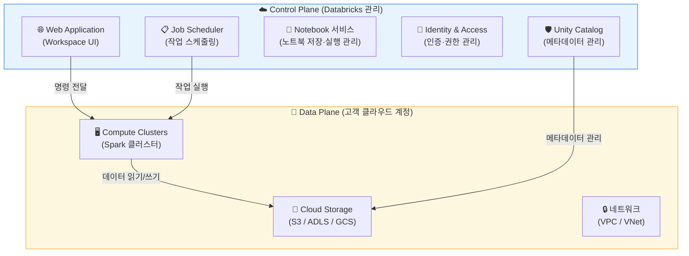
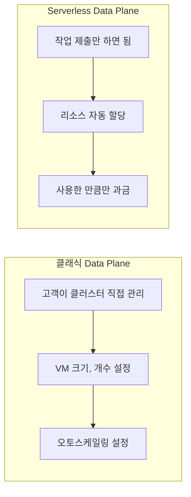
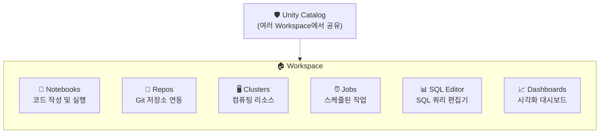
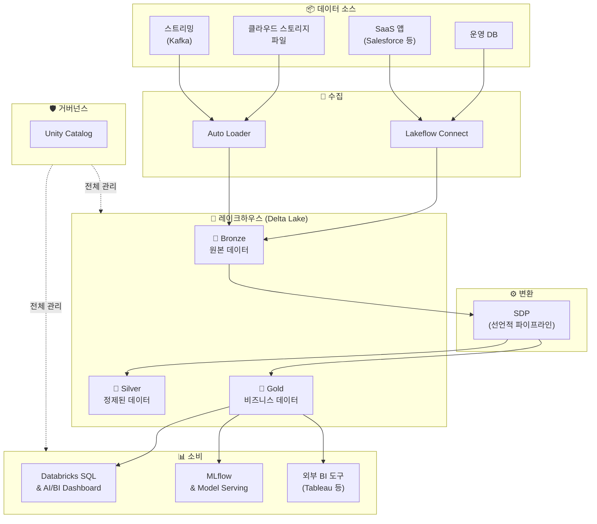

# Databricks 아키텍처

## 왜 아키텍처를 이해해야 하나요?

Databricks를 사용하다 보면 "내 데이터는 어디에 저장되는 거지?", "클러스터는 누가 관리하지?", "보안은 어떻게 되는 거지?" 같은 질문이 생깁니다. 이 질문들에 답하려면 Databricks의 아키텍처를 이해해야 합니다.

Databricks 아키텍처의 핵심은 **Control Plane(제어 평면)**과 **Data Plane(데이터 평면)**의 분리입니다.

---

## Control Plane vs Data Plane

> 💡 **Control Plane(제어 평면)**이란 Databricks가 직접 관리하는 영역으로, 사용자 인터페이스, 작업 스케줄링, 노트북 관리 등 "관리 기능"을 담당합니다.
>
> **Data Plane(데이터 평면)**이란 고객의 클라우드 계정에서 실행되는 영역으로, 실제 데이터 처리와 저장이 이루어지는 곳입니다.

### 비유로 이해하기

항공 관제 시스템을 떠올려 보겠습니다.

- **관제탑(Control Plane)** = Databricks가 운영합니다. 비행 계획을 관리하고, 이착륙 순서를 조율하며, 전체 상황을 모니터링합니다.
- **활주로와 비행기(Data Plane)** = 고객의 클라우드 계정에 있습니다. 실제로 비행기(데이터 처리)가 뜨고 내리는 곳이며, 승객(데이터)은 이 영역에만 존재합니다.

이 분리 덕분에 **고객의 데이터는 항상 고객의 클라우드 계정 안에 머물러 있어** 보안과 규정 준수 요건을 충족할 수 있습니다.

### 아키텍처 다이어그램

### 각 영역의 상세 구성

#### Control Plane (Databricks 관리 영역)

| 구성 요소 | 역할 |
|-----------|------|
| **Web Application** | 브라우저에서 접속하는 Workspace UI를 제공합니다 |
| **Job Scheduler** | 작업의 스케줄링, 실행, 재시도를 관리합니다 |
| **Notebook Service** | 노트북의 저장, 버전 관리, 실행 결과 관리를 담당합니다 |
| **Cluster Manager** | 클러스터의 생성, 스케일링, 종료를 제어합니다 |
| **Unity Catalog Metastore** | 테이블, 뷰, 함수 등의 메타데이터를 저장합니다 |
| **IAM (Identity & Access)** | 사용자 인증과 권한 관리를 수행합니다 |

#### Data Plane (고객 클라우드 영역)

| 구성 요소 | 역할 |
|-----------|------|
| **Compute Clusters** | 실제 Spark 작업을 실행하는 가상 머신(VM) 클러스터입니다 |
| **Cloud Storage** | Delta Lake 테이블, 파일 등 실제 데이터가 저장되는 곳입니다 |
| **Network (VPC/VNet)** | 고객의 가상 네트워크 안에서 안전하게 통신합니다 |

> 💡 **VPC(Virtual Private Cloud)란?** 클라우드 안에서 논리적으로 격리된 네트워크 공간입니다. 마치 큰 건물(클라우드) 안에 전용 사무실(VPC)을 빌리는 것과 같습니다. 외부에서 함부로 접근할 수 없고, 허용된 경로로만 통신할 수 있습니다. AWS에서는 VPC, Azure에서는 VNet(Virtual Network)이라고 부릅니다.

---

## Serverless Data Plane

최근 Databricks는 **Serverless** 옵션을 통해 Data Plane의 관리 부담을 더욱 줄이고 있습니다.

> 💡 **서버리스(Serverless)란?** 사용자가 서버(컴퓨팅 리소스)를 직접 생성하거나 관리할 필요 없이, 작업을 실행하면 시스템이 알아서 적절한 리소스를 할당해 주는 방식입니다. "서버가 없다"는 뜻이 아니라, "서버 관리를 신경 쓰지 않아도 된다"는 의미입니다.

| 비교 항목 | 클래식 (Customer-Managed) | 서버리스 (Serverless) |
|-----------|--------------------------|----------------------|
| 리소스 관리 | 고객이 직접 클러스터 설정 | Databricks가 자동 관리 |
| 시작 시간 | 수 분 (클러스터 시작) | 수 초 (즉시 시작) |
| 비용 모델 | 클러스터 실행 시간 기준 | 실제 처리량 기준 |
| 적합한 경우 | 세밀한 제어가 필요할 때 | 빠른 시작, 간편 운영 |

> 🆕 **최신 동향**: Databricks는 SQL Warehouse, Notebooks, Jobs, SDP 등 대부분의 워크로드에서 Serverless 옵션을 지원하고 있으며, 점차 서버리스를 기본(default) 모드로 전환하고 있습니다. 특히 Serverless SQL Warehouse는 수 초 만에 시작되어 대화형 SQL 분석에 매우 적합합니다.

---

## 클라우드별 아키텍처

세 클라우드에서의 기본 구조는 동일하지만, 사용되는 클라우드 서비스 이름이 다릅니다.

| 구성 요소 | AWS | Azure | GCP |
|-----------|-----|-------|-----|
| 오브젝트 스토리지 | S3 | ADLS Gen2 | GCS |
| 네트워크 | VPC | VNet | VPC |
| 컴퓨트 VM | EC2 | Azure VM | Compute Engine |
| IAM | AWS IAM | Azure AD (Entra ID) | Cloud IAM |
| 네트워크 격리 | PrivateLink | Private Endpoint | Private Service Connect |

---

## Workspace의 개념

> 💡 **Workspace(워크스페이스)**란 Databricks에서 작업을 수행하는 **독립적인 작업 환경**입니다. 하나의 조직에서 여러 개의 Workspace를 만들 수 있으며, 각 Workspace는 고유한 URL을 가집니다.

Workspace는 다음과 같은 구성 요소를 포함합니다.

### Workspace 구성 모범 사례

| 전략 | 설명 | 적합한 경우 |
|------|------|------------|
| **환경별 분리** | 개발(Dev), 스테이징(Staging), 프로덕션(Prod) 별도 Workspace | 대부분의 기업에 권장됩니다 |
| **팀별 분리** | 데이터 엔지니어링 팀, 분석 팀, ML 팀 별도 Workspace | 팀 간 격리가 필요할 때 |
| **단일 Workspace** | 모든 팀이 하나의 Workspace 사용 | 소규모 조직 |

> 💡 **Unity Catalog**는 여러 Workspace에 걸쳐 공유될 수 있습니다. 따라서 Workspace를 분리하더라도 데이터에 대한 통합 거버넌스를 유지할 수 있습니다.

---

## 데이터 흐름의 전체 그림

지금까지 배운 내용을 종합하여, Databricks에서 데이터가 흘러가는 전체 과정을 살펴보겠습니다.

---

## 정리

| 핵심 개념 | 설명 |
|-----------|------|
| **Control Plane** | Databricks가 관리하는 영역. UI, 스케줄링, 메타데이터 관리를 담당합니다 |
| **Data Plane** | 고객 클라우드에 위치한 영역. 실제 데이터 처리와 저장이 이루어집니다 |
| **Serverless** | 리소스를 자동 관리하여 사용자가 인프라를 신경 쓰지 않아도 되는 방식입니다 |
| **Workspace** | Databricks에서 작업을 수행하는 독립적인 환경입니다 |
| **VPC/VNet** | 클라우드에서 네트워크를 격리하여 보안을 확보하는 기술입니다 |

다음 문서에서는 실제로 Databricks Workspace에 접속하여 **UI를 둘러보는 방법**을 안내해 드리겠습니다.

---

## 참고 링크

- [Databricks: Architecture overview](https://docs.databricks.com/aws/en/getting-started/overview.html)
- [Azure Databricks: Architecture](https://learn.microsoft.com/en-us/azure/databricks/getting-started/overview)
- [Databricks: Serverless compute](https://docs.databricks.com/aws/en/serverless-compute/)
