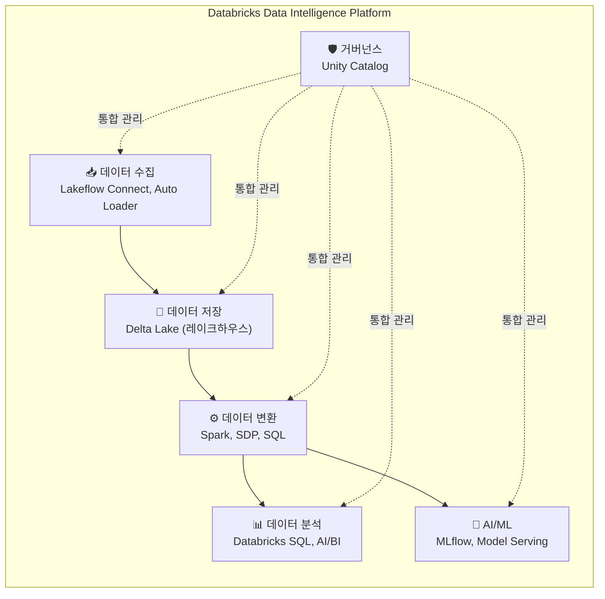
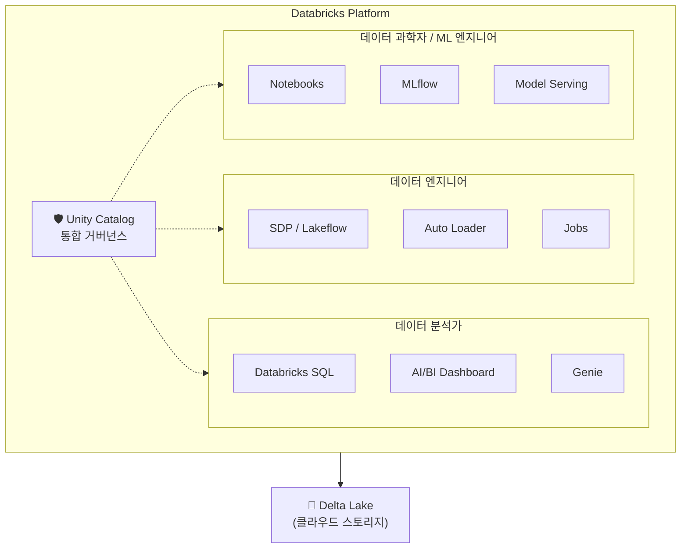

# Databricks란?

## 왜 Databricks가 필요한가요?

이전 섹션에서 데이터 엔지니어링의 기초, 데이터 웨어하우스와 데이터 레이크의 차이점, ETL/ELT 패턴을 학습하셨습니다. 이제 한 가지 질문이 떠오르실 수 있습니다.

*"그러면 이 모든 것을 실제로 어떤 도구로 구현하나요?"*

전통적으로는 각 역할을 위해 서로 다른 도구를 따로 사용해야 했습니다.

| 역할 | 전통적 도구 (따로따로) |
|------|----------------------|
| 데이터 수집 | Apache NiFi, Informatica |
| 데이터 저장 | Hadoop HDFS, Amazon S3 |
| 데이터 변환 | Apache Spark (별도 클러스터) |
| SQL 분석 | 별도의 데이터 웨어하우스 |
| ML 모델 학습 | Jupyter Notebook + 로컬 서버 |
| 모델 배포 | 별도의 서빙 인프라 |
| 데이터 거버넌스 | 또 다른 별도 도구 |

이렇게 여러 도구를 조합하면 시스템이 복잡해지고, 도구 간 데이터를 복사하는 비용이 발생하며, 통합 관리가 어려워집니다.

**Databricks**는 이 모든 것을 **하나의 통합 플랫폼**에서 제공합니다.

---

## Databricks란 무엇인가요?

> 💡 **Databricks**는 데이터 엔지니어링, 데이터 웨어하우징, 데이터 과학, 머신러닝을 **하나의 플랫폼**에서 수행할 수 있는 클라우드 기반 **데이터 인텔리전스 플랫폼(Data Intelligence Platform)**입니다.

### 탄생 배경

Databricks는 **Apache Spark**를 만든 UC Berkeley 연구팀이 2013년에 설립한 회사입니다. Apache Spark는 대규모 데이터를 빠르게 처리할 수 있는 오픈소스 분산 처리 엔진으로, 현재 전 세계에서 가장 널리 사용되는 빅데이터 처리 프레임워크입니다.

> 💡 **Apache Spark란?** 대용량 데이터를 여러 대의 컴퓨터에 나누어 동시에 처리하는 **분산 컴퓨팅 엔진**입니다. 예를 들어, 10억 건의 데이터를 분석할 때 한 대의 컴퓨터로는 수 시간이 걸리지만, Spark를 사용하면 100대의 컴퓨터가 동시에 처리하여 수 분 만에 완료할 수 있습니다.

Databricks 팀은 Spark뿐만 아니라 **Delta Lake**(데이터 저장), **MLflow**(ML 관리), **Unity Catalog**(데이터 거버넌스) 등 핵심 오픈소스 프로젝트를 주도하며, 이를 하나의 통합 플랫폼으로 제공하고 있습니다.

### 핵심 가치: "데이터 인텔리전스 플랫폼"

Databricks는 스스로를 **"Data Intelligence Platform"**이라고 정의합니다. 이는 단순히 데이터를 저장하고 처리하는 것을 넘어, 데이터에서 **지능(Intelligence)** 을 추출하는 전체 과정을 지원한다는 의미입니다.

---

## Databricks의 주요 구성 요소

Databricks 플랫폼은 여러 핵심 구성 요소로 이루어져 있습니다. 각 구성 요소가 어떤 역할을 하는지 살펴보겠습니다.

### 1. 레이크하우스 (Lakehouse) — 데이터 저장

| 구성 요소 | 역할 |
|-----------|------|
| **Delta Lake** | 데이터 레이크 위에 ACID 트랜잭션, 스키마 관리, 타임 트래블 등을 제공하는 오픈소스 스토리지 레이어입니다 |
| **Unity Catalog** | 모든 데이터 자산(테이블, 파일, ML 모델, 함수)을 통합 관리하는 거버넌스 솔루션입니다 |
| **Delta Sharing** | 조직 간에 데이터를 안전하게 공유할 수 있는 오픈 프로토콜입니다 |

### 2. 데이터 엔지니어링 (Data Engineering) — 데이터 파이프라인

| 구성 요소 | 역할 |
|-----------|------|
| **Lakeflow Connect** | 외부 데이터 소스(DB, SaaS)에서 데이터를 자동으로 수집하는 관리형 커넥터입니다 |
| **Auto Loader** | 클라우드 스토리지에 도착하는 새 파일을 자동으로 감지하고 수집합니다 |
| **Spark Declarative Pipelines (SDP)** | 선언적 방식으로 데이터 변환 파이프라인을 정의합니다 (이전 명칭: Delta Live Tables) |
| **Lakeflow Jobs** | 워크플로우를 스케줄링하고 오케스트레이션합니다 |

### 3. 데이터 분석 (Data Analytics) — SQL과 BI

| 구성 요소 | 역할 |
|-----------|------|
| **Databricks SQL (DBSQL)** | SQL을 사용하여 Delta Lake 데이터를 직접 조회하고 분석합니다 |
| **SQL Warehouse** | SQL 쿼리를 실행하기 위한 전용 컴퓨팅 리소스입니다 |
| **AI/BI Dashboard** | 데이터를 시각화하고 대시보드를 생성하는 도구입니다 |
| **Genie** | 자연어로 데이터에 질문하면 SQL 쿼리를 자동 생성하여 답변을 제공합니다 |

### 4. AI & 머신러닝 (AI & ML) — 모델 개발과 배포

| 구성 요소 | 역할 |
|-----------|------|
| **MLflow** | ML 실험을 추적하고, 모델을 등록·관리하며, GenAI 앱의 실행 흐름을 트레이싱합니다 |
| **Model Serving** | 학습된 모델을 실시간 추론 엔드포인트로 배포합니다 |
| **Foundation Model API** | 주요 LLM(GPT, Claude, Llama 등)을 API로 제공합니다 |
| **Vector Search** | 임베딩 기반 유사도 검색을 제공하여 RAG(검색 증강 생성)를 지원합니다 |
| **Mosaic AI Agent Framework** | AI 에이전트를 개발, 평가, 배포할 수 있는 프레임워크입니다 |

### 5. 인프라 (Infrastructure) — 컴퓨팅과 관리

| 구성 요소 | 역할 |
|-----------|------|
| **Workspace** | 모든 작업이 이루어지는 웹 기반 협업 환경입니다 |
| **Clusters** | Spark 작업을 실행하는 컴퓨팅 리소스(가상 머신 클러스터)입니다 |
| **Notebooks** | 코드를 작성하고 실행하며, 결과를 바로 확인할 수 있는 대화형 문서입니다 |
| **Repos (Git 연동)** | Git 저장소와 연동하여 코드 버전 관리를 할 수 있습니다 |

---

## Databricks가 지원하는 클라우드

Databricks는 주요 3대 클라우드 플랫폼 모두에서 사용할 수 있습니다.

| 클라우드 | 서비스명 | 데이터 저장소 |
|----------|----------|-------------|
| **AWS** | Databricks on AWS | Amazon S3 |
| **Azure** | Azure Databricks | Azure Data Lake Storage (ADLS) |
| **GCP** | Databricks on GCP | Google Cloud Storage (GCS) |

세 클라우드에서 제공하는 Databricks의 핵심 기능은 동일합니다. 다만 인프라 관리, 네트워크 설정, 결제 방식 등에서 클라우드별 차이가 있습니다.

---

## Databricks를 사용하는 역할별 활용 방법

Databricks는 데이터 팀의 다양한 역할이 하나의 플랫폼에서 협업할 수 있도록 설계되어 있습니다.

| 역할 | 주로 사용하는 기능 | 예시 업무 |
|------|-------------------|-----------|
| **데이터 엔지니어** | SDP, Lakeflow, Auto Loader, Jobs | 데이터 파이프라인 구축·운영 |
| **데이터 분석가** | Databricks SQL, AI/BI Dashboard, Genie | SQL 분석, 대시보드 작성, 리포트 |
| **데이터 과학자** | Notebooks, MLflow, Feature Store | ML 모델 개발, 실험 관리 |
| **ML 엔지니어** | Model Serving, MLflow, Agent Framework | 모델 배포, 에이전트 개발 |
| **플랫폼 관리자** | Unity Catalog, Workspace 관리, 보안 설정 | 권한 관리, 비용 모니터링, 거버넌스 |

---

## Databricks의 핵심 오픈소스 프로젝트

Databricks의 독특한 점 중 하나는 플랫폼의 핵심 기술들이 **오픈소스**라는 것입니다. 이는 특정 벤더에 종속(Vendor Lock-in)되는 것을 우려하는 고객들에게 큰 장점입니다.

| 오픈소스 프로젝트 | 역할 | GitHub Stars |
|------------------|------|-------------|
| **Apache Spark** | 분산 데이터 처리 엔진 | 40,000+ ⭐ |
| **Delta Lake** | 트랜잭션 지원 스토리지 레이어 | 7,500+ ⭐ |
| **MLflow** | ML 라이프사이클 관리 | 19,000+ ⭐ |
| **Delta Sharing** | 오픈 데이터 공유 프로토콜 | 700+ ⭐ |
| **Unity Catalog (OSS)** | 오픈소스 데이터 카탈로그 | 2,500+ ⭐ |

> 💡 **벤더 락인(Vendor Lock-in)이란?** 특정 회사의 제품이나 서비스에 의존하게 되어, 다른 제품으로 전환하기 어려운 상태를 말합니다. 오픈소스 기반이라는 것은, 이론적으로 Databricks 없이도 동일한 기술을 직접 운영할 수 있다는 의미입니다. 다만 Databricks는 이 오픈소스 위에 관리형 서비스, 성능 최적화, 보안 기능 등을 추가하여 편리하게 제공합니다.

---

## 정리

| 핵심 개념 | 설명 |
|-----------|------|
| **Databricks** | 데이터 수집부터 AI까지 전체 라이프사이클을 지원하는 통합 데이터 인텔리전스 플랫폼입니다 |
| **레이크하우스** | Databricks의 핵심 아키텍처로, 데이터 레이크 + 웨어하우스의 장점을 결합합니다 |
| **Apache Spark** | Databricks의 기반이 되는 오픈소스 분산 처리 엔진입니다 |
| **Delta Lake** | 데이터 레이크에 트랜잭션과 스키마 관리를 추가하는 오픈소스 스토리지 레이어입니다 |
| **Unity Catalog** | 모든 데이터 자산을 통합 관리하는 거버넌스 솔루션입니다 |

다음 문서에서는 Databricks의 **아키텍처**(Control Plane과 Data Plane)를 더 자세히 살펴보겠습니다.

---

## 참고 링크

- [Databricks: Get started with Databricks](https://docs.databricks.com/aws/en/getting-started/)
- [Azure Databricks: What is Azure Databricks?](https://learn.microsoft.com/en-us/azure/databricks/introduction/)
- [Databricks Blog: What is a Data Intelligence Platform?](https://www.databricks.com/blog)
- [Databricks: Release Notes](https://docs.databricks.com/aws/en/release-notes/)
