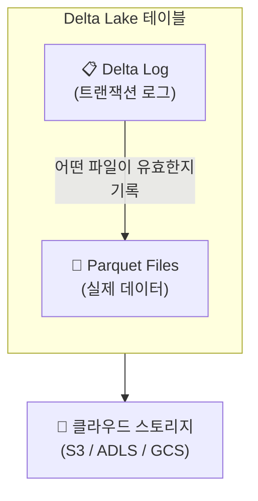
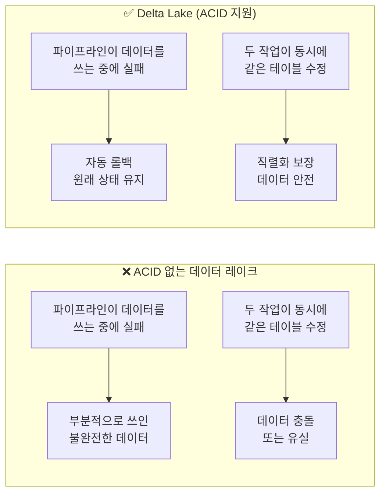
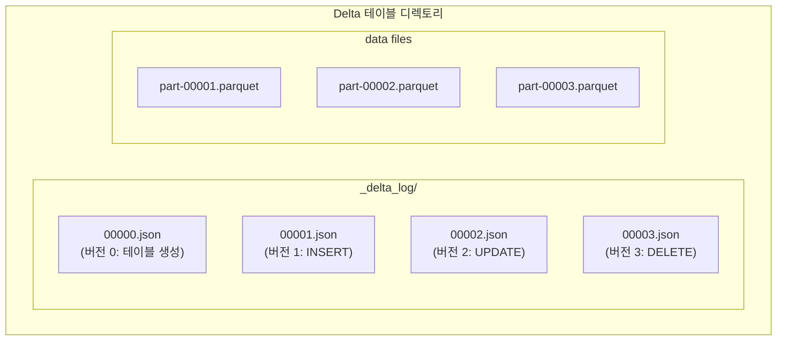

# Delta Lake 핵심

## Delta Lake란?

> 💡 **Delta Lake**는 클라우드 오브젝트 스토리지(S3, ADLS, GCS) 위에서 **ACID 트랜잭션**, **스키마 관리**, **타임 트래블** 등의 기능을 제공하는 오픈소스 스토리지 레이어입니다.

쉽게 비유하면, 일반 데이터 레이크가 **정리되지 않은 창고**라면, Delta Lake는 그 창고에 **재고 관리 시스템**, **출입 통제**, **변경 기록 장부**를 설치한 것과 같습니다.

### Delta Lake의 구조



Delta Lake 테이블은 실제로 두 가지로 구성됩니다.

| 구성 요소 | 역할 |
|-----------|------|
| **Parquet 파일** | 실제 데이터가 저장되는 파일입니다. 컬럼 기반의 오픈 포맷입니다 |
| **Delta Log (_delta_log/)** | 트랜잭션 로그가 저장되는 디렉토리입니다. 모든 변경 사항이 JSON 파일로 기록됩니다 |

---

## 핵심 기능 1: ACID 트랜잭션

### ACID란?

> 💡 **ACID**는 데이터베이스 트랜잭션(작업 단위)이 갖추어야 할 네 가지 특성의 약자입니다. 전통적인 RDBMS(MySQL, PostgreSQL 등)에서는 당연한 기능이지만, 데이터 레이크에서는 제공되지 않았던 기능입니다.

| 속성 | 영문 | 설명 | 비유 |
|------|------|------|------|
| **원자성** | Atomicity | 작업이 전부 완료되거나 전부 취소되어야 합니다 | 은행 이체: 인출+입금이 반드시 함께 성공하거나 함께 실패해야 합니다 |
| **일관성** | Consistency | 작업 전후로 데이터가 항상 유효한 상태를 유지해야 합니다 | 재고: 마이너스 재고가 생기면 안 됩니다 |
| **격리성** | Isolation | 동시에 실행되는 작업들이 서로 간섭하지 않아야 합니다 | ATM: 두 사람이 동시에 같은 계좌에서 출금해도 잔액이 꼬이면 안 됩니다 |
| **지속성** | Durability | 완료된 작업의 결과는 영구적으로 보존되어야 합니다 | 저장: 컴퓨터가 갑자기 꺼져도 저장된 데이터는 유지되어야 합니다 |

### 왜 데이터 레이크에서 ACID가 중요한가요?

ACID가 없는 일반 데이터 레이크에서는 다음과 같은 문제가 발생할 수 있습니다.



### 실습 예제

```sql
-- Delta 테이블 생성
CREATE TABLE catalog.schema.customers (
    customer_id BIGINT,
    name STRING,
    email STRING,
    city STRING,
    signup_date DATE
) USING DELTA;

-- 데이터 삽입
INSERT INTO catalog.schema.customers VALUES
(1, '김철수', 'cs.kim@email.com', '서울', '2025-01-15'),
(2, '이영희', 'yh.lee@email.com', '부산', '2025-02-20'),
(3, '박민수', 'ms.park@email.com', '대구', '2025-03-10');
```

위 INSERT 문이 실행 중에 네트워크 오류가 발생해도, Delta Lake는 **원자성(Atomicity)** 을 보장하여 불완전한 데이터가 테이블에 남지 않습니다.

---

## 핵심 기능 2: 타임 트래블 (Time Travel)

### 개념

> 💡 **타임 트래블(Time Travel)** 이란 Delta 테이블의 **과거 시점 데이터**를 조회하거나 복원할 수 있는 기능입니다. Delta Lake는 모든 변경 사항을 트랜잭션 로그에 기록하기 때문에, 이전 버전의 데이터로 되돌아갈 수 있습니다.

이 기능은 마치 **문서의 버전 관리(Version Control)** 와 같습니다. Google Docs에서 이전 편집 내역으로 되돌릴 수 있는 것처럼, Delta 테이블도 이전 버전으로 되돌릴 수 있습니다.

### 사용 방법

```sql
-- 현재 데이터 조회
SELECT * FROM catalog.schema.customers;

-- 데이터 수정
UPDATE catalog.schema.customers
SET city = '인천'
WHERE customer_id = 1;

-- 수정 전 데이터 조회 (버전 번호로)
SELECT * FROM catalog.schema.customers VERSION AS OF 0;

-- 수정 전 데이터 조회 (타임스탬프로)
SELECT * FROM catalog.schema.customers TIMESTAMP AS OF '2025-03-15 10:00:00';

-- 테이블 변경 이력 확인
DESCRIBE HISTORY catalog.schema.customers;
```

### 활용 사례

| 사례 | 설명 |
|------|------|
| **실수 복구** | 잘못된 UPDATE/DELETE를 실행한 후, 이전 버전으로 즉시 복원할 수 있습니다 |
| **감사(Audit)** | 특정 시점의 데이터 상태를 확인하여 규정 준수를 증명할 수 있습니다 |
| **데이터 디버깅** | "어제까지는 정상이었는데 오늘 이상하다" → 어제 버전과 비교 가능합니다 |
| **ML 재현성** | 특정 시점의 데이터로 모델을 재학습하여 결과를 재현할 수 있습니다 |

---

## 핵심 기능 3: 스키마 관리

### 스키마 강제 (Schema Enforcement)

> 💡 **스키마 강제(Schema Enforcement)** 란 테이블에 정의된 스키마에 맞지 않는 데이터를 삽입하려고 하면 **자동으로 거부**하는 기능입니다.

```sql
-- customers 테이블에 잘못된 데이터 삽입 시도
INSERT INTO catalog.schema.customers VALUES
(4, '최지은', 'je.choi@email.com', '서울', 'not-a-date');
-- ❌ 오류 발생: 'not-a-date'는 DATE 타입이 아닙니다
```

### 스키마 진화 (Schema Evolution)

> 💡 **스키마 진화(Schema Evolution)** 란 기존 테이블의 스키마(구조)를 데이터를 유실하지 않고 **안전하게 변경**할 수 있는 기능입니다. 새로운 컬럼 추가, 컬럼 이름 변경 등이 가능합니다.

```sql
-- 새 컬럼 추가
ALTER TABLE catalog.schema.customers
ADD COLUMN phone_number STRING;

-- 기존 데이터는 새 컬럼이 NULL로 채워짐
SELECT * FROM catalog.schema.customers;
-- +------------+------+------------------+----+------------+--------------+
-- |customer_id | name | email            |city|signup_date | phone_number |
-- +------------+------+------------------+----+------------+--------------+
-- |1           |김철수|cs.kim@email.com  |인천|2025-01-15  | NULL         |
-- |2           |이영희|yh.lee@email.com  |부산|2025-02-20  | NULL         |
-- ...
```

---

## 핵심 기능 4: 트랜잭션 로그 (Delta Log)

모든 Delta Lake의 기능은 **트랜잭션 로그(Delta Log)** 를 기반으로 동작합니다.

### 동작 원리



- 각 트랜잭션(INSERT, UPDATE, DELETE 등)이 실행될 때마다 새로운 로그 파일(JSON)이 생성됩니다
- 로그 파일에는 "어떤 Parquet 파일이 추가되었고, 어떤 파일이 제거되었는지"가 기록됩니다
- 테이블을 읽을 때는 최신 로그를 참조하여 유효한 Parquet 파일만 읽습니다
- 이 구조 덕분에 타임 트래블, 롤백, 동시 쓰기 제어가 가능합니다

> 💡 **MVCC(Multi-Version Concurrency Control, 다중 버전 동시성 제어)란?** Delta Lake가 동시 읽기/쓰기를 관리하는 방식입니다. 데이터를 수정할 때 기존 파일을 직접 덮어쓰지 않고, 새로운 파일을 추가한 후 로그를 업데이트하는 방식으로 동작합니다. 따라서 누군가 테이블을 읽고 있는 중에 다른 사람이 쓰기를 해도, 읽는 쪽은 일관된 데이터를 볼 수 있습니다.

---

## Delta Lake vs 일반 Parquet 비교

| 비교 항목 | 일반 Parquet 파일 | Delta Lake |
|-----------|-------------------|------------|
| **트랜잭션** | ❌ (부분 쓰기 위험) | ✅ ACID 보장 |
| **스키마 관리** | ❌ (수동 관리) | ✅ 강제 + 진화 |
| **타임 트래블** | ❌ | ✅ 버전별 조회 |
| **UPDATE/DELETE** | ❌ (파일 전체 재작성) | ✅ 효율적 처리 |
| **동시 쓰기** | ❌ (충돌 위험) | ✅ 자동 조율 |
| **데이터 압축** | 수동 | ✅ 자동 (OPTIMIZE) |
| **메타데이터** | 파일 자체에만 | ✅ 트랜잭션 로그로 관리 |

---

## 실습: Delta 테이블 생성과 기본 조작

```sql
-- 1. Delta 테이블 생성
CREATE TABLE catalog.schema.products (
    product_id BIGINT,
    name STRING,
    category STRING,
    price DECIMAL(10, 2),
    stock INT
) USING DELTA;

-- 2. 데이터 삽입
INSERT INTO catalog.schema.products VALUES
(101, '무선 키보드', '전자제품', 89000.00, 150),
(102, '블루투스 이어폰', '전자제품', 65000.00, 300),
(103, '텀블러 500ml', '생활용품', 25000.00, 500);

-- 3. 데이터 수정 (UPDATE)
UPDATE catalog.schema.products
SET price = 79000.00, stock = stock - 10
WHERE product_id = 101;

-- 4. 변경 이력 확인
DESCRIBE HISTORY catalog.schema.products;

-- 5. 수정 전 데이터 확인 (타임 트래블)
SELECT * FROM catalog.schema.products VERSION AS OF 1;

-- 6. 테이블 상세 정보 확인
DESCRIBE DETAIL catalog.schema.products;
```

---

## 정리

| 핵심 기능 | 설명 |
|-----------|------|
| **ACID 트랜잭션** | 데이터 변경이 항상 완전하고 일관되게 처리됩니다 |
| **타임 트래블** | 과거 시점의 데이터를 조회하거나 복원할 수 있습니다 |
| **스키마 강제** | 잘못된 형식의 데이터가 테이블에 들어오는 것을 방지합니다 |
| **스키마 진화** | 테이블 구조를 안전하게 변경할 수 있습니다 |
| **트랜잭션 로그** | 모든 변경 사항을 기록하여 위 기능들을 가능하게 하는 핵심 메커니즘입니다 |

다음 문서에서는 Delta Lake 테이블을 체계적으로 구성하는 설계 패턴인 **Medallion 아키텍처**를 살펴보겠습니다.

---

## 참고 링크

- [Databricks: Delta Lake](https://docs.databricks.com/aws/en/delta/)
- [Azure Databricks: What is Delta Lake?](https://learn.microsoft.com/en-us/azure/databricks/delta/)
- [Delta Lake Official Documentation](https://docs.delta.io/)
- [Databricks Blog: Delta Lake](https://www.databricks.com/blog/category/engineering-blog)
