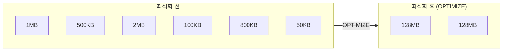
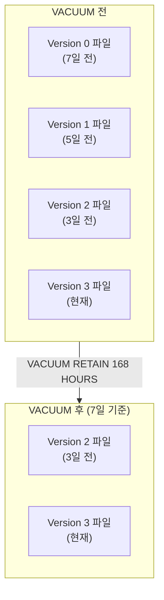

# Delta Lake 실전 — MERGE, OPTIMIZE, VACUUM

## 이 문서에서 다루는 내용

Delta Lake의 핵심 개념을 이해하셨다면, 이제 실무에서 자주 사용하는 **고급 조작법**을 살펴보겠습니다. 이 기능들은 데이터 파이프라인을 안정적이고 효율적으로 운영하는 데 필수적입니다.

---

## MERGE (Upsert)

### 개념

> 💡 **MERGE**는 "있으면 업데이트하고(UPDATE), 없으면 삽입한다(INSERT)"를 하나의 명령으로 수행하는 작업입니다. 이를 **Upsert(Update + Insert)** 라고도 부릅니다.

전통적인 데이터 레이크에서는 UPDATE가 불가능하여, 전체 테이블을 다시 써야 했습니다. Delta Lake의 MERGE는 이 문제를 우아하게 해결합니다.

### 문법

```sql
MERGE INTO target_table AS target
USING source_table AS source
ON target.id = source.id
WHEN MATCHED THEN
    UPDATE SET target.name = source.name,
               target.amount = source.amount,
               target.updated_at = current_timestamp()
WHEN NOT MATCHED THEN
    INSERT (id, name, amount, created_at, updated_at)
    VALUES (source.id, source.name, source.amount, current_timestamp(), current_timestamp());
```

### 실습 예제: 고객 정보 동기화

```sql
-- 소스 시스템에서 변경된 고객 데이터가 도착했다고 가정합니다
CREATE OR REPLACE TEMP VIEW updated_customers AS
SELECT * FROM VALUES
    (1, '김철수', 'cs.kim@newmail.com', '서울'),      -- 기존 고객: 이메일 변경
    (4, '한지민', 'jm.han@email.com', '대전')          -- 신규 고객
AS t(customer_id, name, email, city);

-- MERGE 실행
MERGE INTO catalog.schema.customers AS target
USING updated_customers AS source
ON target.customer_id = source.customer_id
WHEN MATCHED THEN
    UPDATE SET
        target.name = source.name,
        target.email = source.email,
        target.city = source.city
WHEN NOT MATCHED THEN
    INSERT (customer_id, name, email, city, signup_date)
    VALUES (source.customer_id, source.name, source.email, source.city, current_date());
```

### MERGE의 활용 패턴

| 패턴 | 설명 |
|------|------|
| **Upsert** | 있으면 UPDATE, 없으면 INSERT (가장 일반적) |
| **SCD Type 1** | 최신 값으로 덮어쓰기 (이력 보존 안 함) |
| **SCD Type 2** | 변경 이력을 모두 보존 (유효 기간 관리) |
| **Deduplication** | 중복 데이터 제거 |
| **Delete 동기화** | 소스에서 삭제된 레코드를 타겟에서도 삭제 |

> 💡 **SCD(Slowly Changing Dimension, 완만하게 변하는 차원)란?** 데이터 웨어하우스에서 시간에 따라 변하는 데이터(예: 고객 주소, 상품 가격)를 어떻게 관리할지에 대한 전략입니다.
> - **Type 1**: 변경 시 이전 값을 덮어씁니다. 이력을 보존하지 않습니다.
> - **Type 2**: 변경 시 이전 레코드를 만료 처리하고 새 레코드를 추가합니다. 전체 이력을 보존합니다.

---

## OPTIMIZE (데이터 압축)

### 개념

> 💡 **OPTIMIZE**는 Delta 테이블의 작은 파일들을 **큰 파일로 합치는(Compaction)** 작업입니다. 데이터를 지속적으로 추가하다 보면 작은 파일이 매우 많아지는데, 이를 적절한 크기로 합치면 쿼리 성능이 크게 향상됩니다.

### 왜 필요한가요?



> 💡 **Small File Problem(작은 파일 문제)이란?** 스트리밍 수집이나 빈번한 INSERT로 인해 테이블에 수천~수만 개의 작은 파일이 쌓이는 현상입니다. 쿼리 시 각 파일을 열고 닫는 오버헤드가 누적되어 성능이 크게 저하됩니다. OPTIMIZE는 이 문제를 해결합니다.

### 사용 방법

```sql
-- 테이블 전체 최적화
OPTIMIZE catalog.schema.orders;

-- 특정 파티션만 최적화
OPTIMIZE catalog.schema.orders
WHERE order_date >= '2025-03-01';
```

### Liquid Clustering

> 🆕 **Liquid Clustering**은 Databricks가 최근 도입한 차세대 데이터 배치 최적화 기술입니다. 기존의 Z-Order와 파티셔닝을 대체하며, 데이터를 자동으로 최적의 레이아웃으로 재배치합니다.

```sql
-- Liquid Clustering 활성화하여 테이블 생성
CREATE TABLE catalog.schema.orders (
    order_id BIGINT,
    customer_id BIGINT,
    order_date DATE,
    amount DECIMAL(10,2)
) CLUSTER BY (order_date, customer_id);

-- OPTIMIZE 실행 시 자동으로 Liquid Clustering 적용
OPTIMIZE catalog.schema.orders;
```

| 비교 항목 | 파티셔닝 (기존) | Z-Order (기존) | Liquid Clustering (최신) |
|-----------|----------------|----------------|------------------------|
| 설정 방법 | `PARTITIONED BY` | `OPTIMIZE ... ZORDER BY` | `CLUSTER BY` |
| 컬럼 변경 | 테이블 재생성 필요 | 매번 지정 | `ALTER TABLE ... CLUSTER BY` |
| 동작 방식 | 물리적 디렉토리 분리 | 파일 내 정렬 | 증분 자동 재배치 |
| 추천 여부 | 레거시 | 레거시 | ✅ 신규 테이블에 권장 |

> 💡 **파티셔닝(Partitioning)이란?** 데이터를 특정 컬럼 값(예: 날짜)에 따라 물리적으로 다른 디렉토리에 저장하는 방식입니다. `order_date = 2025-03-15` 데이터는 `/order_date=2025-03-15/` 디렉토리에 저장되므로, 특정 날짜만 조회할 때 해당 디렉토리만 읽으면 됩니다. 다만 카디널리티(고유값 수)가 높은 컬럼으로 파티셔닝하면 오히려 작은 파일이 많아지는 문제가 생깁니다.

---

## VACUUM (오래된 파일 정리)

### 개념

> 💡 **VACUUM**은 Delta 테이블에서 **더 이상 사용되지 않는 오래된 데이터 파일**을 삭제하여 스토리지 비용을 절약하는 작업입니다.

Delta Lake에서 UPDATE나 DELETE를 실행하면, 기존 파일이 즉시 삭제되지 않고 새 파일이 추가됩니다 (타임 트래블을 위해). VACUUM은 일정 기간이 지난 오래된 파일을 정리합니다.



### 사용 방법

```sql
-- 기본: 7일(168시간)보다 오래된 파일 삭제
VACUUM catalog.schema.orders;

-- 보존 기간 지정: 30일보다 오래된 파일만 삭제
VACUUM catalog.schema.orders RETAIN 720 HOURS;

-- 삭제될 파일 미리 확인 (DRY RUN)
VACUUM catalog.schema.orders DRY RUN;
```

> ⚠️ **주의사항**: VACUUM을 실행하면 해당 기간 이전의 타임 트래블이 불가능해집니다. 예를 들어, `RETAIN 168 HOURS`로 VACUUM을 실행하면 7일 이전의 데이터는 더 이상 타임 트래블로 조회할 수 없습니다. 규정 준수 요건에 따라 보존 기간을 적절히 설정하시기 바랍니다.

---

## DELETE와 UPDATE

### DELETE

```sql
-- 조건에 맞는 행 삭제
DELETE FROM catalog.schema.orders
WHERE status = 'CANCELLED'
  AND order_date < '2024-01-01';
```

### UPDATE

```sql
-- 조건에 맞는 행 수정
UPDATE catalog.schema.orders
SET status = 'REFUNDED',
    updated_at = current_timestamp()
WHERE order_id = 1001;
```

> 💡 일반 데이터 레이크(Parquet 파일)에서는 DELETE/UPDATE가 불가능합니다. Delta Lake이기에 가능한 기능이며, 내부적으로는 해당 데이터를 포함하는 파일을 새로 쓰는 방식(Copy-on-Write)으로 동작합니다.

---

## 테이블 정보 확인 명령어

```sql
-- 테이블의 물리적 정보 (파일 수, 크기, 파티션 등)
DESCRIBE DETAIL catalog.schema.orders;

-- 테이블 변경 이력
DESCRIBE HISTORY catalog.schema.orders;

-- 테이블의 컬럼 정보
DESCRIBE TABLE catalog.schema.orders;

-- 테이블 생성 DDL 확인
SHOW CREATE TABLE catalog.schema.orders;
```

---

## 운영 모범 사례

| 작업 | 권장 빈도 | 설명 |
|------|-----------|------|
| **OPTIMIZE** | 일 1회 또는 데이터 변경 후 | 작은 파일을 합쳐 쿼리 성능을 유지합니다 |
| **VACUUM** | 주 1회 | 오래된 파일을 삭제하여 스토리지 비용을 절약합니다 |
| **ANALYZE TABLE** | 주 1회 | 통계 정보를 갱신하여 쿼리 최적화기의 성능을 높입니다 |

```sql
-- 추천 운영 스크립트
OPTIMIZE catalog.schema.orders;
VACUUM catalog.schema.orders RETAIN 720 HOURS;
ANALYZE TABLE catalog.schema.orders COMPUTE STATISTICS;
```

> 🆕 **최신 기능**: Databricks는 **Predictive Optimization**을 통해 OPTIMIZE와 VACUUM을 자동으로 실행하는 기능을 제공하고 있습니다. Unity Catalog가 활성화된 관리형(Managed) 테이블에서는 Databricks가 테이블의 상태를 모니터링하고, 최적의 시점에 자동으로 최적화를 수행합니다.

```sql
-- Predictive Optimization 활성화
ALTER TABLE catalog.schema.orders
SET TBLPROPERTIES ('delta.enableOptimizeWrite' = 'true');
```

---

## 정리

| 핵심 기능 | 설명 |
|-----------|------|
| **MERGE** | Upsert(있으면 UPDATE, 없으면 INSERT)를 한 번에 수행합니다 |
| **OPTIMIZE** | 작은 파일들을 합쳐서 쿼리 성능을 향상시킵니다 |
| **Liquid Clustering** | 차세대 데이터 레이아웃 최적화. 기존 파티셔닝/Z-Order를 대체합니다 |
| **VACUUM** | 불필요한 오래된 파일을 삭제하여 스토리지 비용을 절약합니다 |
| **Predictive Optimization** | OPTIMIZE/VACUUM을 Databricks가 자동으로 실행합니다 |

다음 문서에서는 Delta Lake와 **Apache Iceberg**의 관계 및 상호 운용성을 살펴보겠습니다.

---

## 참고 링크

- [Databricks: MERGE INTO](https://docs.databricks.com/aws/en/sql/language-manual/delta-merge-into.html)
- [Databricks: OPTIMIZE](https://docs.databricks.com/aws/en/sql/language-manual/delta-optimize.html)
- [Databricks: VACUUM](https://docs.databricks.com/aws/en/sql/language-manual/delta-vacuum.html)
- [Databricks: Liquid Clustering](https://docs.databricks.com/aws/en/delta/clustering.html)
- [Databricks: Predictive Optimization](https://docs.databricks.com/aws/en/optimizations/predictive-optimization.html)
