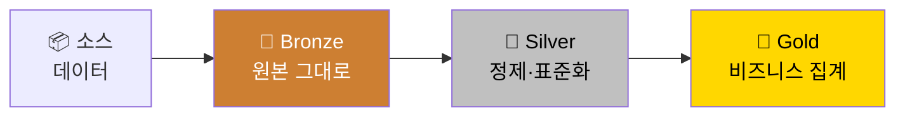
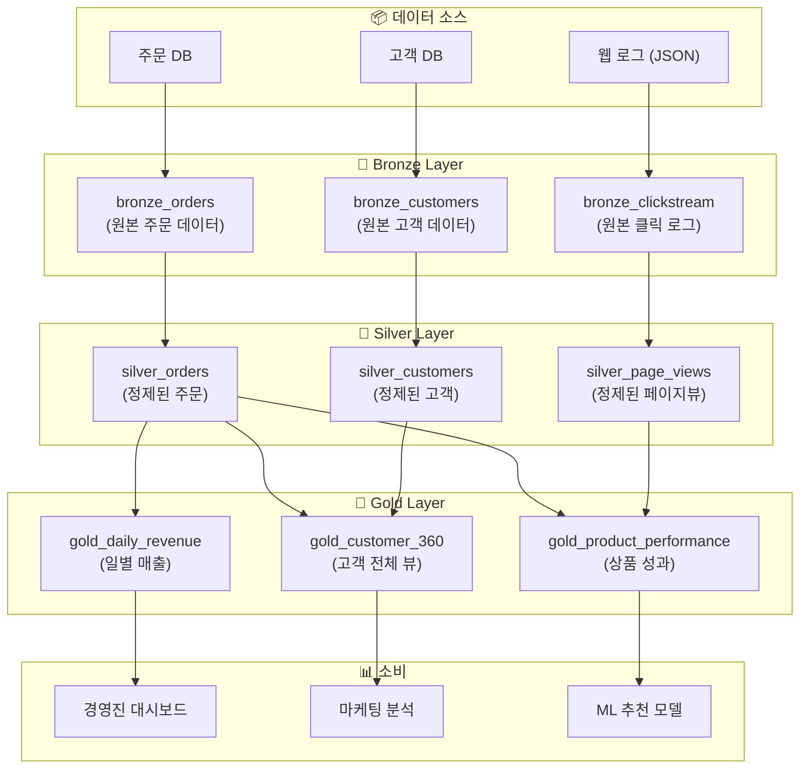

# Medallion 아키텍처

## Medallion 아키텍처란?

> 💡 **Medallion(메달리온) 아키텍처**는 데이터를 품질과 가공 수준에 따라 **Bronze(원본)**, **Silver(정제)**, **Gold(집계)** 세 계층으로 나누어 관리하는 데이터 설계 패턴입니다.

이름의 유래는 올림픽 메달에서 왔습니다. 동메달(Bronze)부터 금메달(Gold)로 갈수록 데이터의 품질과 비즈니스 가치가 높아집니다.



### 비유로 이해하기

식재료가 요리가 되는 과정을 떠올려 보겠습니다.

| 단계 | 비유 | 데이터 |
|------|------|--------|
| **Bronze** | 시장에서 사온 식재료 그대로 (흙, 겉껍질 포함) | 원본 데이터 그대로 (오류, 중복 포함) |
| **Silver** | 씻고, 껍질 벗기고, 손질한 재료 | 정제, 중복 제거, 스키마 표준화된 데이터 |
| **Gold** | 완성된 요리 (스테이크, 샐러드) | 비즈니스 목적에 맞게 집계·요약된 데이터 |

---

## 각 계층의 역할

### 🥉 Bronze Layer (원본 데이터 계층)

| 항목 | 설명 |
|------|------|
| **목적** | 소스 데이터를 **있는 그대로** 보존합니다 |
| **데이터 상태** | 원본 그대로 (오류, 중복, 불완전한 데이터 포함 가능) |
| **저장 방식** | 소스의 스키마를 최대한 유지하되, 메타데이터(수집 시간, 소스 파일명 등)를 추가합니다 |
| **주요 도구** | Auto Loader, Lakeflow Connect |
| **핵심 원칙** | "아무것도 변경하지 않는다. 원본을 그대로 보존한다" |

```sql
-- Bronze 테이블 예시: 원본 JSON 데이터를 그대로 수집
CREATE OR REFRESH STREAMING TABLE bronze_orders
AS SELECT
    *,
    _metadata.file_path AS _source_file,
    _metadata.file_modification_time AS _ingested_at,
    current_timestamp() AS _processing_time
FROM STREAM read_files(
    's3://raw-data/orders/',
    format => 'json',
    inferColumnTypes => true
);
```

> 💡 **왜 원본을 보존해야 하나요?** 나중에 변환 로직에 오류가 발견되더라도, 원본이 있으면 처음부터 다시 정제할 수 있습니다. 원본 없이 변환된 데이터만 있으면, 소스 시스템에 다시 요청해야 하는데 이미 삭제되었거나 변경되었을 수 있습니다.

### 🥈 Silver Layer (정제된 데이터 계층)

| 항목 | 설명 |
|------|------|
| **목적** | Bronze 데이터를 **정제하고 표준화**하여 분석 가능한 형태로 만듭니다 |
| **데이터 상태** | 중복 제거, 타입 변환, 유효성 검증이 완료된 깨끗한 데이터입니다 |
| **저장 방식** | 정규화된 스키마, 적절한 데이터 타입, 일관된 명명 규칙을 적용합니다 |
| **주요 작업** | 데이터 정제, 중복 제거, 조인, 스키마 표준화 |
| **핵심 원칙** | "기업 전체에서 공통으로 사용할 수 있는 깨끗한 데이터를 만든다" |

```sql
-- Silver 테이블 예시: 정제 및 표준화
CREATE OR REFRESH STREAMING TABLE silver_orders (
    -- 데이터 품질 규칙 정의
    CONSTRAINT valid_order_id EXPECT (order_id IS NOT NULL) ON VIOLATION DROP ROW,
    CONSTRAINT valid_amount EXPECT (total_amount > 0) ON VIOLATION DROP ROW,
    CONSTRAINT valid_email EXPECT (email RLIKE '^[^@]+@[^@]+\\.[^@]+$') ON VIOLATION DROP ROW
)
AS SELECT
    CAST(order_id AS BIGINT) AS order_id,
    CAST(customer_id AS BIGINT) AS customer_id,
    TRIM(LOWER(email)) AS email,
    CAST(order_date AS TIMESTAMP) AS order_date,
    CAST(total_amount AS DECIMAL(12, 2)) AS total_amount,
    UPPER(TRIM(status)) AS status,
    TRIM(shipping_city) AS shipping_city
FROM STREAM(bronze_orders)
WHERE order_id IS NOT NULL;
```

> 💡 **정규화(Normalization)란?** 데이터를 중복 없이 효율적으로 저장하기 위해 테이블을 분리하고 관계를 정의하는 과정입니다. 예를 들어, 주문 테이블에 고객 이름을 직접 넣는 대신, 고객 ID만 저장하고 고객 테이블을 별도로 만드는 것입니다. 이렇게 하면 고객 이름이 변경되어도 한 곳만 수정하면 됩니다.

### 🥇 Gold Layer (비즈니스 집계 계층)

| 항목 | 설명 |
|------|------|
| **목적** | 특정 비즈니스 요구에 맞게 **집계, 요약, 결합**된 최종 데이터를 제공합니다 |
| **데이터 상태** | 비즈니스 메트릭, KPI, 리포트용 데이터입니다 |
| **저장 방식** | 비정규화(Denormalized)된 넓은 테이블, 사전 집계된 요약 테이블입니다 |
| **주요 소비자** | BI 대시보드, 경영진 리포트, ML 피처 테이블 |
| **핵심 원칙** | "특정 비즈니스 질문에 바로 답할 수 있는 데이터를 만든다" |

```sql
-- Gold 테이블 예시 1: 일별 매출 요약
CREATE OR REFRESH MATERIALIZED VIEW gold_daily_revenue
AS SELECT
    DATE(order_date) AS order_date,
    shipping_city AS city,
    COUNT(*) AS total_orders,
    SUM(total_amount) AS total_revenue,
    AVG(total_amount) AS avg_order_value,
    COUNT(DISTINCT customer_id) AS unique_customers
FROM silver_orders
WHERE status = 'COMPLETED'
GROUP BY DATE(order_date), shipping_city;

-- Gold 테이블 예시 2: 고객 360 뷰
CREATE OR REFRESH MATERIALIZED VIEW gold_customer_360
AS SELECT
    c.customer_id,
    c.name,
    c.email,
    c.signup_date,
    COUNT(o.order_id) AS lifetime_orders,
    SUM(o.total_amount) AS lifetime_revenue,
    AVG(o.total_amount) AS avg_order_value,
    MAX(o.order_date) AS last_order_date,
    DATEDIFF(CURRENT_DATE(), MAX(o.order_date)) AS days_since_last_order
FROM silver_customers c
LEFT JOIN silver_orders o ON c.customer_id = o.customer_id
GROUP BY c.customer_id, c.name, c.email, c.signup_date;
```

> 💡 **비정규화(Denormalization)란?** 정규화의 반대 개념입니다. 분석 성능을 위해 의도적으로 데이터를 중복 저장합니다. 예를 들어, 고객 360 뷰에서는 고객 정보와 주문 집계를 하나의 넓은 테이블에 미리 합쳐 놓아, 조인 없이 빠르게 조회할 수 있습니다.

---

## 전체 흐름 다이어그램



---

## 계층 간 비교

| 비교 항목 | Bronze | Silver | Gold |
|-----------|--------|--------|------|
| **데이터 품질** | 낮음 (원본 그대로) | 높음 (정제됨) | 최고 (비즈니스 검증) |
| **스키마** | 소스와 동일 | 표준화됨 | 비즈니스 도메인 기준 |
| **갱신 빈도** | 실시간 ~ 분 단위 | 분 ~ 시간 단위 | 시간 ~ 일 단위 |
| **주요 소비자** | 데이터 엔지니어 | 데이터 분석가, DS | BI, 경영진, 앱 |
| **보존 기간** | 장기 (원본 보존) | 중기 | 단기 ~ 중기 |
| **테이블 수** | 소스 수와 비례 | Bronze와 유사 | 비즈니스 요구에 따라 |

---

## 모범 사례

### 네이밍 컨벤션

일관된 이름 규칙을 사용하면 테이블의 계층을 쉽게 식별할 수 있습니다.

| 방식 | 예시 |
|------|------|
| **접두어 방식** | `bronze_orders`, `silver_orders`, `gold_daily_revenue` |
| **스키마 분리 방식** | `raw.orders`, `cleaned.orders`, `analytics.daily_revenue` |
| **카탈로그 분리 방식** | `bronze.ecommerce.orders`, `silver.ecommerce.orders`, `gold.ecommerce.daily_revenue` |

Databricks에서는 **Unity Catalog의 3-Level 네임스페이스(Catalog → Schema → Table)**를 활용하여 계층을 체계적으로 관리하는 것을 권장합니다.

### 권한 관리

| 계층 | 접근 권한 |
|------|-----------|
| **Bronze** | 데이터 엔지니어만 쓰기/읽기 가능합니다 |
| **Silver** | 데이터 엔지니어가 쓰기, 분석가/과학자가 읽기 가능합니다 |
| **Gold** | 넓은 읽기 권한 (BI 사용자, 경영진 포함) |

---

## 정리

| 핵심 개념 | 설명 |
|-----------|------|
| **Bronze** | 원본 데이터를 그대로 보존하는 첫 번째 계층입니다. "있는 그대로 저장"합니다 |
| **Silver** | 정제, 표준화, 중복 제거가 완료된 두 번째 계층입니다. "깨끗하게 정리"합니다 |
| **Gold** | 비즈니스 목적에 맞게 집계된 세 번째 계층입니다. "바로 분석 가능"합니다 |
| **Medallion** | Bronze → Silver → Gold 3계층 구조의 데이터 설계 패턴입니다 |

다음 문서에서는 Delta Lake의 **실전 조작법**(MERGE, OPTIMIZE, VACUUM 등)을 자세히 살펴보겠습니다.

---

## 참고 링크

- [Databricks: Medallion Architecture](https://docs.databricks.com/aws/en/lakehouse/medallion.html)
- [Azure Databricks: Medallion lakehouse architecture](https://learn.microsoft.com/en-us/azure/databricks/lakehouse/medallion)
- [Databricks Blog: Medallion Architecture](https://www.databricks.com/glossary/medallion-architecture)
