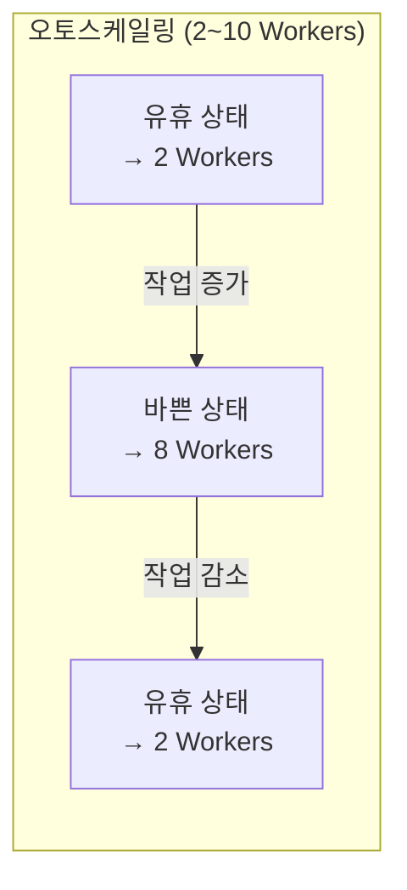

# 클러스터 설정

## 클러스터를 설정할 때 고려해야 할 항목들

All-Purpose 또는 Job 클러스터를 생성할 때, 워크로드의 특성에 맞게 다양한 설정을 조정할 수 있습니다. 이 문서에서는 주요 설정 항목과 선택 가이드를 안내해 드리겠습니다.

---

## Databricks Runtime 버전

> 💡 **Databricks Runtime**은 클러스터에서 실행되는 소프트웨어 패키지입니다. Apache Spark와 함께 다양한 라이브러리, 최적화, 보안 기능이 포함되어 있습니다.

| Runtime 유형 | 포함 내용 | 적합한 워크로드 |
|-------------|----------|---------------|
| **Standard** | Spark + Delta Lake + 기본 라이브러리 | 일반 데이터 엔지니어링 |
| **ML Runtime** | Standard + PyTorch, TensorFlow, XGBoost, scikit-learn 등 | 머신러닝 모델 학습 |
| **Photon Runtime** | Standard + Photon 엔진 (C++ 기반 고속 처리) | SQL 분석, ETL 성능 최적화 |
| **GPU Runtime** | ML Runtime + GPU 드라이버 | 딥러닝, LLM 파인튜닝 |

> 🆕 **최신 버전**: Databricks Runtime **18.1**이 최신 GA 버전이며, Apache Spark 4.1.0을 기반으로 합니다. 특별한 이유가 없다면 최신 LTS(Long Term Support) 버전을 선택하시는 것을 권장합니다.

---

## 노드 타입 (Node Type)

### Driver 노드와 Worker 노드

| 항목 | Driver 노드 | Worker 노드 |
|------|-------------|-------------|
| 역할 | 작업 계획, 결과 수집 | 실제 데이터 처리 |
| 개수 | 항상 1대 | 0대 이상 (설정 가능) |
| 크기 선택 | 중간 크기 권장 | 워크로드에 따라 선택 |

### 인스턴스 패밀리 선택 가이드

| 인스턴스 유형 | 특징 | 적합한 워크로드 | AWS 예시 |
|-------------|------|---------------|----------|
| **범용 (General Purpose)** | CPU와 메모리 균형 | 일반 ETL, SQL 분석 | m5, m6i |
| **메모리 최적화 (Memory)** | 메모리 용량이 큼 | 대규모 조인, 캐싱, ML | r5, r6i |
| **컴퓨트 최적화 (Compute)** | CPU 성능이 높음 | CPU 집약적 변환 | c5, c6i |
| **스토리지 최적화 (Storage)** | 로컬 SSD가 큼 | 대용량 셔플, 스필 | i3, i4i |
| **GPU** | GPU 장착 | 딥러닝, LLM | p3, g4dn |

> 💡 **셔플(Shuffle)이란?** `groupBy()`, `join()` 같은 연산을 할 때, 데이터가 Executor 간에 재분배되는 과정입니다. 대량의 셔플이 발생하면 네트워크와 디스크 I/O가 증가합니다. 스토리지 최적화 인스턴스는 로컬 SSD를 활용하여 셔플 성능을 향상시킵니다.

> 🆕 **Flexible Node Types**: Databricks가 최근 GA로 출시한 기능으로, 요청한 인스턴스 타입을 사용할 수 없는 경우 **호환되는 다른 인스턴스 타입으로 자동 대체**합니다. 클라우드 용량 부족으로 클러스터 시작이 실패하는 문제를 방지합니다.

---

## 오토스케일링 (Autoscaling)

> 💡 **오토스케일링(Autoscaling)**이란 워크로드에 따라 Worker 노드의 수를 **자동으로 늘리거나 줄이는** 기능입니다.



### 설정 방법

```
최소 Worker 수: 2
최대 Worker 수: 10
```

- **최소(Min)**: 클러스터가 유휴 상태일 때 유지하는 최소 Worker 수입니다
- **최대(Max)**: 부하가 높을 때 확장할 수 있는 최대 Worker 수입니다

### 권장 사항

| 워크로드 | 최소 | 최대 | 설명 |
|----------|------|------|------|
| 대화형 개발 | 1~2 | 4~8 | 탐색 시 적은 노드, 무거운 작업 시 확장 |
| 정기 ETL (배치) | 고정 | 고정 | 예측 가능한 워크로드는 고정 크기가 효율적 |
| 스트리밍 | 2 | 워크로드 피크에 맞춤 | 트래픽 변동에 대응 |

---

## Spot 인스턴스

> 💡 **Spot 인스턴스(Spot Instance)**란 클라우드 제공자의 여유 용량을 활용하여 **정가의 60~90% 할인된 가격**으로 사용할 수 있는 인스턴스입니다. 단, 클라우드 제공자가 용량이 필요하면 **갑자기 회수(preemption)**할 수 있습니다.

| 비교 항목 | On-Demand (정가) | Spot (할인) |
|-----------|-----------------|------------|
| 비용 | 100% | 10~40% |
| 안정성 | 보장됨 | 회수될 수 있음 |
| 적합한 용도 | Driver, 프로덕션 | Worker, 비핵심 작업 |

### 모범 사례

- **Driver 노드**는 항상 On-Demand를 사용합니다 (중간에 회수되면 전체 작업이 실패)
- **Worker 노드**는 Spot과 On-Demand를 혼합합니다
- Spot이 회수되어도 Spark는 자동으로 작업을 재시도합니다

---

## Photon 엔진

> 💡 **Photon**은 Databricks가 C++로 개발한 차세대 쿼리 실행 엔진입니다. 기존 Spark SQL 엔진을 대체하여 SQL 쿼리와 DataFrame 연산을 **최대 수 배 빠르게** 실행합니다.

### Photon이 빠른 이유

| 기술 | 설명 |
|------|------|
| **네이티브 벡터 실행** | JVM 대신 C++로 CPU 명령어를 직접 실행하여 오버헤드를 줄입니다 |
| **SIMD 최적화** | CPU의 벡터 연산 명령어(AVX 등)를 활용하여 여러 데이터를 동시에 처리합니다 |
| **메모리 관리** | JVM의 가비지 컬렉션 없이 효율적으로 메모리를 관리합니다 |

### 활성화 방법

클러스터 생성 시 **Photon 가속**을 체크하거나, Photon이 포함된 Runtime을 선택하면 됩니다.

---

## 자동 종료 (Auto Termination)

비용 절약을 위해 **자동 종료** 설정은 매우 중요합니다.

```
자동 종료 시간: 30분 (유휴 후)
```

- All-Purpose 클러스터에서 설정하는 것을 **강력히 권장**합니다
- 설정하지 않으면, 아무도 사용하지 않아도 계속 실행되어 비용이 발생합니다
- 일반적으로 **30분~120분** 사이로 설정합니다

---

## 정리

| 핵심 설정 | 설명 |
|-----------|------|
| **Runtime** | Spark 엔진과 라이브러리가 포함된 소프트웨어 패키지. 최신 LTS 버전을 권장합니다 |
| **노드 타입** | 워크로드 특성(메모리, CPU, GPU)에 맞는 인스턴스를 선택합니다 |
| **오토스케일링** | 부하에 따라 Worker 수를 자동 조절합니다 |
| **Spot 인스턴스** | Worker에 적용하여 비용을 크게 절감할 수 있습니다 |
| **Photon** | C++ 기반 고성능 엔진으로 SQL/DataFrame 성능을 향상시킵니다 |
| **자동 종료** | 유휴 시 자동 종료하여 불필요한 비용을 방지합니다 |

---

## 참고 링크

- [Databricks: Cluster configuration](https://docs.databricks.com/aws/en/compute/configure.html)
- [Databricks: Photon](https://docs.databricks.com/aws/en/compute/photon.html)
- [Azure Databricks: Compute configuration](https://learn.microsoft.com/en-us/azure/databricks/compute/configure)
