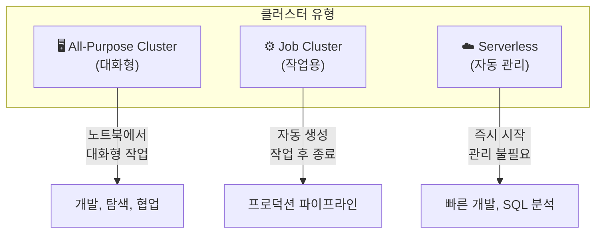
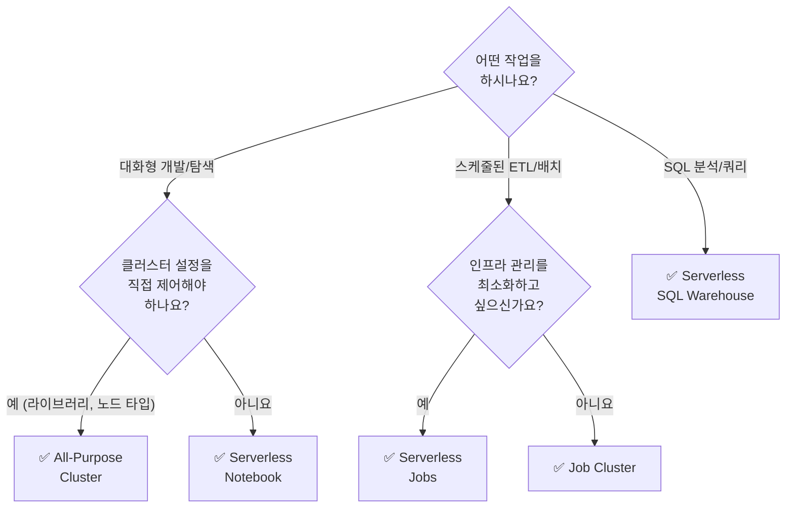

# 클러스터 종류

## 클러스터란?

> 💡 **클러스터(Cluster)** 란 Spark 코드를 실행하기 위한 **컴퓨팅 리소스의 집합**입니다. 하나의 Driver 노드와 0개 이상의 Worker 노드로 구성됩니다.

Databricks에서 노트북의 코드를 실행하거나 ETL 작업을 수행하려면 반드시 클러스터가 필요합니다. 어떤 종류의 클러스터를 선택하느냐에 따라 비용, 성능, 관리 방식이 달라집니다.

---

## 클러스터 종류 비교

Databricks는 세 가지 유형의 클러스터를 제공합니다.



| 비교 항목 | All-Purpose Cluster | Job Cluster | Serverless |
|-----------|-------------------|-------------|------------|
| **용도** | 대화형 개발, 탐색 | 예약된 작업 실행 | 노트북, SQL, Jobs |
| **생성 방식** | 사용자가 수동 생성 | Job 실행 시 자동 생성 | 자동 관리 |
| **수명** | 수동 종료 또는 자동 종료 | 작업 완료 후 자동 종료 | 유휴 시 자동 해제 |
| **시작 시간** | 3~5분 | 3~5분 | 수 초 |
| **비용** | 실행 중 계속 과금 | 작업 시간만 과금 | 사용량(처리량) 기준 |
| **공유** | 여러 사용자가 공유 가능 | 하나의 작업 전용 | 사용자별 격리 |
| **설정 자유도** | 높음 (노드 타입, 라이브러리 등) | 높음 | 낮음 (자동 관리) |

---

## All-Purpose Cluster (대화형 클러스터)

### 언제 사용하나요?

- 노트북에서 코드를 작성하고 **대화형으로 결과를 확인**할 때
- 데이터를 탐색하고 분석하는 **개발 단계**에서
- 여러 팀원이 하나의 클러스터를 **공유하여 협업**할 때

### 특징

| 항목 | 설명 |
|------|------|
| 생성 | 사용자가 Compute 메뉴에서 직접 생성합니다 |
| 종료 | 수동으로 종료하거나, 일정 시간 유휴 후 자동 종료됩니다 |
| 공유 | 여러 노트북이 동시에 연결될 수 있습니다 |
| 재시작 | 종료 후 재시작하면 기존 설정이 유지됩니다 |
| 비용 주의 | 사용하지 않아도 실행 중이면 과금됩니다. 자동 종료 설정이 중요합니다 |

```python
# All-Purpose 클러스터에서 대화형 작업 예시
df = spark.read.table("catalog.schema.sales")
display(df.describe())  # 데이터 탐색
```

---

## Job Cluster (작업용 클러스터)

### 언제 사용하나요?

- **스케줄된 ETL 파이프라인**을 실행할 때
- **프로덕션 워크로드**를 안정적으로 운영할 때
- 비용을 최소화하면서 **일회성 배치 작업**을 실행할 때

### 특징

| 항목 | 설명 |
|------|------|
| 생성 | Job(작업)이 시작될 때 자동으로 생성됩니다 |
| 종료 | 작업이 완료되면 자동으로 종료되고 삭제됩니다 |
| 격리 | 각 작업이 전용 클러스터에서 실행되어, 다른 작업과 리소스를 공유하지 않습니다 |
| 비용 | 실제 작업 시간에 대해서만 과금되어 비용 효율적입니다 |

```yaml
# Job 설정 예시 (Databricks Asset Bundle)
resources:
  jobs:
    daily_etl:
      name: "daily-sales-etl"
      tasks:
        - task_key: "process_sales"
          job_cluster_key: "etl_cluster"
          notebook_task:
            notebook_path: "/Workspace/etl/process_sales"
      job_clusters:
        - job_cluster_key: "etl_cluster"
          new_cluster:
            spark_version: "18.1.x-scala2.12"
            num_workers: 4
            node_type_id: "i3.xlarge"
```

---

## Serverless Compute (서버리스 컴퓨트)

### 언제 사용하나요?

- **빠르게 코드를 실행**하고 싶을 때 (클러스터 시작 대기 불필요)
- 클러스터 설정을 **신경 쓰지 않고** 개발에 집중하고 싶을 때
- **SQL 분석**을 수행할 때 (Serverless SQL Warehouse)

### 특징

| 항목 | 설명 |
|------|------|
| 시작 시간 | 수 초 만에 즉시 시작됩니다 |
| 관리 | Databricks가 자동으로 리소스를 할당·해제합니다 |
| 비용 | 실제 처리한 데이터량(DBU) 기준으로 과금됩니다 |
| 제한 | 사용자 정의 라이브러리 설치 등 세밀한 제어가 제한됩니다 |

> 🆕 **Serverless Workspaces**: 최근 Databricks는 **Serverless Workspaces**를 GA로 출시했습니다. 새로운 Workspace를 생성하면 기본적으로 Serverless 컴퓨트가 사전 구성되어 있어, 별도의 클러스터 설정 없이 바로 작업을 시작할 수 있습니다.

> 🆕 **Serverless Job Environments**: Notebook 태스크에서 작업 전용 환경을 사용할 수 있게 되어, 서버리스에서도 커스텀 라이브러리를 설치할 수 있습니다.

---

## 어떤 클러스터를 선택해야 하나요?



### 실무 권장 사항

| 환경 | 권장 클러스터 | 이유 |
|------|-------------|------|
| **개발/프로토타이핑** | Serverless Notebook | 빠른 시작, 관리 불필요 |
| **팀 협업 개발** | All-Purpose (공유) | 여러 노트북 동시 사용, 공유 라이브러리 |
| **프로덕션 ETL** | Job Cluster 또는 Serverless Job | 비용 효율, 작업 격리 |
| **SQL 대시보드/분석** | Serverless SQL Warehouse | 즉시 시작, 최적 SQL 성능 |
| **ML 학습 (GPU)** | All-Purpose (GPU 노드) | GPU 노드 타입 선택 필요 |

---

## 정리

| 핵심 개념 | 설명 |
|-----------|------|
| **All-Purpose Cluster** | 대화형 개발용. 사용자가 직접 생성하고 관리합니다 |
| **Job Cluster** | 프로덕션 작업용. 작업 시 자동 생성, 완료 후 자동 종료됩니다 |
| **Serverless** | 관리 불필요. 수 초 만에 시작되며 사용량 기준으로 과금됩니다 |

다음 문서에서는 클러스터의 **세부 설정**(노드 타입, 오토스케일링, Photon 등)을 살펴보겠습니다.

---

## 참고 링크

- [Databricks: Compute](https://docs.databricks.com/aws/en/compute/)
- [Databricks: Serverless compute](https://docs.databricks.com/aws/en/serverless-compute/)
- [Azure Databricks: Compute](https://learn.microsoft.com/en-us/azure/databricks/compute/)
