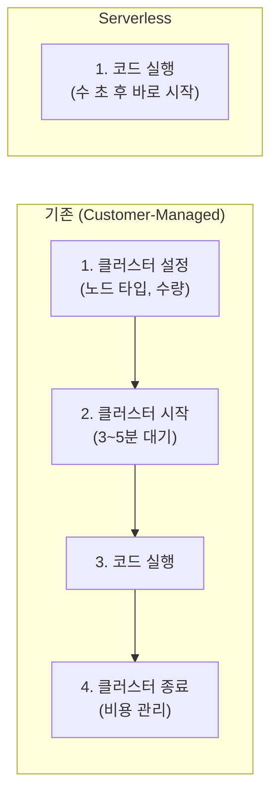
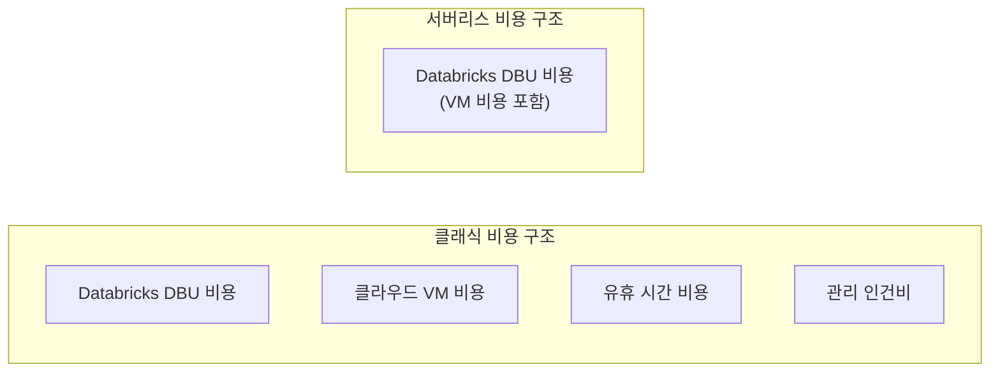

# Serverless 컴퓨트

## Serverless란?

> 💡 **Serverless 컴퓨트**는 사용자가 서버(클러스터)를 직접 생성하거나 관리할 필요 없이, **코드를 실행하면 Databricks가 알아서 리소스를 할당**해 주는 방식입니다.

### 기존 방식과의 비교



| 비교 항목 | Customer-Managed | Serverless |
|-----------|-----------------|------------|
| 시작 시간 | 3~5분 | **수 초** |
| 설정 필요 | 노드 타입, 수량, 오토스케일링 등 | **없음** |
| 비용 관리 | 사용자가 직접 (자동 종료 설정 등) | **자동** (유휴 시 즉시 해제) |
| 업그레이드 | Runtime 버전 직접 선택 | **자동** (항상 최신) |
| 보안 패치 | 사용자가 Runtime 업데이트 | **자동** |

---

## Serverless가 지원되는 워크로드

현재 Databricks에서 Serverless를 사용할 수 있는 워크로드는 다음과 같습니다.

| 워크로드 | 서버리스 지원 | 설명 |
|----------|-------------|------|
| **SQL Warehouse** | ✅ GA | SQL 분석, BI 도구 연결에 가장 많이 사용됩니다 |
| **Notebooks** | ✅ GA | 대화형 개발. Python, SQL, Scala, R 모두 지원합니다 |
| **Jobs (Workflows)** | ✅ GA | 스케줄된 배치 작업. JAR 태스크도 지원됩니다 |
| **SDP (Pipelines)** | ✅ GA | 선언적 데이터 파이프라인을 서버리스로 실행합니다 |
| **Model Serving** | ✅ GA | ML 모델 추론 엔드포인트입니다 |
| **Vector Search** | ✅ GA | 벡터 유사도 검색 인덱스입니다 |
| **Apps** | ✅ GA | Streamlit, Gradio 등 웹 애플리케이션입니다 |

---

## 비용 모델

### DBU (Databricks Unit)

> 💡 **DBU(Databricks Unit)**는 Databricks의 과금 단위입니다. 사용한 컴퓨팅 리소스의 양을 DBU로 환산하여 과금합니다. DBU당 단가는 워크로드 유형(SQL, Jobs, All-Purpose 등)과 요금 플랜에 따라 다릅니다.

### 서버리스 vs 클래식 비용 비교

서버리스의 DBU 단가는 클래식보다 높지만, **총 비용(TCO)**은 서버리스가 더 낮은 경우가 많습니다.

| 비용 요소 | Customer-Managed | Serverless |
|-----------|-----------------|------------|
| DBU 단가 | 낮음 | 높음 |
| 클라우드 VM 비용 | 별도 과금 | **DBU에 포함** |
| 유휴 비용 | 발생 (자동 종료 전) | **없음** |
| 관리 인건비 | 높음 | 낮음 |
| **총 비용** | 상황에 따라 | **보통 더 저렴** |



---

## Serverless 사용하기

### Notebook에서 Serverless 사용

1. 노트북 상단의 클러스터 선택 드롭다운 클릭
2. **Serverless** 선택
3. 코드 실행 → 수 초 내에 결과 확인

### Jobs에서 Serverless 사용

```yaml
# Databricks Asset Bundle 설정
resources:
  jobs:
    my_job:
      tasks:
        - task_key: "etl_task"
          notebook_task:
            notebook_path: "/Workspace/etl/daily_pipeline"
          # environment_key를 지정하면 Serverless로 실행됩니다
          environment_key: "default"
      environments:
        - environment_key: "default"
          spec:
            client: "1"
            dependencies:
              - "pandas>=2.0"
              - "requests"
```

---

## 언제 Serverless를 사용하고, 언제 클래식을 사용하나요?

| 상황 | 추천 | 이유 |
|------|------|------|
| SQL 분석, 대시보드 | ✅ Serverless | 즉시 시작, SQL 최적화 |
| 노트북 개발, 프로토타이핑 | ✅ Serverless | 빠른 반복 개발 |
| 정기 ETL Jobs | ✅ Serverless | 관리 간소화, 비용 효율 |
| GPU 워크로드 (딥러닝) | ❌ 클래식 | 서버리스에서 GPU 미지원 |
| 특정 라이브러리/JNI 필요 | ⚠️ 상황에 따라 | 서버리스 Job Environments로 해결 가능한지 확인 |
| 극도로 세밀한 클러스터 튜닝 | ❌ 클래식 | 노드 타입, Spark 설정 직접 제어 필요 시 |

---

## 정리

| 핵심 개념 | 설명 |
|-----------|------|
| **Serverless** | 인프라 관리 없이 코드만 실행하면 자동으로 리소스가 할당됩니다 |
| **즉시 시작** | 수 초 내에 시작되어 대기 시간이 거의 없습니다 |
| **자동 비용 관리** | 유휴 시 즉시 리소스를 해제하여 불필요한 비용이 발생하지 않습니다 |
| **DBU** | Databricks의 컴퓨팅 과금 단위입니다 |

이것으로 **컴퓨트와 워크스페이스** 섹션을 마치겠습니다. 다음 섹션에서는 실제 [데이터 엔지니어링](../05-data-engineering/README.md) 파이프라인 구축 방법을 알아보겠습니다.

---

## 참고 링크

- [Databricks: Serverless compute](https://docs.databricks.com/aws/en/serverless-compute/)
- [Azure Databricks: Serverless compute](https://learn.microsoft.com/en-us/azure/databricks/serverless-compute/)
- [Databricks: Pricing](https://www.databricks.com/pricing)
