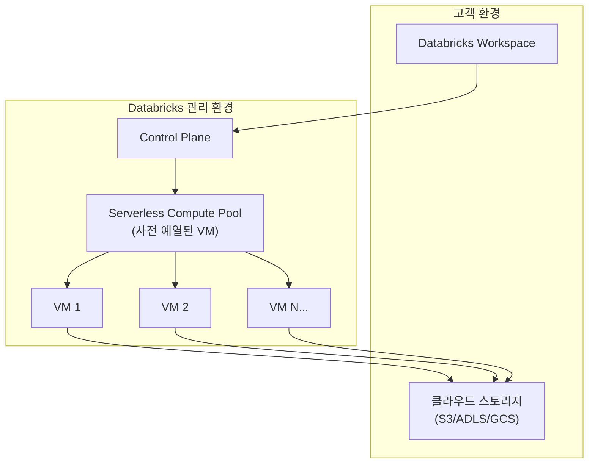
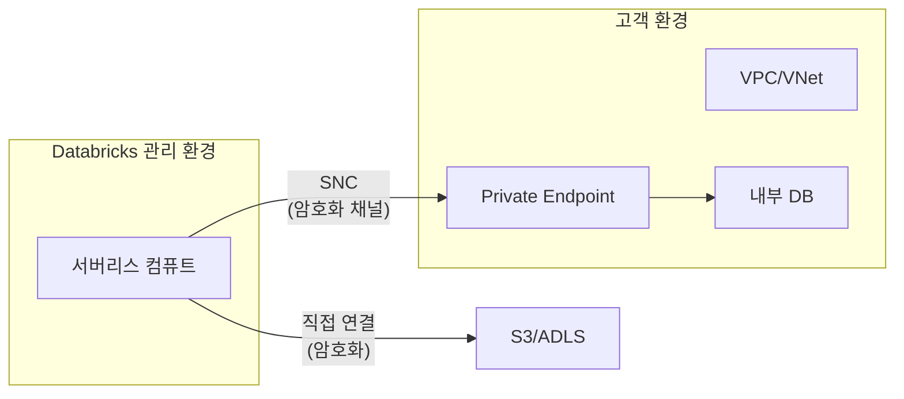
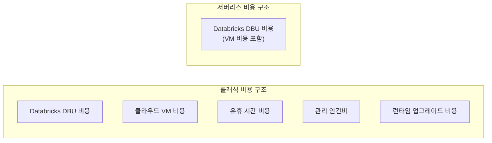

# Serverless 컴퓨트

## 서버리스 컴퓨팅이란?

> 💡 **Serverless 컴퓨트**는 사용자가 서버(클러스터)를 직접 생성하거나 관리할 필요 없이, **코드를 실행하면 Databricks가 알아서 리소스를 할당**해 주는 방식입니다.

서버리스 컴퓨팅은 인프라 관리의 부담을 완전히 제거합니다. 노드 타입 선택, 오토스케일링 설정, 런타임 버전 관리, 보안 패치 적용 등 모든 인프라 운영을 Databricks가 대신 처리합니다. 사용자는 **비즈니스 로직에만 집중**할 수 있습니다.

---

## 왜 서버리스가 필요한가?

기존 클러스터 기반 방식에서 팀이 겪는 공통적인 문제들을 서버리스가 해결합니다.

| 기존 방식의 문제 | 서버리스의 해결 |
|-----------------|---------------|
| 클러스터 시작까지 3~5분 대기합니다 | **수 초 만에 시작**되어 즉시 작업을 시작합니다 |
| 노드 타입, 수량, 런타임 버전을 선택해야 합니다 | **설정 없이** 코드만 실행하면 됩니다 |
| 유휴 클러스터가 비용을 발생시킵니다 | **사용한 만큼만** 과금되며 유휴 비용이 없습니다 |
| 런타임 업그레이드, 보안 패치를 직접 적용해야 합니다 | Databricks가 **자동으로 최신 상태**를 유지합니다 |
| 클러스터 관리를 위한 전담 인력이 필요합니다 | **관리 인건비 절감**, 인프라 팀 부담 감소 |

---

## Databricks 서버리스 아키텍처

서버리스의 핵심은 **컴퓨트 리소스가 Databricks 관리 환경에서 실행**된다는 것입니다. 기존 방식에서는 고객의 클라우드 계정(VPC/VNet)에서 VM이 실행되었지만, 서버리스에서는 Databricks가 관리하는 인프라에서 실행됩니다.



### 기존 방식과의 비교

| 구분 | Customer-Managed | Serverless |
|------|-----------------|------------|
| **VM 실행 위치** | 고객의 클라우드 계정 | Databricks 관리 환경 |
| **VM 수명주기** | 고객이 시작/중지 관리 | Databricks가 자동 관리 |
| **네트워크** | 고객 VPC/VNet 내부 | Databricks VPC (보안 연결) |
| **런타임 버전** | 고객이 선택/업그레이드 | 항상 최신 버전 자동 적용 |
| **스토리지 접근** | VPC 내부에서 직접 | 보안 채널을 통해 고객 스토리지 접근 |

---

## 서버리스 지원 워크로드

현재 Databricks에서 서버리스를 사용할 수 있는 워크로드는 다음과 같습니다.

| 워크로드 | 서버리스 지원 | 설명 |
|----------|-------------|------|
| **SQL Warehouse** | ✅ GA | SQL 분석, BI 도구 연결에 가장 많이 사용됩니다 |
| **Notebooks** | ✅ GA | 대화형 개발. Python, SQL, Scala, R 모두 지원합니다 |
| **Jobs (Workflows)** | ✅ GA | 스케줄된 배치 작업. JAR 태스크도 지원됩니다 |
| **SDP (Pipelines)** | ✅ GA | 선언적 데이터 파이프라인을 서버리스로 실행합니다 |
| **Model Serving** | ✅ GA | ML 모델 추론 엔드포인트입니다 |
| **Vector Search** | ✅ GA | 벡터 유사도 검색 인덱스입니다 |
| **Apps** | ✅ GA | Streamlit, Gradio 등 웹 애플리케이션입니다 |

---

## 서버리스 vs 클래식 상세 비교

### 시작 시간 비교

```mermaid
gantt
    title 컴퓨트 시작 시간 비교
    dateFormat ss
    axisFormat %S초

    section Customer-Managed
    VM 프로비저닝      :a1, 00, 120s
    런타임 초기화       :a2, after a1, 60s
    라이브러리 설치     :a3, after a2, 30s

    section Serverless
    사전 예열된 VM 할당  :b1, 00, 5s
    즉시 실행 가능       :milestone, after b1, 0s
```



| 단계 | Customer-Managed | Serverless |
|------|-----------------|------------|
| VM 할당 | 2~3분 (클라우드 API 호출) | **수 초** (사전 예열된 풀에서 할당) |
| 런타임 초기화 | 30초~1분 | **이미 초기화됨** |
| 라이브러리 설치 | 추가 시간 소요 | **환경 설정에 포함** |
| **총 소요 시간** | **3~5분** | **5~15초** |

### 관리 부담 비교

| 관리 항목 | Customer-Managed | Serverless |
|-----------|-----------------|------------|
| 노드 타입 선택 | 사용자가 직접 | 자동 |
| 오토스케일링 설정 | Min/Max 직접 설정 | 자동 |
| 런타임 버전 관리 | 직접 선택/업그레이드 | 항상 최신 |
| 보안 패치 | 런타임 업데이트 필요 | 자동 적용 |
| Spot Instance 설정 | 직접 구성 | 자동 최적화 |
| Init Script | 직접 관리 | 환경 설정으로 대체 |
| 라이브러리 충돌 | 직접 해결 | 격리된 환경 |

---

## 서버리스 SQL Warehouse 상세

서버리스 SQL Warehouse는 가장 먼저 도입되고, 가장 널리 사용되는 서버리스 워크로드입니다.

| 특징 | 설명 |
|------|------|
| **즉시 시작** | 수 초 내에 쿼리 실행이 가능합니다 |
| **자동 스케일링** | 동시 쿼리 부하에 따라 자동으로 확장/축소됩니다 |
| **Photon 기본** | C++ 벡터화 엔진이 기본으로 활성화되어 있습니다 |
| **자동 중지** | 유휴 상태에서 자동으로 리소스를 해제합니다 |
| **관리 불필요** | 사이즈만 선택하면 나머지는 Databricks가 관리합니다 |

```sql
-- 서버리스 SQL Warehouse에서 쿼리 실행 (일반 SQL과 동일)
SELECT
    region,
    COUNT(*) AS order_count,
    SUM(revenue) AS total_revenue
FROM production.ecommerce.orders
WHERE order_date >= '2025-01-01'
GROUP BY region
ORDER BY total_revenue DESC;
```

---

## 서버리스 Notebooks 상세

서버리스 Notebooks는 대화형 개발에서 클러스터 시작 대기 시간을 제거합니다.

### 사용 방법

1. 노트북 상단의 클러스터 선택 드롭다운을 클릭합니다
2. **Serverless**를 선택합니다
3. 코드를 실행하면 수 초 내에 결과를 확인할 수 있습니다

### 환경 설정 (Environment)

서버리스 Notebooks에서는 **Environment**를 통해 Python 라이브러리를 관리합니다.

```python
# 노트북 상단에서 %pip로 라이브러리 설치 가능
%pip install scikit-learn==1.4.0 xgboost==2.0.0

# 설치 후 바로 사용
import sklearn
import xgboost
```

> 💡 **Environment vs Init Script**: 서버리스에서는 Init Script 대신 **Environment** 설정을 사용합니다. 노트북 또는 Job에서 필요한 Python 라이브러리를 `requirements.txt` 형식으로 지정할 수 있습니다.

---

## 서버리스 Jobs 상세

서버리스 Jobs는 스케줄된 배치 작업을 인프라 관리 없이 실행합니다.

### Databricks Asset Bundle에서 설정

```yaml
# databricks.yml - 서버리스 Job 설정
resources:
  jobs:
    daily_etl:
      name: "Daily ETL Pipeline"
      tasks:
        - task_key: "extract"
          notebook_task:
            notebook_path: "/Workspace/etl/extract"
          # environment_key를 지정하면 Serverless로 실행됩니다
          environment_key: "default"

        - task_key: "transform"
          depends_on:
            - task_key: "extract"
          notebook_task:
            notebook_path: "/Workspace/etl/transform"
          environment_key: "default"

        - task_key: "load"
          depends_on:
            - task_key: "transform"
          notebook_task:
            notebook_path: "/Workspace/etl/load"
          environment_key: "default"

      environments:
        - environment_key: "default"
          spec:
            client: "1"
            dependencies:
              - "pandas>=2.0"
              - "requests"
              - "great-expectations"

      schedule:
        quartz_cron_expression: "0 0 6 * * ?"  # 매일 오전 6시
        timezone_id: "Asia/Seoul"
```

### UI에서 서버리스 Job 설정

1. **Workflows** 메뉴에서 **Create Job** 클릭합니다
2. 태스크 설정에서 **Compute** 옵션을 **Serverless**로 선택합니다
3. 필요한 라이브러리를 **Environment** 탭에서 추가합니다
4. 스케줄을 설정합니다

---

## 서버리스 파이프라인 (SDP)

선언적 데이터 파이프라인(SDP, 구 DLT)도 서버리스로 실행할 수 있습니다.

```python
# SDP 파이프라인 노트북
import dlt

@dlt.table(comment="원본 주문 데이터")
def bronze_orders():
    return spark.readStream.format("cloudFiles") \
        .option("cloudFiles.format", "json") \
        .load("/Volumes/production/raw/orders/")

@dlt.table(comment="정제된 주문 데이터")
@dlt.expect_or_drop("valid_amount", "total_amount > 0")
def silver_orders():
    return dlt.read_stream("bronze_orders") \
        .filter("status IS NOT NULL")
```

파이프라인 설정에서 **Serverless**를 선택하면, 파이프라인 실행 시 자동으로 서버리스 컴퓨트가 할당됩니다.

---

## 보안 고려사항

서버리스는 Databricks 관리 환경에서 실행되므로, 보안에 대한 이해가 중요합니다.

| 보안 항목 | 설명 |
|-----------|------|
| **네트워크 격리** | 각 고객의 워크로드는 별도의 VM에서 격리 실행됩니다 |
| **데이터 전송** | 고객 스토리지와의 통신은 암호화된 채널을 사용합니다 |
| **CMK (Customer-Managed Key)** | 서버리스에서도 고객 관리 암호화 키를 사용할 수 있습니다 |
| **데이터 상주** | 서버리스 VM은 고객의 클라우드 리전 내에서 실행됩니다 |
| **서버리스 네트워크 연결(SNC)** | 고객 VPC의 프라이빗 엔드포인트에 접근할 수 있습니다 |
| **VM 재사용 금지** | VM은 사용 후 폐기되며, 다른 고객과 공유되지 않습니다 |

> ⚠️ **서버리스 네트워크 연결(Serverless Network Connectivity)**: 서버리스 컴퓨트에서 고객 VPC 내부의 리소스(예: 온프레미스 데이터베이스, Private Link 엔드포인트)에 접근하려면 **서버리스 네트워크 연결(SNC)** 설정이 필요합니다. Account Console에서 네트워크 연결 구성을 설정할 수 있습니다.



---

## 비용 모델

### DBU (Databricks Unit)

> 💡 **DBU(Databricks Unit)**는 Databricks의 과금 단위입니다. 사용한 컴퓨팅 리소스의 양을 DBU로 환산하여 과금합니다. DBU당 단가는 워크로드 유형(SQL, Jobs, All-Purpose 등)과 요금 플랜에 따라 다릅니다.

### 서버리스 vs 클래식 비용 비교

서버리스의 DBU 단가는 클래식보다 높지만, **총 비용(TCO)**은 서버리스가 더 낮은 경우가 많습니다.

| 비용 요소 | Customer-Managed | Serverless |
|-----------|-----------------|------------|
| DBU 단가 | 낮음 | 높음 |
| 클라우드 VM 비용 | 별도 과금 | **DBU에 포함** |
| 유휴 비용 | 발생 (자동 종료 전) | **없음** |
| 관리 인건비 | 높음 (클러스터 운영) | 낮음 |
| 런타임 업그레이드 비용 | 테스트/마이그레이션 필요 | **없음** (자동) |
| **총 비용 (TCO)** | 상황에 따라 | **보통 더 저렴** |



### 비용 최적화 팁

| 팁 | 설명 |
|----|------|
| **Auto-Stop 활용** | 서버리스는 유휴 시 즉시 해제되므로 별도 설정 없이 비용이 절감됩니다 |
| **적절한 사이즈** | SQL Warehouse는 필요한 최소 사이즈로 시작하고, 필요 시 확장합니다 |
| **예약 용량(Committed Use)** | 장기 사용이 확실하면 예약 용량 할인을 활용합니다 |
| **시스템 테이블 모니터링** | `system.billing.usage`로 비용을 추적하고 이상을 감지합니다 |

```sql
-- 서버리스 vs 클래식 비용 비교 쿼리
SELECT
    sku_name,
    billing_origin_product,
    SUM(usage_quantity) AS total_dbus,
    COUNT(DISTINCT usage_date) AS active_days,
    ROUND(SUM(usage_quantity) / COUNT(DISTINCT usage_date), 1) AS avg_daily_dbus
FROM system.billing.usage
WHERE usage_date >= CURRENT_DATE() - INTERVAL 30 DAY
  AND billing_origin_product IN ('JOBS_COMPUTE', 'JOBS_SERVERLESS',
                                  'SQL_COMPUTE', 'SQL_SERVERLESS',
                                  'ALL_PURPOSE_COMPUTE', 'INTERACTIVE_SERVERLESS')
GROUP BY sku_name, billing_origin_product
ORDER BY total_dbus DESC;
```

---

## 제한사항 및 주의사항

| 제한사항 | 설명 | 대안 |
|----------|------|------|
| **GPU 미지원** | 서버리스에서 GPU 워크로드는 실행할 수 없습니다 | 딥러닝 학습은 Customer-Managed 클러스터를 사용합니다 |
| **Spark 설정 제한** | 일부 Spark 설정을 직접 변경할 수 없습니다 | 대부분의 최적화가 자동 적용됩니다 |
| **Init Script 미지원** | 기존 Init Script를 직접 사용할 수 없습니다 | Environment 설정으로 대체합니다 |
| **커스텀 Docker 미지원** | 사용자 정의 Docker 이미지를 사용할 수 없습니다 | Environment에서 라이브러리를 지정합니다 |
| **네트워크 제약** | 기본적으로 고객 VPC 내부 리소스에 접근 불가합니다 | SNC(Serverless Network Connectivity)를 설정합니다 |
| **리전 가용성** | 일부 클라우드 리전에서는 사용이 불가할 수 있습니다 | 지원 리전 목록을 확인합니다 |

> ⚠️ **중요**: 서버리스로 전환하기 전에, 기존 워크로드가 위 제한사항에 해당하지 않는지 반드시 확인하시기 바랍니다. 특히 Init Script, 커스텀 Spark 설정, 특수 라이브러리(JNI 등)를 사용하는 경우 호환성 테스트가 필요합니다.

---

## 마이그레이션 가이드 (클래식 → 서버리스)

### 마이그레이션 단계


### Step 1: 현황 분석

```sql
-- 현재 클러스터 사용 현황 분석
SELECT
    cluster_name,
    cluster_source,
    COUNT(*) AS job_count,
    SUM(usage_quantity) AS total_dbus
FROM system.billing.usage u
JOIN system.compute.clusters c ON u.usage_metadata.cluster_id = c.cluster_id
WHERE usage_date >= CURRENT_DATE() - INTERVAL 30 DAY
GROUP BY cluster_name, cluster_source
ORDER BY total_dbus DESC;
```

### Step 2: 호환성 체크리스트

| 체크 항목 | 확인 방법 |
|-----------|-----------|
| Init Script 사용 여부 | 클러스터 설정에서 Init Script 확인합니다 |
| 커스텀 Spark 설정 | `spark.conf.get()` 또는 클러스터 설정에서 확인합니다 |
| 특수 라이브러리 (JNI, C 확장) | 클러스터의 라이브러리 목록을 확인합니다 |
| VPC 내부 접근 필요 여부 | 온프레미스 DB, Private Link 사용 여부를 확인합니다 |
| GPU 사용 여부 | 클러스터 노드 타입에 GPU 인스턴스가 있는지 확인합니다 |

### Step 3: Job 마이그레이션 예시

```yaml
# Before: Customer-Managed 클러스터 사용
resources:
  jobs:
    my_job:
      tasks:
        - task_key: "etl"
          existing_cluster_id: "0123-456789-abcdef"
          notebook_task:
            notebook_path: "/Workspace/etl/pipeline"

# After: 서버리스로 전환
resources:
  jobs:
    my_job:
      tasks:
        - task_key: "etl"
          # existing_cluster_id 제거
          environment_key: "default"
          notebook_task:
            notebook_path: "/Workspace/etl/pipeline"
      environments:
        - environment_key: "default"
          spec:
            client: "1"
            dependencies:
              - "pandas>=2.0"
```

### Step 4: 성능/비용 비교

마이그레이션 후 최소 2주간 성능과 비용을 비교합니다.

```sql
-- 마이그레이션 전후 비교
SELECT
    CASE
        WHEN billing_origin_product LIKE '%SERVERLESS%' THEN 'Serverless'
        ELSE 'Classic'
    END AS compute_type,
    SUM(usage_quantity) AS total_dbus,
    COUNT(DISTINCT usage_date) AS active_days
FROM system.billing.usage
WHERE usage_date >= CURRENT_DATE() - INTERVAL 14 DAY
  AND billing_origin_product IN ('JOBS_COMPUTE', 'JOBS_SERVERLESS')
GROUP BY 1;
```

---

## 언제 서버리스를 사용하고, 언제 클래식을 사용하나요?

| 상황 | 추천 | 이유 |
|------|------|------|
| SQL 분석, 대시보드 | ✅ Serverless | 즉시 시작, SQL 최적화가 자동 적용됩니다 |
| 노트북 개발, 프로토타이핑 | ✅ Serverless | 빠른 반복 개발이 가능합니다 |
| 정기 ETL Jobs | ✅ Serverless | 관리 간소화, 비용 효율적입니다 |
| SDP 파이프라인 | ✅ Serverless | 파이프라인별 리소스 자동 관리됩니다 |
| GPU 워크로드 (딥러닝) | ❌ 클래식 | 서버리스에서 GPU를 지원하지 않습니다 |
| 특정 라이브러리/JNI 필요 | ⚠️ 상황에 따라 | 서버리스 Environment로 해결 가능한지 먼저 확인합니다 |
| 극도로 세밀한 클러스터 튜닝 | ❌ 클래식 | 노드 타입, Spark 설정을 직접 제어해야 할 때 사용합니다 |
| VPC 내부 리소스 접근 | ⚠️ SNC 필요 | SNC 설정 후 서버리스 사용이 가능합니다 |

---

## 정리

| 핵심 개념 | 설명 |
|-----------|------|
| **Serverless** | 인프라 관리 없이 코드만 실행하면 자동으로 리소스가 할당됩니다 |
| **즉시 시작** | 사전 예열된 VM 풀에서 수 초 내에 시작됩니다 |
| **자동 비용 관리** | 유휴 시 즉시 리소스를 해제하여 불필요한 비용이 발생하지 않습니다 |
| **Databricks 관리** | VM, 런타임, 보안 패치 등을 Databricks가 자동으로 관리합니다 |
| **SNC** | 서버리스에서 고객 VPC 내부 리소스에 안전하게 접근하는 방법입니다 |
| **Environment** | 서버리스에서 Python 라이브러리를 관리하는 방법입니다 |
| **DBU** | Databricks의 컴퓨팅 과금 단위이며, 서버리스는 VM 비용이 포함되어 있습니다 |

이것으로 **컴퓨트와 워크스페이스** 섹션을 마치겠습니다. 다음 섹션에서는 실제 [데이터 엔지니어링](../05-data-engineering/README.md) 파이프라인 구축 방법을 알아보겠습니다.

---

## 참고 링크

- [Databricks: Serverless compute](https://docs.databricks.com/aws/en/serverless-compute/)
- [Databricks: Serverless Networking](https://docs.databricks.com/aws/en/serverless-compute/serverless-connectivity.html)
- [Databricks: Serverless Environment](https://docs.databricks.com/aws/en/serverless-compute/serverless-environment.html)
- [Azure Databricks: Serverless compute](https://learn.microsoft.com/en-us/azure/databricks/serverless-compute/)
- [Databricks: Pricing](https://www.databricks.com/pricing)
- [Databricks Blog: Serverless Compute](https://www.databricks.com/blog/serverless-compute)
