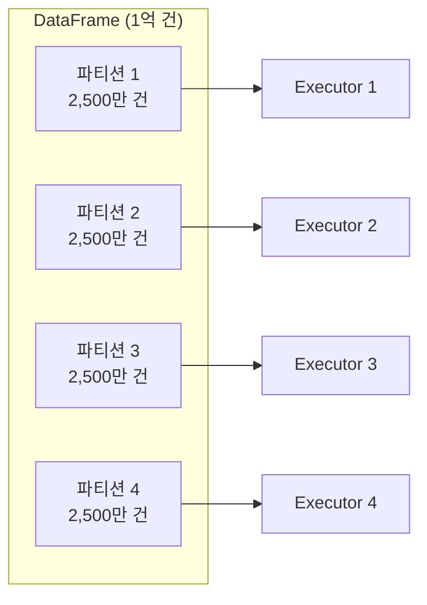

# Apache Spark 기초

## Apache Spark란?

> 💡 **Apache Spark**는 대용량 데이터를 여러 대의 컴퓨터에 분산하여 **동시에 빠르게 처리**할 수 있는 오픈소스 분산 컴퓨팅 엔진입니다.

### 비유로 이해하기

1,000페이지짜리 책에서 "데이터"라는 단어가 몇 번 나오는지 세야 한다고 가정해 보겠습니다.

- **혼자 세기 (단일 서버)**: 1,000페이지를 처음부터 끝까지 혼자 읽어야 합니다 → 오래 걸립니다
- **10명이 나눠서 세기 (Spark)**: 각 사람이 100페이지씩 맡아서 동시에 세고, 마지막에 결과를 합칩니다 → 10배 빠릅니다

이것이 바로 **분산 처리(Distributed Processing)** 의 핵심 원리이며, Spark가 하는 일입니다.

---

## Spark의 아키텍처: Driver와 Executor

Spark는 **Driver**와 **Executor**라는 두 가지 역할로 구성됩니다.


> 출처: [Apache Spark 공식 문서 — Cluster Mode Overview](https://spark.apache.org/docs/latest/cluster-overview.html)

| 구성 요소 | 역할 | 비유 |
|-----------|------|------|
| **Driver** | 전체 작업을 계획하고, Executor에게 작업을 나눠줍니다. 최종 결과를 수집합니다 | 현장 감독. 누가 무슨 일을 할지 지시합니다 |
| **Executor** | 실제 데이터를 읽고, 변환하고, 계산하는 작업자입니다. 여러 대가 병렬로 동작합니다 | 작업자. 맡은 데이터를 처리하고 결과를 보고합니다 |
| **Cluster Manager** | Driver와 Executor에게 컴퓨팅 리소스(CPU, 메모리)를 할당합니다 | 인사부. 작업자를 배치합니다 |

> 💡 **노드(Node)란?** 클러스터를 구성하는 개별 컴퓨터(또는 가상 머신)를 말합니다. Driver가 실행되는 노드를 **Driver Node**, Executor가 실행되는 노드를 **Worker Node**라고 부릅니다.

---

## Spark의 핵심 개념: DataFrame

Spark에서 데이터를 다루는 가장 기본적인 구조는 **DataFrame**입니다.

> 💡 **DataFrame**은 행(Row)과 열(Column)로 구성된 분산 데이터 구조입니다. 엑셀의 시트나 SQL 테이블과 비슷하게 생겼지만, 내부적으로는 여러 Executor에 데이터가 나뉘어(Partition) 저장되어 있습니다.

```python
# DataFrame 생성 예시
df = spark.createDataFrame([
    ("김철수", 28, "서울", 4500000),
    ("이영희", 34, "부산", 5200000),
    ("박민수", 25, "대구", 3800000),
], ["이름", "나이", "도시", "연봉"])

# DataFrame 내용 확인
df.show()
# +------+---+----+-------+
# |  이름|나이|도시|   연봉|
# +------+---+----+-------+
# |김철수| 28|서울|4500000|
# |이영희| 34|부산|5200000|
# |박민수| 25|대구|3800000|
# +------+---+----+-------+
```

### 파티션(Partition) — 분산의 단위

> 💡 **파티션(Partition)** 이란 DataFrame의 데이터를 물리적으로 나눈 조각입니다. 각 Executor는 하나 이상의 파티션을 담당하여 병렬로 처리합니다.



---

## Transformation과 Action

Spark의 연산은 크게 **Transformation(변환)** 과 **Action(실행)** 으로 나뉩니다. 이 구분은 Spark의 **지연 실행(Lazy Evaluation)** 방식과 직접 관련됩니다.

### Transformation (변환) — "계획 세우기"

데이터를 어떻게 변환할지 **계획만 세우고**, 실제로 실행하지는 않습니다.

```python
# 이 코드들은 아직 실행되지 않습니다 (계획만 세움)
filtered = df.filter(df.나이 >= 30)           # 30세 이상 필터링
selected = filtered.select("이름", "연봉")      # 필요한 컬럼만 선택
sorted_df = selected.orderBy("연봉", ascending=False)  # 연봉 내림차순 정렬
```

### Action (실행) — "계획 실행하기"

실제로 데이터를 처리하고 결과를 반환합니다. Action이 호출되면 그때서야 위의 모든 Transformation이 실행됩니다.

```python
# Action: 이 시점에 위의 모든 변환이 실행됩니다
sorted_df.show()        # 결과를 화면에 출력 (Action!)
sorted_df.count()       # 건수를 반환 (Action!)
sorted_df.collect()     # 전체 데이터를 Driver로 가져옴 (Action!)
sorted_df.write.save()  # 파일로 저장 (Action!)
```

> 💡 **지연 실행(Lazy Evaluation)이란?** Spark가 Transformation을 즉시 실행하지 않고, Action이 호출될 때까지 기다리는 전략입니다. 이렇게 하면 Spark가 전체 실행 계획을 먼저 최적화한 후 실행할 수 있어서, 불필요한 계산을 줄이고 성능을 크게 향상시킬 수 있습니다.

### 주요 Transformation과 Action 목록

| Transformation (변환) | 설명 |
|----------------------|------|
| `filter()` / `where()` | 조건에 맞는 행만 남깁니다 |
| `select()` | 특정 컬럼만 선택합니다 |
| `groupBy()` | 그룹별로 묶습니다 |
| `join()` | 두 DataFrame을 결합합니다 |
| `orderBy()` | 정렬합니다 |
| `withColumn()` | 새 컬럼을 추가하거나 기존 컬럼을 변환합니다 |
| `drop()` | 컬럼을 제거합니다 |
| `distinct()` | 중복을 제거합니다 |

| Action (실행) | 설명 |
|--------------|------|
| `show()` | 결과를 화면에 출력합니다 |
| `count()` | 행 수를 반환합니다 |
| `collect()` | 전체 데이터를 리스트로 반환합니다 |
| `first()` / `head()` | 첫 번째 행을 반환합니다 |
| `write.save()` | 파일이나 테이블로 저장합니다 |
| `display()` | Databricks 노트북에서 시각화와 함께 출력합니다 |

---

## Spark SQL — SQL로 분산 처리하기

Spark의 강력한 장점 중 하나는 **SQL로도 분산 처리가 가능**하다는 것입니다. Python DataFrame API와 SQL을 자유롭게 혼합하여 사용할 수 있습니다.

```python
# DataFrame을 임시 뷰로 등록
df.createOrReplaceTempView("employees")

# SQL로 분석
result = spark.sql("""
    SELECT
        도시,
        COUNT(*) AS 인원수,
        AVG(연봉) AS 평균연봉
    FROM employees
    GROUP BY 도시
    ORDER BY 평균연봉 DESC
""")

result.show()
```

Databricks에서는 `%sql` 매직 커맨드를 사용하여 노트북 셀에서 직접 SQL을 실행할 수도 있습니다.

```sql
%sql
SELECT 도시, COUNT(*) AS 인원수, AVG(연봉) AS 평균연봉
FROM employees
GROUP BY 도시
ORDER BY 평균연봉 DESC
```

---

## 실습: 기본 데이터 처리

```python
from pyspark.sql.functions import col, sum, avg, count, when, upper

# 1. 데이터 읽기 (Delta 테이블에서)
orders = spark.read.table("catalog.schema.orders")

# 2. 필터링: 완료된 주문만
completed = orders.filter(col("status") == "COMPLETED")

# 3. 변환: 새 컬럼 추가
enriched = completed.withColumn(
    "order_size",
    when(col("amount") >= 100000, "대형")
    .when(col("amount") >= 50000, "중형")
    .otherwise("소형")
)

# 4. 집계: 주문 크기별 통계
summary = enriched.groupBy("order_size").agg(
    count("*").alias("주문건수"),
    sum("amount").alias("총매출"),
    avg("amount").alias("평균주문액")
)

# 5. 결과 출력
display(summary)

# 6. 결과를 Delta 테이블로 저장
summary.write.format("delta") \
    .mode("overwrite") \
    .saveAsTable("catalog.schema.order_summary")
```

---

## Databricks에서의 Spark

Databricks에서 Spark를 사용할 때 알아두면 좋은 점들을 정리하겠습니다.

| 항목 | 설명 |
|------|------|
| **자동 설정** | 클러스터를 생성하면 Spark가 자동으로 구성됩니다. 별도 설치가 필요 없습니다 |
| **spark 변수** | 노트북에서 `spark` 변수가 자동으로 사용 가능합니다 |
| **Photon 엔진** | Databricks 전용 고성능 엔진으로, Spark SQL 쿼리를 자동으로 가속합니다 |
| **Adaptive Query Execution** | 실행 중에 자동으로 쿼리 계획을 최적화합니다 |
| **display() 함수** | Databricks 전용 함수로, `show()` 대신 시각화와 함께 결과를 표시합니다 |

> 🆕 **Databricks Runtime 18.x**: 최신 Databricks Runtime은 **Apache Spark 4.1.0**을 기반으로 하며, 성능 개선과 새로운 기능들이 포함되어 있습니다. 클러스터 생성 시 최신 Runtime을 선택하시면 최적의 성능을 경험하실 수 있습니다.

---

## 정리

| 핵심 개념 | 설명 |
|-----------|------|
| **Apache Spark** | 대용량 데이터를 분산 처리하는 오픈소스 엔진입니다 |
| **Driver** | 작업을 계획하고 지휘하는 프로세스입니다 |
| **Executor** | 실제 데이터를 처리하는 작업자 프로세스입니다 |
| **DataFrame** | 분산 환경에서 데이터를 다루는 기본 구조입니다 |
| **Partition** | DataFrame을 물리적으로 나눈 단위. 병렬 처리의 기본 단위입니다 |
| **Lazy Evaluation** | Transformation은 계획만 세우고, Action 호출 시 실행합니다 |

다음 문서에서는 Spark를 실행하는 컴퓨팅 리소스인 **클러스터**의 종류와 설정 방법을 살펴보겠습니다.

---

## 참고 링크

- [Databricks: Apache Spark on Databricks](https://docs.databricks.com/aws/en/spark/)
- [Azure Databricks: Apache Spark](https://learn.microsoft.com/en-us/azure/databricks/spark/)
- [Apache Spark Official](https://spark.apache.org/)
