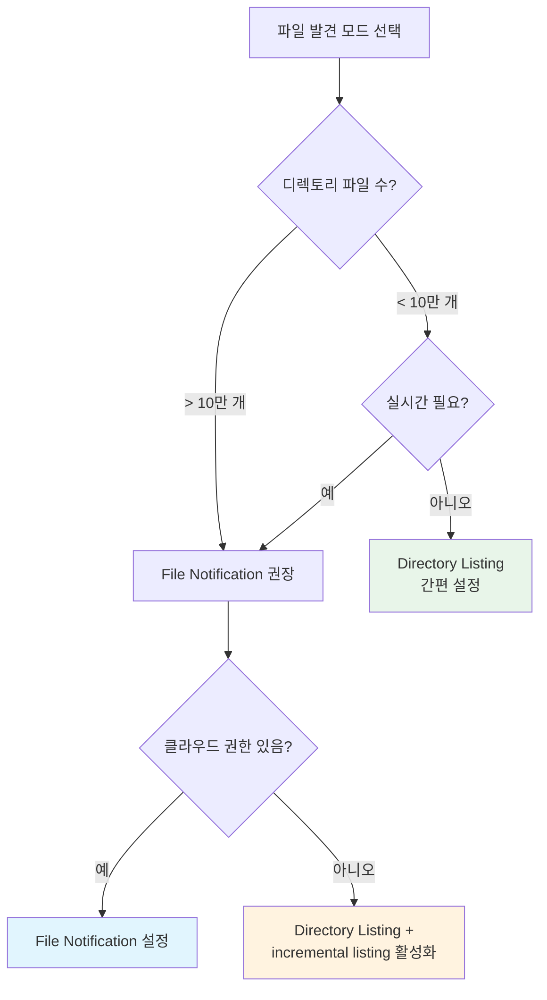

# Auto Loader 주요 옵션

## 왜 옵션 설정이 중요한가?

Auto Loader는 기본 설정만으로도 동작하지만, 프로덕션 환경에서는 **파일 발견 모드, 스키마 처리, 에러 핸들링, 성능 튜닝** 등을 세밀하게 조정해야 합니다. 잘못된 옵션 설정은 데이터 유실, 성능 저하, 예상치 못한 비용 증가로 이어질 수 있습니다.

> 💡 **Auto Loader 옵션 체계**: 모든 Auto Loader 옵션은 `cloudFiles.` 접두사로 시작합니다 (예: `cloudFiles.format`, `cloudFiles.schemaLocation`). 포맷별 옵션(예: CSV의 `header`, JSON의 `multiLine`)은 접두사 없이 사용합니다.

---

## 파일 발견 모드

Auto Loader가 새 파일을 감지하는 방식에는 **Directory Listing**과 **File Notification** 두 가지가 있습니다.

### 모드 비교

| 구분 | Directory Listing | File Notification |
|------|-------------------|-------------------|
| **동작 방식** | 디렉토리를 주기적으로 스캔합니다 | 클라우드 이벤트 알림을 수신합니다 |
| **설정 난이도** | 추가 설정 없음 (기본값) | 클라우드 이벤트 서비스 설정 필요 |
| **비용** | 대규모 디렉토리에서 API 호출 비용 발생 | 이벤트 서비스 비용 (매우 저렴) |
| **지연 시간** | 스캔 주기에 따라 다름 | 거의 실시간 (수 초) |
| **대규모 디렉토리** | 파일이 많으면 스캔 시간 증가 | 파일 수에 무관하게 빠름 |
| **적합한 시나리오** | 소규모~중규모 디렉토리, 빠른 시작 | 대규모 디렉토리, 실시간 요구 |

### Directory Listing 모드 (기본값)

```python
df = (spark.readStream
    .format("cloudFiles")
    .option("cloudFiles.format", "json")
    .option("cloudFiles.useNotifications", "false")  # 기본값
    .load("s3://bucket/data/")
)
```

### File Notification 모드

```python
df = (spark.readStream
    .format("cloudFiles")
    .option("cloudFiles.format", "json")
    .option("cloudFiles.useNotifications", "true")
    # AWS SQS 기반 알림 (자동 설정)
    .option("cloudFiles.region", "ap-northeast-2")
    .load("s3://bucket/data/")
)
```

> 💡 **자동 리소스 프로비저닝**: File Notification 모드를 처음 사용하면 Auto Loader가 자동으로 클라우드 이벤트 알림 인프라(AWS: SQS+SNS, Azure: Event Grid+Queue)를 생성합니다. 적절한 IAM 권한이 필요합니다.

### 모드 선택 기준



> ⚠️ **Incremental Listing**: Directory Listing 모드에서 `cloudFiles.useIncrementalListing`을 `true`로 설정하면, 이전 스캔 이후 수정된 파일만 확인하여 성능을 크게 개선할 수 있습니다. 단, 파일이 시간순으로 정렬된 디렉토리 구조(예: `/year=2025/month=03/`)에서만 효과적입니다.

---

## 포맷별 옵션 상세

### JSON

```python
df = (spark.readStream
    .format("cloudFiles")
    .option("cloudFiles.format", "json")
    .option("cloudFiles.inferColumnTypes", "true")    # 타입 자동 추론
    .option("cloudFiles.schemaLocation", "s3://bucket/schema/json/")
    .option("multiLine", "true")                      # 여러 줄에 걸친 JSON
    .option("primitivesAsString", "false")             # 숫자를 숫자 타입으로 유지
    .option("allowUnquotedFieldNames", "true")         # 따옴표 없는 필드명 허용
    .option("allowSingleQuotes", "true")               # 작은따옴표 허용
    .load("s3://bucket/json-data/")
)
```

| 옵션 | 기본값 | 설명 |
|------|--------|------|
| `multiLine` | `false` | 하나의 JSON 레코드가 여러 줄에 걸쳐 있을 때 `true`로 설정합니다 |
| `primitivesAsString` | `false` | 모든 기본형을 문자열로 읽을지 여부입니다 |
| `allowUnquotedFieldNames` | `false` | 따옴표 없는 필드명을 허용합니다 |
| `allowSingleQuotes` | `true` | 작은따옴표를 문자열 구분자로 허용합니다 |
| `dateFormat` | `yyyy-MM-dd` | 날짜 파싱 포맷입니다 |
| `timestampFormat` | `yyyy-MM-dd'T'HH:mm:ss` | 타임스탬프 파싱 포맷입니다 |

### CSV

```python
df = (spark.readStream
    .format("cloudFiles")
    .option("cloudFiles.format", "csv")
    .option("cloudFiles.schemaLocation", "s3://bucket/schema/csv/")
    .option("header", "true")                          # 첫 줄을 헤더로 사용
    .option("delimiter", ",")                          # 구분자
    .option("encoding", "UTF-8")                       # 인코딩
    .option("quote", '"')                              # 따옴표 문자
    .option("escape", "\\")                            # 이스케이프 문자
    .option("nullValue", "NULL")                       # NULL 표현 값
    .option("emptyValue", "")                          # 빈 값 표현
    .option("nanValue", "NaN")                         # NaN 표현
    .option("maxColumns", "100")                       # 최대 컬럼 수
    .option("multiLine", "true")                       # 필드 내 줄바꿈 허용
    .load("s3://bucket/csv-data/")
)
```

| 옵션 | 기본값 | 설명 |
|------|--------|------|
| `header` | `false` | 첫 줄을 컬럼 헤더로 사용합니다 |
| `delimiter` | `,` | 필드 구분자입니다. TSV는 `\t`을 사용합니다 |
| `encoding` | `UTF-8` | 파일 인코딩입니다 |
| `quote` | `"` | 필드를 감싸는 따옴표 문자입니다 |
| `escape` | `\` | 따옴표 내 이스케이프 문자입니다 |
| `nullValue` | `""` | NULL로 해석할 문자열입니다 |
| `multiLine` | `false` | 필드 내 줄바꿈을 허용합니다 |
| `inferSchema` | `false` | Auto Loader에서는 `cloudFiles.inferColumnTypes` 사용을 권장합니다 |

### Parquet / Avro

```python
# Parquet (스키마가 파일에 내장되어 있어 옵션이 적습니다)
df_parquet = (spark.readStream
    .format("cloudFiles")
    .option("cloudFiles.format", "parquet")
    .option("cloudFiles.schemaLocation", "s3://bucket/schema/parquet/")
    .load("s3://bucket/parquet-data/")
)

# Avro
df_avro = (spark.readStream
    .format("cloudFiles")
    .option("cloudFiles.format", "avro")
    .option("cloudFiles.schemaLocation", "s3://bucket/schema/avro/")
    .option("avroSchema", avro_schema_json)  # 선택: 명시적 스키마 지정
    .load("s3://bucket/avro-data/")
)
```

### XML

```python
df_xml = (spark.readStream
    .format("cloudFiles")
    .option("cloudFiles.format", "xml")
    .option("cloudFiles.schemaLocation", "s3://bucket/schema/xml/")
    .option("rowTag", "record")              # 레코드를 나타내는 XML 태그
    .option("rootTag", "data")               # 루트 XML 태그
    .load("s3://bucket/xml-data/")
)
```

### Binary (이미지, PDF 등)

```python
df_binary = (spark.readStream
    .format("cloudFiles")
    .option("cloudFiles.format", "binaryFile")
    .option("pathGlobFilter", "*.pdf")
    .load("s3://bucket/documents/")
)
# 결과: path, modificationTime, length, content(binary) 컬럼
```

---

## 스키마 추론 및 진화 옵션

Auto Loader의 가장 강력한 기능 중 하나는 자동 스키마 추론과 스키마 진화입니다.

### 스키마 관련 핵심 옵션

| 옵션 | 설명 | 기본값 |
|------|------|--------|
| `cloudFiles.schemaLocation` | 추론된 스키마를 저장할 경로입니다 (필수 권장) | — |
| `cloudFiles.inferColumnTypes` | 컬럼 타입을 자동 추론합니다 (`false`면 모두 STRING) | `false` |
| `cloudFiles.schemaEvolutionMode` | 스키마 변경 시 동작 방식입니다 | `addNewColumns` |
| `cloudFiles.schemaHints` | 특정 컬럼의 타입을 명시적으로 지정합니다 | — |
| `cloudFiles.allowOverwrites` | 스키마 덮어쓰기를 허용합니다 | `false` |

### 스키마 진화 모드 (schemaEvolutionMode)

| 모드 | 동작 | 사용 시나리오 |
|------|------|---------------|
| `addNewColumns` | 새 컬럼이 감지되면 자동으로 추가합니다 | 소스 스키마가 점진적으로 확장되는 경우 |
| `rescue` | 새 컬럼을 `_rescued_data`에 저장합니다 | 스키마 변경을 수동으로 검토하고 싶은 경우 |
| `failOnNewColumns` | 새 컬럼 감지 시 스트림을 중단합니다 | 스키마가 엄격하게 통제되어야 하는 경우 |
| `none` | 스키마 진화를 비활성화합니다 | 고정된 스키마로 운영하는 경우 |

```python
# 스키마 진화 설정 예제
df = (spark.readStream
    .format("cloudFiles")
    .option("cloudFiles.format", "json")
    .option("cloudFiles.schemaLocation", "s3://bucket/schema/orders/")
    .option("cloudFiles.inferColumnTypes", "true")
    .option("cloudFiles.schemaEvolutionMode", "addNewColumns")
    # 특정 컬럼 타입 힌트
    .option("cloudFiles.schemaHints",
            "order_id BIGINT, amount DECIMAL(12,2), order_date TIMESTAMP")
    .load("s3://bucket/orders/")
)
```

> 💡 **schemaHints 활용**: 자동 추론이 부정확한 컬럼(예: ID가 BIGINT인데 STRING으로 추론)에 대해 힌트를 제공하면, 추론 결과를 덮어쓸 수 있습니다.

---

## 체크포인트 관리

Auto Loader는 **체크포인트(Checkpoint)** 를 통해 어떤 파일을 이미 처리했는지 추적합니다.

> 💡 **체크포인트**란 Structured Streaming이 진행 상태를 기록하는 저장소입니다. 스트림이 재시작되면 체크포인트에서 마지막 처리 위치를 읽어 이어서 처리합니다.

| 옵션 | 설명 |
|------|------|
| `checkpointLocation` | 체크포인트를 저장할 경로입니다 (writeStream에서 설정) |
| `cloudFiles.schemaLocation` | 스키마 정보를 저장할 경로입니다 |
| `cloudFiles.backfillInterval` | 주기적으로 누락된 파일을 재스캔하는 간격입니다 |

```python
# 체크포인트와 함께 전체 파이프라인 설정
(df.writeStream
    .option("checkpointLocation", "s3://bucket/checkpoints/orders/")
    .option("mergeSchema", "true")    # 스키마 변경 시 자동 병합
    .trigger(availableNow=True)       # 현재 사용 가능한 파일만 처리
    .toTable("catalog.bronze.orders")
)
```

> ⚠️ **체크포인트 삭제 주의**: 체크포인트를 삭제하면 처리 상태가 초기화되어 모든 파일을 처음부터 다시 처리하게 됩니다. 데이터 중복이 발생할 수 있으므로, `MERGE` 또는 멱등 처리 로직을 사용해야 합니다.

---

## 파일 필터링

### 경로 기반 필터링

| 옵션 | 설명 | 예시 |
|------|------|------|
| `pathGlobFilter` | 파일 이름 패턴으로 필터링합니다 | `*.json`, `orders_*.csv` |
| `recursiveFileLookup` | 하위 디렉토리를 재귀적으로 탐색합니다 | `true` / `false` |
| `cloudFiles.includeExistingFiles` | 기존 파일도 처리할지 여부입니다 | `true` (기본값) |

### 시간 기반 필터링

| 옵션 | 설명 | 예시 |
|------|------|------|
| `modifiedAfter` | 지정 시간 이후 수정된 파일만 처리합니다 | `2025-01-01T00:00:00Z` |
| `modifiedBefore` | 지정 시간 이전 수정된 파일만 처리합니다 | `2025-03-31T23:59:59Z` |

```python
# 2025년 이후 JSON 파일만 처리
df = (spark.readStream
    .format("cloudFiles")
    .option("cloudFiles.format", "json")
    .option("pathGlobFilter", "*.json")
    .option("modifiedAfter", "2025-01-01T00:00:00Z")
    .option("recursiveFileLookup", "true")
    .load("s3://bucket/data/")
)
```

---

## 성능 튜닝 옵션

| 옵션 | 설명 | 기본값 | 권장값 |
|------|------|--------|--------|
| `cloudFiles.maxFilesPerTrigger` | 트리거당 처리할 최대 파일 수입니다 | 1000 | 워크로드에 따라 조정 |
| `cloudFiles.maxBytesPerTrigger` | 트리거당 처리할 최대 바이트 수입니다 | — | `10g` (대용량 파일) |
| `cloudFiles.useIncrementalListing` | 증분 디렉토리 리스팅을 사용합니다 | `auto` | 파티션 디렉토리에서 `true` |
| `cloudFiles.fetchParallelism` | 파일 목록 조회 병렬도입니다 | 1 | 대규모 디렉토리: 4~8 |

```python
# 성능 최적화 예제
df = (spark.readStream
    .format("cloudFiles")
    .option("cloudFiles.format", "parquet")
    .option("cloudFiles.maxFilesPerTrigger", "500")
    .option("cloudFiles.maxBytesPerTrigger", "5g")
    .option("cloudFiles.useIncrementalListing", "true")
    .option("cloudFiles.fetchParallelism", "4")
    .load("s3://bucket/large-dataset/")
)
```

> 💡 **Trigger 모드와 성능**: `trigger(availableNow=True)`를 사용하면 현재 도착한 모든 파일을 배치 단위로 처리합니다. `maxFilesPerTrigger`와 함께 사용하면 각 마이크로배치의 크기를 제어할 수 있습니다.

---

## 에러 처리

데이터 품질 문제를 우아하게 처리하기 위한 옵션들입니다.

| 옵션 | 설명 | 권장 |
|------|------|------|
| `rescuedDataColumn` | 스키마에 맞지 않는 데이터를 별도 컬럼에 보존합니다 | `_rescued_data` |
| `badRecordsPath` | 파싱 실패한 레코드를 별도 경로에 저장합니다 | 프로덕션에서 설정 권장 |
| `columnNameOfCorruptRecord` | 손상된 레코드를 담을 컬럼 이름입니다 | `_corrupt_record` |
| `ignoreCorruptFiles` | 손상된 파일을 건너뛰고 계속 처리합니다 | 프로덕션에서 `true` |
| `ignoreMissingFiles` | 처리 중 삭제된 파일을 무시합니다 | `true` |

```python
# 에러 처리가 포함된 프로덕션 설정
df = (spark.readStream
    .format("cloudFiles")
    .option("cloudFiles.format", "json")
    .option("cloudFiles.schemaLocation", "s3://bucket/schema/orders/")
    .option("cloudFiles.inferColumnTypes", "true")
    .option("cloudFiles.schemaEvolutionMode", "addNewColumns")
    # 에러 처리
    .option("rescuedDataColumn", "_rescued_data")
    .option("badRecordsPath", "s3://bucket/bad-records/orders/")
    .option("ignoreCorruptFiles", "true")
    .option("ignoreMissingFiles", "true")
    .load("s3://bucket/raw/orders/")
)
```

---

## 메타데이터 컬럼

Auto Loader는 수집된 파일의 메타데이터를 자동으로 제공합니다. 데이터 리니지 추적과 디버깅에 매우 유용합니다.

| 메타데이터 | 설명 |
|-----------|------|
| `_metadata.file_path` | 소스 파일의 전체 경로입니다 |
| `_metadata.file_name` | 파일 이름입니다 |
| `_metadata.file_size` | 파일 크기(바이트)입니다 |
| `_metadata.file_modification_time` | 파일의 마지막 수정 시간입니다 |
| `_metadata.file_block_start` | 블록 시작 위치입니다 |
| `_metadata.file_block_length` | 블록 길이입니다 |

```sql
-- SDP(선언적 파이프라인)에서 메타데이터 활용
CREATE OR REFRESH STREAMING TABLE bronze_orders
AS SELECT
    *,
    _metadata.file_path AS _source_file,
    _metadata.file_name AS _source_file_name,
    _metadata.file_size AS _source_file_size,
    _metadata.file_modification_time AS _file_modified_at,
    current_timestamp() AS _ingested_at
FROM STREAM read_files(
    's3://bucket/data/',
    format => 'json',
    inferColumnTypes => true,
    rescuedDataColumn => '_rescued_data'
);
```

---

## 옵션 설정 종합 가이드

### 시나리오별 권장 설정

| 시나리오 | 핵심 옵션 |
|----------|-----------|
| **소규모 JSON 수집** | `format=json`, `inferColumnTypes=true`, `schemaLocation` |
| **대규모 CSV (수백만 파일)** | `useNotifications=true`, `maxFilesPerTrigger=1000`, `useIncrementalListing=true` |
| **스키마 자주 변경** | `schemaEvolutionMode=addNewColumns`, `rescuedDataColumn` |
| **엄격한 스키마 관리** | `schemaEvolutionMode=failOnNewColumns`, 명시적 스키마 지정 |
| **데이터 품질 중요** | `rescuedDataColumn`, `badRecordsPath`, `ignoreCorruptFiles=true` |

---

## 정리

| 옵션 카테고리 | 핵심 포인트 |
|---------------|-------------|
| **파일 발견** | 소규모는 Directory Listing, 대규모는 File Notification을 사용합니다 |
| **포맷 옵션** | JSON/CSV는 파싱 옵션이 많고, Parquet/Avro는 스키마 내장으로 간편합니다 |
| **스키마 진화** | `schemaEvolutionMode`로 새 컬럼 대응 전략을 결정합니다 |
| **에러 처리** | `rescuedDataColumn`과 `badRecordsPath`로 데이터 유실을 방지합니다 |
| **성능 튜닝** | `maxFilesPerTrigger`, `useIncrementalListing`으로 처리량을 조절합니다 |

---

## 참고 링크

- [Databricks: Auto Loader options](https://docs.databricks.com/aws/en/ingestion/auto-loader/options.html)
- [Databricks: Auto Loader schema inference](https://docs.databricks.com/aws/en/ingestion/auto-loader/schema.html)
- [Databricks: Auto Loader file notification mode](https://docs.databricks.com/aws/en/ingestion/auto-loader/file-notification-mode.html)
- [Databricks: Auto Loader production best practices](https://docs.databricks.com/aws/en/ingestion/auto-loader/production.html)
