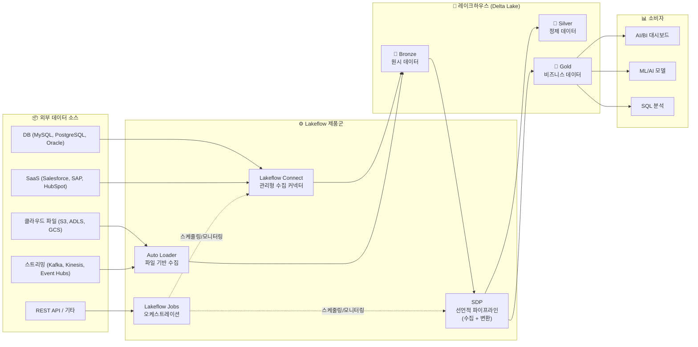
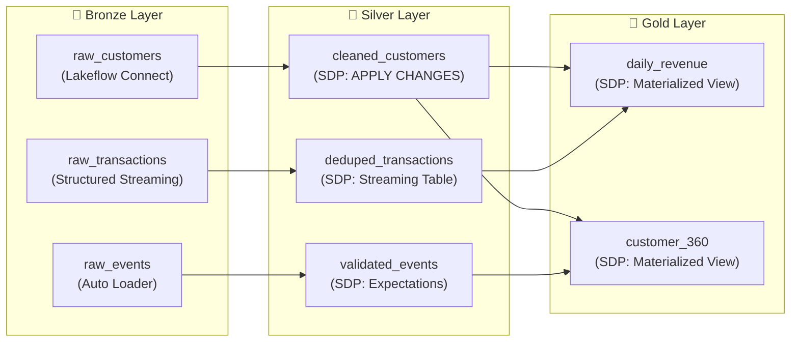
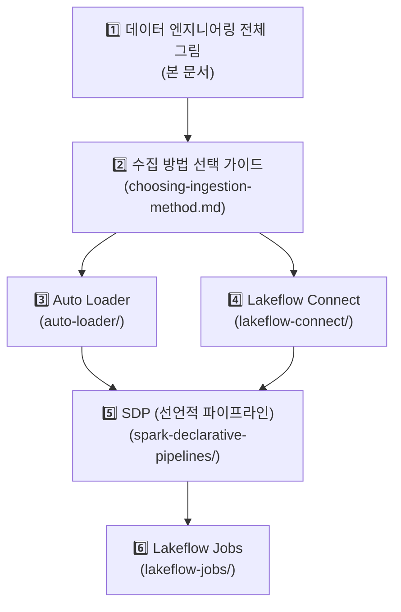

# 데이터 엔지니어링 전체 그림

## 왜 데이터 엔지니어링이 중요한가요?

데이터 엔지니어링은 **원천 데이터를 비즈니스에서 활용할 수 있는 형태로 변환하는 전체 과정**을 의미합니다. 아무리 좋은 분석 도구나 AI 모델이 있어도, 데이터가 정확하고 시의적절하게 준비되지 않으면 아무 소용이 없습니다.

데이터 엔지니어링 파이프라인은 다음과 같은 역할을 수행합니다:

1. **수집(Ingestion)**: 다양한 소스에서 데이터를 가져옵니다
2. **변환(Transformation)**: 원시 데이터를 정제하고 비즈니스 로직을 적용합니다
3. **오케스트레이션(Orchestration)**: 수집과 변환 작업을 자동으로 스케줄링하고 관리합니다
4. **품질 관리(Quality)**: 데이터가 정확하고 완전한지 검증합니다
5. **모니터링(Monitoring)**: 파이프라인이 정상적으로 동작하는지 관찰합니다

> 💡 **비유**: 데이터 엔지니어링은 "정수 시설"과 비슷합니다. 강이나 호수에서 원수(Raw Data)를 가져와서, 여러 단계의 정화 과정(변환)을 거쳐, 가정(분석/AI)에서 바로 마실 수 있는 깨끗한 물(정제된 데이터)로 만드는 것입니다.

---

## Databricks의 데이터 엔지니어링 도구 전체 맵

Databricks에서 데이터 엔지니어링은 **Lakeflow**라는 통합 제품 브랜드 아래에서 제공됩니다. 수집부터 변환, 오케스트레이션까지 데이터 파이프라인의 전체 라이프사이클을 지원합니다.



---

## Lakeflow 브랜드 체계

Databricks는 2024년부터 데이터 엔지니어링 관련 제품들을 **Lakeflow**라는 하나의 브랜드로 통합하였습니다. 이전에 각각 별도의 이름으로 불리던 도구들이 체계적으로 정리되었습니다.

| Lakeflow 구성 요소 | 이전 이름 / 별칭 | 역할 | 핵심 가치 |
|-------------------|-----------------|------|----------|
| **Lakeflow Connect** | (신규) | 외부 DB/SaaS에서 관리형 수집 | 코드 없이 CDC 수집 자동화 |
| **Lakeflow Declarative Pipelines (SDP)** | Delta Live Tables (DLT) | 선언적 변환 파이프라인 | "무엇을"만 정의하면 "어떻게"는 자동 |
| **Lakeflow Jobs** | Databricks Workflows | 워크플로 오케스트레이션 | 스케줄링, 의존성 관리, 모니터링 |
| **Auto Loader** | Auto Loader (변경 없음) | 클라우드 파일 증분 수집 | 새 파일 자동 감지, 스키마 진화 |

> ⚠️ **용어 참고**: Delta Live Tables(DLT)는 현재 **Spark Declarative Pipelines(SDP)** 또는 **Lakeflow Declarative Pipelines**로 명칭이 변경되었습니다. 기존 문서나 블로그에서 DLT라는 이름이 등장하면 SDP와 동일한 것으로 이해하시면 됩니다.

---

## 각 구성 요소의 역할 상세

### Lakeflow Connect — 관리형 데이터 수집

외부 데이터베이스(MySQL, PostgreSQL, Oracle)와 SaaS 애플리케이션(Salesforce, Workday, HubSpot 등)에서 **코드 작성 없이 데이터를 자동으로 수집**합니다.

- **초기 스냅샷**: 소스 테이블의 전체 데이터를 한 번 복사합니다
- **CDC(Change Data Capture)**: 이후 변경된 데이터만 실시간으로 반영합니다
- **스키마 진화**: 소스에서 컬럼이 추가/변경되면 자동으로 대상 테이블에 반영합니다

### Auto Loader — 파일 기반 증분 수집

클라우드 스토리지(S3, ADLS, GCS)에 도착하는 새 파일을 **자동으로 감지하고 증분 수집**합니다.

- **파일 알림 모드**: 클라우드 이벤트(SNS/SQS, Event Grid)를 활용하여 새 파일을 즉시 감지합니다
- **디렉토리 리스팅 모드**: 주기적으로 디렉토리를 스캔하여 새 파일을 찾습니다
- **스키마 추론/진화**: JSON, CSV 등의 포맷에서 스키마를 자동으로 추론하고 변경을 감지합니다

### SDP (Spark Declarative Pipelines) — 선언적 변환

**"무엇을 만들지"만 선언하면 실행 계획, 의존성 관리, 증분 처리를 자동으로 관리**하는 파이프라인 프레임워크입니다.

- **Streaming Table**: 실시간 증분 처리에 적합한 테이블 형태입니다
- **Materialized View**: 전체 데이터를 주기적으로 재계산하는 뷰입니다
- **Expectations**: 데이터 품질 규칙을 파이프라인에 내장하여 불량 데이터를 자동으로 감지합니다

### Lakeflow Jobs — 워크플로 오케스트레이션

다양한 태스크(노트북, Python, SQL, SDP 파이프라인 등)를 **DAG(Directed Acyclic Graph) 형태로 조합하여 스케줄링하고 모니터링**합니다.

- **다양한 트리거**: 크론 스케줄, 파일 도착, API 호출, 연속 실행 등
- **의존성 관리**: 태스크 간 실행 순서를 그래프로 정의합니다
- **재시도 및 알림**: 실패 시 자동 재시도, 이메일/Slack 알림을 지원합니다

---

## Medallion 아키텍처와의 관계

Databricks의 데이터 엔지니어링 도구들은 **Medallion 아키텍처**(Bronze → Silver → Gold)와 자연스럽게 연결됩니다.

> 💡 **Medallion 아키텍처**는 데이터를 품질과 정제 수준에 따라 3개 계층으로 분류하는 설계 패턴입니다. 자세한 내용은 [03-lakehouse-architecture](../03-lakehouse-architecture/) 섹션을 참고하시기 바랍니다.

| 계층 | 역할 | 담당 도구 | 데이터 특성 |
|------|------|----------|-----------|
| **Bronze** (원시) | 소스에서 있는 그대로 수집 | Auto Loader, Lakeflow Connect | 원본 그대로, 삭제 없음, 감사 목적 |
| **Silver** (정제) | 정제, 중복 제거, 타입 변환 | SDP (Streaming Table, APPLY CHANGES) | 정규화됨, 비즈니스 키 기준 최신화 |
| **Gold** (비즈니스) | 집계, KPI, 비즈니스 뷰 | SDP (Materialized View) | 비즈니스 목적에 최적화, 소비 가능 |



---

## 서버리스 컴퓨트와 데이터 엔지니어링

Databricks의 데이터 엔지니어링 도구들은 **서버리스 컴퓨트(Serverless Compute)** 위에서 실행할 수 있습니다. 서버리스를 사용하면 클러스터를 직접 관리할 필요 없이 자동으로 리소스가 할당됩니다.

| 도구 | 서버리스 지원 | 이점 |
|------|:------------:|------|
| **Lakeflow Connect** | ✅ 기본값 | 항상 서버리스로 실행, 인프라 관리 불필요 |
| **SDP** | ✅ 지원 | 파이프라인 실행 시 자동 스케일링 |
| **Lakeflow Jobs** | ✅ 지원 | 잡 실행 시 빠른 시작, 자동 스케일링 |
| **Auto Loader** | ✅ 지원 (SDP/Jobs 내) | SDP 또는 Jobs의 서버리스 컴퓨트 활용 |

> 💡 **서버리스의 장점**: 클러스터 시작 대기 시간이 수초 이내로 줄어들고, 사용한 만큼만 과금되며, 인프라 관리(패치, 스케일링 등)가 완전히 자동화됩니다.

---

## 데이터 품질 관리 개요

데이터 엔지니어링에서 **데이터 품질 관리**는 선택이 아닌 필수입니다. Databricks는 여러 레벨에서 품질을 관리할 수 있는 도구를 제공합니다.

| 품질 관리 방법 | 도구 | 적용 시점 | 설명 |
|--------------|------|---------|------|
| **Expectations** | SDP | 수집/변환 시 | 파이프라인 내에서 선언적 품질 규칙 적용 |
| **Unity Catalog Monitor** | Lakehouse Monitoring | 테이블 레벨 | 데이터 프로파일링, 드리프트 감지, 이상 탐지 |
| **SQL 제약조건** | Delta Lake | 테이블 레벨 | NOT NULL, CHECK 제약조건 |
| **커스텀 검증** | Lakeflow Jobs | 파이프라인 후 | Python/SQL로 비즈니스 규칙 검증 |

```sql
-- SDP Expectations 예시: 데이터 품질 규칙 선언
CREATE OR REFRESH STREAMING TABLE silver_orders (
    CONSTRAINT valid_amount EXPECT (amount > 0) ON VIOLATION DROP ROW,
    CONSTRAINT valid_email EXPECT (email IS NOT NULL) ON VIOLATION FAIL UPDATE
)
AS SELECT * FROM STREAM(bronze_orders);
```

---

## 모니터링 및 관측성(Observability)

파이프라인을 구축한 후에는 지속적인 **모니터링**이 필요합니다. Databricks는 다음과 같은 모니터링 기능을 제공합니다.

| 모니터링 영역 | 도구/기능 | 확인 내용 |
|-------------|----------|----------|
| **파이프라인 실행 상태** | Lakeflow Jobs UI | 성공/실패, 실행 시간, 재시도 횟수 |
| **SDP 파이프라인 메트릭** | SDP Pipeline UI | 처리 건수, 지연 시간, Expectation 위반율 |
| **시스템 테이블** | `system.workflow.job_run_timeline` | 잡 실행 이력, 비용 분석 |
| **알림** | Lakeflow Jobs 알림 | 실패, SLA 위반 시 이메일/Slack/PagerDuty 알림 |
| **데이터 리니지** | Unity Catalog Lineage | 데이터 흐름 추적, 영향 분석 |

> 💡 **시스템 테이블(System Tables)** 은 Databricks 플랫폼의 운영 데이터(잡 실행 이력, 비용, 감사 로그 등)를 Delta 테이블로 제공하는 기능입니다. SQL로 직접 쿼리하여 커스텀 모니터링 대시보드를 만들 수 있습니다.

---

## 비용 최적화 전략

데이터 엔지니어링 파이프라인의 비용을 최적화하기 위한 핵심 전략들입니다.

| 전략 | 설명 | 적용 도구 |
|------|------|----------|
| **서버리스 사용** | 클러스터 대기 비용 제거, 사용한 만큼만 과금 | 모든 Lakeflow 도구 |
| **트리거 배치 모드** | 연속 실행 대신 주기적 트리거로 비용 절감 | Auto Loader, SDP |
| **증분 처리** | 전체 데이터 재처리 대신 변경분만 처리 | Auto Loader, SDP, Lakeflow Connect |
| **적절한 클러스터 크기** | 워크로드에 맞는 클러스터 사이즈 선택 | Lakeflow Jobs |
| **Photon 엔진 활용** | C++ 기반 쿼리 엔진으로 처리 속도 향상 (비용/시간 절감) | SDP, Jobs |
| **파티셔닝/Z-Order** | 불필요한 데이터 스캔 감소 | Delta Lake 테이블 |
| **Liquid Clustering** | 자동 데이터 레이아웃 최적화 | Delta Lake 테이블 |

```sql
-- Liquid Clustering으로 테이블 최적화 (자동 레이아웃)
CREATE TABLE gold_sales
CLUSTER BY (region, sale_date)
AS SELECT * FROM silver_sales_agg;
```

> ⚠️ **비용 모니터링 팁**: `system.billing.usage` 시스템 테이블을 활용하면 파이프라인별 DBU 소비량을 추적하고 비용 이상 징후를 조기에 감지할 수 있습니다.

---

## 학습 로드맵

이 섹션의 문서들을 아래 순서대로 학습하시면 데이터 엔지니어링 전체 흐름을 체계적으로 이해하실 수 있습니다.



| 순서 | 문서 | 핵심 학습 내용 |
|:----:|------|-------------|
| 1 | **본 문서** | 전체 그림 파악, 각 도구의 역할 이해 |
| 2 | [수집 방법 선택 가이드](./choosing-ingestion-method.md) | 상황별 최적 수집 방법 결정 |
| 3 | [Auto Loader](./auto-loader/) | 파일 기반 데이터 수집 마스터 |
| 4 | [Lakeflow Connect](./lakeflow-connect/) | DB/SaaS 관리형 수집 이해 |
| 5 | [SDP (선언적 파이프라인)](./spark-declarative-pipelines/) | 선언적 변환, 데이터 품질 관리 |
| 6 | [Lakeflow Jobs](./lakeflow-jobs/) | 워크플로 오케스트레이션, 스케줄링 |

> 💡 **학습 팁**: 각 도구를 개별적으로 이해한 후, 마지막에 **시나리오 기반으로 여러 도구를 조합**하는 연습을 해보시면 실무 적용력이 크게 향상됩니다.

---

## 정리

Databricks의 데이터 엔지니어링 도구들은 **Lakeflow** 브랜드 아래 체계적으로 구성되어 있습니다:

- **Lakeflow Connect**: 외부 DB/SaaS에서 코드 없이 관리형 수집
- **Auto Loader**: 클라우드 스토리지 파일 자동 증분 수집
- **SDP (Spark Declarative Pipelines)**: 선언적 변환 파이프라인 + 데이터 품질
- **Lakeflow Jobs**: 전체 워크플로 오케스트레이션 및 스케줄링

이 도구들을 Medallion 아키텍처와 결합하면, 원시 데이터부터 비즈니스 인사이트까지 **안정적이고 확장 가능한 데이터 파이프라인**을 구축할 수 있습니다.

---

## 참고 링크

- [Databricks: Data Engineering](https://docs.databricks.com/aws/en/data-engineering)
- [Databricks: Lakeflow Product Page](https://www.databricks.com/product/data-engineering)
- [Databricks: Serverless Compute](https://docs.databricks.com/aws/en/compute/serverless/)
- [Databricks: Lakehouse Monitoring](https://docs.databricks.com/aws/en/lakehouse-monitoring/)
- [Databricks: System Tables](https://docs.databricks.com/aws/en/administration-guide/system-tables/)
- [Databricks Blog: Introducing Lakeflow](https://www.databricks.com/blog/introducing-databricks-lakeflow)
