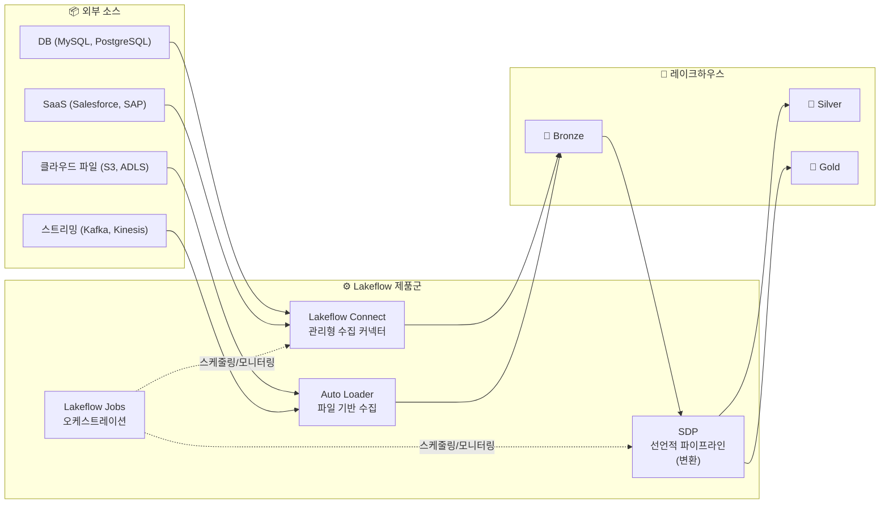
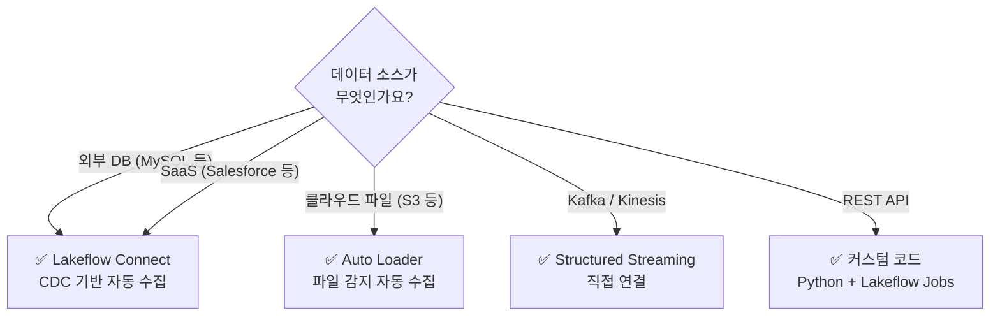

# 데이터 엔지니어링 전체 그림

## Databricks의 데이터 엔지니어링 제품군

Databricks에서 데이터 엔지니어링은 **Lakeflow**라는 제품 브랜드 아래 통합되어 있습니다. 데이터 수집부터 변환, 오케스트레이션까지 전체 파이프라인 라이프사이클을 지원합니다.

---

## 각 구성 요소의 역할

| 구성 요소 | 역할 | 적합한 소스 |
|-----------|------|-----------|
| **Lakeflow Connect** | 외부 DB, SaaS에서 관리형 커넥터로 자동 수집 (CDC 포함) | MySQL, PostgreSQL, Salesforce, SAP 등 |
| **Auto Loader** | 클라우드 스토리지에 도착하는 새 파일을 자동 감지·수집 | S3, ADLS, GCS의 CSV, JSON, Parquet 파일 |
| **SDP (Spark Declarative Pipelines)** | "무엇을" 만들지 선언하면 "어떻게"는 자동 처리. 변환 파이프라인 구축 | Bronze → Silver → Gold 변환 |
| **Lakeflow Jobs** | 파이프라인과 작업을 스케줄링, 의존성 관리, 모니터링 | 모든 워크로드의 오케스트레이션 |

---

## 수집 방법 선택 가이드

> 🆕 **최신 커넥터**: Databricks는 지속적으로 Lakeflow Connect 커넥터를 추가하고 있습니다. 최근 HubSpot, TikTok Ads, Google Ads, Zendesk, Workday HCM, SFTP 등의 커넥터가 베타/프리뷰로 출시되었습니다.

---

## 정리

각 하위 섹션에서 Auto Loader, SDP, Lakeflow Connect, Lakeflow Jobs를 하나씩 자세히 다루겠습니다.

---

## 참고 링크

- [Databricks: Data Engineering](https://docs.databricks.com/aws/en/data-engineering)
- [Databricks: Lakeflow](https://www.databricks.com/product/data-engineering)
