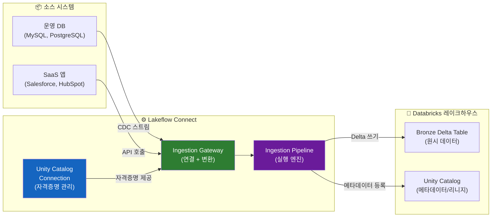

# Lakeflow Connect란?

## 왜 Lakeflow Connect가 필요한가요?

기업의 데이터는 운영 데이터베이스(MySQL, PostgreSQL, Oracle)와 SaaS 애플리케이션(Salesforce, SAP, HubSpot)에 흩어져 있습니다. 이 데이터를 분석용 레이크하우스로 가져오려면 전통적으로 다음과 같은 과정이 필요했습니다:

1. 소스 시스템에 연결하는 코드 작성
2. 초기 전체 데이터 복사(Full Load)
3. 이후 변경된 데이터만 추적하는 CDC 로직 구현
4. 스키마 변경 감지 및 대응
5. 오류 처리, 재시도, 모니터링 구현

이 과정은 수주~수개월이 걸리며, 지속적인 유지보수도 필요합니다. **Lakeflow Connect는 이 모든 과정을 자동화하여 코드 없이 몇 번의 클릭만으로 데이터 수집 파이프라인을 구성**할 수 있게 해줍니다.

> 💡 **Lakeflow Connect**는 외부 데이터 소스(데이터베이스, SaaS 애플리케이션)에서 Databricks 레이크하우스로 데이터를 **자동으로 수집하는 관리형 커넥터** 서비스입니다. Fivetran, Airbyte 같은 데이터 통합(ELT) 도구와 유사한 역할을 하지만, Databricks 플랫폼에 네이티브로 통합되어 있습니다.

> 💡 **CDC(Change Data Capture)** 란 소스 데이터베이스에서 발생하는 INSERT, UPDATE, DELETE 등의 변경 사항을 실시간으로 캡처하여 대상 시스템에 반영하는 기술입니다. 전체 데이터를 매번 다시 복사하는 것보다 훨씬 효율적이며, 소스 시스템에 대한 부하도 최소화합니다.

---

## 지원 소스 시스템 상세

Lakeflow Connect는 지속적으로 새로운 커넥터를 추가하고 있습니다. 아래는 주요 지원 소스 목록입니다.

### 데이터베이스 커넥터

| 소스 | 지원 상태 | CDC 방식 | 비고 |
|------|:--------:|---------|------|
| **MySQL** | GA | Binlog 기반 | MySQL 5.7+, MariaDB 지원 |
| **PostgreSQL** | GA | Logical Replication | PostgreSQL 10+ |
| **SQL Server** | GA | CT(Change Tracking) / CDC | SQL Server 2016+ |
| **Oracle** | Public Preview | LogMiner | Oracle 12c+ |
| **MongoDB** | Public Preview | Change Streams | MongoDB 4.0+ |

### SaaS 커넥터

| 소스 | 지원 상태 | 수집 방식 | 비고 |
|------|:--------:|---------|------|
| **Salesforce** | GA | API 폴링 (Bulk API) | Sales Cloud, Service Cloud |
| **ServiceNow** | GA | Table API | ITSM 데이터 수집 |
| **Google Analytics** | Public Preview | Reporting API | GA4 지원 |
| **Workday HCM** | Beta | RAAS API | 인사 데이터 |
| **HubSpot** | Beta | REST API | 마케팅/영업 데이터 |
| **TikTok Ads** | Beta | Reporting API | 광고 성과 데이터 |
| **Google Ads** | Beta | Google Ads API | 광고 캠페인 데이터 |
| **Zendesk** | Beta | REST API | 고객 지원 데이터 |
| **NetSuite** | Beta | SuiteQL | ERP 데이터 |
| **Dynamics 365** | Beta | OData API | CRM/ERP 데이터 |

### 파일/기타 커넥터

| 소스 | 지원 상태 | 수집 방식 | 비고 |
|------|:--------:|---------|------|
| **SFTP** | Public Preview | 파일 폴링 | CSV, JSON 등 파일 수집 |
| **Google Sheets** | GA | Sheets API | 스프레드시트 동기화 |
| **SharePoint** | Beta | Graph API | 문서/리스트 데이터 |

> 🆕 **최신 동향**: Databricks는 매 릴리즈마다 새로운 커넥터를 추가하고 있습니다. 최신 지원 소스 목록은 [공식 문서](https://docs.databricks.com/aws/en/lakeflow-connect/)에서 확인하실 수 있습니다.

---

## 아키텍처: 전체 동작 흐름

Lakeflow Connect의 전체 아키텍처는 다음과 같이 구성됩니다.



### 주요 구성 요소

| 구성 요소 | 역할 | 설명 |
|----------|------|------|
| **Unity Catalog Connection** | 자격증명 관리 | 소스 시스템 접속 정보를 안전하게 저장하고, Secret으로 비밀번호를 관리합니다 |
| **Ingestion Gateway** | 연결 및 변환 | 소스에서 데이터를 읽어 Delta 포맷으로 변환합니다. 네트워크 연결 및 인증을 처리합니다 |
| **Ingestion Pipeline** | 실행 엔진 | 실제 데이터 수집을 실행하는 서버리스 컴퓨트 엔진입니다. 스케줄링과 상태 관리를 담당합니다 |

---

## 초기 스냅샷 vs CDC 증분 동기화

Lakeflow Connect의 수집은 크게 두 단계로 이루어집니다.

### 1단계: 초기 스냅샷 (Initial Snapshot)

처음 파이프라인을 시작하면, 소스 테이블의 **전체 데이터를 한 번 복사**합니다.

```
소스 테이블 (MySQL)              대상 테이블 (Delta)
┌──────────────────┐           ┌──────────────────┐
│ id │ name │ city │    →→→    │ id │ name │ city │
│  1 │ Kim  │ Seoul│  전체복사  │  1 │ Kim  │ Seoul│
│  2 │ Lee  │ Busan│           │  2 │ Lee  │ Busan│
│  3 │ Park │ Daegu│           │  3 │ Park │ Daegu│
└──────────────────┘           └──────────────────┘
```

### 2단계: CDC 증분 수집 (Incremental CDC)

초기 스냅샷 이후에는 소스에서 **변경된 데이터(INSERT, UPDATE, DELETE)만 실시간으로 반영**합니다.

```
소스에서 변경 발생:
  - INSERT: id=4, Park, Incheon (신규)
  - UPDATE: id=2, Lee, Seoul (도시 변경)
  - DELETE: id=3 (삭제)

CDC 스트림으로 변경분만 전달:
┌──────────────────────────────────┐
│ op   │ id │ name │ city    │ ts  │
│ INSERT│  4 │ Park │ Incheon │ ... │
│ UPDATE│  2 │ Lee  │ Seoul   │ ... │
│ DELETE│  3 │      │         │ ... │
└──────────────────────────────────┘

대상 테이블에 반영:
┌──────────────────┐
│ id │ name │ city   │
│  1 │ Kim  │ Seoul  │ (변경 없음)
│  2 │ Lee  │ Seoul  │ (UPDATE 반영)
│  4 │ Park │ Incheon│ (INSERT 반영)
└──────────────────┘  (id=3 DELETE 반영)
```

> 💡 **CDC의 장점**: 전체 데이터를 매번 다시 복사하는 Full Load 방식 대비, CDC는 변경분만 전달하므로 **소스 시스템의 부하가 최소화**되고, **네트워크 트래픽이 크게 줄어들며**, **수집 지연시간이 초 단위로 단축**됩니다.

---

## 스키마 진화(Schema Evolution) 처리

운영 데이터베이스에서는 애플리케이션 업데이트에 따라 스키마가 변경될 수 있습니다. Lakeflow Connect는 이를 자동으로 감지하고 처리합니다.

| 스키마 변경 유형 | Lakeflow Connect 동작 | 대상 테이블 영향 |
|----------------|---------------------|----------------|
| **컬럼 추가** (ADD COLUMN) | 자동으로 대상 테이블에 컬럼 추가 | 기존 행의 새 컬럼은 NULL |
| **컬럼 타입 변경** | 호환 가능한 변경만 자동 처리 | 예: INT → BIGINT 자동 변환 |
| **컬럼 삭제** (DROP COLUMN) | 대상 테이블에서 해당 컬럼 유지 (삭제하지 않음) | 이후 행에서 NULL로 채워짐 |
| **테이블 추가** | 설정에 따라 자동 수집 시작 | 새 Delta 테이블 생성 |

> ⚠️ **비호환 스키마 변경**: 컬럼 타입을 호환되지 않는 형태로 변경하면(예: VARCHAR → INT) 파이프라인이 일시 중지될 수 있습니다. 이 경우 수동으로 대응이 필요합니다.

---

## 에러 처리 및 재시도 메커니즘

Lakeflow Connect는 다양한 장애 상황에 대해 자동으로 대응합니다.

| 장애 유형 | 자동 대응 | 수동 대응 필요 |
|----------|---------|--------------|
| **네트워크 일시 단절** | 자동 재시도 (지수 백오프) | 불필요 |
| **소스 DB 일시 중단** | 재연결 대기 후 자동 재개 | 장시간 중단 시 확인 필요 |
| **자격증명 만료** | 파이프라인 일시 중지 | 자격증명 갱신 후 재시작 |
| **스키마 비호환 변경** | 파이프라인 일시 중지 | 스키마 매핑 수정 후 재시작 |
| **디스크/메모리 부족** | 서버리스 자동 스케일링 | 데이터 볼륨이 극단적인 경우 설정 조정 |
| **중복 데이터** | 체크포인트 기반 중복 방지 | 불필요 (Exactly-once 보장) |

---

## 성능 특성 및 제한사항

### 성능 특성

| 항목 | 수치/특성 |
|------|----------|
| **초기 스냅샷 속도** | 소스 DB 성능과 네트워크에 의존, 일반적으로 수백 GB/시간 |
| **CDC 지연시간** | 일반적으로 수초~수분 |
| **동시 테이블 수** | 파이프라인당 수백 개 테이블 지원 |
| **컴퓨트 타입** | 서버리스 (자동 스케일링) |
| **실행 모드** | 연속(Continuous) 또는 트리거(Triggered) |

### 주요 제한사항

| 제한사항 | 설명 | 대안 |
|---------|------|------|
| 지원되지 않는 소스 | 커넥터 목록에 없는 소스는 사용 불가 | Lakeflow Jobs + 커스텀 코드 |
| 복잡한 변환 | 수집 시 복잡한 변환 로직 불가 | SDP 파이프라인에서 후처리 |
| 소스 DB 버전 요구사항 | 각 DB별 최소 버전 요구 | 소스 DB 업그레이드 |
| 네트워크 연결 | 소스와 Databricks 간 네트워크 연결 필요 | Private Link / VPN 설정 |
| 커스텀 CDC 쿼리 | 특정 행/컬럼 필터링 제한적 | SDP에서 Silver 변환 시 필터 |

---

## 실습 예제: MySQL CDC 파이프라인 설정

### 사전 준비

1. **소스 MySQL 설정**: Binlog가 활성화되어 있어야 합니다
2. **네트워크**: Databricks에서 MySQL에 접속 가능해야 합니다
3. **계정**: `SELECT`, `REPLICATION SLAVE`, `REPLICATION CLIENT` 권한 필요

### Step 1: Unity Catalog Connection 생성

```sql
-- MySQL Connection 생성
CREATE CONNECTION mysql_erp
TYPE MYSQL
OPTIONS (
    host = 'mysql-prod.example.com',
    port = '3306',
    user = 'databricks_cdc',
    password = secret('my-scope', 'mysql-erp-password')
);

-- 연결 테스트 (권한 확인)
-- Catalog Explorer > External Data > Connections에서 "Test Connection" 클릭
```

### Step 2: Ingestion Pipeline 생성 (UI)

1. **Pipelines** 메뉴 → **Create Pipeline** 클릭
2. **Ingestion (Lakeflow Connect)** 선택
3. 소스 유형: **MySQL** 선택
4. Connection: `mysql_erp` 선택
5. 수집할 스키마/테이블 선택
6. 대상 카탈로그/스키마 지정 (예: `analytics.bronze`)
7. 실행 모드: **Continuous** (실시간) 또는 **Triggered** (주기적)
8. **Create** 클릭

### Step 3: 수집 결과 확인

```sql
-- 수집된 데이터 확인
SELECT * FROM analytics.bronze.customers LIMIT 10;

-- 수집 메타데이터 확인 (CDC 타임스탬프)
SELECT _ingested_at, _change_type, *
FROM analytics.bronze.orders
ORDER BY _ingested_at DESC
LIMIT 20;

-- 소스와 대상 건수 비교
SELECT 'source' AS origin, COUNT(*) AS cnt
FROM mysql_connection.ecommerce.customers
UNION ALL
SELECT 'target', COUNT(*)
FROM analytics.bronze.customers;
```

---

## 다른 수집 도구와의 비교

Lakeflow Connect와 유사한 역할을 하는 외부 도구들과의 비교입니다.

| 비교 항목 | Lakeflow Connect | Fivetran | Airbyte | 커스텀 코드 (JDBC) |
|----------|:----------------:|:--------:|:-------:|:-----------------:|
| **설정 난이도** | 매우 쉬움 (No-code) | 쉬움 | 중간 | 어려움 |
| **Databricks 통합** | 네이티브 | 커넥터 필요 | 커넥터 필요 | 직접 구현 |
| **Unity Catalog 연동** | 자동 | 설정 필요 | 설정 필요 | 수동 |
| **데이터 리니지** | 자동 추적 | 제한적 | 제한적 | 없음 |
| **CDC 지원** | 내장 | 내장 | 내장 | 직접 구현 |
| **스키마 진화** | 자동 | 자동 | 자동 | 직접 구현 |
| **비용 모델** | DBU 과금 | 행 기반 과금 | 행 기반/오픈소스 | 컴퓨트 비용만 |
| **커넥터 수** | 증가 중 (20+) | 300+ | 350+ | 무제한 (직접 구현) |
| **서버리스** | 기본값 | SaaS | 자체 호스팅/Cloud | 클러스터 필요 |

> 💡 **선택 기준**: Lakeflow Connect가 지원하는 소스라면 **네이티브 통합의 이점**(Unity Catalog 자동 연동, 리니지, 서버리스)이 크므로 Lakeflow Connect를 우선 사용합니다. 지원되지 않는 소스가 많다면 Fivetran이나 Airbyte를 보조적으로 활용할 수 있습니다.

---

## 정리

- **Lakeflow Connect**는 외부 DB/SaaS에서 코드 없이 관리형으로 데이터를 수집하는 서비스입니다
- **초기 스냅샷 + CDC 증분 수집**을 자동으로 처리하여 소스 시스템 부하를 최소화합니다
- **스키마 진화를 자동으로 감지**하고 대상 테이블에 반영합니다
- Unity Catalog와 네이티브로 통합되어 **자격증명 관리, 메타데이터, 리니지**가 자동화됩니다
- 지원 커넥터가 없는 소스는 **Lakeflow Jobs + 커스텀 코드**로 대응합니다

---

## 참고 링크

- [Databricks: Lakeflow Connect](https://docs.databricks.com/aws/en/lakeflow-connect/)
- [Databricks: Create a Connection](https://docs.databricks.com/aws/en/sql/language-manual/sql-ref-syntax-ddl-create-connection.html)
- [Databricks: Lakeflow Connect Supported Sources](https://docs.databricks.com/aws/en/lakeflow-connect/)
- [Databricks Blog: Introducing Lakeflow Connect](https://www.databricks.com/blog/introducing-lakeflow-connect)
- [Databricks: CDC with Lakeflow Connect](https://docs.databricks.com/aws/en/lakeflow-connect/)
