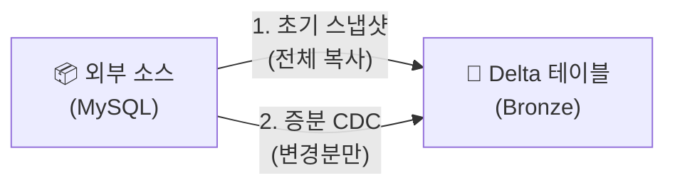

# Lakeflow Connect란?

## 개념

> 💡 **Lakeflow Connect**는 외부 데이터 소스(데이터베이스, SaaS 애플리케이션)에서 Databricks로 데이터를 **자동으로 수집하는 관리형 커넥터** 서비스입니다.

코드를 작성하지 않고도, UI에서 소스를 선택하고 테이블을 매핑하면 **초기 스냅샷 + 실시간 CDC** 수집이 자동으로 이루어집니다.

---

## 지원 소스

| 카테고리 | 소스 | 상태 |
|----------|------|------|
| **데이터베이스** | MySQL, PostgreSQL, SQL Server, Oracle | GA / Preview |
| **SaaS** | Salesforce, ServiceNow, Google Analytics | GA / Preview |
| **SaaS (신규)** | Workday HCM, HubSpot, TikTok Ads, Google Ads, Zendesk, NetSuite, Dynamics 365 | Beta |
| **파일** | SFTP | Public Preview |
| **스프레드시트** | Google Sheets | GA |

> 🆕 Databricks는 지속적으로 새로운 커넥터를 추가하고 있습니다. 최신 지원 소스 목록은 공식 문서를 확인해 주시기 바랍니다.

---

## 동작 방식

1. **초기 스냅샷**: 소스 테이블의 전체 데이터를 한 번 복사합니다
2. **증분 수집 (CDC)**: 이후에는 변경된 데이터(INSERT, UPDATE, DELETE)만 실시간으로 반영합니다

---

## 설정 방법

1. **Pipelines** → **Create Pipeline** → **Lakeflow Connect** 선택
2. 소스 유형 선택 (예: MySQL)
3. 연결 정보 입력 (호스트, 포트, 자격증명)
4. 수집할 테이블 선택
5. 대상 카탈로그/스키마 지정
6. 스케줄 설정 (연속 또는 주기적)
7. **Start** 클릭

---

## 참고 링크

- [Databricks: Lakeflow Connect](https://docs.databricks.com/aws/en/lakeflow-connect/)
