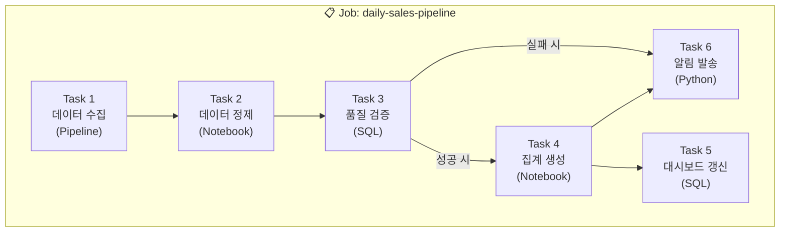
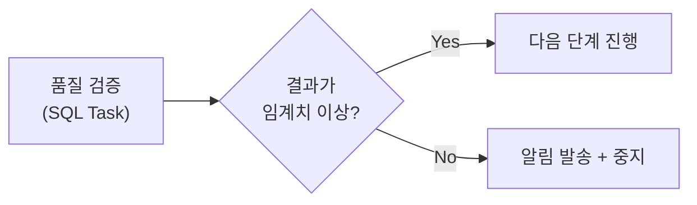
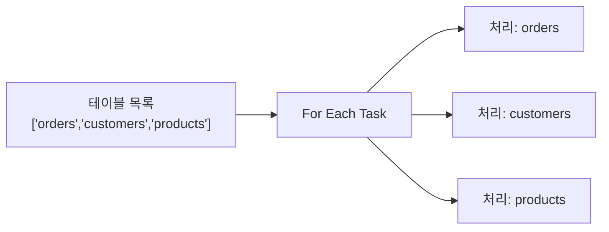

# Lakeflow Jobs란?

## 개념

> 💡 **Lakeflow Jobs (Workflows)**는 데이터 파이프라인과 작업을 **스케줄링하고, 의존성을 관리하며, 모니터링**하는 오케스트레이션 서비스입니다. 여러 개의 작업(Task)을 DAG(Directed Acyclic Graph) 형태로 연결하여, 정해진 순서대로 또는 조건에 따라 실행합니다.

비유하자면, 오케스트라의 **지휘자**와 같습니다. 각 연주자(Task)가 적절한 순서와 타이밍에 연주하도록 조율하고, 문제가 생기면 즉시 대응합니다.

---

## Job의 구성 요소

| 구성 요소 | 설명 |
|-----------|------|
| **Job** | 하나 이상의 Task를 묶은 워크플로우 단위입니다. 스케줄, 알림, 권한 설정의 단위이기도 합니다 |
| **Task** | 실제 실행되는 개별 작업입니다. 다양한 유형(노트북, SQL, 파이프라인 등)을 지원합니다 |
| **Dependency** | Task 간의 실행 순서를 정의합니다. 선행 Task 완료 후 후행 Task가 실행됩니다 |
| **Trigger** | Job이 실행되는 조건입니다 (시간, 파일 도착, API 호출, 테이블 변경) |
| **Run** | Job의 한 번의 실행 인스턴스입니다. 각 Run에는 고유한 run_id가 부여됩니다 |

---

## Task 유형

Lakeflow Jobs는 다양한 유형의 Task를 지원하여, 이기종 워크로드를 하나의 워크플로우에서 관리할 수 있습니다.

| Task 유형 | 설명 | 적합한 사용 |
|-----------|------|-----------|
| **Notebook** | Databricks 노트북을 실행합니다 | Python/SQL 변환 작업 |
| **SQL** | SQL 쿼리 또는 SQL 파일을 실행합니다 | 데이터 검증, 집계 |
| **Python Script** | Python 스크립트 파일을 실행합니다 | 커스텀 로직 |
| **JAR** | Java/Scala JAR 파일을 실행합니다 | 레거시 Spark 작업 |
| **Pipeline** | SDP 파이프라인을 실행합니다 | 선언적 ETL 파이프라인 |
| **dbt** | dbt 프로젝트를 실행합니다 | dbt 기반 변환 |
| **If/Else** | 조건에 따라 분기합니다 | 조건부 실행 로직 |
| **For Each** | 리스트의 각 항목에 대해 반복 실행합니다 | 배치 루프, 다중 테이블 처리 |

### If/Else 분기 예시

### For Each 반복 예시

---

## 시스템 제약 사항

공식 문서에 명시된 Lakeflow Jobs의 시스템 제약입니다. 대규모 운영 시 참고해야 합니다.

| 제약 | 값 |
|------|------|
| 워크스페이스당 최대 동시 Task 실행 수 | **2,000** |
| 시간당 최대 Job 생성 수 | **10,000** |
| 워크스페이스당 최대 저장 Job 수 | **12,000** |
| Job당 최대 Task 수 | **1,000** |
| 최대 동시 Job Run 수 (동일 Job) | 설정 가능 (기본 무제한) |

---

## 프로그래밍 방식 관리

Lakeflow Jobs는 UI 외에도 다양한 방법으로 관리할 수 있습니다.

| 도구 | 설명 |
|------|------|
| **Databricks CLI** | `databricks jobs create`, `databricks jobs run-now` 등 |
| **REST API** | `/api/2.1/jobs/create`, `/api/2.1/jobs/run-now` 등 |
| **Python SDK** | `databricks.sdk.WorkspaceClient().jobs.create()` |
| **Asset Bundles** | YAML로 선언적 정의, `databricks bundle deploy`로 배포 |
| **Apache Airflow** | `DatabricksRunNowOperator`로 외부 오케스트레이션 |
| **Terraform** | `databricks_job` 리소스로 IaC 관리 |

---

## 다른 오케스트레이션 도구와의 비교

| 비교 항목 | Lakeflow Jobs | Apache Airflow | dbt Cloud |
|-----------|-------------|----------------|-----------|
| **설치/관리** | 관리형 (설치 불필요) | 직접 설치/운영 | SaaS |
| **UI** | Databricks 내장 | Airflow 웹 UI | dbt Cloud UI |
| **Task 유형** | 노트북, SQL, JAR, 파이프라인, dbt | Python 오퍼레이터 무한 확장 | SQL 변환 전용 |
| **Databricks 통합** | 네이티브 (완벽) | 커넥터 필요 | 어댑터 필요 |
| **비용** | DBU에 포함 | 별도 인프라 비용 | 별도 SaaS 비용 |
| **적합한 경우** | Databricks 중심 파이프라인 | 복잡한 멀티 플랫폼 오케스트레이션 | SQL 변환 중심 |

> 💡 **권장**: Databricks 내의 워크로드만 오케스트레이션한다면 **Lakeflow Jobs**가 가장 간편하고 비용 효율적입니다. 여러 플랫폼(Databricks + 외부 시스템)을 아우르는 복잡한 오케스트레이션이 필요하다면 **Apache Airflow**를, SQL 변환 중심이라면 **dbt**를 추가로 고려할 수 있습니다.

---

## 정리

| 핵심 개념 | 설명 |
|-----------|------|
| **Job** | Task들의 워크플로우 묶음입니다. 스케줄링과 모니터링의 단위입니다 |
| **Task** | 실제 실행 단위. Notebook, SQL, Pipeline, dbt, If/Else, For Each 등을 지원합니다 |
| **Dependency** | Task 간 실행 순서를 정의합니다 |
| **Run** | Job의 한 번의 실행 인스턴스입니다 |
| **Trigger** | 시간, 파일 도착, API 호출 등 Job 실행 조건입니다 |

---

## 참고 링크

- [Databricks: Lakeflow Jobs](https://docs.databricks.com/aws/en/jobs/)
- [Databricks: Jobs API](https://docs.databricks.com/api/workspace/jobs)
- [Azure Databricks: Workflows](https://learn.microsoft.com/en-us/azure/databricks/workflows/)
