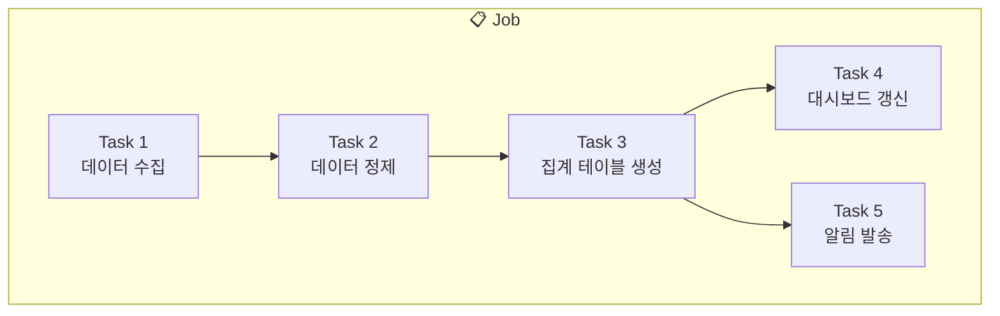

# Lakeflow Jobs란?

## 개념

> 💡 **Lakeflow Jobs (Workflows)**는 데이터 파이프라인과 작업을 **스케줄링하고, 의존성을 관리하며, 모니터링**하는 오케스트레이션 서비스입니다.

비유하자면, 오케스트라의 **지휘자**와 같습니다. 각 연주자(작업)가 적절한 순서와 타이밍에 연주하도록 조율합니다.

---

## Job의 구성 요소

| 구성 요소 | 설명 |
|-----------|------|
| **Job** | 하나 이상의 Task를 묶은 워크플로우 단위입니다 |
| **Task** | 실제 실행되는 개별 작업입니다 (노트북, SQL, JAR, Python 스크립트 등) |
| **의존성 (Dependency)** | Task 간의 실행 순서를 정의합니다 (선행 Task 완료 후 후행 Task 실행) |
| **Trigger** | Job이 실행되는 조건입니다 (시간 기반, 파일 도착, API 호출 등) |

---

## Task 유형

| Task 유형 | 설명 |
|-----------|------|
| **Notebook** | Databricks 노트북을 실행합니다 |
| **SQL** | SQL 쿼리 또는 SQL 파일을 실행합니다 |
| **Python Script** | Python 스크립트 파일을 실행합니다 |
| **JAR** | Java/Scala JAR 파일을 실행합니다 |
| **Pipeline** | SDP 파이프라인을 실행합니다 |
| **dbt** | dbt 프로젝트를 실행합니다 |
| **If/Else** | 조건에 따라 분기합니다 |
| **For Each** | 리스트의 각 항목에 대해 반복 실행합니다 |

---

## 참고 링크

- [Databricks: Lakeflow Jobs](https://docs.databricks.com/aws/en/jobs/)
