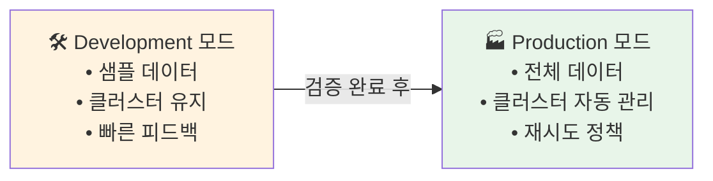

# SDP 파이프라인 설정 상세

## 왜 파이프라인 설정이 중요한가?

SDP(Spark Declarative Pipelines, 구 Delta Live Tables)는 파이프라인의 **실행 모드, 클러스터 구성, 타겟 카탈로그, 채널** 등을 설정을 통해 제어합니다. 올바른 설정은 개발 생산성, 프로덕션 안정성, 비용 효율성에 직접적인 영향을 미칩니다.

---

## Development vs Production 모드

SDP는 두 가지 실행 모드를 제공하며, 각 모드는 파이프라인의 동작 방식이 크게 다릅니다.

| 비교 항목 | Development 모드 | Production 모드 |
|-----------|-----------------|----------------|
| **데이터 재처리** | 전체 데이터가 아닌 **2개 파일만 샘플** 처리합니다 | **전체 데이터**를 처리합니다 |
| **클러스터 재사용** | 실행 사이에 클러스터를 유지합니다 (빠른 반복) | 매 실행마다 클러스터를 새로 생성합니다 |
| **오류 처리** | 오류 발생 시 파이프라인을 즉시 중단합니다 | 재시도 정책에 따라 자동 복구를 시도합니다 |
| **비용** | 클러스터 유지 비용 발생 | 실행 시에만 비용 발생 |
| **적합한 용도** | 개발, 디버깅, 테스트 | 프로덕션 운영 |



---

## 클러스터 설정

### 서버리스 컴퓨트

서버리스를 선택하면 클러스터 구성을 직접 관리할 필요가 없습니다. Databricks가 자동으로 인프라를 프로비저닝합니다.

```json
{
    "name": "my-serverless-pipeline",
    "serverless": true,
    "catalog": "catalog",
    "target": "schema"
}
```

| 장점 | 고려사항 |
|------|---------|
| 클러스터 시작 대기 시간 최소화 | 커스텀 라이브러리 설치 제한 |
| 인프라 관리 불필요 | 특정 인스턴스 타입 지정 불가 |
| 자동 스케일링 | 일부 워크로드에서 비용이 다를 수 있음 |

### Job Cluster (클래식)

세밀한 클러스터 제어가 필요한 경우 직접 클러스터를 구성합니다.

```json
{
    "name": "my-classic-pipeline",
    "clusters": [
        {
            "label": "default",
            "num_workers": 4,
            "node_type_id": "i3.xlarge",
            "spark_conf": {
                "spark.databricks.delta.optimizeWrite.enabled": "true"
            },
            "aws_attributes": {
                "availability": "SPOT_WITH_FALLBACK",
                "first_on_demand": 1
            }
        },
        {
            "label": "maintenance",
            "num_workers": 2,
            "node_type_id": "m5.xlarge"
        }
    ]
}
```

| 클러스터 레이블 | 용도 |
|---------------|------|
| `default` | 파이프라인의 기본 처리에 사용됩니다 |
| `maintenance` | OPTIMIZE, VACUUM 같은 유지보수 작업에 사용됩니다 |

### Auto Scaling 설정

```json
{
    "clusters": [
        {
            "label": "default",
            "autoscale": {
                "min_workers": 2,
                "max_workers": 10,
                "mode": "ENHANCED"
            }
        }
    ]
}
```

---

## Channel (채널) 설정

채널은 SDP 런타임의 **버전**을 결정합니다. 신기능 테스트와 프로덕션 안정성 사이의 균형을 맞출 수 있습니다.

| 채널 | 설명 | 권장 용도 |
|------|------|----------|
| **Current** | 최신 안정 버전의 SDP 런타임입니다 | 프로덕션 환경 |
| **Preview** | 차기 버전의 기능을 미리 사용할 수 있습니다 | 개발, 신기능 테스트 |

```json
{
    "name": "my-pipeline",
    "channel": "CURRENT"
}
```

---

## 타겟 카탈로그/스키마 설정

### Unity Catalog 통합

SDP 파이프라인의 결과 테이블을 Unity Catalog에 저장합니다.

```json
{
    "name": "sales-pipeline",
    "catalog": "production",
    "target": "sales_data"
}
```

| 설정 | 설명 |
|------|------|
| `catalog` | 결과 테이블이 저장될 Unity Catalog 카탈로그입니다 |
| `target` | 결과 테이블이 저장될 스키마(데이터베이스)입니다 |

위 설정으로 파이프라인 내에서 `CREATE STREAMING TABLE orders`를 실행하면 `production.sales_data.orders`로 생성됩니다.

> 💡 **카탈로그/스키마를 파이프라인 레벨에서 설정하면**, 개별 테이블 정의에서 3단계 네임스페이스를 매번 작성할 필요가 없습니다.

---

## 파이프라인 설정 전체 예제

### JSON 설정

```json
{
    "name": "ecommerce-etl-pipeline",
    "catalog": "production",
    "target": "ecommerce",
    "serverless": true,
    "channel": "CURRENT",
    "development": false,
    "continuous": false,
    "photon": true,
    "edition": "ADVANCED",
    "configuration": {
        "source_path": "s3://raw-data/ecommerce/",
        "quality_threshold": "0.95",
        "environment": "production"
    },
    "libraries": [
        {
            "notebook": {
                "path": "/Workspace/pipelines/ecommerce/bronze"
            }
        },
        {
            "notebook": {
                "path": "/Workspace/pipelines/ecommerce/silver"
            }
        },
        {
            "notebook": {
                "path": "/Workspace/pipelines/ecommerce/gold"
            }
        }
    ],
    "notifications": [
        {
            "email_recipients": ["data-team@company.com"],
            "alerts": {
                "on_update_failure": true,
                "on_update_success": false,
                "on_flow_failure": true
            }
        }
    ]
}
```

### YAML 설정 (Asset Bundles)

```yaml
resources:
  pipelines:
    ecommerce_etl:
      name: "ecommerce-etl-pipeline"
      catalog: "${var.catalog}"
      target: "${var.schema}"
      serverless: true
      channel: "CURRENT"
      development: ${var.is_dev}
      photon: true
      edition: "ADVANCED"

      configuration:
        source_path: "${var.source_path}"
        quality_threshold: "0.95"
        environment: "${bundle.target}"

      libraries:
        - notebook:
            path: "./pipelines/bronze.sql"
        - notebook:
            path: "./pipelines/silver.py"
        - notebook:
            path: "./pipelines/gold.sql"

      notifications:
        - email_recipients:
            - "data-team@company.com"
          alerts:
            on_update_failure: true
            on_flow_failure: true
```

---

## 주요 설정 옵션 총정리

| 설정 | 설명 | 기본값 |
|------|------|--------|
| `name` | 파이프라인 이름입니다 | (필수) |
| `catalog` | Unity Catalog 카탈로그입니다 | — |
| `target` | 타겟 스키마(데이터베이스)입니다 | — |
| `serverless` | 서버리스 컴퓨트 사용 여부입니다 | `false` |
| `channel` | 런타임 채널입니다 (CURRENT/PREVIEW) | `CURRENT` |
| `development` | 개발 모드 활성화 여부입니다 | `true` |
| `continuous` | 연속 실행 모드 여부입니다 | `false` |
| `photon` | Photon 엔진 활성화 여부입니다 | `false` |
| `edition` | 에디션입니다 (CORE/PRO/ADVANCED) | `ADVANCED` |
| `configuration` | 파이프라인에서 사용할 키-값 매개변수입니다 | `{}` |
| `libraries` | 파이프라인에 포함할 노트북/파일 목록입니다 | (필수) |

### configuration 매개변수 활용

`configuration`에 정의한 값은 파이프라인 코드에서 `spark.conf.get()`으로 접근할 수 있습니다.

```python
# Python에서 파이프라인 설정값 읽기
source_path = spark.conf.get("source_path")
quality_threshold = float(spark.conf.get("quality_threshold"))
```

```sql
-- SQL에서 파이프라인 설정값 읽기
SELECT * FROM STREAM read_files(
    '${source_path}',
    format => 'json'
);
```

---

## Continuous 모드 vs Triggered 모드

| 모드 | 동작 | 적합한 시나리오 |
|------|------|--------------|
| **Triggered** (기본값) | 한 번 실행하고 종료합니다. 새 데이터가 있으면 처리하고 멈춥니다 | 배치 ETL, 스케줄 실행 |
| **Continuous** | 항상 실행 상태를 유지하며, 새 데이터가 도착하면 즉시 처리합니다 | 실시간 스트리밍, 저지연 요구 |

> ⚠️ **Continuous 모드는 항상 클러스터가 실행 중이므로 비용이 지속적으로 발생합니다.** 실시간 요구사항이 없다면 Triggered 모드 + 스케줄링을 권장합니다.

---

## 정리

| 핵심 설정 | 권장값 |
|-----------|--------|
| **개발 단계** | Development 모드, Preview 채널 |
| **프로덕션** | Production 모드, Current 채널 |
| **비용 최적화** | 서버리스 또는 Spot 인스턴스 |
| **성능 최적화** | Photon 활성화, Auto Scaling |
| **환경 분리** | Asset Bundles 변수로 카탈로그/스키마 분리 |

---

## 참고 링크

- [Databricks: Configure a SDP pipeline](https://docs.databricks.com/aws/en/delta-live-tables/configure-pipeline.html)
- [Databricks: Pipeline settings](https://docs.databricks.com/aws/en/delta-live-tables/settings.html)
- [Databricks: Serverless SDP](https://docs.databricks.com/aws/en/delta-live-tables/serverless-dlt.html)
- [Azure Databricks: Configure pipelines](https://learn.microsoft.com/en-us/azure/databricks/delta-live-tables/configure-pipeline)
