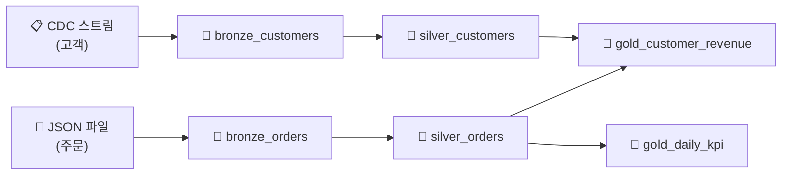

# SDP 실습 — Medallion 파이프라인 구축

## 시나리오

온라인 쇼핑몰의 주문 데이터(JSON)와 고객 마스터 데이터(CDC)를 수집하여, Medallion 아키텍처 기반의 분석 파이프라인을 구축합니다.

---

## 전체 파이프라인 구조



---

## 파이프라인 코드

아래 SQL을 하나의 노트북에 순서대로 작성합니다.

```sql
-- ===== Bronze Layer =====

-- 주문 데이터 수집 (Auto Loader)
CREATE OR REFRESH STREAMING TABLE bronze_orders
AS SELECT *, _metadata.file_path AS _source
FROM STREAM read_files('s3://shop/raw/orders/', format => 'json');

-- 고객 CDC 데이터 수집
CREATE OR REFRESH STREAMING TABLE bronze_customers
AS SELECT * FROM STREAM read_files('s3://shop/raw/customers/', format => 'json');

-- ===== Silver Layer =====

-- 주문 정제
CREATE OR REFRESH STREAMING TABLE silver_orders (
    CONSTRAINT valid_id EXPECT (order_id IS NOT NULL) ON VIOLATION DROP ROW,
    CONSTRAINT valid_amount EXPECT (amount > 0) ON VIOLATION DROP ROW
)
AS SELECT
    CAST(order_id AS BIGINT) AS order_id,
    CAST(customer_id AS BIGINT) AS customer_id,
    TRIM(product) AS product,
    CAST(amount AS DECIMAL(12,2)) AS amount,
    CAST(order_date AS TIMESTAMP) AS order_date,
    UPPER(status) AS status
FROM STREAM(bronze_orders);

-- 고객 마스터 (CDC → SCD Type 1)
CREATE OR REFRESH STREAMING TABLE silver_customers;

APPLY CHANGES INTO silver_customers
FROM STREAM(bronze_customers)
KEYS (customer_id)
SEQUENCE BY updated_at
STORED AS SCD TYPE 1;

-- ===== Gold Layer =====

-- 고객별 누적 매출
CREATE OR REFRESH MATERIALIZED VIEW gold_customer_revenue
AS SELECT
    c.customer_id,
    c.name,
    c.city,
    COUNT(o.order_id) AS total_orders,
    SUM(o.amount) AS total_revenue,
    AVG(o.amount) AS avg_order_value,
    MAX(o.order_date) AS last_order_date
FROM silver_orders o
JOIN silver_customers c ON o.customer_id = c.customer_id
WHERE o.status = 'COMPLETED'
GROUP BY c.customer_id, c.name, c.city;

-- 일별 KPI
CREATE OR REFRESH MATERIALIZED VIEW gold_daily_kpi
AS SELECT
    DATE(order_date) AS sale_date,
    COUNT(DISTINCT customer_id) AS unique_customers,
    COUNT(*) AS total_orders,
    SUM(amount) AS total_revenue,
    AVG(amount) AS avg_order_value
FROM silver_orders
WHERE status = 'COMPLETED'
GROUP BY DATE(order_date);
```

---

## 파이프라인 실행

1. **Pipelines** → **Create Pipeline**
2. Pipeline name: `shop-medallion-pipeline`
3. Source code: 위 노트북 경로
4. Destination: `catalog.ecommerce`
5. Compute: **Serverless** 선택
6. **Start** 클릭

Pipeline UI에서 테이블 간 의존성 그래프, Expectations 결과, 처리 건수를 실시간으로 모니터링할 수 있습니다.

---

## 참고 링크

- [Databricks: SDP tutorial](https://docs.databricks.com/aws/en/sdp/tutorial.html)
