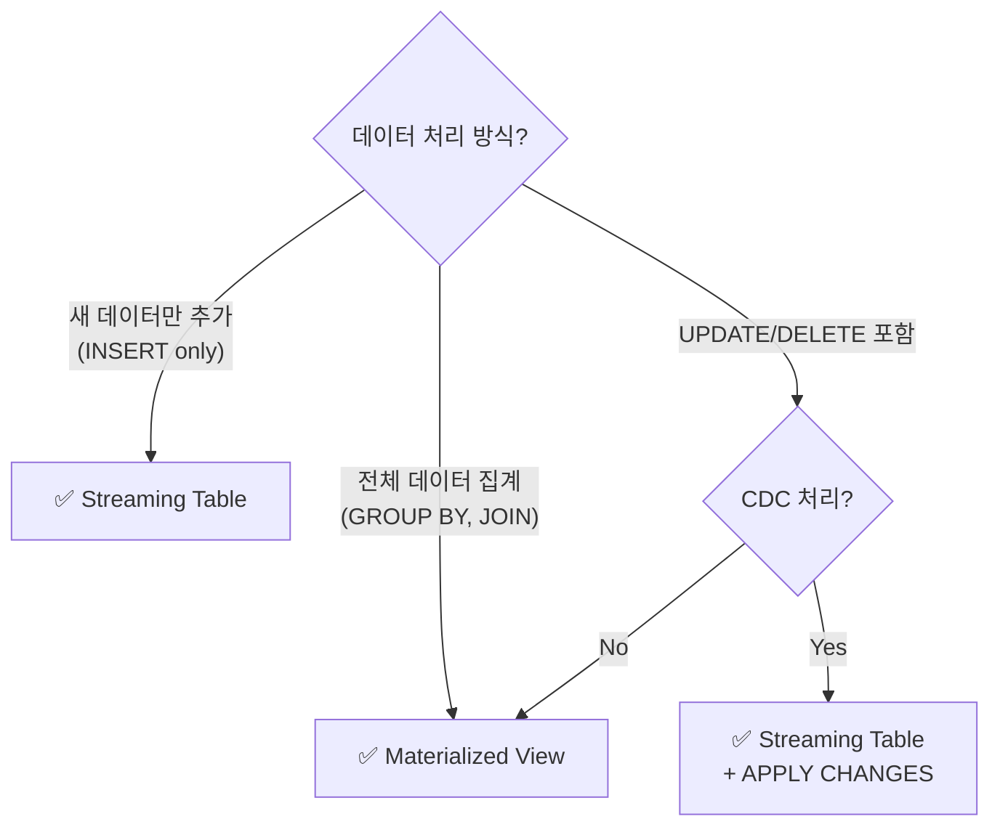

# Streaming Tables & Materialized Views

## 두 가지 핵심 테이블 유형

SDP에서 데이터를 저장하는 방식은 **Streaming Table**과 **Materialized View** 두 가지입니다.

---

## Streaming Table

> 💡 **Streaming Table**은 새로 도착한 데이터만 **증분(Incremental)**으로 처리하여 추가하는 테이블입니다. 한 번 처리된 데이터는 다시 처리하지 않습니다.

```sql
CREATE OR REFRESH STREAMING TABLE silver_orders
AS SELECT
    CAST(order_id AS BIGINT) AS order_id,
    CAST(amount AS DECIMAL(12,2)) AS amount,
    CAST(order_date AS TIMESTAMP) AS order_date
FROM STREAM(bronze_orders);
```

| 특징 | 설명 |
|------|------|
| 처리 방식 | 새 데이터만 증분 처리 (Append) |
| 적합한 사례 | 로그, 이벤트, 트랜잭션 등 지속적으로 추가되는 데이터 |
| 성능 | 전체 데이터를 재처리하지 않으므로 매우 효율적 |
| 키워드 | `CREATE STREAMING TABLE` + `STREAM()` 함수 |

---

## Materialized View

> 💡 **Materialized View**는 **전체 데이터를 대상으로 결과를 재계산**하는 테이블입니다. 소스 데이터가 변경되면 결과도 자동으로 갱신됩니다.

```sql
CREATE OR REFRESH MATERIALIZED VIEW gold_daily_revenue
AS SELECT
    DATE(order_date) AS sale_date,
    COUNT(*) AS order_count,
    SUM(amount) AS total_revenue
FROM silver_orders
GROUP BY DATE(order_date);
```

| 특징 | 설명 |
|------|------|
| 처리 방식 | 전체 데이터를 재계산 (Full Recompute) |
| 적합한 사례 | 집계, 요약, JOIN 결과 등 전체 데이터가 필요한 경우 |
| 성능 | 데이터가 매우 크면 시간이 걸릴 수 있음 |
| 키워드 | `CREATE MATERIALIZED VIEW` (STREAM 없음) |

---

## 선택 가이드



| 비교 | Streaming Table | Materialized View |
|------|----------------|-------------------|
| **Medallion 계층** | Bronze, Silver | Gold |
| **갱신 비용** | 낮음 (증분만) | 높음 (전체 재계산) |
| **UPDATE/DELETE** | APPLY CHANGES로 지원 | 자동 재계산 |
| **실시간성** | 높음 | 중간 |

---

## 참고 링크

- [Databricks: Streaming tables](https://docs.databricks.com/aws/en/sdp/streaming-tables.html)
- [Databricks: Materialized views](https://docs.databricks.com/aws/en/sdp/materialized-views.html)
