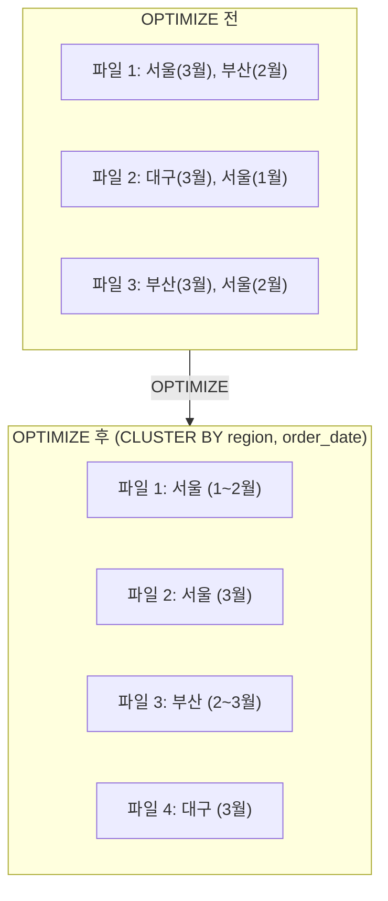
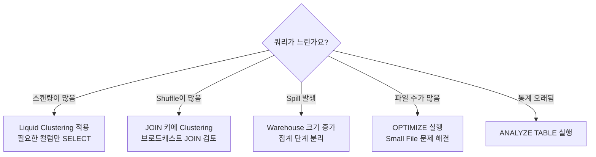

# 쿼리 최적화

## 왜 쿼리 최적화가 중요한가요?

동일한 데이터를 조회하더라도, 쿼리를 어떻게 작성하고 테이블을 어떻게 구성하느냐에 따라 **실행 시간이 수십 배** 차이날 수 있습니다. 대시보드의 응답 속도, ETL 파이프라인의 처리 시간, 그리고 **컴퓨팅 비용(DBU)**에 직접적으로 영향을 미칩니다.

이 문서에서는 Databricks에서 쿼리 성능을 극대화하기 위한 핵심 기술과 모범 사례를 상세히 다루겠습니다.

---

## 1. Liquid Clustering — 차세대 데이터 레이아웃 최적화

### 개념

> 💡 **Liquid Clustering**은 데이터를 지정한 컬럼 기준으로 **물리적으로 가까이 배치**하여, 쿼리 시 불필요한 파일 읽기를 최소화하는 기술입니다. 기존의 파티셔닝(Partitioning)과 Z-Order를 대체하는 Databricks의 최신 최적화 기술입니다.

### 왜 기존 방식을 대체하나요?

| 기존 방식 | 문제점 |
|-----------|--------|
| **Hive-style 파티셔닝** | 파티션 컬럼을 변경하려면 **테이블을 재생성**해야 합니다. 카디널리티가 높은 컬럼(예: user_id)으로 파티셔닝하면 수만 개의 작은 파일이 생깁니다 |
| **Z-Order** | 매번 `OPTIMIZE ... ZORDER BY` 를 명시적으로 실행해야 하며, 최적 컬럼 조합을 찾기 어렵습니다 |
| **Liquid Clustering** | 컬럼 변경이 자유롭고(`ALTER TABLE`), OPTIMIZE 시 자동 적용되며, 증분 방식으로 효율적입니다 |

### 사용 방법

```sql
-- 1. 새 테이블 생성 시 Clustering 지정
CREATE TABLE catalog.schema.orders (
    order_id BIGINT,
    customer_id BIGINT,
    order_date DATE,
    amount DECIMAL(12,2),
    status STRING,
    region STRING
)
USING DELTA
CLUSTER BY (order_date, region);

-- 2. 기존 테이블에 Clustering 추가
ALTER TABLE catalog.schema.orders
CLUSTER BY (order_date, region);

-- 3. Clustering 컬럼 변경 (재생성 불필요!)
ALTER TABLE catalog.schema.orders
CLUSTER BY (order_date, customer_id);

-- 4. Clustering 실행 (OPTIMIZE에 통합)
OPTIMIZE catalog.schema.orders;

-- 5. Clustering 비활성화
ALTER TABLE catalog.schema.orders CLUSTER BY NONE;
```

### Clustering 컬럼 선택 가이드

| 원칙 | 설명 | 예시 |
|------|------|------|
| **자주 필터링하는 컬럼** | WHERE 절에 자주 등장하는 컬럼을 선택합니다 | `order_date`, `region`, `status` |
| **카디널리티가 적당한 컬럼** | 값의 종류가 너무 적거나 너무 많지 않은 컬럼이 좋습니다 | ✅ `region` (10개), ❌ `order_id` (수억 개) |
| **최대 4개 이하** | 컬럼 수가 많으면 효과가 분산됩니다 | `CLUSTER BY (date, region)` |
| **JOIN 키 컬럼** | 자주 JOIN에 사용되는 컬럼도 좋은 후보입니다 | `customer_id` |

### Liquid Clustering의 동작 원리



`WHERE region = '서울' AND order_date >= '2025-03-01'` 쿼리를 실행하면:
- **최적화 전**: 3개 파일을 모두 스캔해야 합니다
- **최적화 후**: 파일 2만 스캔하면 됩니다 → **데이터 스캔량 2/3 감소**

---

## 2. Predictive Optimization — 자동 최적화

### 개념

> 💡 **Predictive Optimization**은 Databricks가 테이블의 사용 패턴을 분석하여, **OPTIMIZE와 VACUUM을 자동으로 실행**해 주는 기능입니다. 사용자가 직접 스케줄을 관리할 필요가 없습니다.

### 활성화 방법

```sql
-- 스키마 단위로 활성화 (해당 스키마의 모든 Managed 테이블에 적용)
ALTER SCHEMA catalog.schema
SET DBPROPERTIES ('databricks.predictiveOptimization.enabled' = 'true');

-- 또는 개별 테이블에 활성화
ALTER TABLE catalog.schema.orders
SET TBLPROPERTIES ('delta.enableOptimizeWrite' = 'true');
```

### 자동으로 수행하는 작업

| 작업 | 설명 |
|------|------|
| **Auto Compaction** | 작은 파일이 많이 생기면 자동으로 합칩니다 |
| **Auto OPTIMIZE** | 데이터 레이아웃을 자동으로 최적화합니다 |
| **Auto VACUUM** | 오래된 불필요한 파일을 자동으로 삭제합니다 |
| **Auto ANALYZE** | 통계 정보를 자동으로 갱신합니다 |

> ⚠️ **요구 사항**: Predictive Optimization은 Unity Catalog의 **Managed Table**에서만 사용할 수 있습니다. External Table에서는 사용할 수 없습니다.

---

## 3. Query Profile — 쿼리 성능 분석

### Query Profile 읽는 방법

SQL Editor에서 쿼리를 실행한 후 **Query Profile** 탭을 클릭하면, 실행 계획을 시각적으로 확인할 수 있습니다.

### 핵심 메트릭

| 메트릭 | 의미 | 이상 징후 |
|--------|------|----------|
| **Rows Scanned** | 읽은 행 수 | 반환된 행에 비해 지나치게 많으면 필터링 비효율입니다 |
| **Bytes Scanned** | 읽은 데이터량 | 불필요한 컬럼을 읽고 있을 수 있습니다 |
| **Files Pruned** | 건너뛴 파일 수 | 비율이 낮으면 Clustering이 필요합니다 |
| **Shuffle Bytes** | 노드 간 이동 데이터 | 과도하면 JOIN이나 GROUP BY 최적화가 필요합니다 |
| **Spill to Disk** | 디스크로 유출된 데이터 | 메모리 부족. Warehouse 크기를 늘리거나 쿼리를 최적화합니다 |
| **Peak Memory** | 최대 메모리 사용량 | Warehouse 크기 대비 사용량을 확인합니다 |

### 성능 개선 판단 플로우



---

## 4. SQL 쿼리 작성 최적화

### SELECT * 피하기

```sql
-- ❌ 나쁜 예: 모든 컬럼을 읽습니다
SELECT * FROM orders WHERE order_date = '2025-03-15';

-- ✅ 좋은 예: 필요한 컬럼만 읽습니다 (컬럼 기반 저장의 장점 활용)
SELECT order_id, customer_id, amount
FROM orders
WHERE order_date = '2025-03-15';
```

> 💡 Delta Lake는 **컬럼 기반(Columnar)** 포맷인 Parquet로 데이터를 저장합니다. `SELECT *`는 모든 컬럼의 데이터를 읽지만, 필요한 컬럼만 지정하면 해당 컬럼의 데이터만 읽으므로 I/O가 크게 줄어듭니다.

### JOIN 최적화

```sql
-- ❌ 나쁜 예: 큰 테이블끼리 직접 JOIN
SELECT o.*, c.name, c.email
FROM orders o  -- 10억 행
JOIN customers c ON o.customer_id = c.customer_id;  -- 100만 행

-- ✅ 좋은 예: 작은 테이블에 브로드캐스트 힌트 사용
SELECT /*+ BROADCAST(c) */ o.order_id, o.amount, c.name, c.email
FROM orders o
JOIN customers c ON o.customer_id = c.customer_id;
```

> 💡 **브로드캐스트 JOIN(Broadcast JOIN)이란?** 작은 테이블을 모든 노드에 복사하여, 큰 테이블의 데이터를 이동(Shuffle)하지 않고 각 노드에서 바로 조인하는 방식입니다. 한쪽 테이블이 충분히 작을 때(일반적으로 수십MB 이하) 매우 효과적입니다.

### 서브쿼리보다 CTE 사용

```sql
-- ❌ 나쁜 예: 중첩 서브쿼리 (가독성 낮음, 최적화 어려움)
SELECT * FROM (
    SELECT customer_id, SUM(amount) AS total
    FROM (SELECT * FROM orders WHERE status = 'COMPLETED') t
    GROUP BY customer_id
) WHERE total > 1000000;

-- ✅ 좋은 예: CTE 사용 (가독성 높음, 동일 성능)
WITH completed_orders AS (
    SELECT customer_id, amount
    FROM orders
    WHERE status = 'COMPLETED'
),
customer_totals AS (
    SELECT customer_id, SUM(amount) AS total
    FROM completed_orders
    GROUP BY customer_id
)
SELECT * FROM customer_totals
WHERE total > 1000000;
```

### 효율적인 필터링

```sql
-- ❌ 나쁜 예: 함수로 감싼 컬럼은 인덱스/Clustering을 활용하지 못합니다
SELECT * FROM orders WHERE YEAR(order_date) = 2025;

-- ✅ 좋은 예: 범위 조건으로 작성합니다
SELECT * FROM orders
WHERE order_date >= '2025-01-01' AND order_date < '2026-01-01';

-- ❌ 나쁜 예: LIKE '%keyword%' (전체 스캔)
SELECT * FROM products WHERE name LIKE '%키보드%';

-- ✅ 대안: ai_classify() 또는 전문 검색(Full-text Search) 활용
```

---

## 5. 테이블 통계 관리

```sql
-- 테이블 전체 통계 수집 (행 수, 컬럼별 분포)
ANALYZE TABLE catalog.schema.orders COMPUTE STATISTICS;

-- 특정 컬럼의 상세 통계 수집
ANALYZE TABLE catalog.schema.orders
COMPUTE STATISTICS FOR COLUMNS order_date, customer_id, amount;

-- 통계 확인
DESCRIBE EXTENDED catalog.schema.orders;
```

> 💡 **통계(Statistics)**는 쿼리 최적화기(Query Optimizer)가 최적의 실행 계획을 수립하는 데 사용됩니다. 예를 들어, 테이블의 행 수, 컬럼의 고유값 수, 최소/최대값 등을 알면 JOIN 순서나 필터 적용 순서를 더 효율적으로 결정할 수 있습니다.

---

## 6. 기타 최적화 기법

### Delta Cache

SQL Warehouse는 자주 접근하는 데이터를 **로컬 SSD에 자동 캐싱**합니다. 동일한 데이터를 반복 조회할 때 디스크 I/O 없이 캐시에서 바로 읽을 수 있습니다. 별도 설정 없이 자동으로 동작합니다.

### Materialized View 활용

자주 실행되는 복잡한 집계 쿼리는 **Materialized View**로 만들어 결과를 사전 계산해 두면, 매번 재계산하지 않아 응답 시간이 크게 단축됩니다.

```sql
-- 자주 조회되는 복잡한 집계를 MV로 사전 계산
CREATE MATERIALIZED VIEW catalog.schema.mv_monthly_kpi AS
SELECT
    DATE_TRUNC('MONTH', order_date) AS month,
    region,
    COUNT(DISTINCT customer_id) AS unique_customers,
    COUNT(*) AS total_orders,
    SUM(amount) AS total_revenue,
    AVG(amount) AS avg_order_value,
    PERCENTILE_CONT(0.5) WITHIN GROUP (ORDER BY amount) AS median_order_value
FROM catalog.schema.silver_orders
WHERE status = 'COMPLETED'
GROUP BY 1, 2;
```

### Optimize Write

스트리밍이나 빈번한 INSERT 워크로드에서 작은 파일이 생기는 것을 방지합니다.

```sql
ALTER TABLE catalog.schema.orders
SET TBLPROPERTIES ('delta.autoOptimize.optimizeWrite' = 'true');
```

---

## 최적화 체크리스트

| # | 항목 | 확인 방법 |
|---|------|----------|
| 1 | 필요한 컬럼만 SELECT하고 있는가? | 쿼리 검토 |
| 2 | WHERE 절에 자주 사용하는 컬럼으로 CLUSTER BY가 설정되어 있는가? | `DESCRIBE DETAIL table` |
| 3 | ANALYZE TABLE로 통계가 최신인가? | `DESCRIBE EXTENDED table` |
| 4 | OPTIMIZE가 정기적으로 실행되고 있는가? | `DESCRIBE HISTORY table` |
| 5 | 작은 파일이 과도하게 많지 않은가? | `DESCRIBE DETAIL table` → numFiles |
| 6 | Materialized View로 사전 계산할 수 있는 쿼리가 있는가? | 자주 실행되는 쿼리 확인 |
| 7 | Predictive Optimization이 활성화되어 있는가? | 스키마 속성 확인 |
| 8 | SQL Warehouse 크기가 적절한가? | Query Profile의 Spill 확인 |

---

## 정리

| 최적화 기법 | 효과 | 적용 난이도 |
|------------|------|-----------|
| **Liquid Clustering** | 데이터 스캔량 대폭 감소 | 낮음 (`CLUSTER BY` 한 줄) |
| **Predictive Optimization** | 자동 OPTIMIZE/VACUUM | 낮음 (스키마 설정) |
| **SELECT 컬럼 명시** | 불필요한 I/O 감소 | 낮음 (코딩 습관) |
| **브로드캐스트 JOIN** | Shuffle 제거 | 중간 (크기 판단 필요) |
| **통계 수집** | 최적화기 판단력 향상 | 낮음 (ANALYZE 실행) |
| **Materialized View** | 반복 집계 시간 제거 | 중간 (MV 설계 필요) |
| **Query Profile 분석** | 병목 지점 식별 | 중간 (읽기 능력 필요) |

---

## 참고 링크

- [Databricks: Liquid Clustering](https://docs.databricks.com/aws/en/delta/clustering.html)
- [Databricks: Predictive Optimization](https://docs.databricks.com/aws/en/optimizations/predictive-optimization.html)
- [Databricks: Query Profile](https://docs.databricks.com/aws/en/sql/user/queries/query-profile.html)
- [Databricks: Optimize performance](https://docs.databricks.com/aws/en/optimizations/)
- [Databricks Blog: Performance tuning](https://www.databricks.com/blog)
