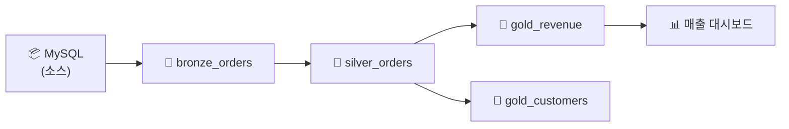

# 데이터 리니지

## 리니지란?

> 💡 **데이터 리니지(Data Lineage)**란 데이터가 **어디서 왔고(upstream), 어디로 가는지(downstream)**를 추적하는 기능입니다. "이 테이블의 데이터는 어떤 소스에서 왔지?", "이 컬럼을 변경하면 어디에 영향이 가지?"라는 질문에 답할 수 있습니다.

---

## 리니지 확인 방법

Catalog Explorer에서 테이블을 선택한 후 **Lineage** 탭을 클릭하면, 해당 테이블의 upstream(입력 소스)과 downstream(의존하는 테이블/대시보드)을 시각적으로 확인할 수 있습니다.

---

## 리니지 활용 사례

| 사례 | 설명 |
|------|------|
| **영향도 분석** | 소스 테이블의 스키마를 변경하면 어떤 다운스트림에 영향이 있는지 확인합니다 |
| **데이터 품질 추적** | Gold 테이블에 이상이 있을 때, 어느 단계에서 문제가 발생했는지 추적합니다 |
| **규정 준수** | 개인정보가 어떤 경로로 흘러가는지 파악하여 GDPR 등 규정을 준수합니다 |

> 🆕 Unity Catalog는 **테이블 수준**과 **컬럼 수준** 리니지를 모두 지원합니다.

---

## 참고 링크

- [Databricks: Data lineage](https://docs.databricks.com/aws/en/data-governance/unity-catalog/data-lineage.html)
