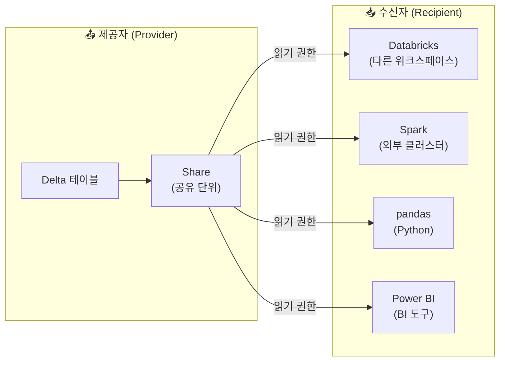

# Delta Sharing — 조직 간 데이터 공유

## 개념

> 💡 **Delta Sharing**은 조직 간에 데이터를 **안전하게 공유**할 수 있는 **오픈 프로토콜**입니다. 데이터를 복사하지 않고, 수신자에게 읽기 권한만 부여하여 원본 데이터에 직접 접근할 수 있게 합니다.

### 왜 Delta Sharing이 필요한가요?

전통적으로 조직 간 데이터 공유는 다음과 같은 방법으로 이루어졌습니다.

| 기존 방법 | 문제점 |
|-----------|--------|
| **파일 전송 (SFTP, Email)** | 데이터 복사 → 보안 위험, 버전 불일치, 대용량 불가 |
| **API 구축** | 개발 비용 높음, 유지보수 부담 |
| **공유 DB 접근 권한** | 보안 위험, 세밀한 제어 어려움 |
| **클라우드 스토리지 공유** | 플랫폼 종속, 권한 관리 복잡 |

Delta Sharing은 이 문제를 해결합니다.

| Delta Sharing 장점 | 설명 |
|--------------------|------|
| **데이터 복사 없음** | 수신자가 원본 데이터를 직접 읽습니다. 복사본이 생기지 않습니다 |
| **오픈 프로토콜** | Databricks 없이도 pandas, Spark, Power BI 등으로 읽을 수 있습니다 |
| **세밀한 제어** | 테이블/파티션 단위로 공유 범위를 지정합니다 |
| **실시간 최신 데이터** | 원본 테이블이 갱신되면 수신자도 최신 데이터를 봅니다 |
| **감사 추적** | 누가, 언제, 어떤 데이터에 접근했는지 기록됩니다 |

---

## Delta Sharing의 구성 요소



| 구성 요소 | 설명 |
|-----------|------|
| **Provider (제공자)** | 데이터를 공유하는 쪽입니다. Share를 생성하고 테이블을 추가합니다 |
| **Share** | 공유 단위입니다. 하나의 Share에 여러 테이블을 포함할 수 있습니다 |
| **Recipient (수신자)** | 데이터를 받는 쪽입니다. Databricks 사용자일 수도, 외부 사용자일 수도 있습니다 |
| **Sharing Server** | Unity Catalog가 제공하는 공유 서버입니다 |

---

## 공유 방법

### Databricks-to-Databricks 공유

같은 Databricks 계정 내의 다른 워크스페이스 또는 다른 Databricks 계정과 공유합니다.

```sql
-- 1. Share 생성
CREATE SHARE IF NOT EXISTS customer_insights
COMMENT '고객 분석 데이터 공유';

-- 2. Share에 테이블 추가
ALTER SHARE customer_insights
ADD TABLE gold.customer_summary;

-- 특정 파티션만 공유 (선택)
ALTER SHARE customer_insights
ADD TABLE gold.regional_sales
PARTITION (region = '서울');

-- 3. 수신자 생성 (Databricks 계정)
CREATE RECIPIENT IF NOT EXISTS partner_analytics
USING ID '<수신자-sharing-identifier>';

-- 4. 수신자에게 Share 접근 권한 부여
GRANT SELECT ON SHARE customer_insights TO RECIPIENT partner_analytics;
```

### Open Sharing (외부 수신자)

Databricks를 사용하지 않는 외부 조직에도 데이터를 공유할 수 있습니다.

```sql
-- 외부 수신자 생성 (인증 토큰 방식)
CREATE RECIPIENT IF NOT EXISTS external_partner
COMMENT '외부 파트너사';

-- 활성화 링크/토큰 확인
DESCRIBE RECIPIENT external_partner;
-- → activation_link가 생성됩니다. 이 링크를 수신자에게 전달합니다.
```

수신자는 활성화 링크를 통해 **크레덴셜 파일**을 다운로드하고, 이를 사용하여 데이터에 접근합니다.

---

## 수신자 측에서 데이터 접근

### Python (pandas)

```python
import delta_sharing

# 프로필 파일 경로 (활성화 시 다운로드한 파일)
profile_file = "/path/to/config.share"

# 사용 가능한 테이블 목록 확인
client = delta_sharing.SharingClient(profile_file)
print(client.list_all_tables())

# 데이터를 pandas DataFrame으로 로드
df = delta_sharing.load_as_pandas(
    f"{profile_file}#share_name.schema_name.table_name"
)
print(df.head())
```

### Apache Spark

```python
df = (spark.read
    .format("deltaSharing")
    .load(f"{profile_file}#share_name.schema_name.table_name")
)
df.show()
```

### Power BI

Power BI에서도 Delta Sharing 커넥터를 통해 공유 데이터에 직접 연결할 수 있습니다.

---

## 공유 관리

```sql
-- Share에 포함된 테이블 확인
SHOW ALL IN SHARE customer_insights;

-- Share에서 테이블 제거
ALTER SHARE customer_insights
REMOVE TABLE gold.customer_summary;

-- 수신자 목록 확인
SHOW RECIPIENTS;

-- 수신자의 접근 기록 확인
SHOW GRANTS ON SHARE customer_insights;

-- 수신자 삭제 (접근 권한 즉시 해제)
DROP RECIPIENT external_partner;

-- Share 삭제
DROP SHARE customer_insights;
```

---

## 활용 시나리오

| 시나리오 | 설명 |
|----------|------|
| **본사 ↔ 자회사** | 본사의 매출 데이터를 자회사에 공유합니다 |
| **데이터 제공 사업** | 데이터를 상품으로 외부 고객에게 판매합니다 |
| **파트너 협업** | 공급망 데이터를 파트너사와 실시간 공유합니다 |
| **규제 보고** | 규제 기관에 특정 데이터를 안전하게 공유합니다 |
| **멀티 리전** | 다른 리전/클라우드의 Databricks와 데이터를 공유합니다 |

---

## 보안 고려사항

| 항목 | 설명 |
|------|------|
| **읽기 전용** | 수신자는 데이터를 읽기만 할 수 있고, 수정/삭제할 수 없습니다 |
| **세밀한 범위** | 테이블 단위, 파티션 단위로 공유 범위를 제한합니다 |
| **감사 로그** | 모든 공유 접근이 `system.access.audit`에 기록됩니다 |
| **수신자 제거** | 수신자를 삭제하면 접근 권한이 즉시 해제됩니다 |
| **토큰 만료** | Open Sharing의 토큰에 만료 기간을 설정할 수 있습니다 |
| **IP 제한** | 수신자의 접근 IP를 제한할 수 있습니다 |

---

## 정리

| 핵심 개념 | 설명 |
|-----------|------|
| **Delta Sharing** | 조직 간 데이터를 안전하게 공유하는 오픈 프로토콜입니다 |
| **Share** | 공유할 테이블의 묶음입니다 |
| **Recipient** | 데이터를 받는 수신자입니다 |
| **데이터 복사 없음** | 수신자가 원본을 직접 읽습니다 |
| **오픈 프로토콜** | Databricks 없이도 pandas, Spark, Power BI로 접근 가능합니다 |

---

## 참고 링크

- [Databricks: Delta Sharing](https://docs.databricks.com/aws/en/data-sharing/)
- [Databricks: Share data](https://docs.databricks.com/aws/en/data-sharing/share-data.html)
- [Delta Sharing Official](https://delta.io/sharing/)
- [Azure Databricks: Delta Sharing](https://learn.microsoft.com/en-us/azure/databricks/data-sharing/)
