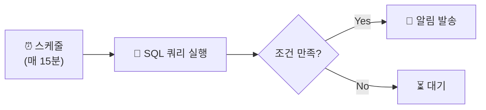

# 알림과 스케줄링

## SQL Alerts

> 💡 **Alert(알림)**는 SQL 쿼리를 주기적으로 실행하여, 결과가 **특정 조건을 만족하면 자동으로 알림을 발송**하는 기능입니다. 이상 거래 감지, SLA 위반 모니터링, 재고 부족 경고 등에 활용됩니다.

---

## Alert의 동작 방식



---

## Alert 생성

### 쿼리 예시

```sql
-- 실패 주문 수 모니터링
SELECT COUNT(*) AS failed_orders
FROM silver_orders
WHERE status = 'FAILED'
  AND order_date >= CURRENT_TIMESTAMP() - INTERVAL 1 HOUR;

-- 파이프라인 지연 감지
SELECT COUNT(*) AS stale_tables
FROM information_schema.tables
WHERE table_schema = 'gold'
  AND TIMESTAMPDIFF(HOUR, last_modified, CURRENT_TIMESTAMP()) > 4;

-- 비용 급증 감지
WITH today AS (SELECT SUM(usage_quantity) AS dbus FROM system.billing.usage WHERE usage_date = CURRENT_DATE()),
last_week AS (SELECT SUM(usage_quantity) AS dbus FROM system.billing.usage WHERE usage_date = CURRENT_DATE() - 7)
SELECT ROUND(today.dbus / NULLIF(last_week.dbus, 0) * 100, 1) AS pct_of_last_week FROM today, last_week;
```

### 조건 설정

| 설정 | 설명 | 예시 |
|------|------|------|
| Value Column | 모니터링할 값 | `failed_orders` |
| Condition | 비교 조건 | `>`, `>=`, `<`, `<=`, `=`, `!=` |
| Threshold | 임계값 | `100` |

### 알림 채널

| 채널 | 설명 |
|------|------|
| **이메일** | 이메일 주소 입력 |
| **Slack** | Incoming Webhook URL |
| **PagerDuty** | Integration Key |
| **Teams** | Webhook URL |

### Alert 상태

| 상태 | 의미 |
|------|------|
| 🔴 **TRIGGERED** | 조건 만족. 알림 발송됨 |
| 🟢 **OK** | 정상 상태 |
| ⚪ **UNKNOWN** | 미실행 또는 쿼리 실패 |

---

## 대시보드 스케줄 갱신

대시보드 데이터를 자동 갱신하고 이메일/Slack으로 전송합니다.

| 설정 | 옵션 |
|------|------|
| **갱신 빈도** | 매시간, 매일, 매주, 커스텀 Cron |
| **전송 대상** | 이메일, Slack |
| **전송 형식** | 링크, PDF 첨부, 인라인 이미지 |

---

## 참고 링크

- [Databricks: Alerts](https://docs.databricks.com/aws/en/sql/user/alerts/)
- [Databricks: Dashboard schedules](https://docs.databricks.com/aws/en/aibi/dashboards/schedule.html)
