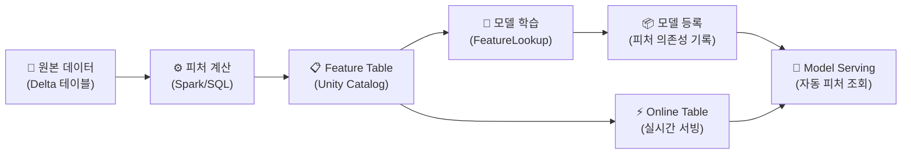

# Feature Engineering 개요

## 피처란?

> 💡 **피처(Feature)** 는 ML 모델의 입력으로 사용되는 **개별 데이터 속성**입니다. 예를 들어, 사기 감지 모델에서 "거래 금액", "거래 시간", "최근 7일 거래 횟수", "해외 거래 여부" 등이 피처입니다.

모델의 성능은 알고리즘보다 **피처의 품질**에 더 크게 좌우되는 경우가 많습니다. 좋은 피처를 설계하고 관리하는 것이 Feature Engineering의 핵심입니다.

---

## 왜 Feature Engineering이 중요한가요?

### 피처 관리의 문제점

| 문제 | 설명 |
|------|------|
| **중복 작업** | 여러 팀이 같은 피처를 각자 만들어 사용합니다 |
| **학습-서빙 불일치** | 학습 시 사용한 피처와 서빙 시 사용한 피처가 다릅니다 (Training-Serving Skew) |
| **데이터 유출** | 미래 데이터가 학습에 포함되어 현실과 다른 성능을 보입니다 (Data Leakage) |
| **버전 관리 부재** | 어떤 피처로 학습한 모델인지 추적이 어렵습니다 |

### Databricks Feature Engineering의 해결

| 해결 | 설명 |
|------|------|
| **중앙 피처 저장소** | Unity Catalog의 Feature Table에 피처를 중앙 관리합니다 |
| **자동 피처 조회** | `FeatureLookup`으로 학습과 서빙에서 동일한 피처를 사용합니다 |
| **Point-in-Time Lookup** | 시간 기반으로 피처를 조회하여 데이터 유출을 방지합니다 |
| **Online Tables** | 실시간 서빙에 최적화된 피처 저장소를 제공합니다 |

---

## Feature Engineering 워크플로우



---

## Feature Table

> 💡 **Feature Table**은 Unity Catalog의 Delta 테이블을 **피처 저장소**로 활용하는 것입니다. Primary Key를 기준으로 피처를 관리하며, 학습과 서빙 시 동일한 피처를 일관되게 사용할 수 있습니다.

### 피처 테이블 생성

```python
from databricks.feature_engineering import FeatureEngineeringClient

fe = FeatureEngineeringClient()

# 피처 계산
customer_features_df = spark.sql("""
    SELECT
        customer_id,
        COUNT(*) AS total_orders,
        SUM(amount) AS lifetime_revenue,
        AVG(amount) AS avg_order_value,
        MAX(order_date) AS last_order_date,
        DATEDIFF(CURRENT_DATE(), MAX(order_date)) AS days_since_last_order,
        COUNT(DISTINCT product_category) AS unique_categories
    FROM silver_orders
    GROUP BY customer_id
""")

# Feature Table로 등록
fe.create_table(
    name="catalog.schema.customer_features",
    primary_keys=["customer_id"],
    df=customer_features_df,
    description="고객 행동 기반 피처"
)
```

### 피처 업데이트

```python
# 새로운 피처 데이터로 업데이트
fe.write_table(
    name="catalog.schema.customer_features",
    df=updated_features_df,
    mode="merge"  # 기존 데이터와 병합 (upsert)
)
```

---

## FeatureLookup — 학습 데이터 생성

```python
from databricks.feature_engineering import FeatureLookup

# 학습 데이터에 피처를 자동으로 결합
training_set = fe.create_training_set(
    df=labels_df,  # 라벨만 있는 데이터 (customer_id, is_churned)
    feature_lookups=[
        FeatureLookup(
            table_name="catalog.schema.customer_features",
            lookup_key="customer_id"
        ),
        FeatureLookup(
            table_name="catalog.schema.product_features",
            lookup_key="product_id",
            feature_names=["avg_rating", "return_rate"]  # 특정 피처만 선택
        )
    ],
    label="is_churned"
)

training_df = training_set.load_df()
# → customer_id, is_churned + total_orders, lifetime_revenue, avg_order_value, ... + avg_rating, return_rate
```

---

## Point-in-Time Lookup

> 💡 **Point-in-Time Lookup**은 시간 기반 피처를 결합할 때, 해당 시점 기준으로만 과거 데이터를 사용하여 **미래 데이터 유출(Data Leakage)** 을 방지하는 기능입니다.

```python
training_set = fe.create_training_set(
    df=labels_df,
    feature_lookups=[
        FeatureLookup(
            table_name="catalog.schema.customer_features",
            lookup_key="customer_id",
            timestamp_lookup_key="event_timestamp"  # 이 시점 기준으로 조회
        )
    ],
    label="is_churned"
)
```

---

## 정리

| 핵심 개념 | 설명 |
|-----------|------|
| **Feature** | ML 모델의 입력 데이터 속성입니다 |
| **Feature Table** | Unity Catalog에서 피처를 중앙 관리하는 테이블입니다 |
| **FeatureLookup** | 학습 데이터에 피처를 자동으로 결합합니다 |
| **Point-in-Time** | 시간 기준으로 피처를 조회하여 데이터 유출을 방지합니다 |
| **Online Table** | 실시간 서빙에 최적화된 피처 저장소입니다 |

---

## 참고 링크

- [Databricks: Feature Engineering](https://docs.databricks.com/aws/en/machine-learning/feature-store/)
- [Databricks: Feature tables](https://docs.databricks.com/aws/en/machine-learning/feature-store/feature-tables.html)
