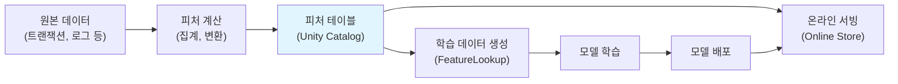
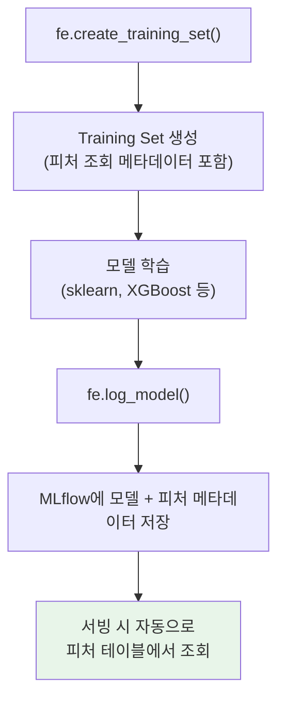

# 피처 테이블 관리 (Feature Table Management)

## 왜 피처 테이블 관리가 중요한가?

머신러닝 프로젝트에서 데이터 과학자들이 가장 많은 시간을 보내는 단계는 **피처 엔지니어링(Feature Engineering)** 입니다. 문제는 각자가 만든 피처가 노트북 곳곳에 흩어져 있어, 재사용이 어렵고 일관성이 깨지기 쉽다는 것입니다.

| 문제 | 설명 |
|------|------|
| **중복 작업** | 동일한 피처를 여러 팀이 각자 계산합니다 (예: "고객 30일 평균 거래 금액") |
| **학습-서빙 불일치** | 학습 시 계산한 피처와 온라인 서빙 시 계산한 피처가 다릅니다 (Training-Serving Skew) |
| **버전 관리 부재** | 피처 정의가 바뀌어도 이전 버전을 추적할 수 없습니다 |
| **발견 불가** | 다른 팀이 만든 유용한 피처가 있는지 알 수 없습니다 |

> 💡 **피처 테이블(Feature Table)** 이란 ML 학습에 사용되는 피처들을 **기본 키(Primary Key)** 와 함께 저장한 Delta 테이블입니다. Unity Catalog에 등록되어 검색, 공유, 리니지 추적이 가능합니다. Databricks Feature Engineering은 이러한 피처 테이블을 체계적으로 생성, 관리, 조회하는 프레임워크입니다.

---

## 핵심 개념



### 피처 테이블 vs 일반 Delta 테이블

| 특성 | 일반 Delta 테이블 | 피처 테이블 |
|------|------------------|------------|
| **기본 키** | 선택 사항 | 필수 (Lookup에 사용) |
| **타임스탬프 키** | 없음 | 선택 (Point-in-time lookup용) |
| **자동 리니지** | 테이블 레벨만 | 피처 → 모델 → 서빙까지 추적 |
| **온라인 스토어 동기화** | 수동 | 자동 퍼블리시 지원 |
| **Feature UI** | 표시 안 됨 | Feature 탭에서 검색/탐색 가능 |
| **서빙 시 자동 조회** | 불가 | 모델 배포 시 자동 피처 조회 |

---

## 피처 테이블 생성

### FeatureEngineeringClient 사용

```python
from databricks.feature_engineering import FeatureEngineeringClient
from pyspark.sql import functions as F

fe = FeatureEngineeringClient()

# 1. 원본 데이터에서 피처 계산
transactions_df = spark.table("catalog.schema.transactions")

customer_features_df = (
    transactions_df
    .groupBy("customer_id")
    .agg(
        F.count("*").alias("total_transactions"),
        F.avg("amount").alias("avg_transaction_amount"),
        F.max("amount").alias("max_transaction_amount"),
        F.stddev("amount").alias("stddev_transaction_amount"),
        F.countDistinct("merchant_category").alias("unique_merchants"),
        F.avg(F.when(F.col("hour").between(0, 6), 1).otherwise(0)).alias("night_transaction_ratio"),
        F.max("transaction_date").alias("last_transaction_date")
    )
)

# 2. 피처 테이블 생성
fe.create_table(
    name="catalog.schema.customer_features",
    primary_keys=["customer_id"],
    df=customer_features_df,
    description="고객별 거래 패턴 피처 (30일 집계)",
    tags={"team": "fraud-detection", "refresh": "daily"}
)
```

### 타임스탬프 키가 있는 피처 테이블

시계열 피처에는 **타임스탬프 키**를 추가하여 Point-in-time Lookup을 지원합니다.

```python
# 시간별 집계 피처 (타임스탬프 포함)
hourly_features_df = (
    transactions_df
    .groupBy("customer_id", F.window("transaction_time", "1 hour").alias("time_window"))
    .agg(
        F.count("*").alias("hourly_transaction_count"),
        F.sum("amount").alias("hourly_transaction_sum")
    )
    .withColumn("timestamp", F.col("time_window.end"))
    .drop("time_window")
)

fe.create_table(
    name="catalog.schema.customer_hourly_features",
    primary_keys=["customer_id"],
    timestamp_keys=["timestamp"],    # Point-in-time lookup용
    df=hourly_features_df,
    description="고객별 시간대별 거래 피처"
)
```

---

## 피처 명명 규칙 및 조직화

체계적인 피처 관리를 위해 **일관된 명명 규칙**을 정하는 것이 중요합니다.

### 추천 명명 규칙

| 구분 | 규칙 | 예시 |
|------|------|------|
| **테이블 이름** | `{entity}_features` 또는 `{entity}_{domain}_features` | `customer_features`, `product_behavior_features` |
| **피처 이름** | `{집계방법}_{대상}_{기간}` | `avg_amount_30d`, `count_transactions_7d` |
| **타임스탬프 키** | `timestamp` 또는 `event_time` | `timestamp` |
| **기본 키** | 엔티티의 고유 식별자 | `customer_id`, `product_id` |

### 카탈로그 구조

```
catalog
└── ml_features (스키마)
    ├── customer_features           -- 고객 정적 피처
    ├── customer_hourly_features    -- 고객 시간대별 피처
    ├── product_features            -- 상품 피처
    ├── merchant_features           -- 가맹점 피처
    └── customer_product_features   -- 고객-상품 교차 피처
```

> 💡 **피처 검색**: Unity Catalog에 등록된 피처 테이블은 Databricks UI의 **Feature** 탭에서 검색하고 메타데이터(설명, 태그, 리니지)를 확인할 수 있습니다. 팀 간 피처 공유에 매우 유용합니다.

---

## FeatureLookup 상세

`FeatureLookup`은 피처 테이블에서 원하는 피처를 **기본 키로 조인하여 가져오는** 메커니즘입니다. 학습 데이터를 만들 때 라벨 데이터에 피처를 결합하는 핵심 도구입니다.

### 기본 사용법

```python
from databricks.feature_engineering import FeatureEngineeringClient, FeatureLookup

fe = FeatureEngineeringClient()

# 라벨 데이터 (기본 키 + 타겟 변수만 포함)
labels_df = spark.table("catalog.schema.fraud_labels")
# 컬럼: customer_id, transaction_id, is_fraud, event_time

# 피처 조회 정의
feature_lookups = [
    # 고객 피처 전체 가져오기
    FeatureLookup(
        table_name="catalog.schema.customer_features",
        lookup_key="customer_id"
        # feature_names를 생략하면 기본 키를 제외한 모든 피처를 가져옵니다
    ),

    # 특정 피처만 선택하여 가져오기
    FeatureLookup(
        table_name="catalog.schema.merchant_features",
        feature_names=["merchant_risk_score", "avg_fraud_rate"],
        lookup_key="merchant_id"
    ),

    # 조인 키 이름이 다른 경우 매핑
    FeatureLookup(
        table_name="catalog.schema.product_features",
        lookup_key=["product_id"],
        rename_outputs={"product_category": "item_category"}  # 피처 이름 변경
    )
]

# 학습 데이터셋 생성
training_set = fe.create_training_set(
    df=labels_df,
    feature_lookups=feature_lookups,
    label="is_fraud",
    exclude_columns=["transaction_id"]  # 학습에 불필요한 컬럼 제외
)

# Pandas DataFrame으로 변환하여 학습
training_df = training_set.load_df()
display(training_df)
```

### FeatureLookup이 모델에 기록되는 원리



> 💡 **핵심 원리**: `fe.log_model()`로 모델을 저장하면, 어떤 피처 테이블에서 어떤 피처를 사용했는지가 모델에 기록됩니다. 서빙 시에는 기본 키만 전달하면 나머지 피처는 자동으로 피처 테이블에서 조회됩니다.

---

## Point-in-time Lookups

시계열 데이터에서는 **미래 데이터 누수(Data Leakage)** 를 방지하기 위해 Point-in-time Lookup이 필수적입니다. 이벤트 발생 시점 기준으로 **그 시점까지 알 수 있었던 피처만** 가져옵니다.

> 💡 **데이터 누수(Data Leakage)** 란 학습 시에는 알 수 없는 미래 데이터가 피처로 포함되는 것을 말합니다. 예를 들어, 화요일에 발생한 거래의 사기 여부를 예측할 때 수요일의 피처 값을 사용하면 실제 서빙 환경과 달라집니다.

```python
# Point-in-time Lookup 예시
training_set = fe.create_training_set(
    df=labels_df,  # event_time 컬럼 포함
    feature_lookups=[
        FeatureLookup(
            table_name="catalog.schema.customer_hourly_features",
            lookup_key="customer_id",
            timestamp_lookup_key="event_time"  # 이 시점 기준으로 조회
        )
    ],
    label="is_fraud"
)

# event_time이 2025-03-15 14:00인 레코드 → 14:00 이전의 최신 피처만 가져옴
# event_time이 2025-03-15 16:00인 레코드 → 16:00 이전의 최신 피처만 가져옴
```

### Point-in-time Lookup 동작 원리

| 라벨 데이터 | 피처 테이블 | 결과 |
|------------|-----------|------|
| customer_id=A, event_time=14:00 | customer_id=A, timestamp=13:00, count=5 | count=5 (13:00 피처 사용) |
| customer_id=A, event_time=14:00 | customer_id=A, timestamp=15:00, count=8 | **사용 안 함** (미래 데이터) |
| customer_id=A, event_time=16:00 | customer_id=A, timestamp=15:00, count=8 | count=8 (15:00 피처 사용) |

---

## 온라인 vs 오프라인 스토어

| 특성 | 오프라인 스토어 | 온라인 스토어 |
|------|---------------|-------------|
| **저장소** | Delta 테이블 (Unity Catalog) | DynamoDB, Azure Cosmos DB 등 |
| **지연 시간** | 초~분 단위 | 밀리초 단위 |
| **용도** | 배치 학습, 분석, 백필 | 실시간 추론 서빙 |
| **데이터 크기** | 수십 TB까지 | 최신 스냅샷만 저장 |
| **비용** | 상대적으로 저렴 | 읽기 처리량에 따라 증가 |

### 온라인 스토어 퍼블리시

```python
from databricks.feature_engineering import FeatureEngineeringClient
from databricks.feature_engineering.online_store_spec import AmazonDynamoDBSpec, AzureCosmosDBSpec

fe = FeatureEngineeringClient()

# AWS DynamoDB로 퍼블리시
dynamodb_spec = AmazonDynamoDBSpec(
    region="ap-northeast-2",
    table_name="customer_features_online",
    read_secret_prefix="feature-store/dynamo",
    write_secret_prefix="feature-store/dynamo"
)

fe.publish_table(
    name="catalog.schema.customer_features",
    online_store=dynamodb_spec,
    mode="merge"  # 기존 데이터와 병합
)
```

```python
# Azure Cosmos DB로 퍼블리시
cosmosdb_spec = AzureCosmosDBSpec(
    account_uri="https://my-cosmos.documents.azure.com:443/",
    read_secret="feature-store/cosmos-key",
    write_secret="feature-store/cosmos-key"
)

fe.publish_table(
    name="catalog.schema.customer_features",
    online_store=cosmosdb_spec,
    mode="merge"
)
```

---

## 실습: 피처 테이블 전체 워크플로

다음은 피처 생성부터 모델 학습, 서빙까지의 전체 워크플로입니다.

```python
from databricks.feature_engineering import FeatureEngineeringClient, FeatureLookup
from sklearn.ensemble import GradientBoostingClassifier
from sklearn.metrics import f1_score
import mlflow

fe = FeatureEngineeringClient()

# ── Step 1: 피처 계산 및 테이블 생성 ──
customer_features_df = (
    spark.table("catalog.schema.transactions")
    .groupBy("customer_id")
    .agg(
        F.count("*").alias("total_transactions"),
        F.avg("amount").alias("avg_amount"),
        F.stddev("amount").alias("stddev_amount"),
        F.countDistinct("merchant_id").alias("unique_merchants")
    )
)

fe.create_table(
    name="catalog.ml_features.customer_features",
    primary_keys=["customer_id"],
    df=customer_features_df,
    description="고객별 거래 통계 피처"
)

# ── Step 2: 학습 데이터 생성 (FeatureLookup) ──
labels_df = spark.table("catalog.schema.fraud_labels")

training_set = fe.create_training_set(
    df=labels_df,
    feature_lookups=[
        FeatureLookup(
            table_name="catalog.ml_features.customer_features",
            lookup_key="customer_id"
        )
    ],
    label="is_fraud"
)

training_df = training_set.load_df().toPandas()

# ── Step 3: 모델 학습 ──
X = training_df.drop(columns=["is_fraud", "customer_id"])
y = training_df["is_fraud"]

model = GradientBoostingClassifier(n_estimators=200, learning_rate=0.1)
model.fit(X, y)

# ── Step 4: 모델 저장 (피처 메타데이터 포함) ──
with mlflow.start_run(run_name="fraud-with-feature-store"):
    fe.log_model(
        model=model,
        artifact_path="model",
        flavor=mlflow.sklearn,
        training_set=training_set,  # 피처 조회 정보가 모델에 기록됨
        registered_model_name="catalog.schema.fraud_model_with_features"
    )

# ── Step 5: 서빙 시 자동 피처 조회 ──
# 엔드포인트에 배포 후, 기본 키만 전달하면 피처는 자동 조회됩니다
# 요청 예시: {"dataframe_records": [{"customer_id": "C12345"}]}
# → customer_features 테이블에서 피처를 자동으로 가져와 예측 수행
```

---

## 피처 테이블 업데이트

기존 피처 테이블에 새로운 데이터를 추가하거나 갱신할 수 있습니다.

```python
# 방법 1: merge (기존 키와 겹치면 업데이트, 새 키는 추가)
fe.write_table(
    name="catalog.ml_features.customer_features",
    df=new_features_df,
    mode="merge"
)

# 방법 2: overwrite (전체 교체)
fe.write_table(
    name="catalog.ml_features.customer_features",
    df=full_features_df,
    mode="overwrite"
)
```

> ⚠️ **주의**: `overwrite` 모드는 기존 데이터를 완전히 교체합니다. 점진적 업데이트에는 반드시 `merge` 모드를 사용하십시오.

---

## 모범 사례 및 안티패턴

### 모범 사례

| 항목 | 권장 사항 |
|------|----------|
| **기본 키 설계** | 비즈니스 엔티티의 고유 식별자를 사용합니다 (`customer_id`, `product_id`) |
| **피처 분리** | 도메인별로 별도의 피처 테이블을 만듭니다 (고객, 상품, 가맹점 등) |
| **설명 추가** | `description`과 `tags`를 반드시 작성하여 팀 간 검색이 가능하게 합니다 |
| **Point-in-time** | 시계열 피처에는 반드시 타임스탬프 키를 포함합니다 |
| **스케줄 갱신** | Databricks Jobs로 피처 테이블을 정기적으로 갱신합니다 |
| **테스트** | 피처 계산 로직에 대한 단위 테스트를 작성합니다 |

### 안티패턴

| 안티패턴 | 문제점 | 개선 방법 |
|---------|--------|----------|
| **거대한 단일 테이블** | 하나의 테이블에 수백 개 피처를 넣으면 관리와 갱신이 어렵습니다 | 도메인별로 분리하고 FeatureLookup으로 결합합니다 |
| **노트북에서 직접 조인** | 피처 조회 로직이 모델에 기록되지 않아 서빙 시 불일치가 발생합니다 | 반드시 `FeatureLookup` + `fe.log_model()`을 사용합니다 |
| **타임스탬프 없는 시계열 피처** | 미래 데이터 누수로 모델 성능이 과대평가됩니다 | `timestamp_keys`를 추가하고 `timestamp_lookup_key`를 사용합니다 |
| **피처 이름에 버전 포함** | `avg_amount_v2`, `avg_amount_v3` 등은 혼란을 초래합니다 | 테이블 자체를 버전 관리하거나, Delta 테이블의 시간 여행을 활용합니다 |
| **수동 피처 복사** | 피처를 CSV로 내보내 다른 프로젝트에서 사용하면 일관성이 깨집니다 | Unity Catalog의 권한 설정으로 테이블을 직접 공유합니다 |

---

## 정리

| 항목 | 핵심 포인트 |
|------|------------|
| **피처 테이블** | 기본 키 + 피처를 Delta 테이블로 관리하여 재사용성과 일관성을 확보합니다 |
| **FeatureLookup** | 라벨 데이터에 피처를 자동으로 결합하고, 메타데이터를 모델에 기록합니다 |
| **Point-in-time** | 타임스탬프 키로 미래 데이터 누수를 방지합니다 |
| **온라인/오프라인** | 오프라인은 학습용, 온라인은 실시간 서빙용으로 동일한 피처를 이중 저장합니다 |
| **fe.log_model()** | 피처 조회 정보가 모델에 포함되어, 서빙 시 기본 키만으로 예측이 가능합니다 |
| **명명 규칙** | 일관된 테이블/피처 명명과 설명으로 팀 간 피처 공유를 촉진합니다 |

---

## 참고 링크

- [Databricks: Feature tables](https://docs.databricks.com/aws/en/machine-learning/feature-store/feature-tables.html)
- [Databricks: Feature Engineering Client API](https://docs.databricks.com/aws/en/machine-learning/feature-store/python-api.html)
- [Databricks: Point-in-time lookups](https://docs.databricks.com/aws/en/machine-learning/feature-store/time-series.html)
- [Databricks: Online Store](https://docs.databricks.com/aws/en/machine-learning/feature-store/online-tables.html)
- [Databricks Blog: Feature Engineering Best Practices](https://www.databricks.com/blog)
