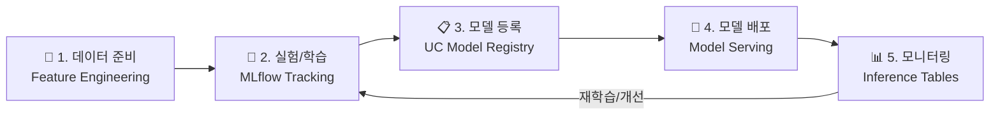

# Databricks ML 개요

## 왜 Databricks에서 ML을 하나요?

전통적으로 ML 워크플로우는 **도구가 파편화**되어 있었습니다. 데이터 준비는 Spark, 모델 학습은 Jupyter + GPU 서버, 실험 추적은 별도 서버, 모델 배포는 또 다른 도구... 이런 분산된 환경은 관리가 복잡하고, 데이터를 여러 시스템 간에 복사해야 하며, 거버넌스 적용이 어렵습니다.

Databricks는 이 모든 과정을 **하나의 플랫폼**에서 수행할 수 있게 합니다.

---

## ML 워크플로우 전체 그림



| 단계 | Databricks 도구 | 역할 | 전통적 도구 (비교) |
|------|----------------|------|------------------|
| **데이터 준비** | Feature Engineering, Spark | 피처 테이블 생성, 학습 데이터 준비 | pandas (로컬), 별도 Feature Store |
| **실험/학습** | MLflow Tracking, Notebooks | 하이퍼파라미터 튜닝, 모델 학습, 실험 비교 | Jupyter + W&B / TensorBoard |
| **모델 등록** | Unity Catalog Models | 모델 버전 관리, 승격(Alias) 관리 | 수동 파일 관리 또는 별도 Registry |
| **모델 배포** | Model Serving | REST API 엔드포인트로 실시간 추론 | Flask + Docker + K8s |
| **모니터링** | Inference Tables, Lakehouse Monitoring | 성능 추적, 드리프트 감지, 비용 추적 | 별도 모니터링 도구 |

---

## 전통 ML vs GenAI 워크플로우

Databricks는 전통적인 ML(테이블 데이터 기반 예측)과 GenAI(LLM 기반 에이전트) **모두**를 지원합니다.

| 비교 | 전통 ML | GenAI / LLM |
|------|---------|------------|
| **데이터** | 정형 데이터 (테이블) | 텍스트, 문서, 이미지 |
| **모델** | scikit-learn, XGBoost, PyTorch | Llama, GPT, Claude + RAG/Agent |
| **학습** | 커스텀 모델 직접 학습 | 사전학습 모델 사용 + Fine-tuning (선택) |
| **입력** | 피처 벡터 (수치) | 자연어 텍스트, 프롬프트 |
| **출력** | 예측값 (수치, 클래스) | 생성된 텍스트, 도구 호출 |
| **평가** | accuracy, F1, AUC | Correctness, Safety, Groundedness |
| **Databricks 도구** | Feature Store, Tracking, Serving | Vector Search, Tracing, Agent Framework |

### 전통 ML 예시: 이탈 예측

```python
import mlflow
from sklearn.ensemble import GradientBoostingClassifier

mlflow.autolog()  # 자동 로깅 활성화

# 데이터 준비
train_df = spark.table("gold.customer_features").toPandas()
X = train_df.drop("churned", axis=1)
y = train_df["churned"]

# 모델 학습 → 자동으로 파라미터/메트릭/모델이 MLflow에 기록됩니다
model = GradientBoostingClassifier(n_estimators=200, max_depth=5)
model.fit(X_train, y_train)
```

### GenAI 예시: 고객 지원 에이전트

```python
import mlflow

# RAG 기반 에이전트 구축
agent = CustomerSupportAgent(
    llm="databricks-meta-llama-3-3-70b-instruct",
    vector_index="catalog.schema.docs_index",
    tools=["get_order_status", "create_ticket"]
)

# MLflow에 에이전트 로깅
with mlflow.start_run():
    mlflow.pyfunc.log_model("agent", python_model=agent)
```

---

## Databricks ML 핵심 컴포넌트 맵

| 카테고리 | 컴포넌트 | 설명 |
|----------|----------|------|
| **컴퓨트** | ML Runtime | ML 라이브러리 사전 설치 |
| | GPU Clusters | 딥러닝/LLM 학습용 GPU |
| **실험 관리** | MLflow Tracking | 파라미터, 메트릭, 아티팩트 추적 |
| | MLflow Autolog | 한 줄로 자동 로깅 |
| | Notebooks | 대화형 개발 환경 |
| **피처** | Feature Engineering | 피처 테이블 생성·관리 |
| | Online Tables | 실시간 피처 서빙 |
| **모델 관리** | UC Model Registry | 모델 버전·Alias 관리 |
| **배포** | Model Serving | REST API 엔드포인트 |
| | Foundation Model API | 내장 LLM (Llama, DBRX 등) |
| **GenAI** | Vector Search | 임베딩 기반 유사도 검색 |
| | Agent Framework | AI 에이전트 개발 |
| | MLflow Tracing | GenAI 실행 흐름 추적 |
| **평가** | MLflow Evaluate | 자동화된 품질 평가 |
| **모니터링** | Inference Tables | 추론 입출력 자동 기록 |
| | Lakehouse Monitoring | 데이터/모델 드리프트 감지 |

---

## 정리

| 핵심 메시지 | 설명 |
|------------|------|
| **통합 플랫폼** | 데이터 준비 → 학습 → 배포 → 모니터링을 하나의 플랫폼에서 수행합니다 |
| **전통 ML + GenAI** | 테이블 데이터 예측부터 LLM 에이전트까지 모두 지원합니다 |
| **거버넌스** | 모델, 피처, 데이터가 모두 Unity Catalog에서 통합 관리됩니다 |
| **MLflow 중심** | 실험 추적, 모델 관리, 트레이싱, 평가를 MLflow가 담당합니다 |

---

## 참고 링크

- [Databricks: AI and Machine Learning](https://docs.databricks.com/aws/en/machine-learning/)
- [Azure Databricks: AI and Machine Learning](https://learn.microsoft.com/en-us/azure/databricks/machine-learning/)
