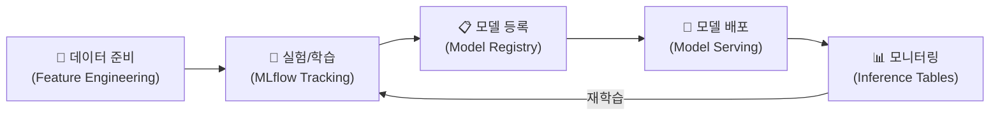

# Databricks ML 개요

## ML 워크플로우 전체 그림

| 단계 | Databricks 도구 | 설명 |
|------|----------------|------|
| 데이터 준비 | Feature Engineering | 피처 테이블 생성 및 관리 |
| 실험/학습 | MLflow Tracking | 파라미터, 메트릭, 아티팩트 추적 |
| 모델 등록 | Unity Catalog Models | 모델 버전 관리, 스테이지 관리 |
| 모델 배포 | Model Serving | 실시간 추론 엔드포인트 |
| 모니터링 | Inference Tables, Lakehouse Monitoring | 드리프트 감지, 성능 추적 |

---

## 참고 링크

- [Databricks: AI and Machine Learning](https://docs.databricks.com/aws/en/machine-learning/)
