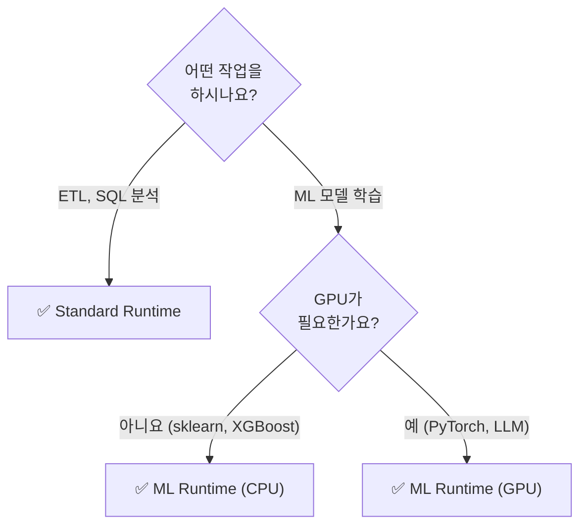

# ML Runtime

## ML Runtime이란?

> 💡 **ML Runtime**은 머신러닝 작업에 필요한 라이브러리가 **사전 설치된** Databricks Runtime입니다. 별도 설치 없이 클러스터를 시작하면 바로 모델 학습을 시작할 수 있습니다.

---

## Runtime 유형별 비교

| Runtime | 포함 내용 | 적합한 워크로드 |
|---------|----------|-------------|
| **Standard Runtime** | Spark + Delta Lake + 기본 Python 라이브러리 | 데이터 엔지니어링, SQL 분석 |
| **ML Runtime** | Standard + **ML/DL 라이브러리** (PyTorch, TensorFlow, scikit-learn 등) | ML 모델 학습, Feature Engineering |
| **ML Runtime (GPU)** | ML Runtime + **GPU 드라이버** (CUDA, cuDNN) | 딥러닝, LLM 파인튜닝, 이미지 처리 |

---

## ML Runtime에 포함된 주요 라이브러리

### 전통 ML

| 라이브러리 | 용도 |
|-----------|------|
| **scikit-learn** | 분류, 회귀, 클러스터링, 전처리 |
| **XGBoost** | 그래디언트 부스팅 (정형 데이터에 강력) |
| **LightGBM** | 경량 그래디언트 부스팅 (대용량 학습에 효율적) |
| **Spark MLlib** | 분산 ML (대용량 데이터) |

### 딥러닝

| 라이브러리 | 용도 |
|-----------|------|
| **PyTorch** | 딥러닝 프레임워크 (연구/프로덕션) |
| **TensorFlow / Keras** | 딥러닝 프레임워크 |
| **Hugging Face Transformers** | 사전학습 모델 (BERT, GPT 등) 활용 |

### 데이터 처리 / 시각화

| 라이브러리 | 용도 |
|-----------|------|
| **pandas** | 데이터 조작 (DataFrame) |
| **NumPy** | 수치 계산 |
| **SciPy** | 과학 계산 |
| **matplotlib / seaborn** | 데이터 시각화 |
| **plotly** | 대화형 시각화 |

### ML Ops

| 라이브러리 | 용도 |
|-----------|------|
| **MLflow** | 실험 추적, 모델 관리, 트레이싱 |
| **Hyperopt** | 하이퍼파라미터 자동 튜닝 |
| **SHAP** | 모델 해석 (피처 중요도) |

---

## GPU Runtime 구성

| GPU 인스턴스 | GPU | 메모리 | 적합한 워크로드 |
|-------------|-----|--------|-------------|
| **g4dn.xlarge** | NVIDIA T4 (16GB) | 4 vCPU, 16GB | 소규모 학습, 추론 |
| **g5.xlarge** | NVIDIA A10G (24GB) | 4 vCPU, 16GB | 중규모 학습 |
| **p3.2xlarge** | NVIDIA V100 (16GB) | 8 vCPU, 61GB | 대규모 학습 |
| **p4d.24xlarge** | NVIDIA A100 × 8 (320GB) | 96 vCPU, 1152GB | LLM 파인튜닝 |

### 멀티 GPU / 멀티 노드 학습

Databricks ML Runtime은 **분산 딥러닝**을 지원합니다.

```python
from pyspark.ml.torch.distributor import TorchDistributor

# 4개 GPU에서 분산 학습
distributor = TorchDistributor(
    num_processes=4,
    local_mode=False,
    use_gpu=True
)
distributor.run(train_function)
```

---

## Runtime 선택 가이드



---

## 정리

| 핵심 개념 | 설명 |
|-----------|------|
| **ML Runtime** | ML 라이브러리가 사전 설치된 Databricks Runtime입니다 |
| **GPU Runtime** | GPU 드라이버(CUDA)가 포함되어 딥러닝에 사용합니다 |
| **사전 설치** | scikit-learn, PyTorch, TensorFlow, XGBoost, MLflow 등이 포함됩니다 |
| **분산 학습** | TorchDistributor로 멀티 GPU/멀티 노드 학습을 지원합니다 |

---

## 참고 링크

- [Databricks: ML Runtime release notes](https://docs.databricks.com/aws/en/release-notes/runtime/ml.html)
- [Databricks: GPU clusters](https://docs.databricks.com/aws/en/compute/gpu.html)
