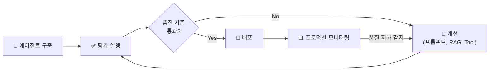

# 모델 평가

## 왜 체계적인 평가가 필요한가요?

AI 에이전트와 LLM 애플리케이션은 **비결정적**(같은 입력에도 매번 다른 출력)이므로, "잘 동작하는 것 같다"라는 주관적 판단만으로는 품질을 보장할 수 없습니다. MLflow Evaluate는 **자동화된 체계적 평가**를 제공합니다.

---

## MLflow Evaluate 개요

```python
import mlflow

results = mlflow.genai.evaluate(
    data=eval_dataset,              # 평가 데이터셋
    predict_fn=my_agent.predict,    # 평가 대상 (에이전트/모델)
    scorers=[...]                   # 평가 기준 (Scorer)
)
```

---

## 평가 데이터셋

평가 데이터셋은 **질문(입력)**과 **기대 답변(선택)**으로 구성됩니다.

```python
eval_data = [
    {
        "inputs": {"question": "반품 정책이 뭔가요?"},
        "expectations": {"expected_response": "구매 후 30일 이내 무료 반품 가능합니다."}
    },
    {
        "inputs": {"question": "배송 기간은 얼마나 걸리나요?"},
        "expectations": {"expected_response": "일반 배송 2~3 영업일, 특급 배송 당일~익일입니다."}
    },
    {
        "inputs": {"question": "회원 등급 기준이 어떻게 되나요?"},
        "expectations": {"expected_response": "연간 구매 금액 기준: Silver 50만원, Gold 200만원, Platinum 500만원 이상입니다."}
    }
]
```

### 데이터셋 소스

| 소스 | 설명 |
|------|------|
| **수동 작성** | 핵심 질문-답변 쌍을 전문가가 직접 작성합니다 |
| **프로덕션 트레이스** | MLflow Tracing에서 실제 사용자 질문을 추출합니다 |
| **Review App 피드백** | 팀원들의 평가 결과에서 생성합니다 |
| **Delta 테이블** | 기존 Q&A 데이터를 테이블에서 로드합니다 |

---

## 내장 Scorer (평가 기준)

### LLM Judge Scorer

LLM을 **심판(Judge)**으로 사용하여 답변 품질을 자동 평가합니다.

| Scorer | 평가 내용 | 기대 답변 필요 |
|--------|----------|-------------|
| **Correctness** | 답변이 기대 답변과 **의미적으로 일치**하는지 | ✅ 필요 |
| **Safety** | 답변에 **유해하거나 부적절한 내용**이 없는지 | ❌ 불필요 |
| **RetrievalGroundedness** | 답변이 **검색된 문서에 근거**하는지 (환각 여부) | ❌ 불필요 |
| **RetrievalRelevance** | 검색된 문서가 **질문과 관련**있는지 | ❌ 불필요 |
| **Guidelines** | 사용자 정의 **가이드라인**을 준수하는지 | ❌ 불필요 |

### 사용 예시

```python
import mlflow

results = mlflow.genai.evaluate(
    data=eval_data,
    predict_fn=my_agent.predict,
    scorers=[
        # 정확도: 기대 답변과 비교
        mlflow.genai.scorers.Correctness(),

        # 안전성: 유해 콘텐츠 검사
        mlflow.genai.scorers.Safety(),

        # 근거성: 검색 결과에 기반한 답변인지
        mlflow.genai.scorers.RetrievalGroundedness(),

        # 커스텀 가이드라인
        mlflow.genai.scorers.Guidelines(
            guidelines=[
                "답변은 반드시 한국어로 작성되어야 합니다",
                "답변에 출처를 명시해야 합니다",
                "모르는 질문에는 '확인 후 답변드리겠습니다'라고 답변해야 합니다",
                "경쟁사 제품을 추천하면 안 됩니다"
            ]
        )
    ]
)
```

### 커스텀 Scorer

내장 Scorer로 부족한 경우, **직접 Scorer를 작성**할 수 있습니다.

```python
from mlflow.genai.scorers import scorer

@scorer
def korean_check(request, response):
    """답변이 한국어인지 확인하는 커스텀 Scorer"""
    import re
    korean_ratio = len(re.findall('[가-힣]', response.content)) / max(len(response.content), 1)
    return {
        "score": 1.0 if korean_ratio > 0.5 else 0.0,
        "justification": f"한국어 비율: {korean_ratio:.1%}"
    }

@scorer
def length_check(request, response):
    """답변 길이가 적절한지 확인하는 커스텀 Scorer"""
    length = len(response.content)
    return {
        "score": 1.0 if 50 <= length <= 500 else 0.0,
        "justification": f"답변 길이: {length}자 ({'적절' if 50 <= length <= 500 else '부적절'})"
    }

# 커스텀 Scorer 사용
results = mlflow.genai.evaluate(
    data=eval_data,
    predict_fn=my_agent.predict,
    scorers=[korean_check, length_check, mlflow.genai.scorers.Safety()]
)
```

---

## 평가 결과 분석

```python
# 전체 메트릭 요약
print(results.metrics)
# {'correctness/mean': 0.85, 'safety/mean': 0.98, 'guidelines/mean': 0.72}

# 개별 평가 결과 테이블
display(results.tables["eval_results"])
# 각 질문별로 점수, 판단 근거(justification)가 표시됩니다
```

---

## 평가 워크플로우



---

## 정리

| 핵심 개념 | 설명 |
|-----------|------|
| **MLflow Evaluate** | 모델/에이전트 품질을 자동으로 평가하는 프레임워크입니다 |
| **Scorer** | 평가 기준. Correctness, Safety, Guidelines 등 내장 + 커스텀 |
| **LLM Judge** | LLM을 심판으로 사용하여 답변 품질을 자동 판단합니다 |
| **평가 데이터셋** | 질문 + 기대 답변으로 구성된 테스트 세트입니다 |
| **반복 개선** | 평가 → 개선 → 재평가 사이클로 품질을 높입니다 |

---

## 참고 링크

- [Databricks: MLflow Evaluation](https://docs.databricks.com/aws/en/mlflow/llm-evaluate.html)
- [Databricks: Agent Evaluation](https://docs.databricks.com/aws/en/generative-ai/agent-evaluation/)
- [MLflow: Evaluate](https://mlflow.org/docs/latest/llms/llm-evaluate/index.html)
