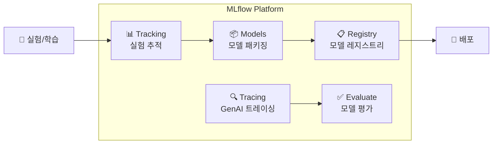

# MLflow란?

## 개념

> 💡 **MLflow**는 머신러닝 라이프사이클 전체를 관리하는 **오픈소스 플랫폼**입니다. 실험 추적, 모델 패키징, 모델 레지스트리, GenAI 트레이싱, 모델 평가까지 ML/AI 워크플로우의 모든 단계를 지원합니다.

Databricks가 주도하여 개발하고 있으며, GitHub Stars 19,000+로 가장 널리 사용되는 ML 라이프사이클 관리 도구입니다. Databricks에서는 **별도 설치 없이 기본 내장**되어 있습니다.

---

## MLflow의 핵심 컴포넌트



| 컴포넌트 | 역할 | 사용 시나리오 |
|----------|------|-------------|
| **Tracking** | 실험의 **파라미터, 메트릭, 아티팩트**를 기록합니다. 여러 실험을 비교할 수 있습니다 | 모델 학습 시 하이퍼파라미터, 정확도 등을 기록 |
| **Models** | 모델을 **표준 형식**으로 패키징합니다. 다양한 프레임워크(sklearn, PyTorch, HuggingFace 등)를 지원합니다 | 학습된 모델을 저장하고 로드 |
| **Model Registry** | 모델의 **버전을 관리**하고, **Alias**(champion, challenger)를 부여합니다. Unity Catalog와 통합됩니다 | 모델의 프로덕션 승격 관리 |
| **Tracing** | GenAI 앱의 **실행 흐름을 추적**합니다. LLM 호출, Tool 실행, 검색 등 각 단계를 기록합니다 | RAG 파이프라인, AI 에이전트 디버깅 |
| **Evaluate** | 모델/에이전트의 **품질을 자동 평가**합니다. 내장 Scorer와 커스텀 Scorer를 지원합니다 | 정확도, 안전성, 근거성 평가 |

---

## 전통 ML vs GenAI에서의 MLflow 역할

| 역할 | 전통 ML (scikit-learn, XGBoost) | GenAI (LLM, RAG, Agent) |
|------|-------------------------------|------------------------|
| **추적** | 파라미터, 메트릭(accuracy, F1) 기록 | 프롬프트, 토큰 사용량, 지연시간 기록 |
| **모델 저장** | 학습된 모델 파일 (.pkl, .pt) | ChatAgent, RAG Chain 등 |
| **평가** | 테스트 데이터 기반 메트릭 | LLM Judge (Correctness, Safety) |
| **모니터링** | 데이터 드리프트 | 답변 품질, 환각율, 지연시간 |
| **핵심 도구** | Tracking, Models, Registry | Tracing, Evaluate, Models |

---

## Databricks와의 통합

Databricks에서 MLflow를 사용하면 다음과 같은 추가 이점이 있습니다.

| 기능 | 설명 |
|------|------|
| **자동 설정** | Tracking Server, 인증이 자동으로 구성됩니다. `mlflow.set_tracking_uri()` 불필요합니다 |
| **Unity Catalog 통합** | 모델이 UC에 등록되어, 테이블과 동일한 거버넌스(권한, 리니지)가 적용됩니다 |
| **Autolog** | 한 줄로 주요 ML 프레임워크의 자동 로깅을 활성화합니다 |
| **Workspace UI** | 실험, 모델, 트레이스를 웹 UI에서 시각적으로 관리합니다 |
| **Model Serving 연동** | 등록된 모델을 클릭 한 번으로 서빙 엔드포인트에 배포합니다 |
| **Serverless 실행** | MLflow 작업이 서버리스 컴퓨트에서 실행됩니다 |

```python
import mlflow

# Databricks에서는 이것만으로 바로 사용 가능합니다
mlflow.set_experiment("/Users/user@company.com/my-experiment")

with mlflow.start_run():
    mlflow.log_param("learning_rate", 0.01)
    mlflow.log_metric("accuracy", 0.95)
    mlflow.sklearn.log_model(model, "model")
```

---

## MLflow의 핵심 개념

| 개념 | 설명 |
|------|------|
| **Experiment** | 관련 있는 여러 Run을 묶는 그룹입니다. 프로젝트나 모델 단위로 생성합니다 |
| **Run** | 하나의 모델 학습/실행을 의미합니다. 파라미터, 메트릭, 아티팩트가 기록됩니다 |
| **Parameter** | 모델의 입력 설정값입니다 (학습률, 트리 수 등) |
| **Metric** | 모델의 성능 지표입니다 (정확도, F1 score, 손실 등) |
| **Artifact** | 모델 파일, 그래프, 데이터 등 실행 중 생성된 파일입니다 |
| **Registered Model** | Unity Catalog에 등록된 모델. 버전과 Alias로 관리합니다 |
| **Trace** | GenAI 앱의 한 번의 실행을 기록한 것입니다. 여러 Span으로 구성됩니다 |
| **Span** | Trace 내의 개별 단계입니다 (LLM 호출, 검색, Tool 실행 등) |

---

## 지원 ML 프레임워크

MLflow는 다양한 ML/DL 프레임워크를 네이티브로 지원합니다.

| 카테고리 | 프레임워크 | MLflow 모듈 |
|----------|-----------|-----------|
| **전통 ML** | scikit-learn | `mlflow.sklearn` |
| | XGBoost | `mlflow.xgboost` |
| | LightGBM | `mlflow.lightgbm` |
| | Spark ML | `mlflow.spark` |
| **딥러닝** | PyTorch | `mlflow.pytorch` |
| | TensorFlow/Keras | `mlflow.tensorflow` |
| **LLM/GenAI** | OpenAI | `mlflow.openai` |
| | LangChain | `mlflow.langchain` |
| | Anthropic | `mlflow.anthropic` |
| | Hugging Face | `mlflow.transformers` |
| | LlamaIndex | `mlflow.llama_index` |
| **범용** | 커스텀 모델 | `mlflow.pyfunc` |

> 🆕 **MLflow Traces in Unity Catalog (Preview)**: MLflow 트레이스를 Unity Catalog에 저장하여 SQL로 조회할 수 있는 기능이 출시되었습니다. 무제한 용량으로 트레이스를 보존하고 분석할 수 있습니다.

---

## 정리

| 핵심 개념 | 설명 |
|-----------|------|
| **MLflow** | ML 라이프사이클 전체를 관리하는 오픈소스 플랫폼입니다 |
| **Tracking** | 실험의 파라미터, 메트릭, 아티팩트를 추적합니다 |
| **Models** | 다양한 프레임워크의 모델을 표준 형식으로 패키징합니다 |
| **Registry** | 모델 버전과 프로덕션 승격을 관리합니다 (Unity Catalog 통합) |
| **Tracing** | GenAI 앱의 실행 흐름을 단계별로 추적합니다 |
| **Evaluate** | 모델/에이전트 품질을 자동으로 평가합니다 |

---

## 참고 링크

- [Databricks: MLflow](https://docs.databricks.com/aws/en/mlflow/)
- [MLflow Official Documentation](https://mlflow.org/docs/latest/)
- [MLflow GitHub](https://github.com/mlflow/mlflow)
- [Azure Databricks: MLflow](https://learn.microsoft.com/en-us/azure/databricks/mlflow/)
