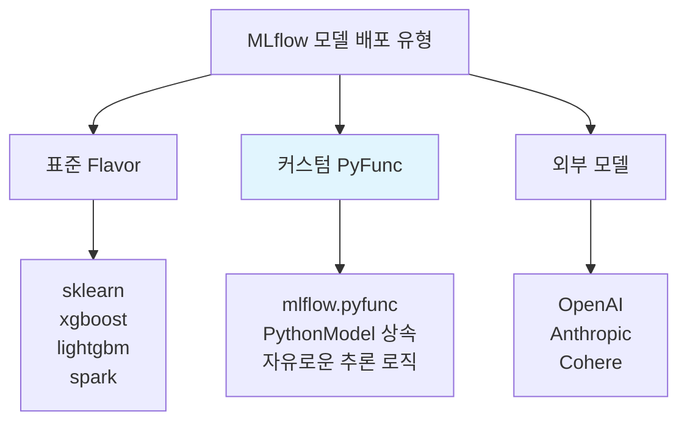
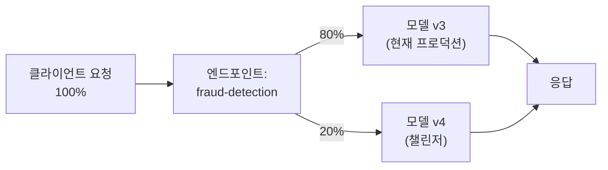

# 커스텀 모델 배포 (Custom Model Deployment)

## 왜 커스텀 모델 배포가 필요한가?

Databricks Model Serving은 등록된 MLflow 모델을 REST API 엔드포인트로 배포하는 관리형 서비스입니다. 하지만 모든 모델이 단순한 `predict()` 호출만으로 서빙되지는 않습니다. 다음과 같은 경우에 **커스텀 모델 배포**가 필요합니다:

| 사용 사례 | 설명 |
|-----------|------|
| **전후처리 파이프라인** | 입력 데이터 정규화, 피처 엔지니어링, 출력 후처리가 필요한 경우 |
| **앙상블 모델** | 여러 모델의 예측을 결합해야 하는 경우 |
| **외부 라이브러리 의존** | 표준 MLflow flavor에 없는 프레임워크를 사용하는 경우 |
| **비즈니스 로직 포함** | 예측값에 규칙 기반 로직을 적용해야 하는 경우 |
| **GPU 추론** | 대규모 딥러닝 모델을 GPU로 서빙해야 하는 경우 |

> 💡 **모델 서빙 엔드포인트(Model Serving Endpoint)** 란 학습된 ML 모델을 REST API로 노출하여, 애플리케이션에서 실시간으로 예측을 요청할 수 있게 해주는 서비스입니다. Databricks에서는 인프라 관리, 오토스케일링, 모니터링을 자동으로 처리합니다.

---

## 배포 가능한 모델 유형



| 모델 유형 | 특징 | 적합한 경우 |
|-----------|------|------------|
| **표준 MLflow Flavor** | `mlflow.sklearn`, `mlflow.xgboost` 등으로 저장한 모델 | 단순 predict 호출로 충분한 경우 |
| **커스텀 PyFunc** | `mlflow.pyfunc.PythonModel`을 상속하여 자유로운 추론 로직 구현 | 전후처리, 앙상블, 비즈니스 로직이 필요한 경우 |
| **외부 모델 (External Models)** | OpenAI, Anthropic 등 외부 API를 Databricks 엔드포인트로 프록시 | 외부 LLM API에 거버넌스/레이트 리밋을 적용할 때 |

---

## PyFunc 커스텀 모델 작성법

`mlflow.pyfunc.PythonModel`을 상속하면 `load_context()`와 `predict()` 메서드를 직접 구현하여 자유로운 추론 로직을 만들 수 있습니다.

### 기본 구조

```python
import mlflow.pyfunc
import pandas as pd
import numpy as np

class FraudDetectionModel(mlflow.pyfunc.PythonModel):
    """전처리 + 모델 추론 + 후처리를 하나로 묶는 커스텀 모델"""

    def load_context(self, context):
        """모델 로드 시 한 번 실행 (무거운 초기화 작업)"""
        import joblib

        # artifacts에서 모델과 전처리기 로드
        self.model = joblib.load(context.artifacts["model_path"])
        self.scaler = joblib.load(context.artifacts["scaler_path"])
        self.threshold = 0.7  # 커스텀 임계값

    def predict(self, context, model_input, params=None):
        """추론 요청마다 실행되는 메서드"""
        # 1. 전처리
        scaled_input = self.scaler.transform(model_input)

        # 2. 예측 확률 계산
        probabilities = self.model.predict_proba(scaled_input)[:, 1]

        # 3. 후처리 (커스텀 임계값 + 리스크 등급)
        results = pd.DataFrame({
            "fraud_probability": probabilities,
            "is_fraud": (probabilities >= self.threshold).astype(int),
            "risk_level": pd.cut(
                probabilities,
                bins=[0, 0.3, 0.7, 1.0],
                labels=["LOW", "MEDIUM", "HIGH"]
            )
        })

        return results
```

### 커스텀 모델 저장 및 등록

```python
import joblib
from sklearn.ensemble import GradientBoostingClassifier
from sklearn.preprocessing import StandardScaler

# 모델과 스케일러 학습
scaler = StandardScaler()
X_train_scaled = scaler.fit_transform(X_train)
model = GradientBoostingClassifier(n_estimators=200)
model.fit(X_train_scaled, y_train)

# 아티팩트 저장
joblib.dump(model, "/tmp/model.joblib")
joblib.dump(scaler, "/tmp/scaler.joblib")

# 커스텀 모델을 MLflow에 로깅
with mlflow.start_run(run_name="fraud-custom-pyfunc"):
    model_info = mlflow.pyfunc.log_model(
        artifact_path="fraud_model",
        python_model=FraudDetectionModel(),
        artifacts={
            "model_path": "/tmp/model.joblib",
            "scaler_path": "/tmp/scaler.joblib"
        },
        conda_env={
            "dependencies": [
                "python=3.10",
                {"pip": ["scikit-learn==1.4.0", "pandas>=2.0", "numpy>=1.24"]}
            ]
        },
        input_example=X_test[:3],
        registered_model_name="catalog.schema.fraud_detection_custom"
    )
```

> ⚠️ **의존성 관리 주의**: `conda_env` 또는 `pip_requirements`를 명시하지 않으면, 로컬 환경의 패키지 버전이 서빙 환경과 달라 오류가 발생할 수 있습니다. 반드시 학습에 사용한 주요 라이브러리 버전을 명시하십시오.

---

## 엔드포인트 생성

### 방법 1: SDK (MLflow Deployments)

```python
import mlflow.deployments

client = mlflow.deployments.get_deploy_client("databricks")

# 엔드포인트 생성
endpoint = client.create_endpoint(
    name="fraud-detection-v2",
    config={
        "served_entities": [{
            "entity_name": "catalog.schema.fraud_detection_custom",
            "entity_version": "3",
            "workload_size": "Small",           # Small / Medium / Large
            "scale_to_zero_enabled": True,      # 트래픽 없을 때 0으로 축소
            "workload_type": "CPU"              # CPU 또는 GPU_SMALL / GPU_MEDIUM / GPU_LARGE
        }],
        "auto_capture_config": {
            "catalog_name": "catalog",
            "schema_name": "schema",
            "table_name_prefix": "fraud_endpoint"
        }
    }
)
```

### 방법 2: Databricks SDK

```python
from databricks.sdk import WorkspaceClient
from databricks.sdk.service.serving import (
    EndpointCoreConfigInput,
    ServedEntityInput,
    AutoCaptureConfigInput
)

w = WorkspaceClient()

# 엔드포인트 생성
endpoint = w.serving_endpoints.create(
    name="fraud-detection-v2",
    config=EndpointCoreConfigInput(
        served_entities=[
            ServedEntityInput(
                entity_name="catalog.schema.fraud_detection_custom",
                entity_version="3",
                workload_size="Small",
                scale_to_zero_enabled=True,
                workload_type="CPU"
            )
        ],
        auto_capture_config=AutoCaptureConfigInput(
            catalog_name="catalog",
            schema_name="schema",
            table_name_prefix="fraud_endpoint",
            enabled=True
        )
    )
)

# 엔드포인트 준비 대기
endpoint = w.serving_endpoints.wait_get_serving_endpoint_not_updating(
    name="fraud-detection-v2"
)
print(f"Endpoint state: {endpoint.state.ready}")
```

### 방법 3: REST API

```bash
curl -X POST "https://<workspace-url>/api/2.0/serving-endpoints" \
  -H "Authorization: Bearer $DATABRICKS_TOKEN" \
  -H "Content-Type: application/json" \
  -d '{
    "name": "fraud-detection-v2",
    "config": {
      "served_entities": [{
        "entity_name": "catalog.schema.fraud_detection_custom",
        "entity_version": "3",
        "workload_size": "Small",
        "scale_to_zero_enabled": true
      }]
    }
  }'
```

### 워크로드 크기 옵션

| 워크로드 크기 | 동시 요청 수 (대략) | 적합한 사용 사례 |
|--------------|---------------------|----------------|
| **Small** | 최대 4 동시 요청 | 개발/테스트, 저트래픽 |
| **Medium** | 최대 16 동시 요청 | 중간 트래픽 프로덕션 |
| **Large** | 최대 64 동시 요청 | 고트래픽 프로덕션 |

---

## 트래픽 분할 및 A/B 테스트

하나의 엔드포인트에 여러 모델 버전을 동시에 배포하고, 트래픽 비율을 조절하여 **A/B 테스트**를 수행할 수 있습니다.



```python
# 트래픽 분할 설정
client = mlflow.deployments.get_deploy_client("databricks")

client.update_endpoint(
    endpoint="fraud-detection-v2",
    config={
        "served_entities": [
            {
                "entity_name": "catalog.schema.fraud_detection_custom",
                "entity_version": "3",
                "workload_size": "Small",
                "scale_to_zero_enabled": False
            },
            {
                "entity_name": "catalog.schema.fraud_detection_custom",
                "entity_version": "4",
                "workload_size": "Small",
                "scale_to_zero_enabled": False
            }
        ],
        "traffic_config": {
            "routes": [
                {"served_model_name": "fraud_detection_custom-3", "traffic_percentage": 80},
                {"served_model_name": "fraud_detection_custom-4", "traffic_percentage": 20}
            ]
        }
    }
)
```

> 💡 **블루-그린 배포**: 새 모델 버전을 100% 트래픽으로 전환하면서도 이전 버전을 유지하는 방식입니다. 문제 발생 시 즉시 이전 버전으로 롤백할 수 있습니다.

---

## GPU 서빙 설정

딥러닝 모델이나 대규모 모델은 GPU 서빙이 필요합니다.

| GPU 워크로드 타입 | GPU 종류 | 적합한 모델 |
|------------------|---------|------------|
| `GPU_SMALL` | T4 (16GB) | 소규모 딥러닝 모델, 임베딩 모델 |
| `GPU_MEDIUM` | A10G (24GB) | 중규모 트랜스포머, 이미지 모델 |
| `GPU_LARGE` | A100 (80GB) | 대규모 LLM, 파인튜닝된 Foundation Model |

```python
# GPU 엔드포인트 생성 예시
endpoint = client.create_endpoint(
    name="embedding-model-gpu",
    config={
        "served_entities": [{
            "entity_name": "catalog.schema.sentence_transformer",
            "entity_version": "1",
            "workload_size": "Small",
            "workload_type": "GPU_SMALL",       # GPU 타입 지정
            "scale_to_zero_enabled": True
        }]
    }
)
```

---

## 실습: 모델 서빙 엔드포인트 생성 및 호출

### 엔드포인트 호출 방법

```python
import requests
import json

# 방법 1: requests 라이브러리
workspace_url = "https://<workspace-url>"
token = dbutils.notebook.entry_point.getDbutils().notebook().getContext().apiToken().get()

url = f"{workspace_url}/serving-endpoints/fraud-detection-v2/invocations"
headers = {
    "Authorization": f"Bearer {token}",
    "Content-Type": "application/json"
}

# DataFrame 레코드 형식
payload = {
    "dataframe_records": [
        {"amount": 50000, "merchant_category": "online_retail", "hour": 3, "is_international": 1},
        {"amount": 25, "merchant_category": "grocery", "hour": 12, "is_international": 0}
    ]
}

response = requests.post(url, json=payload, headers=headers)
predictions = response.json()
print(json.dumps(predictions, indent=2))
```

```python
# 방법 2: Databricks SDK
from databricks.sdk import WorkspaceClient

w = WorkspaceClient()

response = w.serving_endpoints.query(
    name="fraud-detection-v2",
    dataframe_records=[
        {"amount": 50000, "merchant_category": "online_retail", "hour": 3, "is_international": 1}
    ]
)
print(response.predictions)
```

```python
# 방법 3: MLflow Deployments Client
client = mlflow.deployments.get_deploy_client("databricks")

response = client.predict(
    endpoint="fraud-detection-v2",
    inputs={
        "dataframe_records": [
            {"amount": 50000, "merchant_category": "online_retail", "hour": 3}
        ]
    }
)
print(response)
```

---

## 트러블슈팅

### 자주 발생하는 문제와 해결 방법

| 증상 | 원인 | 해결 방법 |
|------|------|-----------|
| **엔드포인트가 `PENDING` 상태에서 멈춤** | 모델 로드 실패 또는 의존성 문제 | 엔드포인트 이벤트 로그 확인. `conda_env`에 정확한 패키지 버전 명시 |
| **`ModuleNotFoundError`** | 서빙 환경에 필요한 패키지 미설치 | `pip_requirements` 또는 `conda_env`에 모든 의존성 추가 |
| **입력 스키마 불일치** | 요청 데이터의 컬럼명/타입이 모델 시그니처와 다름 | `input_example`과 동일한 형식으로 요청. 모델 시그니처 확인 |
| **Scale-to-zero 후 첫 요청 느림** | Cold Start (컨테이너 부팅 시간) | 프로덕션에서는 `scale_to_zero_enabled=False` 사용 |
| **메모리 부족 (OOM)** | 모델 크기 대비 워크로드 크기가 작음 | `workload_size`를 Medium/Large로 변경 |
| **GPU 할당 실패** | GPU 리소스 부족 | 다른 GPU 타입 시도 또는 워크스페이스 관리자에 문의 |

### 엔드포인트 상태 확인

```python
from databricks.sdk import WorkspaceClient

w = WorkspaceClient()

# 엔드포인트 상태 조회
endpoint = w.serving_endpoints.get(name="fraud-detection-v2")
print(f"State: {endpoint.state.ready}")
print(f"Config update: {endpoint.state.config_update}")

# 이벤트 로그 조회 (디버깅용)
for event in w.serving_endpoints.list_serving_endpoint_events(name="fraud-detection-v2"):
    print(f"[{event.timestamp}] {event.type}: {event.message}")
```

> ⚠️ **프로덕션 배포 체크리스트**:
> - 모델 시그니처(input/output schema)가 올바른지 확인
> - `pip_requirements`에 모든 의존성과 정확한 버전을 명시
> - Scale-to-zero 비활성화 (지연 시간 민감한 경우)
> - Inference Table을 활성화하여 요청/응답 로깅
> - 엔드포인트 모니터링 알림 설정

---

## 정리

| 항목 | 핵심 포인트 |
|------|------------|
| **커스텀 PyFunc** | `PythonModel`을 상속하여 전처리/후처리/앙상블 등 자유로운 추론 로직을 구현합니다 |
| **엔드포인트 생성** | SDK, REST API, UI 세 가지 방법으로 생성할 수 있습니다 |
| **트래픽 분할** | A/B 테스트와 블루-그린 배포로 안전하게 모델을 교체합니다 |
| **GPU 서빙** | `workload_type`으로 T4/A10G/A100 등 GPU를 선택합니다 |
| **의존성 관리** | `conda_env` 또는 `pip_requirements`에 정확한 버전을 명시하는 것이 핵심입니다 |
| **모니터링** | Inference Table과 이벤트 로그로 서빙 상태를 모니터링합니다 |

---

## 참고 링크

- [Databricks: Deploy custom models](https://docs.databricks.com/aws/en/machine-learning/model-serving/create-manage-serving-endpoints.html)
- [Databricks: Custom Python models (PyFunc)](https://docs.databricks.com/aws/en/machine-learning/model-serving/custom-models.html)
- [Databricks: Model Serving GPU workloads](https://docs.databricks.com/aws/en/machine-learning/model-serving/gpu.html)
- [Databricks: A/B testing with serving endpoints](https://docs.databricks.com/aws/en/machine-learning/model-serving/traffic-config.html)
- [MLflow: Custom PyFunc Models](https://mlflow.org/docs/latest/python_api/mlflow.pyfunc.html)
