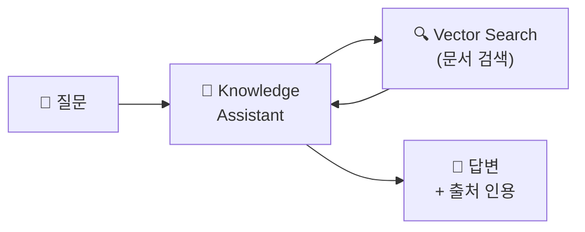
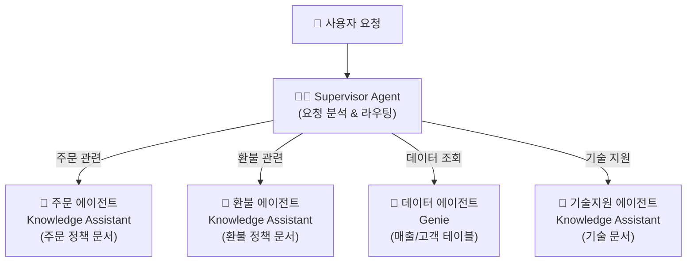

# Agent Bricks — 사전 구축 에이전트

## Agent Bricks란?

> 💡 **Agent Bricks**는 Databricks가 제공하는 **사전 구축된 에이전트 템플릿**입니다. 코드 없이 또는 최소 코드로 AI 에이전트를 빠르게 구축할 수 있습니다. 문서 Q&A, SQL 데이터 분석, 멀티 에이전트 오케스트레이션의 세 가지 유형을 제공합니다.

---

## Agent Bricks 유형

| 유형 | 설명 | 상태 | 적합한 사용 |
|------|------|------|-----------|
| **Knowledge Assistant** | 문서 기반 Q&A 챗봇입니다. PDF, 문서에서 답변을 찾아 **인용과 함께** 제공합니다 | GA | 사내 문서 검색, 고객 FAQ, 제품 매뉴얼 |
| **Genie (SQL Agent)** | 자연어로 데이터에 질문하면 **SQL을 생성**하여 답변합니다 | GA | 비즈니스 데이터 탐색, KPI 조회 |
| **Supervisor Agent** | 여러 에이전트를 조율하는 **멀티 에이전트 오케스트레이터**입니다 | GA | 복합 고객 지원 (주문+환불+기술지원) |

---

## Knowledge Assistant

### 개념

문서(PDF, 웹 페이지, 사내 위키 등)를 기반으로 질문에 답변하는 RAG 챗봇입니다. 답변 시 **출처 문서를 인용**하여 신뢰성을 높입니다.



### 생성 방법

1. **Playground** → **Create Knowledge Assistant**
2. 이름 입력, LLM 선택
3. **문서 소스 연결**: Unity Catalog Volume 또는 Vector Search Index 지정
4. **시스템 프롬프트** 작성 (선택): "당신은 XX 분야 전문가입니다"
5. **테스트**: Playground에서 바로 질문하여 답변 확인
6. **배포**: Model Serving 엔드포인트로 배포

### 활용 시나리오

| 시나리오 | 문서 소스 |
|----------|----------|
| **사내 IT 헬프데스크** | 사내 IT 정책 문서, FAQ |
| **고객 지원 챗봇** | 제품 매뉴얼, 반품/배송 정책 |
| **신입사원 온보딩** | 사내 규정, 프로세스 가이드 |
| **법률/규정 검색** | 계약서, 법률 문서 |

---

## Genie (SQL Agent)

Genie Space를 에이전트로 활용하여, 자연어 질문을 SQL로 변환하고 결과를 반환합니다.

```
👤: "이번 달 서울 지역 매출이 전월 대비 어떻게 됐어?"
🤖: "2025년 3월 서울 매출은 15.2억원으로, 전월(13.8억원) 대비 10.1% 증가했습니다."
    [차트: 월별 매출 추이]
```

Agent Bricks의 Genie는 [08. AI/BI 섹션의 Genie](../08-ai-bi/genie.md)와 동일한 기술을 에이전트 형태로 제공합니다.

---

## Supervisor Agent (멀티 에이전트)

### 개념

> 💡 **Supervisor Agent**는 사용자 요청을 분석하여 **적절한 하위 에이전트에게 작업을 위임**하는 오케스트레이터입니다. 복잡한 요청을 여러 전문 에이전트가 협력하여 처리합니다.



### 동작 방식

1. 사용자가 요청을 입력합니다
2. **Supervisor**가 요청을 분석하고, 적절한 하위 에이전트를 선택합니다
3. 하위 에이전트가 작업을 수행하고 결과를 반환합니다
4. Supervisor가 결과를 종합하여 사용자에게 최종 답변을 전달합니다
5. 필요하면 **여러 에이전트를 순차적으로 호출**합니다

### 활용 시나리오

```
👤: "주문 12345의 배송이 지연되고 있는데, 환불 가능한지 확인하고,
     이 고객의 전체 구매 이력도 알려주세요."

🧑‍💼 Supervisor:
  1. 주문 에이전트에게 주문 12345 상태 확인 요청
  2. 환불 에이전트에게 환불 정책 확인 요청
  3. 데이터 에이전트에게 고객 구매 이력 조회 요청
  4. 세 결과를 종합하여 답변

💬: "주문 12345는 현재 배송 지연 상태(예상 도착: 3/25)입니다.
     배송 지연 시 환불이 가능하며, 환불 절차는...
     해당 고객의 전체 구매 이력: 총 23건, 누적 금액 580만원..."
```

---

## Agent Bricks vs 커스텀 에이전트

| 비교 | Agent Bricks | 커스텀 (ChatAgent) |
|------|-------------|-------------------|
| **개발 시간** | 수분~수시간 | 수일~수주 |
| **코드 필요** | 최소 (UI 중심) | Python 코드 전체 작성 |
| **유연성** | 제한적 (정해진 패턴) | 무한대 (자유 구현) |
| **적합한 경우** | 표준 RAG/SQL 에이전트, 빠른 PoC | 복잡한 비즈니스 로직, 커스텀 Tool |
| **권장 접근** | **먼저 Agent Bricks로 PoC** → 부족하면 커스텀 전환 |

---

## 정리

| 유형 | 용도 | 핵심 기능 |
|------|------|----------|
| **Knowledge Assistant** | 문서 기반 Q&A | RAG + 출처 인용 |
| **Genie** | 데이터 분석 | 자연어 → SQL |
| **Supervisor** | 멀티 에이전트 | 라우팅 + 오케스트레이션 |

---

## 참고 링크

- [Databricks: Agent Bricks](https://docs.databricks.com/aws/en/generative-ai/agent-bricks/)
- [Databricks: Knowledge Assistant](https://docs.databricks.com/aws/en/generative-ai/agent-bricks/knowledge-assistant.html)
- [Databricks: Supervisor Agent](https://docs.databricks.com/aws/en/generative-ai/agent-bricks/supervisor-agent.html)
