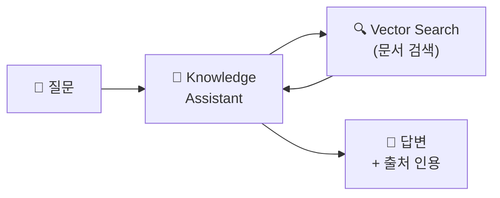
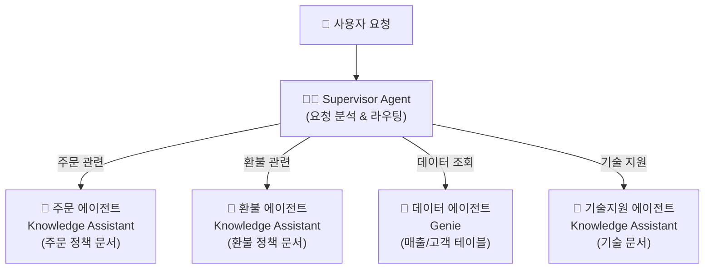

# Agent Bricks — 사전 구축 에이전트

## Agent Bricks란?

> 💡 **Agent Bricks**는 Databricks가 제공하는 **사전 구축된 에이전트 템플릿**입니다. 코드 없이 또는 최소 코드로 AI 에이전트를 빠르게 구축할 수 있습니다. 문서 Q&A, SQL 데이터 분석, 멀티 에이전트 오케스트레이션의 세 가지 유형을 제공합니다.

AI 에이전트를 처음부터 코드로 구축하려면 LLM 연동, 프롬프트 설계, RAG 파이프라인 구성, Tool 연결, 에러 처리 등 상당한 개발 노력이 필요합니다. Agent Bricks는 이러한 **공통 패턴을 템플릿화**하여, 몇 번의 클릭과 설정만으로 프로덕션 수준의 에이전트를 만들 수 있게 해줍니다. 특히 PoC(개념 검증)나 빠른 프로토타이핑에 매우 효과적입니다.

---

## Agent Bricks 유형

| 유형 | 설명 | 상태 | 적합한 사용 |
|------|------|------|-----------|
| **Knowledge Assistant** | 문서 기반 Q&A 챗봇입니다. PDF, 문서에서 답변을 찾아 **인용과 함께** 제공합니다 | GA | 사내 문서 검색, 고객 FAQ, 제품 매뉴얼 |
| **Genie (SQL Agent)** | 자연어로 데이터에 질문하면 **SQL을 생성**하여 답변합니다 | GA | 비즈니스 데이터 탐색, KPI 조회 |
| **Supervisor Agent** | 여러 에이전트를 조율하는 **멀티 에이전트 오케스트레이터**입니다 | GA | 복합 고객 지원 (주문+환불+기술지원) |

### 어떤 유형을 선택해야 할까요?

에이전트 유형 선택은 사용자의 주요 요구사항에 따라 결정됩니다. 아래 의사결정 가이드를 참고하세요.

```
질문: "사용자가 주로 무엇을 원하나요?"

├─ "문서에서 정보를 찾고 싶다" → Knowledge Assistant
│     예: FAQ 답변, 매뉴얼 검색, 규정 조회
│
├─ "데이터를 분석하고 싶다" → Genie (SQL Agent)
│     예: 매출 조회, KPI 확인, 트렌드 분석
│
├─ "여러 가지를 복합적으로 원한다" → Supervisor Agent
│     예: 문서 검색 + 데이터 조회 + 외부 API 호출
│
└─ "위 패턴에 맞지 않거나 고도의 커스텀이 필요하다" → ChatAgent (코드 직접 작성)
      예: 복잡한 비즈니스 로직, 외부 시스템 통합
```

---

## Knowledge Assistant

### 개념

Knowledge Assistant는 문서(PDF, 웹 페이지, 사내 위키 등)를 기반으로 질문에 답변하는 **RAG(Retrieval-Augmented Generation) 챗봇**입니다. 내부적으로 Vector Search를 사용하여 관련 문서를 검색하고, LLM이 검색된 문서를 바탕으로 답변을 생성합니다. 답변 시 **출처 문서를 인용**하여 신뢰성을 높이며, 사용자가 원본 문서를 직접 확인할 수 있는 링크도 제공합니다.



### 생성 방법

Knowledge Assistant는 UI를 통해 코드 없이 생성할 수 있습니다. 각 단계에서 다양한 설정 옵션을 조정하여 에이전트의 동작을 맞춤화할 수 있습니다.

1. **Playground** → **Create Knowledge Assistant**
2. **이름 입력**: 에이전트의 이름을 지정합니다 (예: `hr-policy-assistant`)
3. **LLM 선택**: 사용할 LLM을 선택합니다 (예: Llama 3.3 70B, GPT-4o 등). 응답 품질, 속도, 비용을 고려하여 선택합니다
4. **문서 소스 연결**: Unity Catalog Volume 또는 Vector Search Index를 지정합니다. Volume을 선택하면 자동으로 인덱싱이 수행됩니다
5. **시스템 프롬프트 작성** (선택): "당신은 XX 분야 전문가입니다. 한국어로 답변하세요." 등의 지침을 입력합니다
6. **검색 설정**: 검색할 문서 수, 유사도 임계값 등을 조정합니다
7. **테스트**: Playground에서 바로 질문하여 답변 품질을 확인합니다
8. **배포**: Model Serving 엔드포인트로 배포합니다. 자동으로 REST API가 생성됩니다

### 주요 설정 옵션

| 설정 항목 | 설명 | 권장값 |
|-----------|------|--------|
| **LLM 모델** | 답변 생성에 사용할 LLM입니다 | 품질 우선: GPT-4o / 비용 우선: Llama 3.3 70B |
| **문서 소스** | 검색 대상 문서가 저장된 위치입니다 | UC Volume 또는 Vector Search Index |
| **시스템 프롬프트** | 에이전트의 역할과 규칙을 정의합니다 | 역할, 언어, 답변 스타일 명시 |
| **검색 문서 수** | 답변 생성 시 참조할 최대 문서 수입니다 | 3~5개 |
| **대화 이력** | 멀티턴 대화에서 유지할 이전 대화 수입니다 | 5~10턴 |

### 활용 시나리오

| 시나리오 | 문서 소스 | 시스템 프롬프트 예시 |
|----------|----------|-------------------|
| **사내 IT 헬프데스크** | 사내 IT 정책 문서, FAQ | "당신은 사내 IT 지원 전문가입니다. IT 정책과 절차에 대해 안내합니다." |
| **고객 지원 챗봇** | 제품 매뉴얼, 반품/배송 정책 | "당신은 친절한 고객 지원 상담사입니다. 항상 한국어로 답변하세요." |
| **신입사원 온보딩** | 사내 규정, 프로세스 가이드 | "당신은 신입사원 멘토입니다. 회사 규정과 절차를 쉽게 설명해 주세요." |
| **법률/규정 검색** | 계약서, 법률 문서 | "당신은 법률 리서치 보조입니다. 정확한 조항을 인용하여 답변하세요." |
| **제품 기술 문서** | API 문서, 개발 가이드 | "당신은 기술 문서 전문가입니다. 코드 예제와 함께 설명하세요." |

---

## Genie (SQL Agent)

### 개념

Genie는 자연어 질문을 **SQL 쿼리로 변환**하여 데이터에서 답변을 찾아주는 에이전트입니다. 비개발자도 "이번 달 서울 매출이 얼마야?"라고 물으면, 자동으로 SQL을 생성하고 실행하여 결과를 보여줍니다. Agent Bricks의 Genie는 [08. AI/BI 섹션의 Genie](../08-ai-bi/genie.md)와 동일한 기술을 에이전트 형태로 제공합니다.

### 동작 방식

```
👤: "이번 달 서울 지역 매출이 전월 대비 어떻게 됐어?"

🤖 Genie 내부 처리:
  1. 자연어 질문을 분석합니다
  2. 사용 가능한 테이블/컬럼 메타데이터를 확인합니다
  3. SQL 쿼리를 생성합니다:
     SELECT region, SUM(amount) AS total_sales, ...
  4. SQL을 실행하고 결과를 가져옵니다
  5. 결과를 자연어로 요약합니다

💬: "2025년 3월 서울 매출은 15.2억원으로, 전월(13.8억원) 대비 10.1% 증가했습니다."
    [차트: 월별 매출 추이]
```

### Genie Space 설정

Genie를 Agent Brick으로 사용하려면 먼저 **Genie Space**를 생성하고, 에이전트가 접근할 수 있는 테이블과 설명을 구성해야 합니다.

| 설정 항목 | 설명 | 중요도 |
|-----------|------|--------|
| **테이블 선택** | Genie가 쿼리할 수 있는 테이블을 지정합니다 | 필수 |
| **테이블 설명** | 각 테이블과 컬럼에 대한 설명을 작성합니다. 설명이 자세할수록 SQL 생성 정확도가 높아집니다 | 매우 중요 |
| **샘플 질문** | 예상되는 질문과 정답 SQL을 등록합니다. Few-shot 예시로 활용됩니다 | 권장 |
| **지침** | 테이블 간 조인 조건, 비즈니스 용어 정의 등을 안내합니다 | 권장 |

> 💡 **팁**: Genie의 SQL 생성 정확도를 높이려면 **테이블과 컬럼에 상세한 설명(Comment)** 을 추가하는 것이 가장 효과적입니다. 예를 들어, `order_status` 컬럼에 "주문 상태 코드 (1: 주문완료, 2: 배송중, 3: 배송완료, 4: 취소)"라고 설명을 달아두면 훨씬 정확한 SQL을 생성합니다.

---

## Supervisor Agent (멀티 에이전트)

### 개념

> 💡 **Supervisor Agent**는 사용자 요청을 분석하여 **적절한 하위 에이전트에게 작업을 위임**하는 오케스트레이터입니다. 복잡한 요청을 여러 전문 에이전트가 협력하여 처리합니다.

실제 업무에서는 하나의 질문이 여러 영역에 걸치는 경우가 많습니다. 예를 들어, "주문 12345의 배송이 지연되고 있는데, 환불 가능한지 확인하고, 이 고객의 전체 구매 이력도 알려주세요"라는 요청은 주문 조회, 환불 정책, 데이터 분석 세 가지 영역을 동시에 다루어야 합니다. Supervisor Agent는 이런 복합 요청을 자동으로 분류하고, 적절한 하위 에이전트에게 위임합니다.



### 동작 방식

Supervisor Agent는 다음 단계로 동작합니다. 각 단계가 자동으로 수행되므로 사용자는 하위 에이전트의 존재를 알 필요가 없습니다.

1. **요청 분석**: 사용자가 요청을 입력하면, Supervisor가 LLM을 사용하여 요청의 의도를 분석합니다
2. **에이전트 선택**: 분석 결과를 바탕으로 적절한 하위 에이전트를 선택합니다. 하나 또는 여러 에이전트를 선택할 수 있습니다
3. **작업 위임**: 선택된 하위 에이전트에게 질문을 전달하고, 각 에이전트가 독립적으로 작업을 수행합니다
4. **결과 종합**: 모든 하위 에이전트의 결과를 Supervisor가 수집하고, 하나의 통합된 답변으로 종합합니다
5. **순차 호출**: 필요한 경우 한 에이전트의 결과를 바탕으로 **다른 에이전트를 추가로 호출**할 수도 있습니다

### Supervisor Agent 구성

Supervisor Agent를 생성할 때는 하위 에이전트의 목록과 각 에이전트의 역할을 정의합니다.

| 설정 항목 | 설명 |
|-----------|------|
| **하위 에이전트 목록** | 등록할 에이전트를 선택합니다. Knowledge Assistant, Genie, 커스텀 에이전트를 혼합할 수 있습니다 |
| **에이전트 설명** | 각 하위 에이전트의 역할을 상세히 기술합니다. Supervisor가 라우팅 결정 시 이 설명을 참고합니다 |
| **Supervisor 프롬프트** | Supervisor의 전반적인 행동 지침을 정의합니다 |
| **LLM 모델** | Supervisor가 라우팅 결정에 사용할 LLM을 선택합니다 |

### 활용 시나리오 상세

```
👤: "주문 12345의 배송이 지연되고 있는데, 환불 가능한지 확인하고,
     이 고객의 전체 구매 이력도 알려주세요."

🧑‍💼 Supervisor:
  1. 주문 에이전트에게 주문 12345 상태 확인 요청
  2. 환불 에이전트에게 환불 정책 확인 요청
  3. 데이터 에이전트에게 고객 구매 이력 조회 요청
  4. 세 결과를 종합하여 답변

💬: "주문 12345는 현재 배송 지연 상태(예상 도착: 3/25)입니다.
     배송 지연 시 환불이 가능하며, 환불 절차는...
     해당 고객의 전체 구매 이력: 총 23건, 누적 금액 580만원..."
```

### MAS(Multi-Agent System) 설계 모범 사례

| 원칙 | 설명 |
|------|------|
| **단일 책임 원칙** | 각 하위 에이전트는 하나의 전문 영역만 담당하도록 설계합니다. 범위가 넓으면 분할합니다 |
| **명확한 역할 기술** | 하위 에이전트의 설명을 구체적으로 작성합니다. "주문 관련"보다 "주문 상태 확인, 배송 추적, 주문 변경 처리"가 좋습니다 |
| **중복 방지** | 두 에이전트의 역할이 겹치면 Supervisor가 혼란스러워집니다. 역할 경계를 명확히 합니다 |
| **점진적 확장** | 처음에는 2~3개 에이전트로 시작하고, 필요에 따라 하위 에이전트를 추가합니다 |

---

## Agent Bricks vs 커스텀 에이전트

| 비교 | Agent Bricks | 커스텀 (ChatAgent) |
|------|-------------|-------------------|
| **개발 시간** | 수분~수시간 | 수일~수주 |
| **코드 필요** | 최소 (UI 중심) | Python 코드 전체 작성 |
| **유연성** | 제한적 (정해진 패턴) | 무한대 (자유 구현) |
| **Tool 확장** | 기본 제공 Tool만 사용 | 커스텀 Tool 무제한 추가 |
| **비즈니스 로직** | 단순 규칙만 가능 | 복잡한 조건부 로직 구현 가능 |
| **배포/모니터링** | 자동 (Model Serving 연동) | 동일하게 Model Serving 사용 |
| **적합한 경우** | 표준 RAG/SQL 에이전트, 빠른 PoC | 복잡한 비즈니스 로직, 커스텀 Tool |
| **권장 접근** | **먼저 Agent Bricks로 PoC** → 부족하면 커스텀 전환 | Agent Bricks로 충분하지 않은 경우 |

> 💡 **권장 전략**: 대부분의 프로젝트에서 **Agent Bricks로 먼저 PoC를 진행**하는 것을 권장합니다. 빠르게 동작하는 프로토타입을 만들어 비즈니스 가치를 검증한 후, 필요한 경우에만 커스텀 에이전트로 전환하면 개발 비용과 시간을 절약할 수 있습니다. Agent Bricks로 시작해도 나중에 커스텀 코드로 마이그레이션하는 것이 어렵지 않습니다.

---

## 실습: Knowledge Assistant 빠른 시작

아래는 Knowledge Assistant를 UI 없이 코드로 생성하고 테스트하는 예시입니다.

```python
# 1. 문서 업로드 (Unity Catalog Volume에)
# 사전에 Volume에 PDF, MD, TXT 파일을 업로드해 두세요
# databricks fs cp ./docs/ /Volumes/catalog/schema/docs/

# 2. Playground에서 Knowledge Assistant 생성
# - 이름: hr-policy-assistant
# - LLM: databricks-meta-llama-3-3-70b-instruct
# - 문서 소스: /Volumes/catalog/schema/docs/
# - 시스템 프롬프트: "당신은 HR 정책 전문가입니다. 한국어로 답변하세요."

# 3. 배포 후 API 호출 테스트
import requests

endpoint_url = "https://<workspace>.databricks.com/serving-endpoints/hr-policy-assistant/invocations"
headers = {"Authorization": "Bearer <token>", "Content-Type": "application/json"}

response = requests.post(endpoint_url, headers=headers, json={
    "messages": [
        {"role": "user", "content": "연차 사용 규정을 알려주세요"}
    ]
})

print(response.json()["choices"][0]["message"]["content"])
```

---

## 정리

| 유형 | 용도 | 핵심 기능 | 시작 난이도 |
|------|------|----------|-----------|
| **Knowledge Assistant** | 문서 기반 Q&A | RAG + 출처 인용 | 매우 쉬움 |
| **Genie** | 데이터 분석 | 자연어 → SQL | 쉬움 (테이블 설명 필요) |
| **Supervisor** | 멀티 에이전트 | 라우팅 + 오케스트레이션 | 보통 (하위 에이전트 설계 필요) |

---

## 참고 링크

- [Databricks: Agent Bricks](https://docs.databricks.com/aws/en/generative-ai/agent-bricks/)
- [Databricks: Knowledge Assistant](https://docs.databricks.com/aws/en/generative-ai/agent-bricks/knowledge-assistant.html)
- [Databricks: Supervisor Agent](https://docs.databricks.com/aws/en/generative-ai/agent-bricks/supervisor-agent.html)
- [Databricks: Genie](https://docs.databricks.com/aws/en/genie/)
