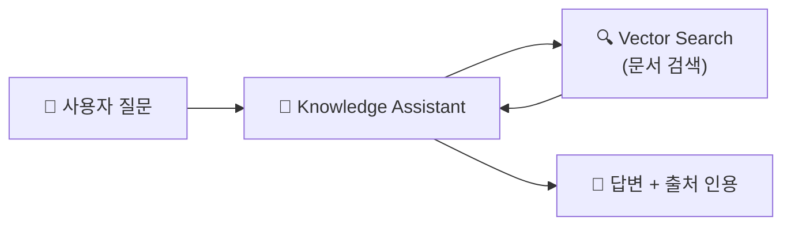
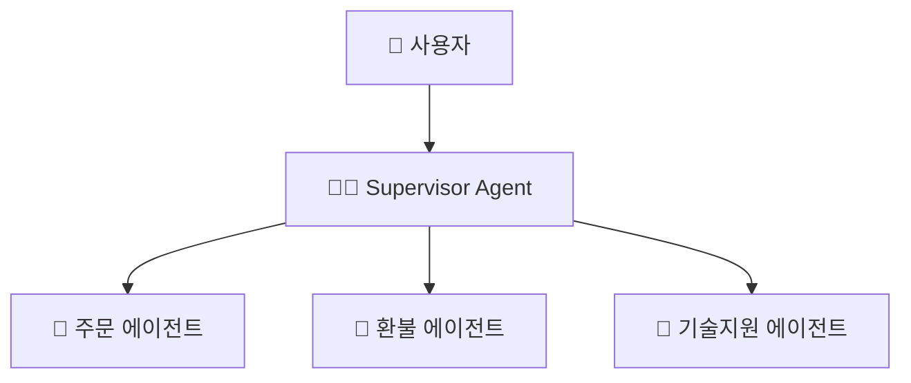

# Agent Bricks

## 사전 구축된 에이전트

> 💡 **Agent Bricks**는 Databricks가 제공하는 **사전 구축된 에이전트 템플릿**입니다. 코드 없이 또는 최소 코드로 AI 에이전트를 구축할 수 있습니다.

---

## Agent Bricks 유형

| 유형 | 설명 | 상태 |
|------|------|------|
| **Knowledge Assistant** | 문서 기반 Q&A 챗봇. PDF, 문서에서 답변을 찾아 인용과 함께 제공합니다 | GA |
| **Genie (SQL Agent)** | 자연어로 데이터에 질문하면 SQL을 생성하여 답변합니다 | GA |
| **Supervisor Agent** | 여러 에이전트를 조율하는 멀티 에이전트 오케스트레이터입니다 | GA |

---

## Knowledge Assistant

UI에서 **Playground** → **Create Knowledge Assistant**로 코드 없이 생성할 수 있습니다.

---

## Supervisor Agent (멀티 에이전트)

Supervisor가 사용자 요청을 분석하여 적절한 하위 에이전트에게 작업을 위임합니다.

---

## 참고 링크

- [Databricks: Agent Bricks](https://docs.databricks.com/aws/en/generative-ai/agent-bricks/)
