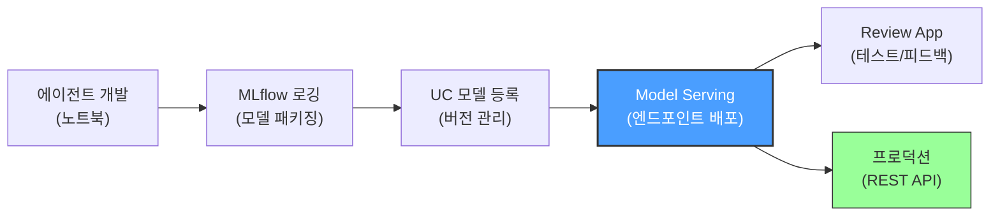
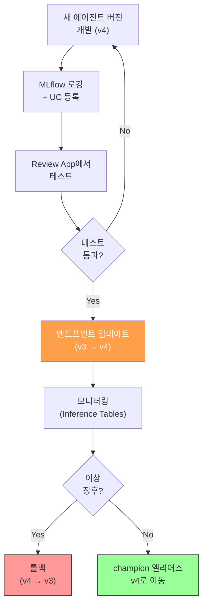

# 에이전트 배포

## 왜 에이전트 배포가 중요한가?

노트북에서 프로토타입으로 동작하는 에이전트와, 실제 사용자가 접근할 수 있는 프로덕션 에이전트는 전혀 다릅니다. 프로덕션 배포에는 **확장성, 모니터링, 보안, 버전 관리**가 필요합니다.

> 💡 Databricks에서 AI 에이전트를 배포한다는 것은, 에이전트를 **Model Serving Endpoint**로 호스팅하여 REST API로 접근할 수 있게 만드는 것입니다. 배포된 에이전트는 웹 앱, 슬랙 봇, 내부 도구 등 다양한 채널에서 호출할 수 있습니다.



---

## 배포 아키텍처 개요

Databricks의 에이전트 배포는 **MLflow + Unity Catalog + Model Serving**의 통합 구조로 동작합니다.

| 구성 요소 | 역할 |
|----------|------|
| **MLflow** | 에이전트를 모델로 패키징하고, 의존성/설정을 함께 로깅합니다 |
| **Unity Catalog** | 모델을 카탈로그에 등록하여 버전 관리와 거버넌스를 적용합니다 |
| **Model Serving** | 등록된 모델을 REST API 엔드포인트로 호스팅합니다 |
| **Review App** | 배포 전 테스터들이 에이전트를 사용해보고 피드백을 남기는 UI입니다 |
| **Inference Tables** | 모든 요청/응답을 자동으로 기록하여 모니터링에 활용합니다 |

---

## Step 1: 에이전트 모델 로깅

배포의 첫 단계는 에이전트를 **MLflow 모델**로 로깅하는 것입니다. 이때 에이전트 코드, 의존성, 설정이 모두 함께 패키징됩니다.

### mlflow.models.set_model() 사용법

에이전트 코드를 별도 Python 파일로 분리한 뒤, `set_model()`로 진입점을 지정합니다. 이 방식이 Databricks에서 권장하는 표준 패턴입니다.

**agent.py** (에이전트 코드):

```python
import mlflow
from databricks.sdk import WorkspaceClient
from langchain_community.chat_models import ChatDatabricks
from langchain.agents import AgentExecutor, create_tool_calling_agent
from langchain_core.prompts import ChatPromptTemplate

# 에이전트 정의
class CustomerSupportAgent(mlflow.pyfunc.PythonModel):
    def __init__(self):
        self.llm = ChatDatabricks(
            endpoint="databricks-meta-llama-3-3-70b-instruct",
            temperature=0.1
        )

    def predict(self, context, model_input, params=None):
        messages = model_input.get("messages", [])
        response = self.llm.invoke(messages)
        return {"content": response.content}

# 진입점 지정 — 이 파일이 모델로 사용될 때 이 클래스가 로드됩니다
mlflow.models.set_model(CustomerSupportAgent())
```

**로깅 노트북** (모델 등록):

```python
import mlflow

# MLflow 실험 설정
mlflow.set_experiment("/Users/user@example.com/customer-support-agent")

# 에이전트 로깅
with mlflow.start_run():
    model_info = mlflow.pyfunc.log_model(
        artifact_path="agent",
        python_model="agent.py",  # 에이전트 코드 파일 경로
        registered_model_name="catalog.schema.customer_support_agent",
        pip_requirements=[
            "langchain>=0.3.0",
            "langchain-community>=0.3.0",
            "databricks-sdk>=0.30.0",
        ],
        input_example={
            "messages": [
                {"role": "user", "content": "주문 상태를 확인하고 싶습니다."}
            ]
        }
    )
    print(f"Model URI: {model_info.model_uri}")
```

### 의존성 관리

에이전트가 사용하는 모든 외부 패키지와 리소스를 명시해야 합니다.

| 의존성 유형 | 지정 방법 | 예시 |
|-----------|----------|------|
| **Python 패키지** | `pip_requirements` | `["langchain>=0.3.0", "tiktoken"]` |
| **환경 변수** | 엔드포인트 설정 시 지정 | `VECTOR_SEARCH_ENDPOINT`, `API_KEY` |
| **리소스 의존성** | `resources` 파라미터 | Vector Search Index, Serving Endpoint |
| **추가 파일** | `code_paths` 또는 `artifacts` | 프롬프트 템플릿, 설정 파일 |

```python
# 리소스 의존성 명시 (배포 시 자동으로 권한 설정)
from mlflow.models.resources import (
    DatabricksServingEndpoint,
    DatabricksVectorSearchIndex
)

with mlflow.start_run():
    mlflow.pyfunc.log_model(
        artifact_path="agent",
        python_model="agent.py",
        registered_model_name="catalog.schema.my_agent",
        resources=[
            DatabricksServingEndpoint(endpoint_name="databricks-meta-llama-3-3-70b-instruct"),
            DatabricksVectorSearchIndex(index_name="catalog.schema.docs_index"),
        ]
    )
```

> 💡 `resources`에 명시된 리소스들은 배포 시 자동으로 서비스 프린시펄(Service Principal)에게 필요한 권한이 부여됩니다. 수동으로 권한을 설정할 필요가 없습니다.

---

## Step 2: Unity Catalog에 모델 등록

`registered_model_name`을 지정하면 MLflow가 자동으로 Unity Catalog에 모델을 등록합니다. 등록된 모델은 버전 관리, 접근 제어, 리니지 추적이 가능합니다.

### 모델 버전 관리

| 개념 | 설명 |
|------|------|
| **모델 이름** | `catalog.schema.model_name` 형식의 3단계 네임스페이스 |
| **버전** | 로깅할 때마다 자동으로 버전 번호가 증가합니다 (v1, v2, v3...) |
| **앨리어스** | `champion`, `challenger` 같은 이름으로 특정 버전을 지칭할 수 있습니다 |

```python
from mlflow import MlflowClient

client = MlflowClient()

# 특정 버전에 앨리어스 지정
client.set_registered_model_alias(
    name="catalog.schema.customer_support_agent",
    alias="champion",
    version=3
)

# 앨리어스로 모델 조회
champion_version = client.get_model_version_by_alias(
    name="catalog.schema.customer_support_agent",
    alias="champion"
)
print(f"Champion version: {champion_version.version}")
```

---

## Step 3: 엔드포인트 생성 및 배포

### deploy() 함수 사용 (권장)

`databricks.agents` 패키지의 `deploy()` 함수가 가장 간편한 배포 방법입니다. 엔드포인트 생성, Review App 활성화, Inference Tables 설정을 한 번에 처리합니다.

```python
from databricks import agents

# 에이전트 배포 (엔드포인트 + Review App + Inference Tables 자동 설정)
deployment = agents.deploy(
    model_name="catalog.schema.customer_support_agent",
    model_version=3,  # 또는 특정 버전 번호
    environment_vars={
        "VECTOR_SEARCH_ENDPOINT": "vs-endpoint-name",
        "TEMPERATURE": "0.1"
    }
)

print(f"Endpoint name: {deployment.endpoint_name}")
print(f"Query endpoint: {deployment.query_endpoint}")
print(f"Review App URL: {deployment.review_app_url}")
```

### SDK를 사용한 세부 설정

더 세밀한 제어가 필요한 경우 Databricks SDK를 직접 사용합니다.

```python
from databricks.sdk import WorkspaceClient
from databricks.sdk.service.serving import (
    EndpointCoreConfigInput,
    ServedEntityInput,
    AutoCaptureConfigInput
)

w = WorkspaceClient()

# 엔드포인트 생성 (세부 설정 포함)
endpoint = w.serving_endpoints.create(
    name="customer-support-agent",
    config=EndpointCoreConfigInput(
        served_entities=[
            ServedEntityInput(
                entity_name="catalog.schema.customer_support_agent",
                entity_version="3",
                workload_size="Small",       # Small, Medium, Large
                scale_to_zero_enabled=True,  # 비활성 시 0으로 축소
                environment_vars={
                    "VECTOR_SEARCH_ENDPOINT": {"type": "plain", "value": "vs-endpoint"},
                    "API_KEY": {"type": "secret", "key": "scope/key"}  # 시크릿 참조
                }
            )
        ],
        auto_capture_config=AutoCaptureConfigInput(
            enabled=True,
            catalog_name="catalog",
            schema_name="schema",
            table_name_prefix="agent_logs"
        )
    )
)
```

### 엔드포인트 설정 옵션

| 설정 | 옵션 | 설명 |
|------|------|------|
| **워크로드 크기** | Small / Medium / Large | 동시 요청 처리 용량을 결정합니다 |
| **Scale to Zero** | true / false | 트래픽이 없을 때 인스턴스를 0으로 축소하여 비용을 절감합니다 |
| **환경 변수** | plain / secret | 민감 정보는 `secret` 타입으로 안전하게 전달합니다 |
| **GPU** | 엔터티별 설정 | GPU가 필요한 모델(임베딩 등)에 GPU 인스턴스를 할당합니다 |
| **Inference Tables** | auto_capture_config | 모든 요청/응답을 Delta Table에 자동 기록합니다 |

---

## Step 4: Review App으로 테스트

### Review App이란?

Review App은 배포된 에이전트를 **웹 기반 채팅 UI**로 테스트하고, 테스터들이 **피드백을 남길 수 있는** 도구입니다. 수집된 피드백은 에이전트 평가와 개선에 활용됩니다.

### 테스터 추가 및 피드백 수집

```python
from databricks import agents

# Review App에 테스터 추가
agents.set_review_instructions(
    model_name="catalog.schema.customer_support_agent",
    instructions="""
    다음 시나리오를 테스트해주세요:
    1. "최근 주문 상태를 알려주세요" 같은 일반적인 질문
    2. 존재하지 않는 주문번호로 질문
    3. 한국어/영어 혼용 질문
    4. 에이전트가 답변할 수 없는 범위 외 질문

    각 응답에 대해 피드백과 코멘트를 남겨주세요.
    """
)

# 특정 사용자에게 Review App 접근 권한 부여
agents.set_permissions(
    model_name="catalog.schema.customer_support_agent",
    users=["tester1@company.com", "tester2@company.com"],
    permission="CAN_QUERY"
)
```

### 피드백 활용

수집된 피드백은 Unity Catalog의 Inference Tables에 저장되며, 다음과 같이 활용할 수 있습니다:

| 활용 방법 | 설명 |
|----------|------|
| **평가 데이터셋 구축** | 실제 사용자 질문 + 피드백을 Agent Evaluation의 골드 데이터셋으로 활용합니다 |
| **문제 패턴 분석** | 부정적 피드백이 많은 질문 유형을 분석하여 개선 방향을 도출합니다 |
| **A/B 테스트 근거** | 새 버전과 기존 버전의 피드백 점수를 비교합니다 |

---

## 에이전트 버전 관리 및 업데이트

### 버전 업데이트 전략



### 엔드포인트 업데이트

```python
from databricks.sdk import WorkspaceClient
from databricks.sdk.service.serving import ServedEntityInput, EndpointCoreConfigInput

w = WorkspaceClient()

# 새 버전으로 엔드포인트 업데이트 (무중단)
w.serving_endpoints.update_config(
    name="customer-support-agent",
    served_entities=[
        ServedEntityInput(
            entity_name="catalog.schema.customer_support_agent",
            entity_version="4",  # 새 버전
            workload_size="Small",
            scale_to_zero_enabled=True
        )
    ]
)
```

### 롤백

문제가 발생하면 이전 버전으로 빠르게 롤백할 수 있습니다.

```python
# 이전 버전으로 즉시 롤백
w.serving_endpoints.update_config(
    name="customer-support-agent",
    served_entities=[
        ServedEntityInput(
            entity_name="catalog.schema.customer_support_agent",
            entity_version="3",  # 이전 안정 버전으로 복귀
            workload_size="Small",
            scale_to_zero_enabled=True
        )
    ]
)
```

---

## 모니터링

### Inference Tables (추론 테이블)

배포된 에이전트의 모든 요청과 응답이 자동으로 Delta Table에 기록됩니다.

```sql
-- 최근 요청/응답 조회
SELECT
    request_id,
    timestamp,
    request:messages AS user_messages,
    response:choices[0]:message:content AS agent_response,
    status_code,
    execution_time_ms
FROM catalog.schema.agent_logs_payload
ORDER BY timestamp DESC
LIMIT 100;

-- 일별 사용 통계
SELECT
    DATE(timestamp) AS date,
    COUNT(*) AS total_requests,
    AVG(execution_time_ms) AS avg_latency_ms,
    COUNT(CASE WHEN status_code != 200 THEN 1 END) AS error_count,
    ROUND(COUNT(CASE WHEN status_code != 200 THEN 1 END) * 100.0 / COUNT(*), 2)
        AS error_rate_pct
FROM catalog.schema.agent_logs_payload
GROUP BY DATE(timestamp)
ORDER BY date DESC;
```

### MLflow Tracing

MLflow Tracing을 활성화하면 에이전트 내부의 각 단계(LLM 호출, 도구 실행, 검색 등)를 상세히 추적할 수 있습니다.

```python
import mlflow

# Tracing 자동 활성화
mlflow.langchain.autolog()

# 또는 수동으로 span 추가
@mlflow.trace
def process_query(query: str):
    with mlflow.start_span(name="retrieve_context") as span:
        context = vector_search(query)
        span.set_attribute("num_results", len(context))

    with mlflow.start_span(name="generate_response") as span:
        response = llm.invoke(query, context=context)
        span.set_attribute("token_count", response.usage.total_tokens)

    return response
```

### 모니터링 대시보드 구축

| 모니터링 지표 | 설명 | 임계값 예시 |
|-------------|------|-----------|
| **요청량** | 시간당/일당 요청 수 | 비정상적 급증 감지 |
| **응답 지연** | p50, p95, p99 응답 시간 | p95 > 5초 시 알림 |
| **오류율** | 4xx/5xx 응답 비율 | > 5% 시 알림 |
| **토큰 사용량** | 요청/응답당 평균 토큰 수 | 비용 관리 |
| **사용자 피드백** | 긍정/부정 피드백 비율 | 부정 > 30% 시 알림 |

---

## Guardrails 설정

에이전트의 안전한 운영을 위해 입출력에 대한 제한을 설정할 수 있습니다.

### AI Gateway Guardrails

```python
from databricks.sdk import WorkspaceClient
from databricks.sdk.service.serving import (
    AiGatewayConfig,
    AiGatewayGuardrails,
    AiGatewayGuardrailParameters,
    AiGatewayRateLimit,
    AiGatewayUsageTrackingConfig
)

w = WorkspaceClient()

# Guardrails가 포함된 엔드포인트 설정
w.serving_endpoints.put_ai_gateway(
    name="customer-support-agent",
    guardrails=AiGatewayGuardrails(
        input=AiGatewayGuardrailParameters(
            safety=True,       # 유해 콘텐츠 필터링
            pii={"behavior": "BLOCK"},  # PII 정보 차단
            valid_topics=["customer support", "order inquiry", "product info"],
            invalid_topics=["politics", "religion", "competitor products"]
        ),
        output=AiGatewayGuardrailParameters(
            safety=True,
            pii={"behavior": "BLOCK"}
        )
    ),
    rate_limits=[
        AiGatewayRateLimit(
            calls=100,
            renewal_period="minute",
            key="user"  # 사용자별 분당 100회 제한
        )
    ],
    usage_tracking_config=AiGatewayUsageTrackingConfig(enabled=True)
)
```

### Guardrails 유형

| 유형 | 설명 |
|------|------|
| **Safety Filter** | 유해하거나 부적절한 콘텐츠를 자동으로 필터링합니다 |
| **PII Detection** | 개인정보(이름, 전화번호, 주민번호 등)를 감지하고 차단합니다 |
| **Topic Control** | 허용된 주제만 응답하고, 금지된 주제는 거부합니다 |
| **Rate Limiting** | 사용자별/전체 요청 수를 제한하여 남용을 방지합니다 |

---

## 트러블슈팅 가이드

### 자주 발생하는 문제

| 문제 | 원인 | 해결 방법 |
|------|------|----------|
| 엔드포인트가 시작되지 않음 | 의존성 누락 또는 버전 충돌 | `pip_requirements`에 모든 패키지와 정확한 버전을 명시합니다 |
| `ModuleNotFoundError` | 패키지가 설치되지 않음 | `pip_requirements`에 해당 패키지를 추가합니다 |
| 환경 변수 접근 실패 | 환경 변수가 설정되지 않음 | 엔드포인트 설정에서 `environment_vars`를 확인합니다 |
| Vector Search 권한 오류 | 서비스 프린시펄 권한 부족 | `resources`에 VS Index를 명시하거나 수동으로 권한을 부여합니다 |
| Scale to Zero 후 지연 | 콜드 스타트 시간 | 프로덕션에서는 `scale_to_zero_enabled=False` 권장 |
| 응답 시간 초과 | 에이전트 로직이 너무 복잡 | 도구 호출 수 제한, LLM 응답 스트리밍 활성화 |

### 엔드포인트 상태 확인

```python
from databricks.sdk import WorkspaceClient

w = WorkspaceClient()

# 엔드포인트 상태 조회
endpoint = w.serving_endpoints.get("customer-support-agent")
print(f"State: {endpoint.state.ready}")
print(f"Config update: {endpoint.state.config_update}")

# 엔드포인트 로그 조회
logs = w.serving_endpoints.logs(
    name="customer-support-agent",
    served_model_name="customer_support_agent-3"
)
print(logs.logs)
```

### 배포 전 로컬 테스트

배포 전에 로깅된 모델을 로컬에서 먼저 테스트하는 것을 권장합니다.

```python
import mlflow

# 로깅된 모델 로드 및 테스트
model = mlflow.pyfunc.load_model(model_info.model_uri)

# 테스트 입력
test_input = {
    "messages": [
        {"role": "user", "content": "주문번호 12345의 배송 상태를 알려주세요."}
    ]
}

# 예측 실행
response = model.predict(test_input)
print(response)
```

---

## 실습: 에이전트 배포 전체 워크플로

전체 배포 과정을 순서대로 정리하면 다음과 같습니다.

```python
# ============================================
# 1. 에이전트 코드 작성 (agent.py)
# ============================================
# (위의 agent.py 참고)

# ============================================
# 2. MLflow로 모델 로깅 + UC 등록
# ============================================
import mlflow
from mlflow.models.resources import (
    DatabricksServingEndpoint,
    DatabricksVectorSearchIndex
)

with mlflow.start_run():
    model_info = mlflow.pyfunc.log_model(
        artifact_path="agent",
        python_model="agent.py",
        registered_model_name="catalog.schema.customer_support_agent",
        pip_requirements=["langchain>=0.3.0", "databricks-sdk>=0.30.0"],
        resources=[
            DatabricksServingEndpoint(endpoint_name="databricks-meta-llama-3-3-70b-instruct"),
            DatabricksVectorSearchIndex(index_name="catalog.schema.docs_index"),
        ],
        input_example={"messages": [{"role": "user", "content": "안녕하세요"}]}
    )

# ============================================
# 3. 로컬 테스트
# ============================================
model = mlflow.pyfunc.load_model(model_info.model_uri)
result = model.predict({"messages": [{"role": "user", "content": "테스트"}]})
print(f"로컬 테스트 결과: {result}")

# ============================================
# 4. 배포 (엔드포인트 + Review App)
# ============================================
from databricks import agents

deployment = agents.deploy(
    model_name="catalog.schema.customer_support_agent",
    model_version=model_info.registered_model_version
)
print(f"배포 완료!")
print(f"   Endpoint: {deployment.endpoint_name}")
print(f"   Review App: {deployment.review_app_url}")

# ============================================
# 5. Review App 설정
# ============================================
agents.set_permissions(
    model_name="catalog.schema.customer_support_agent",
    users=["tester@company.com"],
    permission="CAN_QUERY"
)

# ============================================
# 6. 프로덕션 엔드포인트 호출 테스트
# ============================================
from databricks.sdk import WorkspaceClient

w = WorkspaceClient()
response = w.serving_endpoints.query(
    name=deployment.endpoint_name,
    input={
        "messages": [
            {"role": "user", "content": "최근 주문 상태를 확인하고 싶습니다."}
        ]
    }
)
print(f"에이전트 응답: {response.choices[0].message.content}")
```

---

## 정리

| 핵심 포인트 | 설명 |
|------------|------|
| **배포 파이프라인** | 개발 → MLflow 로깅 → UC 등록 → Model Serving → 모니터링 |
| **agents.deploy()** | 엔드포인트, Review App, Inference Tables를 한 번에 설정하는 가장 간편한 방법입니다 |
| **set_model()** | 에이전트 코드를 별도 파일로 분리하고, 진입점을 지정하는 권장 패턴입니다 |
| **Review App** | 배포 전 테스터 피드백을 수집하고, 평가 데이터셋으로 활용합니다 |
| **Inference Tables** | 모든 요청/응답을 자동 기록하여 모니터링과 디버깅에 활용합니다 |
| **Guardrails** | Safety, PII, Topic Control, Rate Limiting으로 안전한 운영을 보장합니다 |
| **버전 관리** | UC 앨리어스(champion/challenger)로 무중단 업데이트와 롤백이 가능합니다 |

---

## 참고 링크

- [Databricks: Deploy agents](https://docs.databricks.com/aws/en/generative-ai/deploy-agent.html)
- [Databricks: Agent Framework](https://docs.databricks.com/aws/en/generative-ai/agent-framework/index.html)
- [Databricks: Review App](https://docs.databricks.com/aws/en/generative-ai/agent-evaluation/review-app.html)
- [Databricks: MLflow Tracing](https://docs.databricks.com/aws/en/mlflow/mlflow-tracing.html)
- [Databricks: AI Gateway Guardrails](https://docs.databricks.com/aws/en/ai-gateway/guardrails.html)
- [Databricks: Inference Tables](https://docs.databricks.com/aws/en/machine-learning/model-serving/inference-tables.html)
