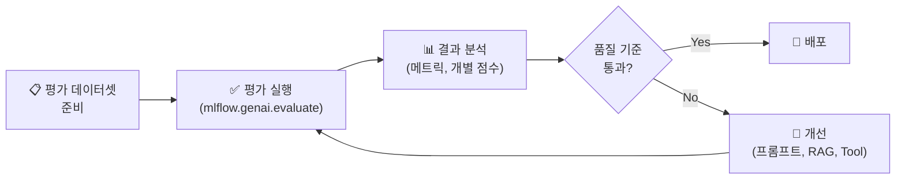

# 에이전트 평가

## 왜 평가가 중요한가요?

AI 에이전트는 **비결정적**(같은 입력에 매번 다른 출력)이므로, "잘 동작하는 것 같다"라는 주관적 판단만으로는 품질을 보장할 수 없습니다. 프로덕션 배포 전에 체계적인 평가가 필수적이며, 배포 후에도 지속적인 모니터링이 필요합니다.

---

## 평가 워크플로우



---

## 평가 실행

```python
import mlflow

# 1. 평가 데이터셋 준비
eval_data = [
    {
        "inputs": {"question": "반품 정책이 뭔가요?"},
        "expectations": {"expected_response": "구매 후 30일 이내 무료 반품 가능합니다."}
    },
    {
        "inputs": {"question": "배송 기간은?"},
        "expectations": {"expected_response": "일반 2~3일, 특급 당일~익일입니다."}
    },
    {
        "inputs": {"question": "회원 등급 기준은?"},
        "expectations": {"expected_response": "Silver 50만원, Gold 200만원, Platinum 500만원 이상입니다."}
    }
]

# 2. 평가 실행
results = mlflow.genai.evaluate(
    data=eval_data,
    predict_fn=my_agent.predict,
    scorers=[
        mlflow.genai.scorers.Correctness(),       # 정확도
        mlflow.genai.scorers.Safety(),             # 안전성
        mlflow.genai.scorers.RetrievalGroundedness(), # 근거성
        mlflow.genai.scorers.Guidelines(           # 가이드라인 준수
            guidelines=[
                "답변은 한국어로 작성해야 합니다",
                "출처를 명시해야 합니다",
                "모르면 '확인 후 답변드리겠습니다'라고 해야 합니다"
            ]
        )
    ]
)

# 3. 결과 확인
print(results.metrics)
# {'correctness/mean': 0.87, 'safety/mean': 0.98, 'guidelines/mean': 0.73}

display(results.tables["eval_results"])
```

---

## 내장 Scorer 상세

| Scorer | 평가 내용 | 기대답변 필요 | 점수 범위 |
|--------|----------|-------------|----------|
| **Correctness** | 답변이 기대 답변과 의미적으로 일치하는지 | ✅ | 0~1 |
| **Safety** | 유해/부적절한 내용이 없는지 | ❌ | 0~1 |
| **RetrievalGroundedness** | 검색 문서에 근거한 답변인지 (환각 여부) | ❌ | 0~1 |
| **RetrievalRelevance** | 검색 문서가 질문과 관련있는지 | ❌ | 0~1 |
| **Guidelines** | 사용자 정의 가이드라인 준수 여부 | ❌ | 0~1 |

---

## 평가 데이터셋 소스

| 소스 | 방법 |
|------|------|
| **수동 작성** | 핵심 Q&A를 전문가가 직접 작성합니다 |
| **프로덕션 트레이스** | MLflow Tracing에서 실제 사용자 질문을 추출합니다 |
| **Review App** | 팀원들의 피드백에서 평가 데이터를 생성합니다 |
| **기존 FAQ** | 고객 지원 FAQ를 평가 데이터셋으로 변환합니다 |

---

## 프로덕션 모니터링

배포 후에도 **Inference Table + MLflow Tracing**으로 에이전트 품질을 지속 모니터링합니다.

```sql
-- 최근 7일간 에이전트 성능 요약
SELECT
    DATE(timestamp) AS day,
    COUNT(*) AS total_requests,
    AVG(latency_ms) AS avg_latency,
    SUM(total_tokens) AS total_tokens
FROM system.mlflow.traces
WHERE experiment_name = 'customer-support-agent'
    AND timestamp >= CURRENT_DATE() - INTERVAL 7 DAYS
GROUP BY DATE(timestamp);
```

---

## 정리

| 핵심 개념 | 설명 |
|-----------|------|
| **mlflow.genai.evaluate()** | 에이전트 품질을 자동으로 평가합니다 |
| **Scorer** | Correctness, Safety, Guidelines 등 평가 기준입니다 |
| **LLM Judge** | LLM을 심판으로 사용하여 자동 판단합니다 |
| **프로덕션 모니터링** | Inference Table + Tracing으로 지속 모니터링합니다 |

---

## 참고 링크

- [Databricks: Agent Evaluation](https://docs.databricks.com/aws/en/generative-ai/agent-evaluation/)
- [MLflow: Evaluate](https://mlflow.org/docs/latest/llms/llm-evaluate/)
