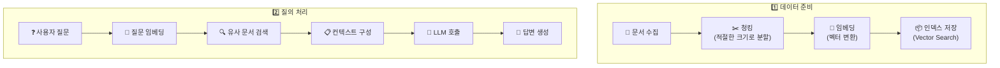

# RAG 파이프라인

## RAG 구축 단계



---

## 문서 파싱 및 청킹

```python
# PDF 문서 파싱
parsed = spark.sql("""
    SELECT ai_parse_document(
        '/Volumes/catalog/schema/docs/manual.pdf', 'text'
    ) AS content
""")

# 청킹 (적절한 크기로 분할)
from langchain.text_splitter import RecursiveCharacterTextSplitter

splitter = RecursiveCharacterTextSplitter(chunk_size=1000, chunk_overlap=200)
chunks = splitter.split_text(document_text)
```

> 💡 **청킹(Chunking)이란?** 긴 문서를 LLM이 처리할 수 있는 적절한 크기의 조각으로 나누는 것입니다. 너무 크면 검색 정확도가 떨어지고, 너무 작으면 맥락이 부족해집니다. 일반적으로 500~1500 토큰 정도가 적당합니다.

---

## 참고 링크

- [Databricks: Build RAG applications](https://docs.databricks.com/aws/en/generative-ai/rag.html)
