# RAG 파이프라인 — 검색 증강 생성

## RAG 파이프라인의 전체 구조

RAG 파이프라인은 크게 **오프라인(데이터 준비)**과 **온라인(질의 처리)** 두 단계로 나뉩니다.

```mermaid
graph TB
    subgraph Offline["🔧 오프라인: 데이터 준비"]
        D1["📄 원본 문서 수집<br/>(PDF, 웹, DB)"] --> D2["✂️ 파싱<br/>(ai_parse_document)"]
        D2 --> D3["📏 청킹<br/>(적절한 크기로 분할)"]
        D3 --> D4["💾 Delta 테이블 저장<br/>(doc_id, content, metadata)"]
        D4 --> D5["🔢 벡터 인덱싱<br/>(Vector Search Index)"]
    end

    subgraph Online["⚡ 온라인: 질의 처리"]
        Q["❓ 사용자 질문"]
        Q --> S1["🔍 검색<br/>(Vector Search)"]
        S1 --> S2["🔀 재순위화<br/>(Reranker)"]
        S2 --> S3["📋 프롬프트 구성<br/>(질문 + 검색 결과)"]
        S3 --> S4["🧠 LLM 호출<br/>(답변 생성)"]
        S4 --> S5["💬 답변 + 출처"]
    end
```



---

## Step 1: 문서 수집 및 파싱

### 문서 소스

| 소스 | 방법 |
|------|------|
| **PDF 문서** | `ai_parse_document()` 또는 Python 라이브러리(PyMuPDF, pdfplumber) |
| **웹 페이지** | Python requests + BeautifulSoup / Scrapy |
| **Confluence/SharePoint** | 커넥터 또는 API 호출 |
| **데이터베이스** | SQL 쿼리로 텍스트 필드 추출 |
| **Google Drive** | Google Drive API |

### Databricks에서 PDF 파싱

```sql
-- ai_parse_document으로 PDF 텍스트 추출
CREATE OR REFRESH MATERIALIZED VIEW parsed_documents AS
SELECT
    file_name,
    ai_parse_document(
        CONCAT('/Volumes/catalog/schema/raw_docs/', file_name),
        'markdown'  -- 구조(제목, 표 등)를 유지하는 markdown 모드
    ) AS content,
    current_timestamp() AS parsed_at
FROM (SELECT file_name FROM LIST('/Volumes/catalog/schema/raw_docs/') WHERE file_name LIKE '%.pdf');
```

```python
# Python으로 PDF 파싱 (더 세밀한 제어)
import fitz  # PyMuPDF

def parse_pdf(path: str) -> str:
    doc = fitz.open(path)
    text = ""
    for page in doc:
        text += page.get_text("text") + "\n\n"
    return text
```

---

## Step 2: 청킹 (Chunking)

> 💡 **청킹(Chunking)**이란 긴 문서를 LLM이 처리할 수 있는 **적절한 크기의 조각**으로 나누는 것입니다. RAG의 품질에 가장 큰 영향을 미치는 단계 중 하나입니다.

### 청킹 전략

| 전략 | 설명 | 적합한 문서 |
|------|------|-----------|
| **고정 크기** | 일정한 토큰/문자 수로 분할합니다 | 균일한 구조의 문서 |
| **재귀적 분할** | 문단 → 문장 → 단어 순서로 자연스러운 경계에서 분할합니다 | 대부분의 문서 (권장) |
| **의미 기반** | 임베딩 유사도를 기반으로 의미 단위로 분할합니다 | 주제가 자주 바뀌는 문서 |
| **구조 기반** | Markdown 제목, HTML 태그 등 문서 구조를 활용합니다 | 구조화된 문서 |

### 최적의 청크 크기

| 청크 크기 | 장점 | 단점 |
|-----------|------|------|
| **작음 (200~500 토큰)** | 검색 정밀도가 높음 | 맥락이 부족할 수 있음 |
| **중간 (500~1000 토큰)** | 정밀도와 맥락의 균형 | 대부분의 경우 권장 |
| **큼 (1000~2000 토큰)** | 충분한 맥락 제공 | 검색 정밀도 저하 |

### 청킹 구현

```python
from langchain.text_splitter import RecursiveCharacterTextSplitter

# 재귀적 분할 (가장 일반적)
splitter = RecursiveCharacterTextSplitter(
    chunk_size=1000,         # 최대 문자 수
    chunk_overlap=200,       # 청크 간 겹침 (맥락 연속성 유지)
    separators=["\n\n", "\n", ". ", " ", ""],  # 분할 우선순위
    length_function=len
)

chunks = splitter.split_text(document_text)

# 결과를 Delta 테이블로 저장
from pyspark.sql import Row

chunk_rows = [
    Row(
        doc_id=f"{doc_id}_chunk_{i}",
        parent_doc_id=doc_id,
        chunk_index=i,
        content=chunk,
        title=doc_title,
        source=doc_source
    )
    for i, chunk in enumerate(chunks)
]

chunk_df = spark.createDataFrame(chunk_rows)
chunk_df.write.format("delta").mode("append").saveAsTable("catalog.schema.document_chunks")
```

> 💡 **chunk_overlap**: 청크 간에 일부 텍스트를 겹치게 하면, 문장이 잘리는 것을 방지하고 맥락의 연속성을 유지할 수 있습니다. 일반적으로 chunk_size의 10~20% 정도를 권장합니다.

---

## Step 3: 벡터 인덱스 생성

```python
from databricks.vector_search.client import VectorSearchClient

vsc = VectorSearchClient()

# Managed Embeddings 인덱스 생성 (권장)
vsc.create_delta_sync_index(
    endpoint_name="vs-endpoint",
    index_name="catalog.schema.docs_index",
    source_table_name="catalog.schema.document_chunks",
    primary_key="doc_id",
    embedding_source_column="content",
    embedding_model_endpoint_name="databricks-gte-large-en",
    pipeline_type="TRIGGERED",
    columns_to_sync=["doc_id", "parent_doc_id", "content", "title", "source", "chunk_index"]
)

# 인덱스 동기화 실행
vsc.get_index("vs-endpoint", "catalog.schema.docs_index").sync()
```

---

## Step 4: 검색 및 답변 생성

```python
import mlflow

@mlflow.trace
def rag_answer(question: str) -> dict:
    """RAG 파이프라인: 질문 → 검색 → 답변"""

    # 1. 관련 문서 검색
    docs = search_documents(question)

    # 2. 프롬프트 구성
    context = format_context(docs)
    prompt = build_prompt(question, context)

    # 3. LLM 호출
    answer = call_llm(prompt)

    # 4. 출처 정보 포함
    sources = [{"title": d["title"], "source": d["source"]} for d in docs]

    return {"answer": answer, "sources": sources}


@mlflow.trace(span_type="RETRIEVER")
def search_documents(query: str, num_results: int = 5) -> list:
    """Vector Search + Reranker로 관련 문서 검색"""
    results = index.similarity_search(
        query_text=query,
        columns=["doc_id", "content", "title", "source"],
        num_results=20,  # 초기 검색은 넓게
        query_options={
            "reranker": {
                "model_name": "databricks-reranker",
                "columns": ["content"],
                "top_k": num_results  # Reranker가 최종 선별
            }
        }
    )
    return [
        {"doc_id": r[0], "content": r[1], "title": r[2], "source": r[3]}
        for r in results["result"]["data_array"]
    ]


def format_context(docs: list) -> str:
    """검색된 문서를 LLM에 전달할 컨텍스트로 포맷팅"""
    return "\n\n---\n\n".join([
        f"[출처: {d['title']}]\n{d['content']}"
        for d in docs
    ])


def build_prompt(question: str, context: str) -> str:
    """시스템 프롬프트 + 컨텍스트 + 질문 조합"""
    return f"""당신은 정확하고 도움이 되는 AI 어시스턴트입니다.
아래 제공된 문서만을 근거로 답변해 주세요.
문서에 없는 내용은 "제공된 문서에서 해당 정보를 찾을 수 없습니다"라고 답변해 주세요.
답변 마지막에 참고한 문서의 출처를 명시해 주세요.

### 참고 문서:
{context}

### 질문:
{question}

### 답변:"""


@mlflow.trace(span_type="LLM")
def call_llm(prompt: str) -> str:
    """Foundation Model API로 LLM 호출"""
    response = client.predict(
        endpoint="databricks-meta-llama-3-3-70b-instruct",
        inputs={
            "messages": [{"role": "user", "content": prompt}],
            "temperature": 0.1,
            "max_tokens": 1000
        }
    )
    return response["choices"][0]["message"]["content"]
```

---

## RAG 품질 개선 전략

| 전략 | 설명 | 효과 |
|------|------|------|
| **Reranker 사용** | 초기 검색 후 LLM으로 재순위화 | 검색 정확도 15~30% 향상 |
| **청크 크기 튜닝** | 문서 유형에 맞는 최적 크기 탐색 | 답변 품질 개선 |
| **하이브리드 검색** | 키워드 + 벡터 검색 결합 | 고유명사, 코드 등에서 효과적 |
| **메타데이터 필터** | 카테고리, 날짜 등으로 검색 범위 제한 | 관련성 높은 결과 |
| **다국어 임베딩** | 한국어 전용 임베딩 모델 사용 | 한국어 검색 품질 향상 |
| **질문 재작성** | LLM으로 질문을 검색에 적합하게 재작성 | 모호한 질문 처리 개선 |
| **문서 정기 갱신** | Delta Sync로 최신 문서 자동 반영 | 답변의 최신성 유지 |

---

## 정리

| 단계 | 핵심 작업 | Databricks 도구 |
|------|----------|----------------|
| **문서 파싱** | PDF/웹 → 텍스트 | ai_parse_document, Python 라이브러리 |
| **청킹** | 적절한 크기로 분할 | RecursiveCharacterTextSplitter |
| **인덱싱** | 임베딩 + 벡터 인덱스 | Vector Search (Managed Embeddings) |
| **검색** | 유사 문서 검색 + 재순위화 | Vector Search + Reranker |
| **생성** | LLM으로 답변 생성 | Foundation Model API |
| **추적** | 실행 흐름 모니터링 | MLflow Tracing |

---

## 참고 링크

- [Databricks: Build RAG applications](https://docs.databricks.com/aws/en/generative-ai/rag.html)
- [Databricks: Document parsing](https://docs.databricks.com/aws/en/generative-ai/rag-document-parsing.html)
- [Databricks: Vector Search](https://docs.databricks.com/aws/en/generative-ai/vector-search.html)
- [LangChain: Text Splitters](https://python.langchain.com/docs/modules/data_connection/document_transformers/)
