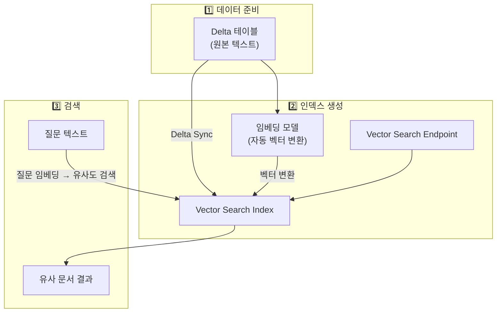
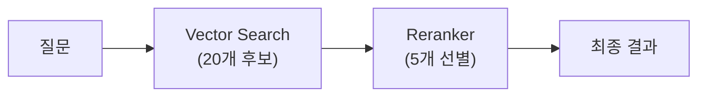

# Vector Search — 벡터 유사도 검색

## 왜 Vector Search가 필요한가요?

전통적인 키워드 검색(SQL의 `LIKE` 또는 `CONTAINS`)은 **정확히 일치하는 단어**만 찾을 수 있습니다. "환불 규정"을 검색하면 "반품 정책"은 찾지 못합니다. 그러나 이 둘은 의미적으로 매우 유사합니다.

**Vector Search**는 텍스트의 **의미(Semantic)**를 이해하여, 키워드가 다르더라도 의미가 유사한 항목을 찾아줍니다. RAG(검색 증강 생성) 기반 AI 에이전트의 핵심 구성 요소입니다.

| 검색 유형 | 방식 | 장점 | 한계 |
|-----------|------|------|------|
| **키워드 검색** | 정확한 단어 매칭 | 빠르고 예측 가능 | 동의어, 의미 유사성 처리 불가 |
| **Vector Search** | 임베딩 벡터 유사도 | 의미적 유사성 검색 가능 | 임베딩 모델에 의존 |
| **하이브리드 검색** | 키워드 + 벡터 결합 | 두 방식의 장점 결합 | 구성이 복잡 |

---

## 핵심 개념: 임베딩 (Embedding)

> 💡 **임베딩(Embedding)**이란 텍스트를 수백~수천 차원의 **숫자 벡터(배열)**로 변환하는 것입니다. 의미가 유사한 텍스트는 벡터 공간에서 **가까운 위치**에 놓이게 됩니다.

```
"강아지"  → [0.23, -0.15, 0.87, 0.42, ...]  (1024차원)
"개"      → [0.25, -0.13, 0.85, 0.40, ...]  ← 가까움! (유사함)
"자동차"  → [-0.71, 0.34, -0.28, 0.55, ...] ← 멂! (다름)
```

> 💡 **코사인 유사도(Cosine Similarity)란?** 두 벡터 간의 각도를 기반으로 유사도를 측정하는 방법입니다. 값은 -1에서 1 사이이며, 1에 가까울수록 유사합니다.

---

## Databricks Vector Search 아키텍처



| 구성 요소 | 역할 |
|-----------|------|
| **Vector Search Endpoint** | 인덱스를 호스팅하고 검색 쿼리를 처리하는 컴퓨팅 리소스입니다 |
| **Vector Search Index** | 임베딩 벡터가 저장된 검색 인덱스입니다 |
| **Delta Sync** | 소스 Delta 테이블이 변경되면 인덱스를 자동으로 갱신합니다 |

---

## Endpoint 생성

```python
from databricks.vector_search.client import VectorSearchClient

vsc = VectorSearchClient()

# Endpoint 생성
vsc.create_endpoint(
    name="vs-endpoint-prod",
    endpoint_type="STANDARD"  # STANDARD 또는 STORAGE_OPTIMIZED
)
```

| 유형 | 설명 | 적합한 사용 |
|------|------|-----------|
| **STANDARD** | 범용. 빠른 검색 성능 | 대부분의 RAG 애플리케이션 |
| **STORAGE_OPTIMIZED** | 대용량에 최적화, 비용 효율적 | 수천만 건 이상의 대규모 인덱스 |

---

## Index 유형 (3가지)

### 1. Delta Sync + Managed Embeddings (권장)

소스 Delta 테이블을 지정하면, Databricks가 **임베딩 변환과 인덱스 동기화를 모두 자동으로** 관리합니다.

```python
index = vsc.create_delta_sync_index(
    endpoint_name="vs-endpoint-prod",
    index_name="catalog.schema.docs_index",
    source_table_name="catalog.schema.documents",
    primary_key="doc_id",
    embedding_source_column="content",
    embedding_model_endpoint_name="databricks-gte-large-en",
    pipeline_type="TRIGGERED",  # TRIGGERED 또는 CONTINUOUS
    columns_to_sync=["doc_id", "content", "title", "source", "updated_at"]
)
```

### 2. Delta Sync + Self-Managed Embeddings

임베딩을 직접 사전 계산하여 Delta 테이블에 저장한 경우 사용합니다.

```python
index = vsc.create_delta_sync_index(
    endpoint_name="vs-endpoint-prod",
    index_name="catalog.schema.docs_index_self",
    source_table_name="catalog.schema.documents_with_embeddings",
    primary_key="doc_id",
    embedding_vector_column="embedding",
    embedding_dimension=1024,
    pipeline_type="TRIGGERED"
)
```

### 3. Direct Vector Access Index

API로 직접 벡터를 삽입/삭제합니다. Delta 테이블과 동기화되지 않습니다.

```python
index = vsc.create_direct_access_index(
    endpoint_name="vs-endpoint-prod",
    index_name="catalog.schema.docs_direct",
    primary_key="doc_id",
    embedding_dimension=1024,
    schema={"doc_id": "string", "content": "string", "embedding": "array<float>"}
)

index.upsert([{"doc_id": "1", "content": "Hello", "embedding": [0.1, 0.2, ...]}])
```

### 인덱스 유형 비교

| 비교 | Delta Sync (Managed) | Delta Sync (Self-Managed) | Direct Access |
|------|---------------------|--------------------------|---------------|
| 임베딩 | 자동 | 직접 계산 | 직접 계산 |
| 동기화 | Delta 테이블과 자동 | Delta 테이블과 자동 | 수동 (API) |
| 적합한 경우 | 대부분 ✅ | 커스텀 임베딩 모델 사용 시 | 외부 소스, 실시간 삽입 |

---

## 유사도 검색

### 텍스트 검색

```python
results = vsc.get_index(
    endpoint_name="vs-endpoint-prod",
    index_name="catalog.schema.docs_index"
).similarity_search(
    query_text="반품 및 환불 절차가 어떻게 되나요?",
    columns=["doc_id", "title", "content", "source"],
    num_results=5
)

for doc in results['result']['data_array']:
    print(f"Score: {doc[-1]:.4f} | Title: {doc[1]}")
```

### 필터 결합 검색

```python
results = index.similarity_search(
    query_text="데이터 보안 정책",
    columns=["doc_id", "title", "content", "category"],
    filters={"category": "보안"},
    num_results=3
)
```

---

## Vector Search Reranker

> 🆕 **Reranker(GA)**: 초기 검색 결과를 LLM 기반으로 **재순위화**하여 정확도를 높이는 기능입니다.

```python
results = index.similarity_search(
    query_text="반품 시 배송비는 누가 부담하나요?",
    columns=["doc_id", "content"],
    num_results=20,  # 넓게 검색
    query_options={
        "reranker": {
            "model_name": "databricks-reranker",
            "columns": ["content"],
            "top_k": 5  # 상위 5개 선별
        }
    }
)
```



---

## 임베딩 모델 선택

| 모델 | 차원 | 언어 | 비고 |
|------|------|------|------|
| `databricks-gte-large-en` | 1024 | 영어 | Databricks 내장 |
| `databricks-bge-large-en` | 1024 | 영어 | Databricks 내장 |
| multilingual-e5-large | 1024 | 다국어 | 한국어 성능 우수 (커스텀 배포 필요) |
| BGE-M3 | 1024 | 다국어 | 한국어 포함 100+ 언어 지원 |

> 💡 **한국어 임베딩**: 한국어 검색 품질을 높이려면, 다국어 임베딩 모델(multilingual-e5-large, BGE-M3)을 Model Serving에 배포하여 사용하는 것을 권장합니다.

---

## 정리

| 핵심 개념 | 설명 |
|-----------|------|
| **임베딩** | 텍스트를 숫자 벡터로 변환하여 의미적 유사도를 계산합니다 |
| **Delta Sync Index** | Delta 테이블과 자동 동기화되는 인덱스입니다. 대부분의 경우 권장됩니다 |
| **Managed Embeddings** | Databricks가 임베딩 변환까지 자동 처리합니다 |
| **Reranker** | 초기 검색 결과를 LLM으로 재순위화하여 정확도를 높입니다 |

---

## 참고 링크

- [Databricks: Vector Search](https://docs.databricks.com/aws/en/generative-ai/vector-search.html)
- [Databricks: Create vector search index](https://docs.databricks.com/aws/en/generative-ai/create-query-vector-search.html)
- [Databricks: Reranker](https://docs.databricks.com/aws/en/generative-ai/vector-search-reranker.html)
