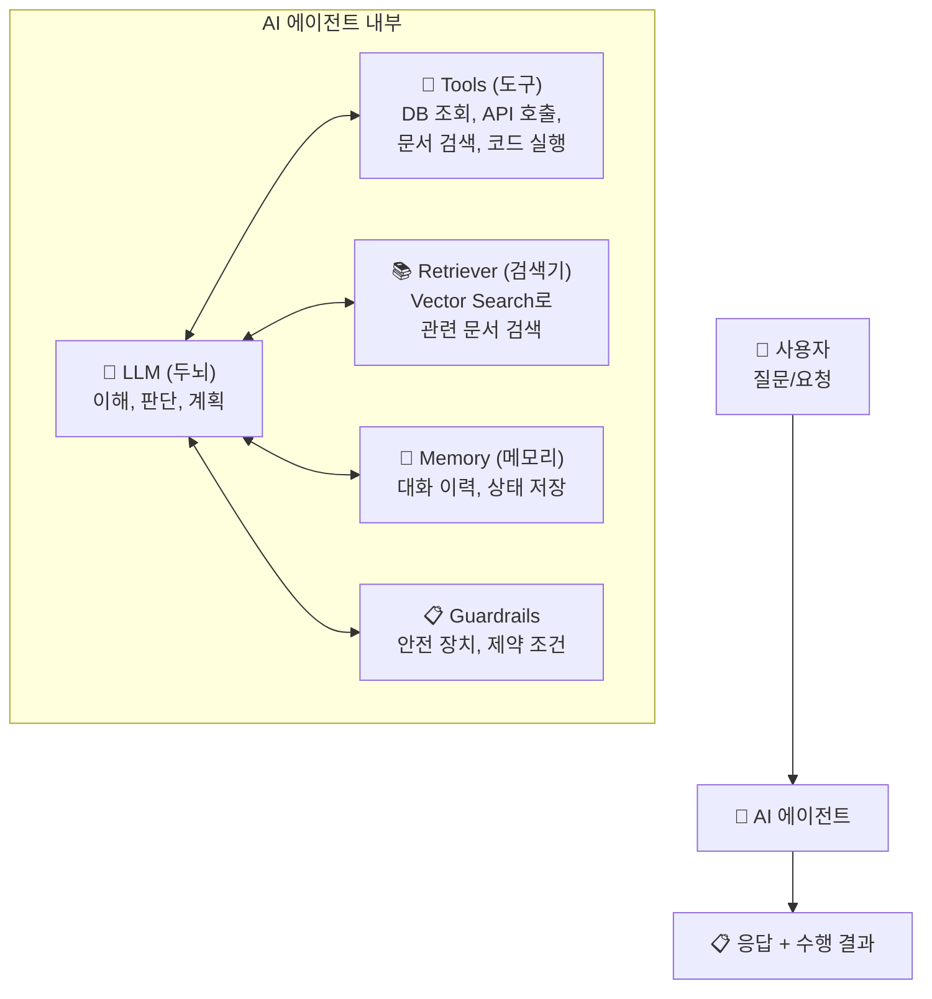
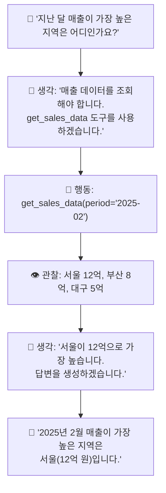
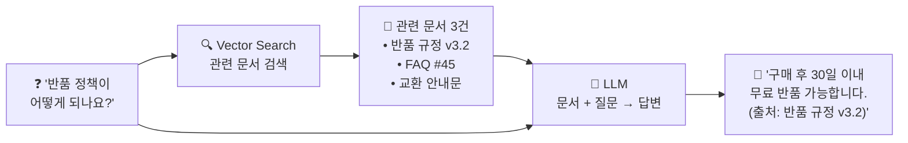
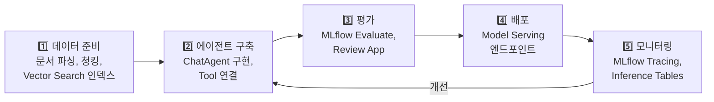

# AI 에이전트란?

## 개념

> 💡 **AI 에이전트(AI Agent)**란 LLM(대규모 언어 모델)을 두뇌로 사용하여, **스스로 판단하고 도구를 호출하며 작업을 수행**하는 자율적인 AI 시스템입니다. 단순한 챗봇과 달리, 에이전트는 목표를 달성하기 위해 여러 단계를 계획하고 실행합니다.

### 챗봇 vs AI 에이전트

| 비교 | 전통적 챗봇 | AI 에이전트 |
|------|-----------|------------|
| **응답 방식** | 미리 정해진 규칙/패턴 매칭 | LLM이 맥락을 이해하여 자율 응답 |
| **도구 사용** | ❌ 텍스트 응답만 가능 | ✅ DB 조회, API 호출, 파일 검색 등 도구 사용 |
| **멀티스텝** | ❌ 단일 응답 | ✅ 여러 단계를 순차적으로 계획·실행 |
| **학습** | 규칙을 수동으로 추가 | 프롬프트/컨텍스트로 행동 조정 |
| **비유** | 자동응답 안내 전화 | 문제를 직접 해결하는 전문 상담원 |

---

## 에이전트의 구성 요소



| 구성 요소 | 역할 | Databricks 도구 |
|-----------|------|----------------|
| **LLM (두뇌)** | 사용자 요청을 이해하고, 어떤 도구를 사용할지 판단합니다 | Foundation Model API, 외부 모델 엔드포인트 |
| **Tools (도구)** | 에이전트가 실행할 수 있는 구체적인 액션입니다 | Unity Catalog Functions, MCP Servers |
| **Retriever (검색기)** | 관련 문서/데이터를 검색하여 LLM에 맥락을 제공합니다 | Vector Search |
| **Memory (메모리)** | 대화 이력을 저장하여 맥락을 유지합니다 | 대화 메시지 배열, Lakebase |
| **Guardrails (안전 장치)** | 부적절한 응답이나 위험한 행동을 방지합니다 | 시스템 프롬프트, Expectations |

---

## 에이전트의 동작 흐름: ReAct 패턴

대부분의 AI 에이전트는 **ReAct(Reasoning + Acting)** 패턴으로 동작합니다.

> 💡 **ReAct 패턴**이란 LLM이 (1) **생각(Reasoning)**하여 다음 행동을 결정하고, (2) **행동(Acting)**하여 도구를 호출하고, (3) 결과를 **관찰(Observation)**하여 다음 생각에 반영하는 반복 루프입니다.



### 복잡한 멀티스텝 예시

```
사용자: "VIP 고객 중 최근 3개월 미구매자에게 쿠폰을 발송해 주세요"

에이전트:
  1. [생각] VIP 고객 목록이 필요합니다 → get_customer_list(tier='VIP') 호출
  2. [관찰] VIP 고객 150명 확인
  3. [생각] 3개월 미구매자를 필터링해야 합니다 → query_orders(days=90) 호출
  4. [관찰] 42명이 3개월 내 구매 없음
  5. [생각] 쿠폰을 발송해야 합니다 → send_coupon(customers=42명, type='10%할인') 호출
  6. [관찰] 42명에게 쿠폰 발송 완료
  7. [응답] "VIP 고객 중 최근 3개월 미구매자 42명에게 10% 할인 쿠폰을 발송했습니다."
```

---

## RAG (Retrieval-Augmented Generation)

### 왜 RAG가 필요한가요?

LLM은 학습 데이터에 포함된 일반적인 지식에 대해서는 잘 답변하지만, 다음과 같은 한계가 있습니다.

| 한계 | 설명 |
|------|------|
| **지식 단절** | 학습 이후의 최신 정보를 알지 못합니다 |
| **내부 정보 부재** | 기업의 내부 문서, 정책, 데이터를 알지 못합니다 |
| **환각(Hallucination)** | 모르는 것을 그럴듯하게 지어낼 수 있습니다 |

> 💡 **RAG(Retrieval-Augmented Generation, 검색 증강 생성)**은 LLM이 답변하기 전에, 먼저 **관련 문서를 검색(Retrieve)**하여 맥락으로 제공한 후, 그 맥락을 기반으로 **답변을 생성(Generate)**하는 패턴입니다.



### RAG vs Fine-tuning 비교

| 비교 | RAG | Fine-tuning |
|------|-----|-------------|
| **데이터 업데이트** | 문서 추가만으로 즉시 반영 | 모델 재학습 필요 (시간/비용) |
| **근거 제시** | 출처 문서를 명시 가능 | 근거 제시 어려움 |
| **비용** | 검색 인프라 비용 | GPU 학습 비용 |
| **정확도** | 검색 품질에 의존 | 도메인 전문성 높음 |
| **환각 방지** | ✅ 문서 기반 답변으로 감소 | 개선되지만 완전하지 않음 |
| **적합한 경우** | 내부 문서 Q&A, 고객 지원 | 특수 도메인 언어/스타일 |

> 💡 **실무 권장**: 대부분의 기업용 AI 에이전트는 **RAG**로 시작하는 것을 권장합니다. Fine-tuning은 RAG로 충분하지 않은 특수한 경우(의료 용어, 법률 문서 등)에 추가로 고려합니다.

---

## Databricks의 에이전트 개발 도구

| 도구 | 역할 | 설명 |
|------|------|------|
| **Mosaic AI Agent Framework** | 에이전트 구축 | ChatAgent 인터페이스, Tool 연동 |
| **Vector Search** | 문서 검색 (RAG) | 임베딩 기반 유사도 검색, Reranker |
| **Foundation Model API** | LLM 제공 | Llama, DBRX, 외부 모델 프록시 |
| **Unity Catalog Functions** | Tool 정의 | SQL/Python 함수를 에이전트의 도구로 사용 |
| **MLflow Tracing** | 관찰 가능성 | 에이전트의 실행 흐름을 추적 |
| **MLflow Evaluate** | 에이전트 평가 | 자동화된 품질 평가 |
| **Model Serving** | 에이전트 배포 | REST API 엔드포인트로 배포 |
| **Review App** | 인간 피드백 | 팀원이 에이전트를 테스트하고 평가 |
| **Agent Bricks** | 사전 구축 에이전트 | Knowledge Assistant, Genie, Supervisor |

---

## 에이전트 개발 워크플로우



---

## 정리

| 핵심 개념 | 설명 |
|-----------|------|
| **AI 에이전트** | LLM을 두뇌로, 도구를 수족으로 사용하여 자율적으로 작업을 수행하는 시스템입니다 |
| **ReAct 패턴** | 생각(Reasoning) → 행동(Acting) → 관찰(Observation)의 반복 루프입니다 |
| **RAG** | 문서 검색 → LLM 답변 생성. 내부 데이터 기반 정확한 답변에 필수적입니다 |
| **Tool** | 에이전트가 호출하는 외부 기능. DB 조회, API 호출, 코드 실행 등입니다 |
| **환각(Hallucination)** | LLM이 근거 없이 그럴듯한 답변을 생성하는 현상. RAG로 완화합니다 |

---

## 참고 링크

- [Databricks: Generative AI](https://docs.databricks.com/aws/en/generative-ai/)
- [Databricks: Mosaic AI Agent Framework](https://docs.databricks.com/aws/en/generative-ai/agent-framework/)
- [Databricks: RAG applications](https://docs.databricks.com/aws/en/generative-ai/rag.html)
- [Databricks Blog: AI Agents](https://www.databricks.com/blog)
